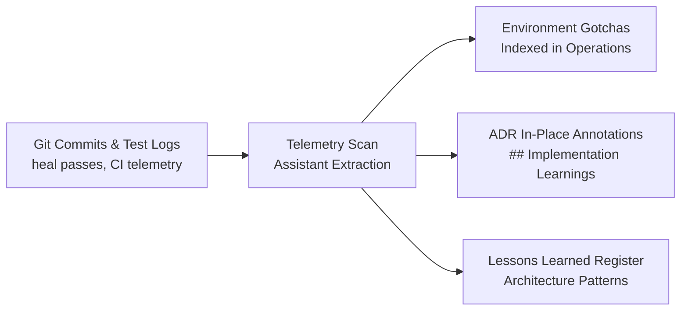

# ADR-0122: Continuous Self-Learning Synthesis and Telemetry Feedback Architecture

**Status:** Accepted (2026-08-27)

**Drafted 2026-08-27 · Accepted 2026-08-27 per architectural review.** Establishes the continuous self-learning synthesis lifecycle that captures runtime execution telemetry, test healing passes, and real-world environment constraints directly into the Second Brain compiled knowledge base.

**Authorizes:**
1. The post-sprint and milestone telemetry ingestion loop into living documentation.
2. The gotcha extraction pipeline into `docs/environment-gotchas.md`.
3. The formal in-place annotation pattern (`## Implementation Learnings & Real-World Constraints`) across all historical and active ADRs.
4. The ongoing curation lifecycle for `docs/project docs/Lessons-Learned-Register.md`.

**Source:** `docs/guides/Implementation-Learnings-Epic-6.md`, `CLAUDE.md`, and Epic 6 telemetry (`01bce70`–`64ac1f3`).

---

## Context

### 1. Static ADRs drift from real-world execution
Upfront architecture decision records capture design intent and initial constraints but cannot anticipate all runtime realities discovered during test-driven development (TDD) and contract execution. Without an operational feedback loop:
- Critical environment discoveries (e.g., test database template clone constraints, runtime parser quirks, bundler edge cases) remain buried in isolated git commit messages or terminal logs.
- Future stories and epics inadvertently repeat previously solved failure modes.
- Documentation steadily drifts from codebase reality, reducing trust in the architecture repository.

### 2. The Second Brain as an active compiler
The knowledge base operates as an active compiler rather than passive storage. When implementation finishes, the synthesis must flow back into the knowledge graph to inform subsequent pair programming and architectural sparring sessions.

---

## Decision

### 1. The Continuous Self-Learning Synthesis Lifecycle
At the completion of each epic, major story cluster, or PR milestone, a **Self-Learning Synthesis** is executed as a standard post-sprint ritual by the developer and assistant:

1. **Telemetry & Commit Scan**: Parse recent commit logs (specifically `heal(...)` commits, contract test reports, and bug fixes) to identify unexpected runtime discoveries.
2. **Gotcha Extraction**: Record any environment, database, bundler, or test runner quirks in `docs/environment-gotchas.md` with root causes and permanent guardrails.
3. **In-Place ADR Retro-Annotation**: For any ADR whose upfront assumptions were refined by implementation, append an in-place section titled `## Implementation Learnings & Real-World Constraints` documenting the exact technical divergence, commit reference, and runtime constraint.
4. **Lessons Learned Curation**: Update `docs/project docs/Lessons-Learned-Register.md` with reusable cross-cutting architectural patterns.

### 2. Decoupling Technical Domain Decisions
To preserve the **Single Responsibility Principle (SRP)** and ensure strict traceability:
- ADR-0122 governs **exclusively** the knowledge management, telemetry ingestion, and retroactive documentation lifecycle.
- Concrete runtime decisions discovered during implementation are delegated to in-place amendments on their respective domain ADRs:
  - *Network/Auth proxy patterns* $\rightarrow$ Amended in `docs/adr/0036-admin-ui-authentication-session-and-role-gating-mechanism.md`.
  - *AI UI state lifecycles* $\rightarrow$ Amended in `docs/adr/0076-composer-deep-research-agent.md`.
  - *Streaming protocol & memory bounds* $\rightarrow$ Amended in `docs/adr/0074-tenant-facing-workspace-and-posts-export.md` and `docs/adr/0090-data-export-posts-csv.md`.

---

## Consequences & Guardrails

### Positive
- **Reduced Failure Recurrence**: Significantly reduces recurrence of environment and database failure modes through indexed gotchas and automated verification.
- **Living Architectural Truth**: ADRs accurately reflect production code reality while preserving the original historical decision context.
- **High Traceability**: Domain decisions remain co-located in their specific domain ADRs rather than tangled into process records.

### Operational Trade-offs & Mitigations
- **Synthesis Cadence**: Requires consistent execution at sprint boundaries. *Mitigated by the assistant proactively proposing synthesis passes after major story milestones.*
- **Version Integrity**: In-place ADR annotations must include timestamps and commit hashes to preserve chronological clarity between original decision and implementation discoveries.

---

## Related Notes
- `docs/environment-gotchas.md`
- `docs/project docs/Lessons-Learned-Register.md`
- `docs/adr/0036-admin-ui-authentication-session-and-role-gating-mechanism.md`
- `docs/adr/0074-tenant-facing-workspace-and-posts-export.md`
- `docs/adr/0076-composer-deep-research-agent.md`
- `docs/adr/0090-data-export-posts-csv.md`