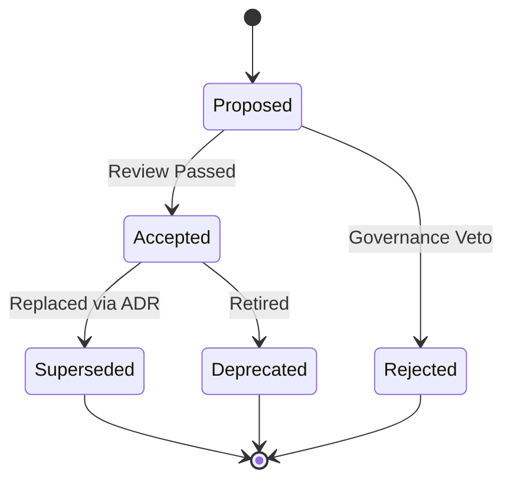

> [!NOTE] 🔗 **Conceptual & Standards Grounding**
> - 🧠 **Governing Enterprise Concept:** [[Concept-metadata-management|Concept: Metadata Management]] *(Aligned with DMBOK2, TOGAF & NIST)*
> - 🧠 **Conceptual & Standards Grounding:** [[Concept-project-governance-management|Concept: Project Governance & Management]]

# ADR-0143: Ontology v1.1.0 Normalization and Metamodel Evolution

**Status:** Accepted (2026-09-08)

## Context
On 2026-09-08, the SocialEngage Second Brain Metamodel reached `v1.0.0 LOCKED` governance status, establishing a rigorous double-loop learning cycle, dual-ontology bridge (`ONTOLOGY.json` and `PROJECT-MANAGEMENT-ONTOLOGY.json`), and first-class affect telemetry.

A comprehensive architectural and validation review identified 16 specific issues across three primary categories:
1. **Critical Tooling & Validation Failures**:
   - `artifact_id` regex pattern (`^[A-Za-z0-9_.-]+$`) rejected valid IDs containing spaces or punctuation (e.g. `Story 1.1`, `MOC - SocialEngage (Master Hub)`).
   - Duplicate nodeTypes existed for identical destination directories (`implementation_plan` vs `plan`, `implementation_walkthrough` vs `walkthrough`).
   - `folders` schema mixed raw strings (`"raw": "raw"`) and objects, breaking compilers expecting uniform `folders[key].allowedNodeTypes` properties.
   - `compilers.script` fields contained human notes and CLI flags rather than clean executable paths.
   - `vaultRoot` contained a hardcoded local Windows path, impairing cross-platform portability and CI validation.
   - The double-loop traceability chain referenced `Objective`, `Benefit`, `Decision`, and `Audit`, which existed in the PM ontology but lacked instantiable `nodeTypes` in the Obsidian metamodel.
2. **Structural Deficiencies**:
   - Monolithic frontmatter schema imposed specialized fields (`valence`, `arousal`, `observation_ids`) across all 28 node types.
   - `relationshipVerbs` included duplicate snake_case/camelCase variants (`depends_on` vs `dependsOn`) and orphaned verbs missing from `PROJECT-MANAGEMENT-ONTOLOGY.json`.
   - Lifecycle `validTransitions` were stored as unparseable strings (e.g. `"Proposed -> Accepted"`).
   - PM ontology classes lacked formal properties.
   - Standards alignment only mapped W3C vocabularies, omitting formal DAMA-DMBOK, PMI-PMBOK, and IIBA-BABOK URI namespaces.
   - Authority levels (1–5) and confidence score calculations were undocumented.
3. **Operational & Governance Enhancements**:
   - Absence of an explicit `supersededBy` / `supersedes` relationship edge.
   - Manual PowerShell skills ingestion pipeline lacked deterministic validation.
   - Visual folder colors had potential contrast and colorblind readability conflicts.

Under the `FROZEN_METAMODEL` policy, schema modifications require a formal Architecture Decision Record. This ADR authoritatively defines the v1.1.0 specification.

---

## Decision

The architecture team approves the evolution from Metamodel `v1.0.0` to `v1.1.0` according to the following 16 architectural decisions:

### 1. Two-Tier Identifier Validation
- **Global Pattern**: The global `artifact_id` pattern is relaxed to `^[A-Za-z0-9_ .()/{}-]+$` to support natural document titles, epics, stories, and contract test templates.
- **Node-Specific Validation**: Each `nodeType` specifies a strict, machine-executable `idRegex` pattern (e.g., `^Story [0-9]+(\.[0-9]+)*$` for stories, `^ADR-[0-9]{4}$` for ADRs).

### 2. Node Type Canonicalization & Aliasing
- `plan` is merged into `implementation_plan`. The canonical type is `implementation_plan`, with `plan` retained as a legacy frontmatter alias.
- `walkthrough` is merged into `implementation_walkthrough`. The canonical type is `implementation_walkthrough`, with `walkthrough` retained as a legacy frontmatter alias.
- `PROJECT-MANAGEMENT-ONTOLOGY.json`'s `nodeTypeToPmClass` maps both canonical names and legacy aliases to ensure zero Dataview query regression.

### 3. Homogeneous Folders Schema
All entries in `ONTOLOGY.json.folders` are normalized to explicit object definitions:
```json
"raw": {
  "path": "raw",
  "allowedNodeTypes": ["concept", "lesson_learned", "observation", "insight"],
  "description": "Staging area for incoming or raw notes prior to compilation",
  "color": "#64748B"
}
```
Top-level structural pointers (`projectsRoot`, `socialEngageRoot`) are moved to `conventions.structuralPaths`.

### 4. Machine-Executable Compilers Schema
Compiler definitions are refactored to separate executable binaries, arguments, execution modes, and human annotations:
```json
{
  "name": "Skill Ingestion Pipeline",
  "script": "scripts/ingest-skills.mjs",
  "args": ["--source=raw/<repo>-skills/"],
  "executionMode": "automated",
  "notes": "Automated validator and compiler for repository agent skills",
  "outputs": ["skill"]
}
```

### 5. Portable Path Resolution
`vaultRoot` is standardized to `"."`. Scripts dynamically resolve paths via `process.env.VAULT_ROOT || process.cwd()`. The reference Windows path is preserved in `conventions.exampleVaultRoot`.

### 6. Closed-Loop Traceability Completeness
Four instantiable node types are formalized in `ONTOLOGY.json` to complete the 17-node double-loop traceability cycle:
- `objective`: Strategic goals (`OBJ-{nnnn}` in `00 Intent & Charter`).
- `benefit`: Expected business returns (`BENEFIT-{nnnn}` in `00 Intent & Charter`).
- `audit`: Compliance and governance verification records (`AUDIT-{nnnn}` in `05 Project Governance & Plans`).
- `decision`: Mapped to canonical `adr` type (`ADR-{nnnn}` in `01 Architecture Decisions (ADR)`).

### 7. Modular Frontmatter Schemas
Frontmatter validation is divided into:
1. `baseSchema`: Shared properties mandatory across all notes (`title`, `artifact_id`, `entity_id`, `version`, `source_document`, `created_at`, `modified_at`, `authority_level`, `confidence_score`, `status`, `type`, `tags`, `aliases`, `domain_cluster`, `dmbok_category`, `pmbok_category`, `babok_category`).
2. `typeExtensions`: Node-specific schemas defining specialized attributes (e.g. `valence`, `arousal`, `pcr_score` for `affect_measurement`; `observation_ids` for `insight`; `target_value`, `actual_value`, `variance_delta` for `outcome`).

### 8. Relationship Verbs Canonicalization & Orphan Resolution
- All relationship verbs are strictly standardized to `camelCase`.
- Redundant snake_case verbs (`depends_on`, `derived_from`) are removed.
- Missing verbs (`references`, `supports`, `updates`, `contradicts`, `passedAt`, `supersededBy`, `supersedes`) are fully registered in `PROJECT-MANAGEMENT-ONTOLOGY.json.relationshipTypes` with explicit `domain`, `range`, and `inverseOf` pairs.

### 9. Structured State Machine Transitions
All `validTransitions` are upgraded from string notation to structured edge definitions:
```json
"validTransitions": [
  { "from": "Proposed", "to": "Accepted" },
  { "from": "Proposed", "to": "Rejected" },
  { "from": "Accepted", "to": "Superseded" },
  { "from": "Accepted", "to": "Deprecated" }
]
```

### 10. Formalized ECS Properties on PM Classes
All 52 classes in `PROJECT-MANAGEMENT-ONTOLOGY.json` receive explicit ECS property declarations extending `governedEntityBase`, enabling automated JSON Schema validation.

### 11. Complete Enterprise Standards Alignment
Formal ontology namespaces are declared:
- `dmbok`: `https://dama.org/dmbok2#`
- `pmbok`: `https://pmi.org/pmbok7#`
- `babok`: `https://iiba.org/babok3#`
Each knowledge area is mapped directly to authoritative standard taxonomy concepts.

### 12. Documented Authority Levels & Confidence Formula
Vault conventions formally document the 5-tier authority scale:
- **Level 1 (Raw/Draft)**: Heuristic or automated ingest, unverified.
- **Level 2 (AI-Synthesized)**: Generated or triaged by agent with grounding.
- **Level 3 (Peer Reviewed)**: Validated by human peer or contributor.
- **Level 4 (Governance Approved)**: Formal ADR, charter, or signed contract.
- **Level 5 (Immutable / Audited)**: Externally audited, cryptographically sealed.

Confidence score is computed as:
$$\text{confidence\_score} = 0.4 \times \text{source\_reliability} + 0.3 \times \text{test\_verification} + 0.3 \times \text{peer\_review}$$

### 13. Metamodel Evolution & Draft Staging
A dual-file drafting pattern is established:
- Canonical: `ONTOLOGY.json` and `PROJECT-MANAGEMENT-ONTOLOGY.json` remain locked at `1.0.0` until migration verification completes.
- Draft: `ONTOLOGY.v1.1.0-draft.json` and `PROJECT-MANAGEMENT-ONTOLOGY.v1.1.0-draft.json` represent the candidate state.
- Transition is completed via `scripts/migrate-ontology-v1-to-v1-1.mjs`.

### 14. Formal `supersededBy` / `supersedes` Lifecycle Edges
`supersededBy` (inverse `supersedes`) is established as a first-class relationship verb across all governance and decision artifacts, formally recording architectural evolution.

### 15. Automated Deterministic Skills Ingestion Engine
`scripts/ingest-skills.mjs` is established as the authoritative compiler for skill assets. It validates `{repo}-{skill-slug}` naming uniqueness, verifies required frontmatter, ensures existence of destination folders, and dynamically maintains `[[MOC - Skills & User Story Coverage]]`.

### 16. Accessible Color Palette
Folder colors in `ONTOLOGY.json` are upgraded to distinct WCAG AAA colorblind-safe tones, eliminating visual collision between skills (`#EC4899`) and contract tests (`#8B5CF6`).

---

## Consequences

### Positive
- **100% Tooling Compatibility**: Eliminates regex and folder schema crashes across all vault compilers and telemetry parsers.
- **Zero Ambiguity in Queries**: Standardized camelCase verbs and unified node types prevent missing or duplicated results in Dataview queries.
- **Complete Closed-Loop Auditability**: The entire 17-node lifecycle from Strategic Intent to Organizational Adaptation can be instantiated, queried, and verified directly within the Obsidian graph.
- **Cross-Platform Readiness**: Relative path resolution enables seamless CI execution and developer onboarding.

### Negative / Operational Overhead
- Requires executing the migration harness (`scripts/migrate-ontology-v1-to-v1-1.mjs`) to verify all notes against the new schema prior to locking v1.1.0.
- Legacy Dataview queries filtering specifically on `type: plan` or `type: walkthrough` should be updated to canonical types over time.

---

## State Machine Model (Example: ADR Lifecycle)



## Traceability
- **Governed By:** [[Concept-metadata-management|Concept: Metadata Management]]
- **Supersedes:** Metamodel v1.0.0 LOCKED
- **Authorizes:** `scripts/migrate-ontology-v1-to-v1-1.mjs`, `scripts/ingest-skills.mjs`, `ONTOLOGY.v1.1.0-draft.json`, `PROJECT-MANAGEMENT-ONTOLOGY.v1.1.0-draft.json`
