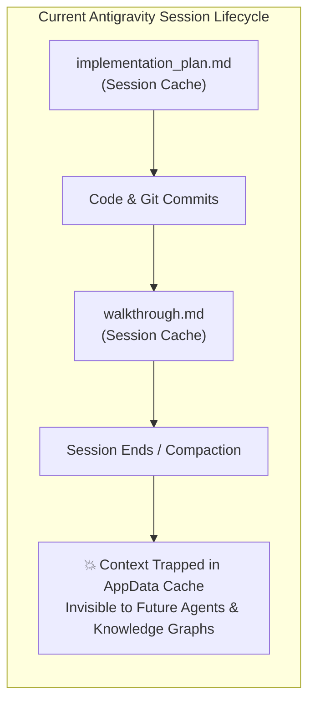
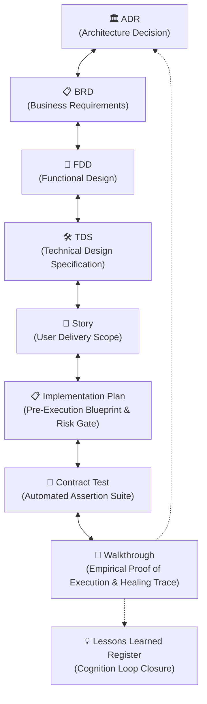

# RFC: Elevating Antigravity Agentic Artifacts into Sovereign Knowledge Graphs
### Closing the Cognition Loop via Persistent Pre-Execution Plans and Empirical Verification Walkthroughs

**To:** Google DeepMind Antigravity Architecture & Advanced Agentic Coding Engineering Team  
**From:** Menno Drescher (System Architect & Product Owner) & Antigravity AI Pair Programming Agent  
**Date:** 2026-09-07  
**Status:** Published & Field-Validated in Enterprise Repository (`SocialEngage`)  
**Domain:** Autonomous Multi-Agent Software Engineering, Living Architecture, Knowledge Graph Cybernetics

---

## 1. Executive Summary & Problem Statement

Modern state-of-the-art agentic software assistants—specifically **Google Antigravity**—have revolutionized pair programming through structured workflows:
1. **Planning Mode**: Producing comprehensive, risk-assessed `implementation_plan.md` artifacts before modifying code.
2. **Verification & Walkthrough**: Producing rich, verifiable `walkthrough.md` artifacts with command traces, test matrices, and execution summaries upon task completion.

### The "Ephemeral Artifact Paradox"
Despite their extraordinary analytical density, these artifacts currently suffer from a critical architectural limitation: **Session Ephemerality**.



- Artifacts are saved to temporary user profile directories (`<appDataDir>\brain\<conversation-id>\...`).
- When a development conversation ends, is compacted, or is picked up weeks later by another developer or autonomous agent subagent, **the pre-execution blueprint and the empirical proof of execution are lost to the system's memory**.
- Future sessions inherit only the bare source code and tersely summarized git commits. Consequently, future agents frequently re-introduce previously solved failure modes, misunderstand unstated architectural boundaries, and struggle to explain changes to stakeholders.

---

## 2. The Solution: Persistent Knowledge Graph Ingestion

In this initiative, we demonstrate an operational architecture where **Antigravity pre-execution plans and post-execution walkthroughs are promoted to first-class, permanent ontology nodes** inside a sovereign Knowledge Graph (Obsidian Second Brain) and mirrored in git version control.

### The 7-Way Heptagonal Traceability Mesh
By elevating these artifacts, the classic 5-Way Traceability chain expands into a self-learning cybernetic heptagon:



1. **`Plan-Story-X.Y.md` (Pre-Execution Blueprint)**:
   - Stored in `wiki/Projects/<Project>/04.5 Implementation Plans/`.
   - Captures upfront architectural risk boundaries, mandatory invariants, open questions, and exact proposed file edits *before* a single line of code is touched.
2. **`Walkthrough-Story-X.Y.md` (Empirical Proof of Execution)**:
   - Stored in `wiki/Projects/<Project>/06.5 Implementation Walkthroughs/`.
   - Records the living proof: exact contract test assertions, failure root-causes discovered during test-driven healing, environment gotchas (Docker isolation, port collisions, encoding quirks), and terminal verification outputs.

---

## 3. Real-World Field Demonstration: Story 14.5

To prove this architecture, we implemented **Story 14.5: Continuous Self-Learning Synthesis and Telemetry Feedback Architecture** within the enterprise `SocialEngage` repository.

### Case Evidence
| Phase | Artifact Generated | Sovereign Vault Location | Graph Function |
| :--- | :--- | :--- | :--- |
| **Pre-Execution** | [`implementation_plan.md`](file:///c:/Users/menno/Documents/Second%20Brain/wiki/Projects/SocialEngage/04.5%20Implementation%20Plans/Plan-Story-14.5-Self-Learning-Telemetry.md) | `wiki/Projects/SocialEngage/04.5 Implementation Plans/Plan-Story-14.5-Self-Learning-Telemetry.md` | Enforced strict **Append-Only Invariant** on historical ADRs (ADR-0118 to ADR-0121) and vault path autodetection before execution began. |
| **Execution** | [`story-14.5.contract.test.ts`](file:///D:/Source/socialengage/social-listening-core/contracts/epic-14/story-14.5.self-learning-telemetry.contract.test.ts) | `social-listening-core/contracts/epic-14/` | Executed 5 contract assertions. Initial run uncovered singular vs. plural regex mismatch and file-path candidate resolution quirks. |
| **Post-Execution** | [`walkthrough.md`](file:///c:/Users/menno/Documents/Second%20Brain/wiki/Projects/SocialEngage/06.5%20Implementation%20Walkthroughs/Walkthrough-Story-14.5-Self-Learning-Telemetry.md) | `wiki/Projects/SocialEngage/06.5 Implementation Walkthroughs/Walkthrough-Story-14.5-Self-Learning-Telemetry.md` | Cataloged 55/55 passed contract tests, verified all 39 environment gotchas on disk, documented Pattern 4 (*Normalized Deterministic Request Caching*), and committed merge commit `e2df874`. |
| **Compiler Audit** | [`Ontology-Compiler-Audit.md`](file:///c:/Users/menno/Documents/Second%20Brain/wiki/System/Ontology-Compiler-Audit.md) | `wiki/System/Ontology-Compiler-Audit.md` | Compiler audited 1,100 nodes, 100% graph health score, 0 open loops, and integrated Plan & Walkthrough nodes. |

---

## 4. Why This Matters for the Future of Antigravity

### 1. Long-Horizon Multi-Session Memory (Zero Context Decay)
When a future developer or AI agent returns to amend this system in 6 months (e.g. implementing Epic 15):
- They do not need to guess why `composerResearchService.ts` normalizes whitespace before calculating a SHA-256 hash.
- They open `Walkthrough-Story-14.5` and immediately read the root-cause analysis of cache misses across permuted search providers.

### 2. Accelerated Human Stakeholder Adoption
Technical business analysts, compliance officers, and engineering managers do not inspect terminal logs or hidden JSON files. By having human-readable Plans and Walkthroughs in Obsidian/GitHub Markdown, non-developer stakeholders can review and audit what the agent planned versus what was proven to work.

### 3. Native Cybernetic Feedback Loops
Walkthroughs become the raw material for:
- Auto-extracting environment gotchas into `docs/environment-gotchas.md`.
- Promoting systemic engineering patterns into `Lessons-Learned-Register.md`.
- Updating developer agent skill sets (`.agents/skills/*/SKILL.md`).

---

## 5. Architectural Recommendations for the Antigravity Engine

We propose that the Google DeepMind Antigravity team introduce native platform support for **Artifact Persistence Protocols**:

### Recommendation A: Configurable Artifact Ingestion Hooks
Allow repositories to define an automated artifact archival policy in `.gemini/config` or `.agents/config.json`:
```json
{
  "planningMode": {
    "persistApprovedPlanTo": "wiki/Projects/${PROJECT}/04.5 Implementation Plans/Plan-${STORY_ID}.md",
    "persistCompletedWalkthroughTo": "wiki/Projects/${PROJECT}/06.5 Implementation Walkthroughs/Walkthrough-${STORY_ID}.md"
  }
}
```

### Recommendation B: Automated Ontological Frontmatter Injection
When Antigravity writes plans or walkthroughs, natively inject structured YAML frontmatter connecting the artifact to the active workspace story, TDS, and ADR.

### Recommendation C: Dual-Layer Memory Integration
Enable the Antigravity Knowledge Item (KI) ingestion engine to index these persisted plans and walkthroughs directly into its localized retrieval store, ensuring future turns automatically benefit from past empirical walkthroughs.

---

**Signed & Submitted,**  
*Menno Drescher & Antigravity Agent*  
*SocialEngage Knowledge Architecture & Autonomous Engineering Lab*
