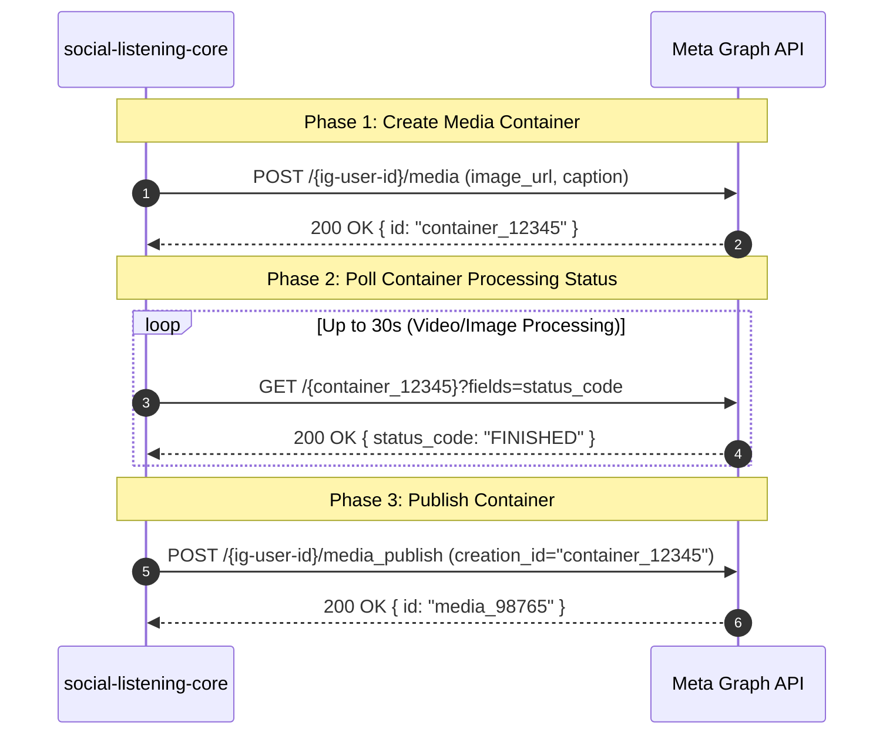

# Platform Library Specification: Instagram Content Publishing API

**Platform ID:** `instagram`  
**Display Name:** Instagram Business (Meta Graph API)  
**Build Sequence:** Step 3 of 5 (Wave 2)  
**Governing Architecture Decision:** [ADR-0118: Additional Social Platform Publishing](file:///c:/Users/MennoDrescher/source/repos/socialengage/docs/adr/0118-additional-social-platform-publishing.md)  
**Foundational Specifications:** [ADR-0068: Instagram Connector](file:///c:/Users/MennoDrescher/source/repos/socialengage/docs/adr/0068-instagram-connector.md) & [ADR-0115: Publishing Media Upload and Asset Targeting](file:///c:/Users/MennoDrescher/source/repos/socialengage/docs/adr/0115-publishing-media-upload-and-asset-targeting.md)  
**Source Story:** [Story 14.1 (ADR-0118)](file:///c:/Users/MennoDrescher/source/repos/socialengage/docs/user-stories/epic-14-adr-0118-to-0122.md#L7-L27)  

---

## 1. Architectural Overview & Critical Constraints

Instagram content publishing operates exclusively through Meta's **Instagram Graph API** (v21.0+).

### 1.1 The Load-Bearing Constraint: No Text-Only Publishing
Per [ADR-0118 Context §3](file:///c:/Users/MennoDrescher/source/repos/socialengage/docs/adr/0118-additional-social-platform-publishing.md#L19-L25) and [ADR-0068](file:///c:/Users/MennoDrescher/source/repos/socialengage/docs/adr/0068-instagram-connector.md), **Instagram does not support text-only posts.**
- Meta’s Content Publishing API mandates a media attachment (`image_url` or `video_url`) for every feed post or reel.
- Posts containing only text or links cannot be dispatched.
- **Runtime Dependency:** Story 14.1 implementation for Instagram is explicitly gated on **Story 13.9 / [ADR-0115](file:///c:/Users/MennoDrescher/source/repos/socialengage/docs/adr/0115-publishing-media-upload-and-asset-targeting.md)** (Media Asset Store and presigned Azure Blob URLs).
- The Polypost Composer informs the user if Instagram is selected without an attached image or video.

### 1.2 Account Scope: Professional Accounts Only
- Supports **Instagram Business** and **Instagram Creator** accounts only.
- Personal Instagram profiles are strictly inaccessible via Meta’s Graph API.
- Each Instagram account must be linked to a parent Facebook Page administered by the authenticating user.

---

## 2. Authentication & Credential Architecture

### 2.1 Facebook Login for Business & Linked Discovery
During OAuth authorization, the user grants permissions via Facebook Login. The connector enumerates linked Instagram Business accounts via:

```http
GET https://graph.facebook.com/v21.0/me/accounts?fields=id,name,instagram_business_account{id,username,name,profile_picture_url}
```

### 2.2 Tier-3 Credential Structure
Stored in `platform_credentials` as an envelope-encrypted JSON string ([ADR-0014](file:///c:/Users/MennoDrescher/source/repos/socialengage/docs/adr/0014-credential-storage-envelope-encryption-oauth-first.md), [ADR-0028](file:///c:/Users/MennoDrescher/source/repos/socialengage/docs/adr/0028-credential-creation-authority-scoped-by-ownership-tier.md)):

```typescript
export interface InstagramPublishingCredential {
  /** Target Instagram Business Account ID (e.g. '17841405309211562') */
  instagramBusinessAccountId: string;
  /** Parent Facebook Page ID */
  pageId: string;
  /** Page Access Token with instagram_content_publish scope */
  pageAccessToken: string;
  /** Instagram account handle */
  username: string;
}
```

### 2.3 Required OAuth Permissions
- `instagram_basic` (account profile and metadata)
- `instagram_content_publish` (media container creation and publishing)
- `pages_show_list` (page discovery)
- `pages_read_engagement` (engagement verification)

---

## 3. Two-Step Asynchronous Publishing Pipeline

Meta requires a two-phase "Container Creation → Status Verification → Publish" lifecycle:



### Step 1: Create Media Container
```http
POST https://graph.facebook.com/v21.0/{ig-user-id}/media
Authorization: Bearer {pageAccessToken}
Content-Type: application/x-www-form-urlencoded

image_url=https%3A%2F%2Fstorage.blob.core.windows.net%2Fmedia%2Fpost_img.jpg%3Fsv%3D...
&caption=Excited+to+announce+our+latest+release%21+%23sociallistening+%23analytics
```

Response:
```json
{
  "id": "17923456789012345"
}
```

### Step 2: Poll Container Status
For single images, the container is often ready immediately (`FINISHED`). For videos or Reels, processing takes several seconds:
```http
GET https://graph.facebook.com/v21.0/{container-id}?fields=status_code,status
```
Possible `status_code` values:
- `FINISHED`: Ready to publish.
- `IN_PROGRESS`: Encoding/resizing in progress; sleep 1500ms and recheck.
- `ERROR`: Media download or encoding failed.
- `EXPIRED`: Container was not published within 24 hours.

### Step 3: Publish Media
```http
POST https://graph.facebook.com/v21.0/{ig-user-id}/media_publish
Authorization: Bearer {pageAccessToken}
Content-Type: application/x-www-form-urlencoded

creation_id=17923456789012345
```

Response:
```json
{
  "id": "18012345678901234"
}
```

The connector resolves the public permalink via:
```typescript
const externalUrl = `https://www.instagram.com/p/${mediaId}/`;
```

---

## 4. Text Validation & Media Constraints

### 4.1 Caption Limits
- **Maximum Length:** **2,200 characters** (NFC codepoints).
- **Hashtag Limit:** Maximum **30 hashtags** per post (API rejects payloads with > 30 `#` tags).
- **Link Behavior:** Links in captions are treated as plain text and are **not clickable** in Instagram feed posts.

### 4.2 Media Format Constraints
- **Images:** JPEG or PNG format.
  - Aspect Ratio: Between **4:5 (vertical)** and **1.91:1 (horizontal)**. Square (1:1) is optimal.
  - Maximum File Size: **8 MB**.
- **Videos / Reels:** MP4 or MOV container.
  - Duration: 3 seconds to 15 minutes.
  - Aspect Ratio: **9:16** for Reels, 4:5 to 16:9 for Feed.

---

## 5. Rate Limiting & RequestGate Configuration

### 5.1 Platform Quota Cap (25 Posts / 24 Hours)
Meta enforces a strict, account-level publishing ceiling:
- **Hard Ceiling:** **25 published posts within any rolling 24-hour window** per Instagram account.
- Exceeding this returns Graph API error subcode `2207001` (`The maximum number of posts has been reached`).

### 5.2 RequestGate Declaration
To prevent hitting Meta's hard publishing block, the connector configures `RequestGate`:

```typescript
getOutboundRateLimitConfig: (): RateLimitConfig => ({
  requestsPerWindow: 25,
  windowSeconds: 24 * 60 * 60, // 24 hours
}),
```

Gated under:
$$\text{GateKey} = (\text{tenantId}, \text{'instagram'}, \text{'outbound\_post'})$$

---

## 6. Error Classification & Resilience

| HTTP / Graph Code | Error Subcode / Message | ErrorKind | Severity / Action |
|---|---|---|---|
| `400 / 100` | `Invalid parameter: image_url is required` | `platform_asset_rejected` | Terminal: Attempted text-only post or media URL was inaccessible. |
| `400 / 2207001` | `Maximum number of posts reached` | `rate_limit` | Transient: Quota exhausted (25 posts/24h). Queue until 24h window elapses. |
| `400 / 2207027` | `Aspect ratio not supported` | `platform_asset_rejected` | Terminal: Image aspect ratio outside 4:5 to 1.91:1. |
| `401 / 190` | `Error validating access token: Session expired` | `http_401` | Terminal: User password changed or token invalidated. Prompt re-auth. |
| `403 / 10` | `Application does not have permission` | `http_403` | Terminal: Missing `instagram_content_publish` permission on Page token. |
| `500 / 1` | `An unknown error occurred` | `http_5xx` | Transient: Meta internal server error. Retry container status or publish call. |

---

## 7. Connector Implementation Blueprint

### 7.1 Directory Layout
Isolated under `social-listening-core/src/connectors/instagram/`:

```
social-listening-core/src/connectors/instagram/
├── instagramConnector.ts        # SocialConnector implementation
├── instagramPublishClient.ts    # Container creation & async polling engine
├── instagramTypes.ts            # Graph API DTOs & Credentials
├── instagramMediaValidator.ts   # Aspect ratio & caption length checks
└── index.ts                     # Public exports
```

### 7.2 Implementation Code Outline

```typescript
// social-listening-core/src/connectors/instagram/instagramConnector.ts

import { SocialConnector, OutboundPostPayload, RateLimitConfig } from '../types';
import { ClassifiableError } from '../../ingestion/errorClassification';
import { parseInstagramCredential, executeInstagramPublish } from './instagramPublishClient';

export const INSTAGRAM_PROVIDER_ID = 'instagram';

export const instagramConnector: SocialConnector = {
  providerId: INSTAGRAM_PROVIDER_ID,
  authMode: 'oauth',
  deliveryMode: 'poll',

  getRateLimitConfig: (): RateLimitConfig => ({
    requestsPerWindow: 25,
    windowSeconds: 86400,
  }),

  getOutboundRateLimitConfig: (): RateLimitConfig => ({
    requestsPerWindow: 25,
    windowSeconds: 86400,
  }),

  async targetAssets(tenantId: string, userId: string, credential: string) {
    const cred = parseInstagramCredential(credential);
    return [{ id: cred.instagramBusinessAccountId, type: 'instagram_business_account', name: cred.username }];
  },

  async publish(tenantId: string, userId: string, payload: OutboundPostPayload, credential: string) {
    const cred = parseInstagramCredential(credential);

    // Enforcement: Instagram requires media attachments
    if (!payload.assets || payload.assets.length === 0) {
      throw new ClassifiableError(
        'platform_asset_rejected',
        'Instagram does not support text-only publishing. An image or video asset is required.'
      );
    }

    const result = await executeInstagramPublish(cred, payload);
    return {
      externalId: result.mediaId,
      externalUrl: `https://www.instagram.com/p/${result.mediaId}/`,
    };
  },

  normalize: (rawItem: unknown) => {
    throw new Error('Instagram polling uses existing pollInstagramAccount implementation');
  }
};
```

---

## 8. Contract Test Suite Plan

The contract test suite (`social-listening-core/contracts/epic-14/story-14.1.instagram-publishing.contract.test.ts`) verifies:
1. **Text-Only Rejection:** Asserts that calling `publish()` with text-only throws `platform_asset_rejected`.
2. **Two-Step Container Sequence:** Mocks Meta Graph API, asserting that `/{ig-user-id}/media` is called first, followed by container polling, followed by `/{ig-user-id}/media_publish`.
3. **25-Post Rolling Rate Gate:** Asserts that calls acquire the gate key `(${tenantId}:instagram:outbound_post)` with a 24-hour rate limit config.
4. **Hashtag Count Validation:** Asserts that captions with > 30 hashtags fail validation before calling Meta API.
