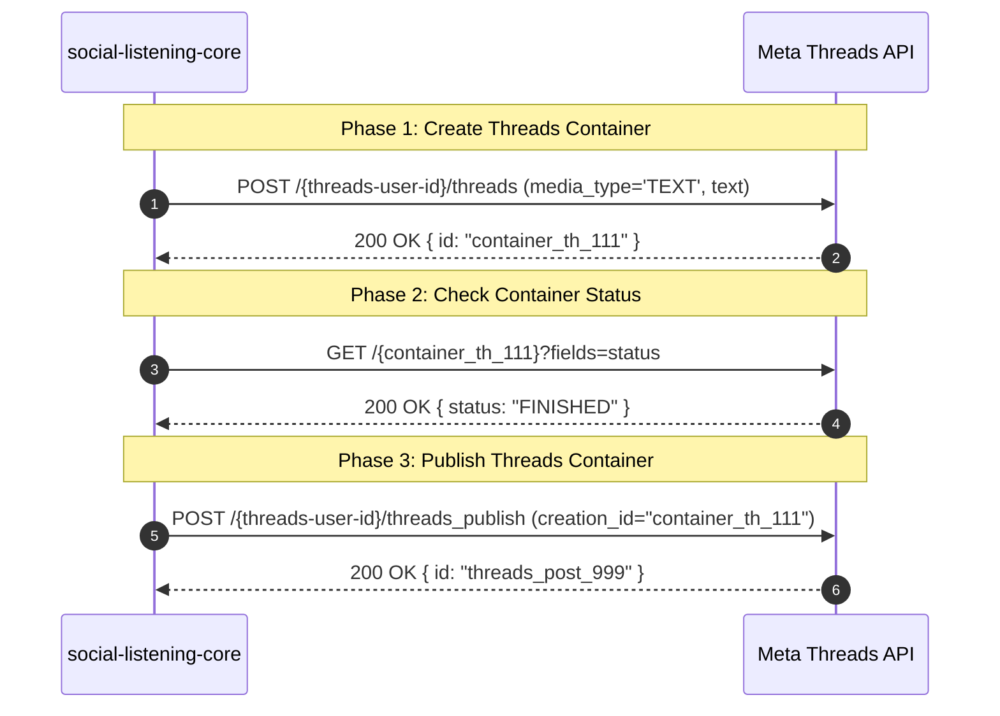

# Platform Library Specification: Meta Threads API Outbound Publishing

**Platform ID:** `threads`  
**Display Name:** Threads (Meta Threads API)  
**Build Sequence:** Step 4 of 5 (Wave 2)  
**Governing Architecture Decision:** [ADR-0118: Additional Social Platform Publishing](file:///c:/Users/MennoDrescher/source/repos/socialengage/docs/adr/0118-additional-social-platform-publishing.md)  
**Foundational Specifications:** [ADR-0075: Outbound Social Post Publishing](file:///c:/Users/MennoDrescher/source/repos/socialengage/docs/adr/0075-outbound-social-post-publishing.md) & [ADR-0072: Polypost Composer](file:///c:/Users/MennoDrescher/source/repos/socialengage/docs/adr/0072-cross-platform-polypost-composer-and-multi-network-preview-engine.md)  
**Source Story:** [Story 14.1 (ADR-0118)](file:///c:/Users/MennoDrescher/source/repos/socialengage/docs/user-stories/epic-14-adr-0118-to-0122.md#L7-L27)  

---

## 1. Architectural Overview & Context

Threads is Meta’s microblogging and public conversation platform. Unlike Instagram, the **Meta Threads API** (`graph.threads.net`) was designed from inception to support text-first conversation, micro-updates, links, and replies.

Per [ADR-0118 Decision §1](file:///c:/Users/MennoDrescher/source/repos/socialengage/docs/adr/0118-additional-social-platform-publishing.md#L33-L43), Threads is placed as the fourth platform in Wave 2:
1. **Full Text-Only Capability:** Unlike Instagram, Threads allows `media_type='TEXT'` posts with zero attached media.
2. **Dedicated Threads API Surface:** Operates on `https://graph.threads.net/v1.0/`, distinct from the main Facebook/Instagram Graph API hostname (`graph.facebook.com`).
3. **App Review Gate:** Requires Meta App Review approval for the `threads_content_publish` permission and business identity verification.

---

## 2. Authentication & Credential Architecture

### 2.1 Threads OAuth 2.0 Flow
Threads uses a standalone OAuth 2.0 authorization code flow via `threads.net`:
1. Authorization URL: `https://threads.net/oauth/authorize`
2. Token Exchange: `POST https://graph.threads.net/oauth/access_token` (exchanging authorization code for a short-lived user token).
3. Long-Lived Token Exchange: `GET https://graph.threads.net/access_token?grant_type=th_exchange_token` (exchanging short-lived token for a 60-day token).

### 2.2 Tier-3 Credential Structure
Stored in `platform_credentials` as an envelope-encrypted JSON string ([ADR-0014](file:///c:/Users/MennoDrescher/source/repos/socialengage/docs/adr/0014-credential-storage-envelope-encryption-oauth-first.md), [ADR-0028](file:///c:/Users/MennoDrescher/source/repos/socialengage/docs/adr/0028-credential-creation-authority-scoped-by-ownership-tier.md)):

```typescript
export interface ThreadsCredential {
  /** Authenticated user's Threads User ID (e.g. '9876543210') */
  threadsUserId: string;
  /** 60-day long-lived User Access Token */
  accessToken: string;
  /** User's Threads handle (e.g. 'brand_hq') */
  username: string;
  /** Token expiration timestamp (ISO 8601) */
  expiresAt: string;
}
```

### 2.3 Required OAuth Scopes
- `threads_basic`: Read profile information and post metadata.
- `threads_content_publish`: Create and publish posts on behalf of the user.
- `threads_manage_replies` (optional): Handle post reply controls.

---

## 3. Two-Step Publishing Pipeline

Similar to the Instagram Graph API, Threads uses a two-phase container model:



### Step 1: Create Container (`media_type='TEXT'`)
```http
POST https://graph.threads.net/v1.0/{threads-user-id}/threads
Authorization: Bearer {accessToken}
Content-Type: application/x-www-form-urlencoded

media_type=TEXT
&text=Exploring+the+frontiers+of+organizational+adaptability.+Read+more+below.
&link_attachment=https%3A%2F%2Fexample.com%2Fadaptability
&reply_control=everyone
```

| Parameter | Type | Description |
|---|---|---|
| `media_type` | string | `'TEXT'` (text-only or text + link), `'IMAGE'`, or `'VIDEO'`. |
| `text` | string | Post text (max 500 characters). |
| `link_attachment` | string (optional) | URL for rendering a native link card preview inside the Threads post. |
| `reply_control` | enum (optional) | `'everyone'`, `'accounts_you_follow'`, or `'mentioned_only'`. Default: `'everyone'`. |

### Step 2: Verify Status
For text-only posts, the container reaches `FINISHED` almost instantly:
```http
GET https://graph.threads.net/v1.0/{container-id}?fields=status,error_message
```

### Step 3: Publish Container
```http
POST https://graph.threads.net/v1.0/{threads-user-id}/threads_publish
Authorization: Bearer {accessToken}
Content-Type: application/x-www-form-urlencoded

creation_id=container_th_111
```

Response:
```json
{
  "id": "18099887766554433"
}
```

The connector constructs the web permalink:
```typescript
const externalUrl = `https://www.threads.net/@${credential.username}/post/${response.id}`;
```

---

## 4. Text Validation & Limits

### 4.1 Character Counting
- **Maximum Length:** **500 characters** (NFC codepoints).
- Character counting follows `social-listening-admin/src/components/composer/lib/counting.ts`:
  $$\text{Length} = \text{Array.from(text.normalize('NFC')).length} \le 500$$

### 4.2 Link Attachment vs. Inline Links
- If a post contains a URL, Threads permits passing it in `link_attachment`.
- The Threads client generates a rich preview card with title, description, and thumbnail automatically.

---

## 5. Rate Limiting & RequestGate Configuration

### 5.1 Platform Quota Cap (250 Posts / 24 Hours)
Meta enforces strict publishing limits on Threads:
- **Maximum Posts:** **250 published posts per rolling 24-hour window** per user account.
- **Container Creations:** Maximum 250 container creation calls per rolling 24-hour window.

### 5.2 RequestGate Declaration
The Threads connector declares:

```typescript
getOutboundRateLimitConfig: (): RateLimitConfig => ({
  requestsPerWindow: 250,
  windowSeconds: 24 * 60 * 60, // 86,400 seconds (24 hours)
}),
```

Gated under:
$$\text{GateKey} = (\text{tenantId}, \text{'threads'}, \text{'outbound\_post'})$$

---

## 6. Error Classification & Resilience

| HTTP Status | Error Subcode | ErrorKind | Severity / Action |
|---|---|---|---|
| `400` | `2388001` (Invalid Media Type) | `platform_asset_rejected` | Terminal: Unsupported format or malformed `media_type`. |
| `400` | `2388003` (Character limit exceeded) | `missing_permission` | Terminal: Text exceeds 500 characters. |
| `401` | `190` (Token expired/invalid) | `http_401` | Terminal: User revoked access or 60-day token expired. |
| `403` | `10` (Missing permission) | `http_403` | Terminal: App lacks `threads_content_publish` permission. |
| `429` | `2388002` (Rate limit exceeded) | `rate_limit` | Transient: User hit 250 posts/24h ceiling. Queue until window resets. |
| `500 / 503` | Server error | `http_5xx` | Transient: Meta Threads backend lag. Retry container status or publish. |

---

## 7. Connector Implementation Blueprint

### 7.1 Directory Layout
Isolated under `social-listening-core/src/connectors/threads/`:

```
social-listening-core/src/connectors/threads/
├── threadsConnector.ts        # SocialConnector implementation
├── threadsClient.ts           # Container creation & publishing HTTP client
├── threadsTypes.ts            # Threads API schemas & Credential definitions
└── index.ts                   # Public exports
```

### 7.2 Implementation Code Outline

```typescript
// social-listening-core/src/connectors/threads/threadsConnector.ts

import { SocialConnector, OutboundPostPayload, RateLimitConfig } from '../types';
import { parseThreadsCredential, createThreadsPost } from './threadsClient';

export const THREADS_PROVIDER_ID = 'threads';

export const threadsConnector: SocialConnector = {
  providerId: THREADS_PROVIDER_ID,
  authMode: 'oauth',
  deliveryMode: 'poll',

  getRateLimitConfig: (): RateLimitConfig => ({
    requestsPerWindow: 250,
    windowSeconds: 86400,
  }),

  getOutboundRateLimitConfig: (): RateLimitConfig => ({
    requestsPerWindow: 250,
    windowSeconds: 86400,
  }),

  async targetAssets(tenantId: string, userId: string, credential: string) {
    const cred = parseThreadsCredential(credential);
    return [{ id: cred.threadsUserId, type: 'threads_user', name: `@${cred.username}` }];
  },

  async publish(tenantId: string, userId: string, payload: OutboundPostPayload, credential: string) {
    const cred = parseThreadsCredential(credential);
    
    // Extract optional link attachment from linkPreview or text
    const linkAttachment = payload.linkPreview ? (payload.linkPreview as { url?: string }).url : undefined;

    const result = await createThreadsPost(cred, {
      text: payload.text,
      linkAttachment,
    });

    return {
      externalId: result.id,
      externalUrl: `https://www.threads.net/@${cred.username}/post/${result.id}`,
    };
  },

  normalize: (rawItem: unknown) => {
    throw new Error('Threads polling is deferred to follow-up story');
  }
};
```

---

## 8. Contract Test Suite Plan

The contract test suite (`social-listening-core/contracts/epic-14/story-14.1.threads-publishing.contract.test.ts`) verifies:
1. **Contract Registration:** Verifies `getSocialConnector('threads')` is registered and exports `publish`.
2. **Text-Only Support:** Asserts that calling `publish()` with text-only successfully invokes container creation with `media_type='TEXT'`.
3. **Link Attachment Mapping:** Asserts that link card data maps to `link_attachment` query parameter.
4. **250-Post Rate Limiting:** Asserts that calls acquire the gate key `(${tenantId}:threads:outbound_post)` with a 24-hour rate limit window.
5. **Character Boundary:** Asserts that text exceeding 500 characters is rejected before API dispatch.
