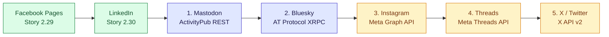
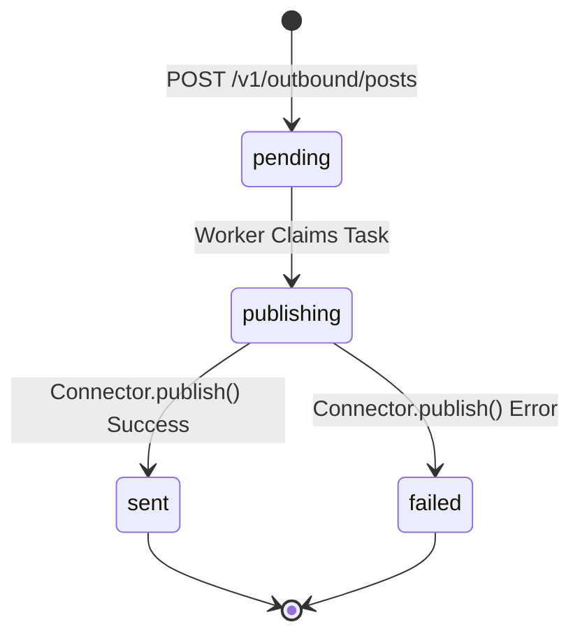

# Social Platform Publishing Library — Roadmap & Architectural Specifications

**Story Reference:** [Story 14.1 — Additional social platform publishing roadmap (backend)](file:///c:/Users/MennoDrescher/source/repos/socialengage/docs/user-stories/epic-14-adr-0118-to-0122.md#L7-L27)  
**Governing Architecture Decision:** [ADR-0118: Additional Social Platform Publishing](file:///c:/Users/MennoDrescher/source/repos/socialengage/docs/adr/0118-additional-social-platform-publishing.md)  
**Foundational Publishing Contracts:** [ADR-0075: Outbound Social Post Publishing](file:///c:/Users/MennoDrescher/source/repos/socialengage/docs/adr/0075-outbound-social-post-publishing.md) & [ADR-0072: Polypost Composer](file:///c:/Users/MennoDrescher/source/repos/socialengage/docs/adr/0072-cross-platform-polypost-composer-and-multi-network-preview-engine.md)  
**Status:** Canonical Platform Library Documentation  
**Target Delivery:** Second Wave of Publishing Connectors  

---

## 1. Executive Summary & Intent

SocialEngage's Polypost Composer exposes client-side preview rails for seven major social networks:
1. **Facebook** (Shipped in Story 2.29 via [ADR-0075](file:///c:/Users/MennoDrescher/source/repos/socialengage/docs/adr/0075-outbound-social-post-publishing.md))
2. **LinkedIn** (Shipped in Story 2.30 via [ADR-0075](file:///c:/Users/MennoDrescher/source/repos/socialengage/docs/adr/0075-outbound-social-post-publishing.md))
3. **Mastodon** (Wave 2, Target 1)
4. **Bluesky** (Wave 2, Target 2)
5. **Instagram** (Wave 2, Target 3 — Media-dependent)
6. **Threads** (Wave 2, Target 4 — Access-dependent)
7. **X / Twitter** (Wave 2, Target 5 — Economic-dependent)

Prior to Story 14.1, the preview rails for Mastodon, Bluesky, Instagram, Threads, and X operated solely as client-side simulations without a backing server-side dispatch route. Story 14.1 defines the build order, shared technical constraints, rate-limit isolation, and credential boundaries to extend `SocialConnector.publish?()` to these five remaining platforms.

This platform library provides the authoritative technical build specifications, API payload structures, authentication flows, rate-limiting rules, character counting mechanisms, and error classifications for each platform.

---

## 2. Governed Build Order & Rationales

Per [ADR-0118 Decision §1](file:///c:/Users/MennoDrescher/source/repos/socialengage/docs/adr/0118-additional-social-platform-publishing.md#L33-L43), implementation proceeds in a strict sequential order determined by integration friction, cost, and API openness:



### Detailed Sequencing Rationale

1. **Mastodon (ActivityPub REST):**
   - **Why first:** Simplest authentication model (OAuth 2.0 Bearer tokens), zero developer fees, zero app review or corporate verification gates, and native support for text, link cards, and content warnings (`spoiler_text`).
   - **Constraint:** Requires instance URL resolution stored directly in the Tier-3 credential.
2. **Bluesky (AT Protocol XRPC):**
   - **Why second:** Open, decentralized protocol without business verification barriers. App Password authentication makes initial onboarding effortless.
   - **Constraint:** Requires AT Protocol XRPC client implementation (`app.bsky.feed.post`) with UTF-8 byte-offset facet calculation for links and mentions.
3. **Instagram (Meta Graph API Content Publishing):**
   - **Why third:** Reuses Meta Developer App and Facebook Login infrastructure established in Epic 2.
   - **Constraint / Gate:** **Text-only publishing is not supported by Instagram's API.** Every post requires a media container (`IMAGE` or `VIDEO`). Build is blocked until media upload is available (ADR-0115).
4. **Threads (Meta Threads API):**
   - **Why fourth:** Native text-only posting is fully supported (up to 500 characters), unlike Instagram.
   - **Constraint / Gate:** Requires Meta App Review approval for the `threads_content_publish` permission and business verification.
5. **X / Twitter (X API v2):**
   - **Why last:** Severe API economics and restrictive paywalls.
   - **Constraint / Gate:** Subject to an explicit economic viability review before implementation. The Free tier permits only 1,500 write requests/month for the entire app; Basic tier costs $100/month for 10,000 tweets.

---

## 3. Shared Architectural Contracts

Every platform connector authored under this roadmap must adhere to the foundational SocialEngage architectural principles:

### 3.1 Connector Interface Conformance
All connectors implement [`SocialConnector`](file:///c:/Users/MennoDrescher/source/repos/socialengage/social-listening-core/src/connectors/types.ts#L141-L260):

```typescript
export interface SocialConnector extends ProviderConnector {
  readonly providerId: string;
  readonly authMode: 'oauth' | 'api_key' | 'none';
  readonly deliveryMode: 'poll' | 'push';

  /** Optional outbound publishing capability */
  publish?(
    tenantId: string,
    userId: string,
    payload: OutboundPostPayload,
    credential: string
  ): Promise<{ externalId: string; externalUrl: string }>;

  /** Per-user asset enumeration to validate targetAssetId */
  targetAssets?(
    tenantId: string,
    userId: string,
    credential: string
  ): Promise<Array<string | { id: string; type: string }>>;

  /** Platform-specific outbound rate-limit configuration */
  getOutboundRateLimitConfig?(): RateLimitConfig;
}
```

### 3.2 RequestGate Rate-Limit Isolation
Per [ADR-0075 Decision §2](file:///c:/Users/MennoDrescher/source/repos/socialengage/docs/adr/0075-outbound-social-post-publishing.md#L45-L55) and [ADR-0118 Decision §2](file:///c:/Users/MennoDrescher/source/repos/socialengage/docs/adr/0118-additional-social-platform-publishing.md#L44-L52), all outbound publishing calls are governed by [`acquireForOutboundPost()`](file:///c:/Users/MennoDrescher/source/repos/socialengage/social-listening-core/src/connectors/requestGate.ts#L173-L182):

$$\text{GateKey} = (\text{tenantId}, \text{providerId}, \text{'outbound\_post'})$$

This key is strictly isolated from:
- Ingestion poll rate-limit gates: `(tenantId, providerId)`
- Outbound reply/comment gates: `(tenantId, providerId, 'outbound')`
- AI Deep Research gates: `(tenantId, providerId, modelId)`

### 3.3 Credential Ownership & Storage (Tier-3)
Per [ADR-0028](file:///c:/Users/MennoDrescher/source/repos/socialengage/docs/adr/0028-credential-creation-authority-scoped-by-ownership-tier.md) and [ADR-0014](file:///c:/Users/MennoDrescher/source/repos/socialengage/docs/adr/0014-credential-storage-envelope-encryption-oauth-first.md):
- All social publishing connectors use **Tier-3 (user-bound)** credentials.
- Stored in `platform_credentials` with `owner_type = 'user'` and envelope-encrypted via Azure Key Vault.
- The stored credential is a JSON-serialized string containing the access tokens, instance domains, and asset IDs required to dispatch requests.
- Per [ADR-0027](file:///c:/Users/MennoDrescher/source/repos/socialengage/docs/adr/0027-connector-is-technical-intermediary-not-contracting-party.md), SocialEngage acts strictly as a **technical intermediary**; tenant users hold and pay for their own social platform accounts. No shared or pooled credentials are permitted.

### 3.4 Outbound Activity Persistence & Lifecycle
Outbound post dispatches are tracked in the tenant-partitioned, RLS-enforced `outbound_activities` table:



On success, the connector returns:
- `externalId`: Platform-assigned native ID (e.g. status ID, AT-URI, tweet ID).
- `externalUrl`: Direct public URL to the published post on the platform web interface.

---

## 4. Cross-Platform Comparative Matrix

| Attribute | 1. Mastodon | 2. Bluesky | 3. Instagram | 4. Threads | 5. X / Twitter |
|---|---|---|---|---|---|
| **Protocol / API** | ActivityPub / REST | AT Protocol XRPC | Meta Graph API v21+ | Meta Threads API | X API v2 REST |
| **Provider ID** | `mastodon` | `bluesky` | `instagram` | `threads` | `twitter` |
| **Auth Mode** | OAuth 2.0 Bearer | Session / App Password | OAuth 2.0 (Page Token) | OAuth 2.0 (Threads) | OAuth 2.0 PKCE |
| **Required Scopes** | `write:statuses` | `atproto` / PDS Session | `instagram_content_publish` | `threads_content_publish` | `tweet.write`, `users.read` |
| **Max Characters** | 500 (default) | 300 graphemes | 2,200 (caption) | 500 characters | 280 weighted |
| **Counting Method** | `mastodon` (URL=23) | `graphemes` (Intl) | `nfc-codepoints` | `nfc-codepoints` | `x-weighted` (URL=23) |
| **Text-Only Posts?**| Yes | Yes | **No (Media Required)** | Yes | Yes |
| **Link Card Previews**| Auto / OpenGraph | Facet + External Embed | Not clickable in caption | `link_attachment` field | Auto / Twitter Card |
| **Native Special Features**| Content Warning (`CW`) | Byte-Offset Rich Facets | Carousel & Product Tags | Topic Tags & Reply Rules| Polls, Reply Settings |
| **Rate Limit Window** | 300 req / 5 min | 5,000 req / hour | 25 posts / 24h rolling | 250 posts / 24h rolling | 200 tweets / 15 min |
| **Economic Gate** | Free | Free | Free (Meta App Review) | Free (Meta App Review) | **Paid ($100/mo min)** |

---

## 5. Platform Document Library Index

Detailed platform build specifications are documented in the companion library guides:

1. [01-mastodon-publishing-connector.md](file:///c:/Users/MennoDrescher/source/repos/socialengage/docs/platform-library/01-mastodon-publishing-connector.md) — Mastodon ActivityPub REST Publishing Specification
2. [02-bluesky-publishing-connector.md](file:///c:/Users/MennoDrescher/source/repos/socialengage/docs/platform-library/02-bluesky-publishing-connector.md) — Bluesky AT Protocol XRPC Publishing Specification
3. [03-instagram-publishing-connector.md](file:///c:/Users/MennoDrescher/source/repos/socialengage/docs/platform-library/03-instagram-publishing-connector.md) — Instagram Content Publishing API Specification
4. [04-threads-publishing-connector.md](file:///c:/Users/MennoDrescher/source/repos/socialengage/docs/platform-library/04-threads-publishing-connector.md) — Meta Threads API Publishing Specification
5. [05-x-twitter-publishing-connector.md](file:///c:/Users/MennoDrescher/source/repos/socialengage/docs/platform-library/05-x-twitter-publishing-connector.md) — X (Twitter) API v2 Publishing & Economic Evaluation Spec
