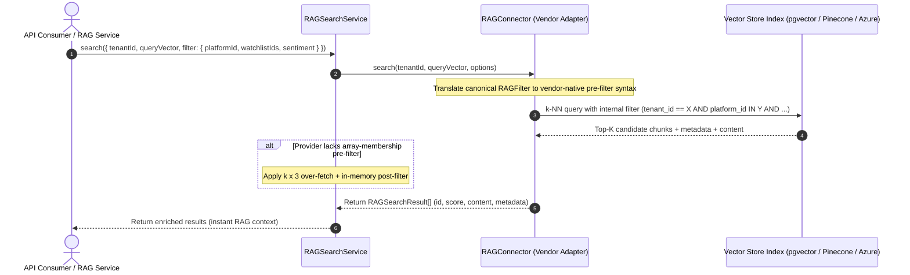
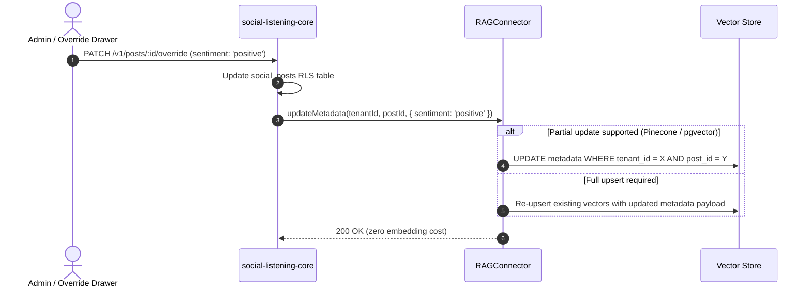

# Functional Design Document — FDD-0083: RAG Vector-Store RLS and Metadata

## 1. Document Control

| Field | Value |
|---|---|
| Document Title | FDD-0083 RAG Vector-Store RLS and Metadata — Functional Design Document |
| Version | 1.0 |
| Date | 2026-08-27 |
| Author(s) | FDD Architect Agent |
| Reviewer(s) | Technical Lead (Menno) |
| Status | Approved (Derived from Accepted ADR-0083 & Approved BRD-0083) |
| Related Documents | ADR-0083, ADR-0081, ADR-0082, ADR-0015, ADR-0043, ADR-0071, BRD-0083, Story 9.9 |

---

## 2. System Architecture & Query Data Flow

### 2.1 Pre-Filtered Vector Search Data Flow
To prevent recall drop-off and pagination skew caused by application-level post-filtering, all metadata filters execute inside the vector store during candidate retrieval:



---

## 3. Component & Schema Specifications

### 3.1 Metadata Schema Definition (`RAGChunkMetadata`)
```ts
export type PlatformId =
  | 'facebook'
  | 'instagram'
  | 'linkedin'
  | 'bluesky'
  | 'threads'
  | 'x'
  | 'rss'
  | 'newswire'
  | 'wikipedia'
  | string;

export interface RAGChunkMetadata {
  tenant_id: string;         // Mandatory: equality-filtered on every search
  post_id: string;           // Links back to social_posts
  chunk_index: number;       // 0..N for this post
  content: string;           // Chunk text payload (bounded <= 256 tokens / ~1.5 KB)
  platform_id: PlatformId;   // Typed platform identifier
  published_at: string;      // ISO 8601 string for date-range filtering
  watchlist_ids: string[];   // Array of matching watchlist IDs (empty array if none)
  sentiment?: string;        // 'positive' | 'negative' | 'neutral' | 'unassigned'
  topics?: string[];         // Topic IDs from AI topic clustering
}
```

---

### 3.2 Provider Filter Syntax Translation

| Provider | Filter Syntax Mapping | Notes |
| :--- | :--- | :--- |
| **pgvector (Default)** | `WHERE tenant_id = $1 AND platform_id = ANY($2) AND watchlist_ids && $3 AND published_at BETWEEN $4 AND $5` | Native SQL array-overlap operator (`&&`) and index scan. |
| **Pinecone** | `{ tenant_id: { $eq: tenantId }, platform_id: { $in: [...] }, watchlist_ids: { $in: [...] } }` | Mongo-style query pre-filter applied before graph traversal. |
| **Azure AI Search** | `tenant_id eq '...' and watchlist_ids/any(w: search.in(w, '...')) and published_at ge ...` | OData `$filter` expression integrated into search index request. |

---

### 3.3 Mutation & Lifecycle Management Workflows

#### A. Targeted Metadata Updates (`RAGConnector.updateMetadata`)
When a human overrides post sentiment (ADR-0071) or a watchlist assignment changes, the system updates metadata without re-running embedding models:


#### B. Content Modification & Redaction
When a post's text is edited or redacted in `social_posts`:
1. Core calls `RAGConnector.deletePost(tenantId, postId)`.
2. Core invokes `RAGChunkingService.split(updatedPost)`.
3. Core calls `AIProviderConnector.embed(texts)`.
4. Core calls `RAGConnector.upsert(newChunks)`.

#### C. Deterministic Deletions & Offboarding
- `deletePost(tenantId, postId)`: Generates ID array `[0..chunk_count - 1]` $\rightarrow$ `${tenantId}:${postId}:${i}` or executes metadata filter `tenant_id == tenantId AND post_id == postId`.
- `deleteTenant(tenantId)`: Bulk deletes all vectors matching `tenant_id == tenantId` (or drops the tenant namespace).

---

## 4. Error Handling & Verification Matrix

| Scenario | System Behavior | Guardrail |
| :--- | :--- | :--- |
| **Query Missing `tenantId`** | Rejected immediately at service layer with `400 Bad Request`. | No vector query is ever constructed without `tenant_id`. |
| **Provider Lacks Array Filter** | `RAGSearchService` over-fetches candidates by $3\times$ ($k \times 3$) and post-filters in memory. | Mitigates candidate list truncation. |
| **Orphaned Vector Records** | Reconciliation worker compares `rag_chunks_sync` vs `social_posts` every 24h. | Purges unlinked vectors. |