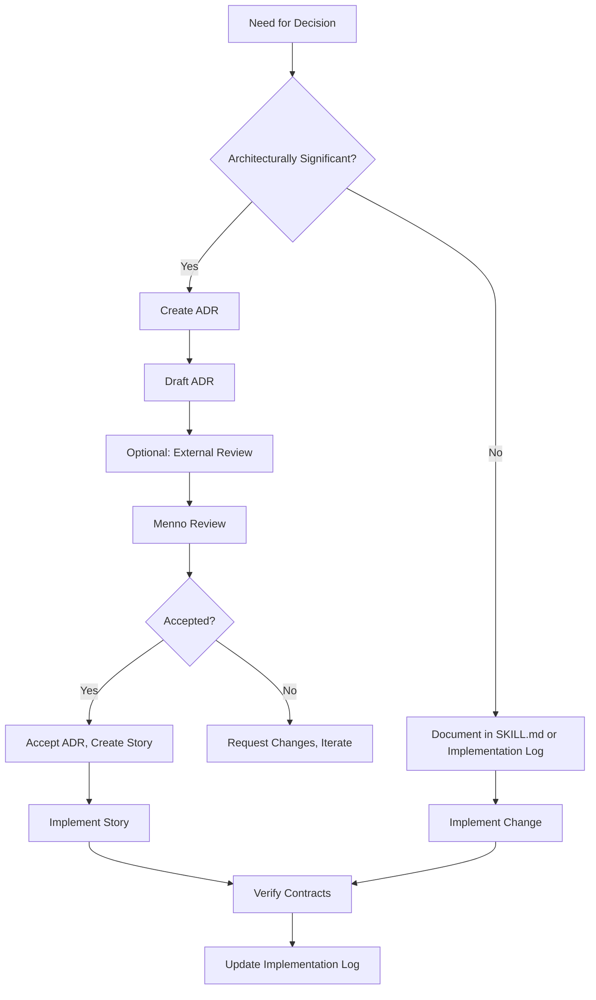

# Development Approach and Life Cycle Management Plan
## SocialEngage Project — PMBOK Domain: Development Approach & Life Cycle

**Project:** Social Listening & Engagement Platform (SocialEngage)  
**Phase:** Phase 1 — Social Listening / Insights Subsystem  
**Owner:** Menno Drescher  
**Date:** 2026-08-01  
**Status:** Draft  
**Version:** 1.2

---

## 1. Purpose

This plan defines **how the SocialEngage project approaches development and the lifecycle model** it follows. It addresses:
- The **development methodology** (contract-first, ADR-driven)
- The **project lifecycle** (phased, dependency-ordered, not calendar-driven)
- The **decision framework** (ADRs as the primary decision mechanism)
- The **integration approach** (how components come together)
- The **adaptation strategy** (how the approach evolves)

This is the **core management plan** that ties together all other plans. Without a clear development approach, the project would lack coherence in how decisions are made, how work is structured, and how success is measured.

---

## 2. Scope

### In Scope
- Development methodology and principles
- Project lifecycle model and phases
- Decision-making framework (ADR process)
- Architecture decision governance
- Integration and delivery approach
- Adaptation and evolution strategy

### Out of Scope
- Detailed technical implementation (covered in ADRs and SKILL.mds)
- Specific project schedules (covered in Implementation Plan)
- Resource allocation (covered in Team Management Plan)
- Risk management (covered in Uncertainty Management Plan)

---

## 3. Approach

### Guiding Principles

1. **Contract-First Development**: Every significant piece of work is defined by a passing contract test before implementation. This ensures the **what** is clear before the **how** is built.

2. **Architecture Decision Records (ADRs)**: Every architecturally significant decision is captured as an ADR. This creates a **decision audit trail** and prevents re-litigation of settled questions.

3. **Phase-Gated Delivery**: Work is organized into phases based on **dependencies**, not calendar dates. A phase only begins when its prerequisites are genuinely met.

4. **Defer Speculative Build**: Don't build capabilities until they are **actually needed**. This prevents overengineering and keeps the codebase lean.

5. **Transparency Over Opacity**: Every decision, change, and piece of work is documented and traceable. There are no hidden implementations or undocumented changes.

6. **Quality Over Speed**: Correctness and maintainability are prioritized over rapid delivery. "Done" means tested, documented, and verified.

### Development Methodology

The SocialEngage project uses a **hybrid methodology** combining:

- **Contract-First Development**: Tests define requirements; code satisfies tests
- **ADR-Driven Architecture**: Architecture decisions are explicit and documented
- **Phase-Gated Delivery**: Work is sequenced by dependency, not timeline
- **Implementation Methodology**: Formalized `implement-story` workflow
- **Healing-Oriented Development**: Contract failures trigger healing, not workarounds

**Methodology Stack:**
```
┌─────────────────────────────────────────────────────────────┐
│                    DEVELOPMENT METHODOLOGY                     │
├─────────────────────────────────────────────────────────────┤
│                                                                  │
│  ┌─────────────────────────────────────────────────────┐    │
│  │                    PHILOSOPHY                          │    │
│  │  ┌─────────────┐  ┌─────────────┐  ┌─────────────┐ │    │
│  │  │ Contract-   │  │ ADR-        │  │ Phase-      │ │    │
│  │  │ First       │  │ Driven      │  │ Gated       │ │    │
│  │  └─────────────┘  └─────────────┘  └─────────────┘ │    │
│  └─────────────────────────────────────────────────────┘    │
│                            │                                   │
│                            ▼                                   │
│  ┌─────────────────────────────────────────────────────┐    │
│  │                    PROCESSES                           │    │
│  │  ┌─────────────┐  ┌─────────────┐  ┌─────────────┐ │    │
│  │  │ implement-  │  │ heal-       │  │ validate-   │ │    │
│  │  │ story       │  │ contract-   │  │ contract    │ │    │
│  │  │             │  │ failure     │  │             │ │    │
│  │  └─────────────┘  └─────────────┘  └─────────────┘ │    │
│  └─────────────────────────────────────────────────────┘    │
│                            │                                   │
│                            ▼                                   │
│  ┌─────────────────────────────────────────────────────┐    │
│  │                    ARTIFACTS                            │    │
│  │  ┌─────────────┐  ┌─────────────┐  ┌─────────────┐ │    │
│  │  │ Contracts   │  │ ADRs        │  │ SKILL.mds   │ │    │
│  │  │ (.test.ts)  │  │ (.md)       │  │ (.md)       │ │    │
│  │  └─────────────┘  └─────────────┘  └─────────────┘ │    │
│  └─────────────────────────────────────────────────────┘    │
└─────────────────────────────────────────────────────────────┘
```

### Project Lifecycle Model

The SocialEngage project uses a **Phased, Dependency-Ordered, Non-Calendar Lifecycle**:

```
┌─────────────────────────────────────────────────────────────┐
│                    PROJECT LIFECYCLE MODEL                       │
├─────────────────────────────────────────────────────────────┤
│                                                                  │
│  ┌─────────┐    ┌─────────┐    ┌─────────┐    ┌─────────┐ │
│  │ Phase 0 │───▶│ Phase 1 │───▶│ Phase 2 │───▶│ Phase 3 │───▶│
│  │ Found-  │    │ MVP     │    │ Enrich- │    │ Event-  │    │
│  │ ations  │    │         │    │ ment    │    │ ing     │    │
│  └─────────┘    └─────────┘    └─────────┘    └─────────┘ │
│                            │                                   │
│                            ▼                                   │
│  ┌─────────┐    ┌─────────┐    ┌─────────┐                   │
│  │ Phase 4 │───▶│ Phase 5 │───▶│ Future   │                   │
│  │ Scale-  │    │ Produ-  │    │ Sub-    │                   │
│  │ out     │    │ ction   │    │ systems │                   │
│  │         │    │ Read-   │    │         │                   │
│  └─────────┘    └─────────┘    └─────────┘                   │
│                                                                  │
│  Characteristics:                                               │
│  - Dependency-ordered (not calendar-driven)                   │
│  - Each phase builds on the previous                            │
│  - Exit criteria must be met before proceeding                  │
│  - Phases can overlap at boundaries (e.g., Phase 1 stories     │
│    can be built while Phase 0 infrastructure is finalized)     │
│                                                                  │
└─────────────────────────────────────────────────────────────┘
```

**Phase Definitions:**

| Phase | Name | Goal | Exit Criteria | Stories |
|-------|------|------|----------------|---------|
| 0 | Foundations | Deployable repos, tenant-isolated DB, credential storage | Repos scaffolded, Postgres+RLS working, Key Vault configured | 1.1-1.4, 5.3-5.4 |
| 1 | MVP | One connector end-to-end with watchlist filtering | One platform ingesting, watchlists working, demo-able | 2.1-2.3, 3.1-3.4, 4.3, 2.7, **1.5** |
| 2 | Enrichment | AI-powered post understanding | Sentiment, entities, key phrases populated | 4.1-4.2 |
| 3 | Eventing | Platform for downstream subsystems | Events published, filtering working, test subscriber | 5.1-5.2, 5.5 |
| 4 | Scale-out | Multi-connector, multi-instance | 2+ connectors, 2+ instances, volume tested | 2.4-2.6, 3.5-3.6, 4.4 |
| 4.5 | Multi-tenant identity & access foundation | Close the authentication/tenant-identity gap (Risk R-04) | Every `/v1` endpoint derives identity from a validated Entra bearer token under RLS; `X-Tenant-Id` retired as a trust mechanism; R-04 closed, not merely mitigated | 5.6-5.11, 1.7 |
| 5 | Production Readiness | Hardened for real use | Implemented Entra authentication/identity, security review, operational runbooks, go-live | Not storied |
| Future | Downstream Subsystems | Brand Reputation, Social Care, Social Selling | Phase 1 validated, separate charters | Deferred |

**Documentation Steward correction, 2026-08-06.** This table was missing the Phase 4.5 row entirely — `docs/implementation-plan.md` inserted a real, fully-built phase between Phase 4 and Phase 5 (2026-08-03, see that document's own "why this is its own phase" section), and this document's own phase table had silently diverged from it ever since, in violation of this plan's own stated intent that `docs/implementation-plan.md` is the phase-structure source of truth. Row added above, matching `docs/implementation-plan.md`'s own Goal/Deliverable/story-list for that phase; no other phase's row content changed.

**2026-08-06 — Phase 5's "go-live" exit criterion is now formally defined, not just named.** `Go-Live-Readiness-Definition.md` (this folder) is the authoritative document: it defines the environment stages between "ephemeral test infrastructure" (today's only mode) and public Go-Live, the narrow Pilot exception, and the gate criteria for each transition. Phase 5's completion is one required input to that decision, not the decision itself.

### Decision Framework: Architecture Decision Records (ADRs)

**ADRs are the primary mechanism for architectural decision-making.**

**ADR Lifecycle:**
```
┌─────────────────────────────────────────────────────────────┐
│                    ADR LIFECYCLE                                 │
├─────────────────────────────────────────────────────────────┤
│                                                                  │
│  ┌─────────────┐    ┌─────────────┐    ┌─────────────┐    │
│  │   Draft     │───▶│  Proposed   │───▶│   Accepted  │    │
│  │ (Authoring) │    │ (Review)    │    │ (Decision)   │    │
│  └─────────────┘    └─────────────┘    └─────────────┘    │
│                            │                                   │
│                            ▼                                   │
│  ┌─────────────┐    ┌─────────────┐                         │
│  │  Superseded │◀───│  Amended    │                         │
│  │ (Replaced)  │    │ (Updated)    │                         │
│  └─────────────┘    └─────────────┘                         │
│                                                                  │
│  Status Transitions:                                            │
│  - Draft → Proposed: Ready for review                          │
│  - Proposed → Accepted: Approved by Menno                     │
│  - Accepted → Amended: Parameter change, clarification         │
│  - Accepted → Superseded: Fundamental decision change         │
│                                                                  │
└─────────────────────────────────────────────────────────────┘
```

**ADR Governance:**
- **Acceptance Authority:** Menno Drescher (for this solo project)
- **Review Process:** AI reviewers provide findings, Menno makes final decision
- **Change Process:** Amendments for parameters, Supersessions for decisions
- **Versioning:** All changes are append-only (never edit original text)

**ADR Statistics (2026-08-03):**
- Total ADRs: 35
- Accepted: 35 (100%)
- Proposed: 0
- Draft: 0
- Superseded: 0

**ADR Categories:**
- **Foundation:** 0001-0016 (Repository split, connector pattern, database, RLS, API versioning)
- **Core Architecture:** 0017-0023 (Versioning, retention, events, health, error handling, rate limits)
- **Connectors & credential ownership:** 0024-0028 (Newswire, GNews, connector intermediation, credential ownership tiers)
- **Identity & administration:** 0029-0035 (Entra External ID, roles, tenant/user data, bearer-token identity, connector authorization, and one role-gated Next.js admin app)

**WIP Limit on Open Governance Work (added 2026-08-05 — dated addition per this project's own convention; does not edit any text above).**

Following the Ideal Manager's 2026-08-05 Decision-Evaluator review of commit `4701eff` (`docs/management/manager-register.md`'s 2026-08-05 entry, per `.claude/agents/ideal-manager.md`'s fourteen-section framework), which found Scope & Expectations "at risk" — "the backlog grew 33% in one session with no stated WIP limit or backlog ceiling anywhere in the commit or surrounding docs," the same already-flagged, unquantified-ceiling gap Business Case §5 ("no formal budget ceiling has been set at this stage") and Charter §6's Assumption A-01 (tracked in `Uncertainty-Management-Plan.md` Appendix D as "never numerically quantified") had already named — Menno set an explicit WIP limit on open governance work. In his own words, verbatim:

- **On ADRs:** *"hard to decide on a day where we only brainstorm ok we can call that not an ADR. We can brainstorm separate keep at 3 at a time for open review."* Unstructured brainstorming/ideation is explicitly exempt from this limit and may continue freely; the limit applies only once something becomes an actual drafted, Proposed ADR under formal review. **Cap: a maximum of 3 Proposed ADRs open for review at any one time.** (Verified against `docs/adr/README.md`'s own "Proposed (not yet decided)" section at the time of this addition: 3 of 40 total ADRs are Proposed — ADR-0038, ADR-0039, ADR-0040 — exactly at this cap, not tightened further.)
- **On stories:** *"not more then the ADRs stories. 3 ADRs then if that take 10 stories then not more."* There is no independent, fixed story-count ceiling; the story WIP limit is *derived from* whatever the current batch of (at most 3) open Proposed ADRs actually sources — whatever that number turns out to be, not a number fixed in advance. (Not a precedent to reuse literally: the 2026-08-05 batch that prompted this rule sourced 3 Proposed ADRs alongside 14 new stories total, of which only 3 — Stories 2.8, 3.7, and 5.18 — were actually Blocked pending those specific ADRs' acceptance; the other 11 needed no new ADR and were already Ready. Verified against `docs/user-stories/README.md`'s own epic table at the time of this addition: 56 stories total across 6 epics.)

This closes, informally and in its governance-specific form, the gap the Manager review's verdict named directly ("state an explicit backlog ceiling or WIP limit before drafting further stories/ADRs"). It does not resolve Business Case §5's own separate, still-open dollar-budget-ceiling gap, which this rule does not attempt to close. See `docs/project docs/Lessons-Learned-Register.md`'s 2026-08-05 entry for the fuller narrative this rule responds to — not duplicated here.

---

## 4. Roles & Responsibilities

| Role | Responsibility | Current Assignment |
|------|---------------|-------------------|
| **Methodology Owner** | Defines and maintains development methodology | Menno Drescher |
| **ADR Author** | Drafts Architecture Decision Records | Menno Drescher + AI Business Analyst |
| **ADR Reviewer** | Reviews ADRs for completeness and soundness | AI Security Reviewer, AI Engineering Pragmatism Reviewer |
| **ADR Acceptor** | Final approval of ADRs | Menno Drescher |
| **Contract Author** | Writes contract tests | Menno Drescher + AI Delivery Agent |
| **Implementation Owner** | Implements code to satisfy contracts | Menno Drescher + AI Delivery Agent |
| **Healing Agent** | Fixes failing contracts | Menno Drescher + AI Delivery Agent |
| **Validator** | Validates contract compliance | CI (future), Manual (current) |

---

## 5. Processes & Procedures

### 5.1 ADR Process

**Trigger:** Need for an architecturally significant decision

**Procedure:**
1. **Identify Need:** Recognize that a decision needs to be made and documented
2. **Check Existing:** Review existing ADRs to ensure this isn't already decided
3. **Draft ADR:**
   - Use template from `docs/templates/adr-template.md`
   - Include Context, Decision, Consequences, Alternatives Considered
   - Reference governing ADRs and stories
   - Include Acceptance Criteria
4. **Review (Optional):**
   - Share with AI reviewers for feedback
   - Address findings or document rationale for not addressing
5. **Accept:**
   - Menno reviews and accepts (or requests changes)
   - Update ADR status to Accepted
   - Add to ADR README master index
6. **Implement:**
   - Create user story from ADR
   - Build according to contract-first methodology
   - Update Implementation Log when complete

**ADR Quality Criteria:**
- [ ] Context clearly describes the problem
- [ ] Decision is specific and actionable
- [ ] Consequences (positive and negative) are identified
- [ ] Alternatives considered are documented
- [ ] Related ADRs and stories are referenced
- [ ] Acceptance criteria are clear
- [ ] No architectural decisions are left implicit

### 5.2 Story Implementation Process

**Trigger:** Ready story (ADR accepted, no blockers)

**Procedure:**
1. **Scope:**
   - Review story in user-stories/
   - Review governing ADRs
   - Review component SKILL.md (create if doesn't exist)
2. **Contract:**
   - Write contract test in appropriate epic directory
   - Test encodes all acceptance criteria
   - Test uses real infrastructure (not mocks)
3. **Implement:**
   - Write code to satisfy contract
   - Follow patterns from existing code
   - Use withTenant() for all DB access
4. **Verify:**
   - Run contract test (must pass)
   - Run full test suite (no regressions)
   - Run typecheck (must pass)
   - Run lint (if configured, must pass)
5. **Log:**
   - Update Implementation Log
   - Include all required fields
   - Append-only (never edit existing entries)
6. **Review (Optional):**
   - For complex stories, consider external review
   - Address feedback before merging

**Implementation Workflow:**
- Use `implement-story` skill for standardized execution
- Follow contract-first discipline
- Never implement without a contract
- Never bypass RLS or other security constraints

### 5.3 Contract Healing Process

**Trigger:** Contract test fails

**Procedure:**
1. **Diagnose:**
   - Run failing contract in isolation
   - Identify root cause (implementation bug vs. contract issue)
2. **Assess:**
   - Is this a code bug (fix implementation)?
   - Is this a contract bug (fix contract with dated note)?
   - Is this a cross-component regression (heal and verify all affected)?
3. **Fix:**
   - Make minimal changes to fix
   - For contract changes, use dated supersession notes
   - For implementation changes, ensure no new regressions
4. **Verify:**
   - Failing contract now passes
   - Full test suite still passes
   - No new issues introduced
5. **Log:**
   - Update Implementation Log with healing pass
   - Reference original story/ADR
   - Document what was fixed

**Healing Principles:**
- Heal the contract, not the test
- Minimal changes to restore correctness
- Verify no regressions
- Document the healing

### 5.4 Phase Transition Process

**Trigger:** All exit criteria for current phase are met

**Procedure:**
1. **Verify Exit Criteria:**
   - Review phase definition in implementation-plan.md
   - Confirm all required stories are complete
   - Confirm all required infrastructure is in place
2. **Review Readiness:**
   - All contracts pass
   - All documentation updated
   - All ADRs accepted
   - No critical blockers
3. **Conduct Phase Review:**
   - Review implementation against plan
   - Identify lessons learned
   - Update documentation
4. **Plan Next Phase:**
   - Review backlog for next phase
   - Confirm dependencies are met
   - Prioritize stories
5. **Transition:**
   - Begin next phase work
   - Monitor for transition issues

**Phase Transition Checklist:**
- [ ] All stories in current phase complete
- [ ] All contracts passing
- [ ] All ADRs accepted
- [ ] Implementation Log updated
- [ ] Documentation complete
- [ ] Exit criteria verified
- [ ] Next phase stories ready
- [ ] Dependencies confirmed

### 5.5 Integration Process

**Trigger:** Multiple components need to work together

**Procedure:**
1. **Identify Integration Points:**
   - Review component SKILL.md relations
   - Review ADR dependencies
   - Review contract dependencies
2. **Design Integration:**
   - Define clear interfaces (TypeScript interfaces)
   - Document contracts between components
   - Identify shared dependencies
3. **Implement Integration:**
   - Write integration contract tests
   - Implement component interactions
   - Verify end-to-end functionality
4. **Verify Integration:**
   - Run integration-specific contracts
   - Run full test suite
   - Verify no regressions

**Integration Patterns:**
- **Loose Coupling:** Components depend on interfaces, not implementations
- **Contract-First:** Integration defined by contracts before implementation
- **Explicit Dependencies:** All dependencies documented in ADRs and SKILL.mds
- **Isolation:** Components can be tested independently

---

## 6. Tools & Techniques

### Primary Tools

| Tool | Purpose | Usage |
|------|---------|-------|
| **ADR Template** | Standard ADR format | `docs/templates/adr-template.md` |
| **Story Template** | Standard user story format | `docs/templates/user-story-template.md` |
| **SKILL.md Template** | Standard component documentation | `docs/templates/component-skill-template.md` |
| **Implementation Log Template** | Standard implementation logging | `docs/templates/implementation-log-template.md` |
| **Jest** | Contract testing | All contract tests |
| **TypeScript** | Type-safe interfaces | All component boundaries |
| **Git/GitHub** | Version control, history | All changes |

### Techniques

1. **Decision Documentation:** Every significant decision captured in an ADR
2. **Contract Encoding:** Requirements encoded as passing tests
3. **Dependency Mapping:** Visualize component dependencies using Mermaid diagrams
4. **Change Impact Analysis:** Before making changes, trace all affected components
5. **Phase-Gate Review:** Formal review before proceeding to next phase

---

## 7. Metrics & KPIs

### Development Approach KPIs

| KPI | Definition | Target | Measurement | Frequency |
|-----|------------|--------|-------------|-----------|
| **ADR Acceptance Rate** | Percentage of proposed ADRs accepted without major revision | ≥80% | ADR README review | Per ADR batch |
| **ADR Decision Stability** | Percentage of accepted ADRs not superseded | ≥90% | ADR series review | Quarterly |
| **Contract Coverage** | Percentage of stories with passing contracts | 100% | Contract test suite | Continuous |
| **Implementation Velocity** | Stories completed per phase | Per phase plan | Implementation Log | Per phase |
| **Regression Rate** | Number of regressions per story | 0 | Test suite diff | Per commit |
| **Documentation Completeness** | Percentage of components with SKILL.md | 100% | SKILL.md directory review | Per phase |

### Current Metrics (last verified 2026-08-03)

**Note:** consider generating this table from `docs/templates/measure-project-health.cjs`'s output rather than hand-maintaining it.

| KPI | Current Value | Target | Status |
|-----|---------------|--------|--------|
| ADR Acceptance Rate | 100% (35/35 accepted) | ≥80% | ✅ Exceeding |
| ADR Decision Stability | 100% (0 superseded) | ≥90% | ✅ Exceeding |
| Contract Coverage | 100% (34/34 stories, 159/159 contracts, 32/32 suites) | 100% | ✅ On Track |
| Implementation Velocity | ~1 story/day (recent) | Per phase plan | ✅ On Track |
| Regression Rate | 0 | 0 | ✅ On Track |
| Documentation Completeness | ~100% | 100% | ✅ On Track |

---

## 8. Review & Update

### Review Schedule

| Review Type | Frequency | Trigger | Owner |
|-------------|-----------|---------|-------|
| **ADR Series Review** | Quarterly | Calendar-based | Menno |
| **Methodology Review** | Per phase | Phase transition | Menno |
| **Process Effectiveness Review** | Quarterly | Calendar-based | Menno |
| **Tooling Review** | Quarterly | Calendar-based | Menno |

### Update Process

1. **Identify Need:** Process inefficiency, new methodology insight, tooling change
2. **Assess Impact:** How does change affect existing work?
3. **Draft Update:** Create updated methodology document
4. **Test Update:** Try new approach on a sample story
5. **Evaluate:** Did the change improve outcomes?
6. **Adopt:** Update methodology, communicate change
7. **Document:** Update this plan with changes

### Version History

| Version | Date | Author | Changes | Commit |
|---------|------|--------|---------|--------|
| 1.0 | 2026-08-01 | Menno Drescher | Initial version | TBD |
| 1.1 | 2026-08-03 | Menno Drescher | Re-baselined §7.2 KPIs to 35/35 ADRs, 34/34 stories, 159/159 contracts (32/32 suites), last verified 2026-08-03; confirmed AI-role references in this file already match Stakeholder-Register.md (no OpenAI/Mistral Vibe mismatch found here) | TBD |
| 1.2 | 2026-08-05 | Menno Drescher (AI Business & Requirements Analyst persona, drafting) | Added the WIP-limit rule on open governance work (§3, Decision Framework section) — 3 Proposed ADRs max, story ceiling derived from that batch, brainstorming exempt — per Menno's own direct instruction, following the Ideal Manager's 2026-08-05 Decision-Evaluator review (`docs/management/manager-register.md`) | TBD |

---

## 9. Appendices

### Appendix A: ADR Checklist

**Before Accepting an ADR:**
- [ ] Context clearly describes the problem being solved
- [ ] Decision is specific and testable
- [ ] Positive consequences are identified
- [ ] Negative consequences are identified
- [ ] Alternatives considered are documented
- [ ] Related ADRs are referenced
- [ ] Related stories are referenced
- [ ] Acceptance criteria are clear and verifiable
- [ ] No architectural decisions are left implicit
- [ ] ADR follows the template
- [ ] Language is clear and unambiguous

### Appendix B: Phase Transition Checklist

**Phase X to Phase Y Transition:**
- [ ] All stories in Phase X complete (Implementation Log verified)
- [ ] All contracts in Phase X passing
- [ ] All ADRs for Phase X accepted
- [ ] All documentation for Phase X updated
- [ ] Exit criteria for Phase X verified
- [ ] Entry criteria for Phase Y verified
- [ ] Stories for Phase Y prioritized and ready
- [ ] Dependencies for Phase Y confirmed available
- [ ] Infrastructure for Phase Y provisioned (or plan exists)
- [ ] Phase transition documented in Implementation Log

### Appendix C: Integration Checklist

**Component Integration:**
- [ ] Interfaces between components are clearly defined (TypeScript interfaces)
- [ ] Contract tests exist for the integration
- [ ] All dependencies are documented in ADRs or SKILL.mds
- [ ] Integration follows loose coupling principles
- [ ] Error handling at integration boundaries is defined
- [ ] Integration is verifiable independently
- [ ] No circular dependencies introduced
- [ ] RLS/tenant isolation maintained across integration

### Appendix D: Decision Flowchart



---

## 10. References

- [PMBOK 7th Edition — Development Approach & Life Cycle Domain](https://www.pmi.org/pmbok-guide-standards/foundational/pmbok)
- [Project Charter](../Project-Charter.md)
- [Implementation Plan](../../implementation-plan.md)
- [Implementation Methodology](../../implementation-methodology.md)
- [ADR Series](../../adr/README.md)
- [User Stories](../../user-stories/README.md)
- [Implementation Log](../../implementation-log.md)

---

*This document is maintained as part of the SocialEngage project's Project Management Plans. For questions or updates, contact Menno Drescher.*
