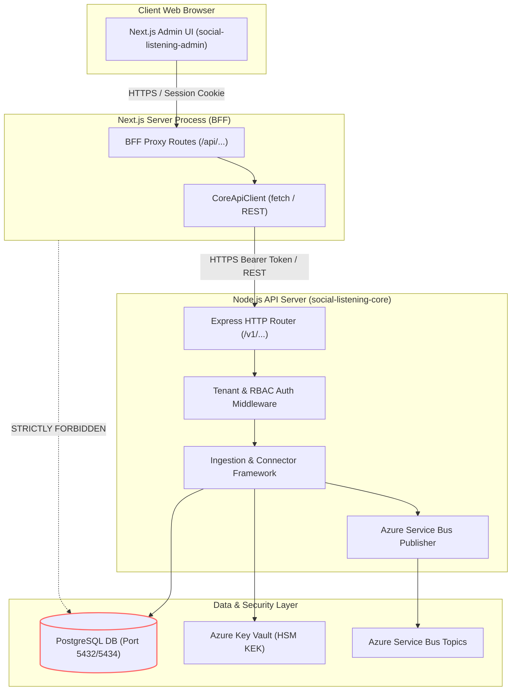

# TDS-0001: Two-Repository Architecture Split

## 1. Document Control & Traceability Linkage

### 1.1 Document Metadata

| Field | Value |
|---|---|
| **Document ID** | `TDS-0001` |
| **Title** | Two-Repository Architecture Split (`social-listening-core` and `social-listening-admin`) |
| **Version** | `1.0.0` |
| **Date** | 2026-07-28 |
| **Author(s)** | Systems Architecture Agent |
| **Technical Reviewer(s)** | Menno (Lead Solutions Architect) |
| **Target Repositories** | `social-listening-core` & `social-listening-admin` |
| **Target Epic** | Epic 1: Repository and API Foundation |
| **Status** | Implemented |

### 1.2 Upstream Specification Traceability

| Artifact Tier | Document Reference | Governing Scope & Constraints |
|---|---|---|
| **Source ADR** | [ADR-0001](file:///d:/Source/socialengage/docs/adr/0001-two-repository-split.md) | Accepted: Divides backend and admin UI into independent repositories with strict REST boundary |
| **Business Requirements (BRD)** | [BRD-0001](file:///d:/Source/socialengage/docs/project%20docs/Business-Requirements/BRD-0001-Two-Repository-Split.md) | Business rationale: independent deployability, tenant isolation, downstream subsystem consumption |
| **Functional Design (FDD)** | [FDD-0001](file:///d:/Source/socialengage/docs/project%20docs/Functional-Design/FDD-0001-Two-Repository-Split.md) | Functional capabilities: core headless service, admin UI REST client consumption |
| **User Stories** | Story 1.1 in `docs/user-stories/epic-1-repository-and-api-foundation.md` | $AC_1$: Admin has no DB driver/connection; $AC_2$: Admin has no local code dependency on core; $AC_3$: Independent packages |
| **Component Skill** | [repo-scaffold](file:///d:/Source/socialengage/social-listening-core/.claude/skills/repo-scaffold/SKILL.md) | Load-bearing invariant: zero database driver in admin, REST-only communication |

---

## 2. System Context & Architectural Topology

### 2.1 Subsystem Placement & Component Topology



### 2.2 Boundary Invariants & Coupling Rules

1. **Zero Database Coupling:** `social-listening-admin`'s `package.json` must never declare PostgreSQL or database drivers (`pg`, `pg-promise`, `typeorm`, `prisma`, etc.).
2. **Zero Code Sharing:** No in-process code sharing or relative imports crossing the repository boundary (`../social-listening-core/src/...` is strictly prohibited).
3. **Headless Usability:** `social-listening-core` is completely usable and testable without the admin UI running.
4. **Independent Versioning:** Each repository maintains its own SemVer lifecycle and deployment pipeline.

---

## 3. Data Architecture & Persistence Design

### 3.1 Database Access Isolation

- `social-listening-core` is the sole custodian of PostgreSQL connections via `src/db/withTenant.ts` and `src/db/pool.ts`.
- `social-listening-admin` contains zero database credentials, zero connection strings, and zero database connection pools.
- Multi-tenant isolation is enforced inside core through PostgreSQL Row Level Security (RLS) policies (`app.tenant_id`).

---

## 4. API, Interface & Contract Design

### 4.1 REST Communication Contract

All interactions from `social-listening-admin` into `social-listening-core` occur over HTTP/REST:

```typescript
// social-listening-admin/src/lib/core-client.ts
export interface CoreClientConfig {
  baseUrl: string;
  timeoutMs: number;
}

export class CoreApiClient {
  constructor(private readonly config: CoreClientConfig) {}

  async get<T>(path: string, token: string): Promise<T> {
    const res = await fetch(`${this.config.baseUrl}${path}`, {
      headers: {
        'Authorization': `Bearer ${token}`,
        'Content-Type': 'application/json',
      },
      signal: AbortSignal.timeout(this.config.timeoutMs),
    });
    if (!res.ok) {
      throw new Error(`Core API error ${res.status}: ${await res.text()}`);
    }
    return res.json();
  }
}
```

---

## 5. Rate Limiting, Quota & Concurrency Gating

- Rate limiting is enforced exclusively inside `social-listening-core` via `RequestGate`.
- The admin UI acts as a well-behaved client that surfaces HTTP `429 Too Many Requests` responses with appropriate user feedback and backoff headers (`Retry-After`).

---

## 6. Security, Identity & Credential Governance

- **Authentication:** Admin UI handles user sign-in via Entra External ID; authenticates requests to Core API using bearer tokens.
- **Authorization:** `social-listening-core` verifies JWT tokens and enforces RBAC roles at the route handler level (`tenantAuthMiddleware`).
- **Secret Separation:** Platform secrets (Azure Key Vault credentials, API keys) live exclusively in `social-listening-core` environment files.

---

## 7. Error Handling, Resilience & Failure Classification

- Network timeouts and Core API unavailability are handled gracefully by the admin BFF layer:
  - Returns `HTTP 502 Bad Gateway` if `social-listening-core` is unreachable.
  - Returns `HTTP 504 Gateway Timeout` if a Core request exceeds `timeoutMs` (default 10,000ms).

---

## 8. Testing, Verification & Contract Gate Plan

### 8.1 Contract Test Specifications

- **Contract Test (Admin):** `social-listening-admin/contracts/epic-1/story-1.1.rest-only-boundary.contract.test.ts`
- **Contract Test (Core):** `social-listening-core/contracts/epic-1/story-1.1.independent-repo-scaffold.contract.test.ts`

### 8.2 Acceptance Criteria Verification Matrix

| AC # | Acceptance Criterion | Test Assertion Name | Verification Mechanism |
|---|---|---|---|
| $AC_1$ | Carries no database driver in dependency manifest | `AC1: carries no Postgres (or other DB) driver in its dependency manifest` | Package manifest AST inspection |
| $AC_1$ | Carries no committed database connection string | `AC1: carries no committed database connection string` | Regex scan across `.env`, `package.json`, and source files |
| $AC_2$ | Zero code dependency on core | `AC2: has no local/file dependency on social-listening-core` | Package manifest dependencies and import path static analysis |
| $AC_3$ | Core independently buildable | `AC3: social-listening-core compiles and tests in isolation` | Execution of `npm test` inside core without admin dependencies |

---

## 9. Component Skill Documentation

- Updates documented in `.claude/skills/repo-scaffold/SKILL.md`.
- Records that breaking the REST-only boundary invalidates ADR-0001 and fails the CI contract gate.

---

## 10. Observability, Metrics & Telemetry

- Standard HTTP request logging on both BFF and Core routers.
- Cross-service correlation IDs (`X-Correlation-ID`) propagated from admin to core for end-to-end request tracing.

---

## 11. Migration, Rollout & Feature Gating

- Structural boundary established on Day 1.
- Both repositories can be built, packaged, and deployed as separate container images / App Services.

---

## 12. Technical Assumptions & Open Questions

- Upstream Assumption: Both repos reside in a root repository structure during development while maintaining package boundary independence.
- Open Questions: Standardized under ADR-0017 (API versioning policy) to handle backwards compatibility across repositories.

---

## 13. Implementation Checklist & Sign-Off

- [x] `social-listening-admin` has no database drivers in `package.json`
- [x] `social-listening-core` operates fully independently
- [x] Contract tests for Story 1.1 pass in both repositories
- [x] Continuous integration pipeline verifies repository boundary invariants
