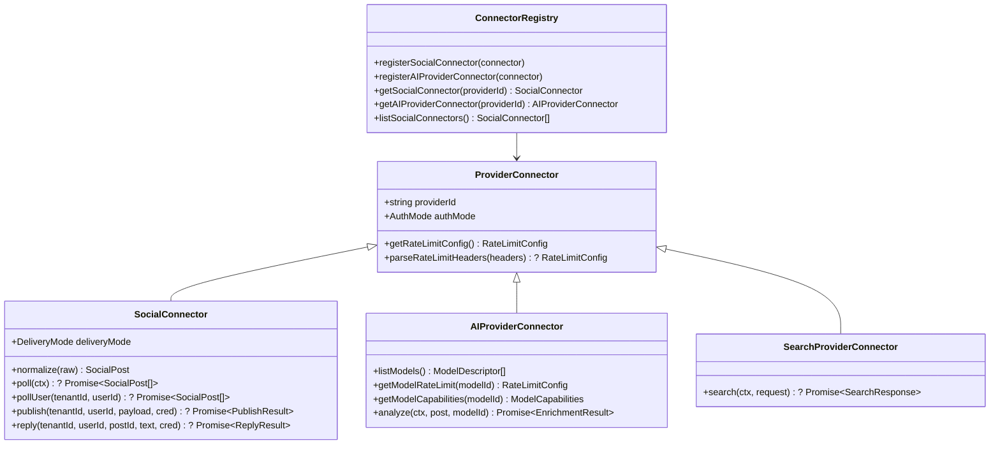

# TDS-0002: Unified Provider Connector Pattern

## 1. Document Control & Traceability Linkage

### 1.1 Document Metadata

| Field | Value |
|---|---|
| **Document ID** | `TDS-0002` |
| **Title** | Unified `ProviderConnector` Architecture for Social and AI Platforms |
| **Version** | `1.0.0` |
| **Date** | 2026-07-28 |
| **Author(s)** | Systems Architecture Agent |
| **Technical Reviewer(s)** | Menno (Lead Solutions Architect) |
| **Target Repositories** | `social-listening-core` |
| **Target Epic** | Epic 2: Ingestion, Connectors, and Rate Limits |
| **Status** | Implemented |

### 1.2 Upstream Specification Traceability

| Artifact Tier | Document Reference | Governing Scope & Constraints |
|---|---|---|
| **Source ADR** | [ADR-0002](file:///d:/Source/socialengage/docs/adr/0002-unified-provider-connector-pattern.md) | Accepted: Shared base interface (`ProviderConnector`) specialized into `SocialConnector` and `AIProviderConnector` |
| **Business Requirements (BRD)** | [BRD-0002](file:///d:/Source/socialengage/docs/project%20docs/Business-Requirements/BRD-0002-Unified-Provider-Connector-Pattern.md) | Swappability of AI providers, uniform connector registry, no-core-change extension model |
| **Functional Design (FDD)** | [FDD-0002](file:///d:/Source/socialengage/docs/project%20docs/Functional-Design/FDD-0002-Unified-Provider-Connector-Pattern.md) | Interface definitions, rate limit header parsing, deliveryMode handling (push vs poll) |
| **User Stories** | Story 1.2 / Story 2.1 in `docs/user-stories/` | $AC_1$: `ProviderConnector` base; $AC_2$: `SocialConnector` normalization; $AC_3$: Swappable registration |
| **Component Skill** | [provider-connector-framework](file:///d:/Source/socialengage/social-listening-core/.claude/skills/provider-connector-framework/SKILL.md) | Load-bearing invariant: new connectors touch only connector-specific directories + registry |

---

## 2. System Context & Architectural Topology

### 2.1 Subsystem Placement & Component Topology



### 2.2 Boundary Invariants & Coupling Rules

1. **No Pipeline Edits (ADR-0048):** Registering a new connector must never modify core pipeline files (`runIngestionAttempt.ts`, `ingestionRunStore.ts`, `requestGate.ts`, `errorClassification.ts`).
2. **Delivery Mode Transparency:** Ingestion pipelines dispatch generically on `connector.deliveryMode` (`'poll' | 'push'`) without hardcoding provider conditionals.
3. **Pluggable Registration:** Connectors are instantiated as self-contained objects and registered into the singleton registry (`src/connectors/registry.ts`) during server startup (`src/connectors/bootstrapConnectors.ts`).

---

## 3. Data Architecture & Persistence Design

### 3.1 Connector Storage & Registry Model

- Connectors themselves are stateless code singletons registered in-memory at process boot.
- Connector activations are tracked in `connector_activations` (ADR-0051) and credentials in `platform_credentials` (ADR-0014/ADR-0028).

```sql
-- Supporting Table: connector_activations (ADR-0051)
CREATE TABLE IF NOT EXISTS connector_activations (
    id              UUID        PRIMARY KEY DEFAULT gen_random_uuid(),
    tenant_id       UUID        NOT NULL,
    provider_id     TEXT        NOT NULL,
    is_active       BOOLEAN     NOT NULL DEFAULT true,
    activated_at    TIMESTAMPTZ NOT NULL DEFAULT now(),
    deactivated_at  TIMESTAMPTZ NULL,
    CONSTRAINT uq_tenant_provider UNIQUE (tenant_id, provider_id)
);
```

---

## 4. API, Interface & Contract Design

### 4.1 TypeScript Interface Specifications

```typescript
// src/connectors/types.ts

export type AuthMode = 'oauth' | 'apiKey' | 'none';
export type DeliveryMode = 'poll' | 'push';

export interface RateLimitConfig {
  requestsPerWindow: number;
  windowSeconds: number;
}

export interface ProviderConnector {
  readonly providerId: string;
  readonly authMode: AuthMode;
  getRateLimitConfig(): RateLimitConfig;
  parseRateLimitHeaders?(headers: Record<string, string>): RateLimitConfig | undefined;
}

export interface SocialConnector extends ProviderConnector {
  readonly deliveryMode: DeliveryMode;
  normalize(raw: unknown): SocialPost;
  poll?(tenantId: string, credential?: string): Promise<RawPollResult>;
  pollUser?(tenantId: string, userId: string): Promise<RawPollResult>;
  publish?(tenantId: string, userId: string, payload: OutboundPostPayload, cred: string): Promise<PublishResult>;
  reply?(tenantId: string, userId: string, targetPost: SocialPost, text: string, cred: string): Promise<ReplyResult>;
}

export interface AIProviderConnector extends ProviderConnector {
  listModels(): ModelDescriptor[];
  getModelRateLimit(modelId: string): RateLimitConfig;
  getModelCapabilities(modelId: string): ModelCapabilities;
  analyze(tenantId: string, post: SocialPost, modelId: string, cred?: string): Promise<PostEnrichment>;
}
```

---

## 5. Rate Limiting, Quota & Concurrency Gating

- **Social Connectors:** Gated per `(tenantId, providerId)` using `connector.getRateLimitConfig()` or parsed live headers.
- **AI Providers:** Gated per `(tenantId, providerId, modelId)` via `connector.getModelRateLimit(modelId)`.
- **Outbound Publishing:** Gated per `(tenantId, providerId, 'outbound_post')` via `connector.getOutboundRateLimitConfig?.() ?? connector.getRateLimitConfig()`.

---

## 6. Security, Identity & Credential Governance

- **Ownership Tier Alignment (ADR-0028):**
  - AI Providers and default social connectors: Tier-2 (tenant-wide).
  - User-specific posting and private feeds: Tier-3 (user-bound).
- Connectors receive decrypted tokens directly in function arguments via `withTenant` / `readCredential`; connectors never manage key stores or database queries directly.

---

## 7. Error Handling, Resilience & Failure Classification

- Connectors throw structured `ClassifiableError` with standard `ErrorKind` values (`rate_limit_exceeded`, `network`, `timeout`, `credential_invalid`, `platform_asset_rejected`).
- The core orchestrator maps exceptions uniformly into `IngestionRun` records and updates derived `ConnectorHealth`.

---

## 8. Testing, Verification & Contract Gate Plan

### 8.1 Contract Test Specifications

- `contracts/epic-2/story-2.1.social-connector-interface.contract.test.ts`
- `contracts/epic-2/story-2.10.connector-registration-transparency.contract.test.ts` (ADR-0048 enforcement)

### 8.2 Invariant Verification

- Assert that registering simulated connectors does not mutate existing registered singletons.
- Assert that AI provider connectors can be swapped dynamically without restarting server logic.

---

## 9. Component Skill Documentation

- Documented in `.claude/skills/provider-connector-framework/SKILL.md`.
- Enforces registration pattern: `{ ...connector, poll, pollCadenceMs }` spread pattern in `bootstrapConnectors.ts` to prevent circular dependencies.

---

## 10. Observability, Metrics & Telemetry

- Ingestion telemetry records `runs_count`, `posts_ingested_count`, and `duration_ms` partitioned by `providerId`.

---

## 11. Migration, Rollout & Feature Gating

- Static interface pattern; zero runtime database migrations needed for the interface itself.
- New connectors roll out behind connector activations in `connector_activations`.

---

## 12. Technical Assumptions & Open Questions

- Assumes each platform adapter implements standard `normalize()` transforming raw network payloads to canonical `SocialPost`.

---

## 13. Implementation Checklist & Sign-Off

- [x] Base `ProviderConnector`, `SocialConnector`, and `AIProviderConnector` defined in `src/connectors/types.ts`
- [x] In-memory registry implemented in `src/connectors/registry.ts`
- [x] ADR-0048 guardrail contracts passing in CI
