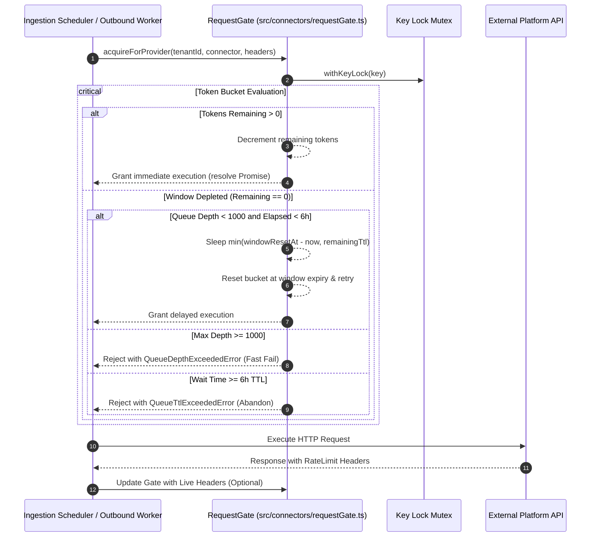

# TDS-0003: Per-Tenant Per-Provider Rate Limiting

## 1. Document Control & Traceability Linkage

### 1.1 Document Metadata

| Field | Value |
|---|---|
| **Document ID** | `TDS-0003` |
| **Title** | Per-Tenant Per-Provider Rate Limiting via Shared `RequestGate` |
| **Version** | `1.0.0` |
| **Date** | 2026-07-28 |
| **Author(s)** | Systems Architecture Agent |
| **Technical Reviewer(s)** | Menno (Lead Solutions Architect) |
| **Target Repositories** | `social-listening-core` |
| **Target Epic** | Epic 2: Ingestion, Connectors, and Rate Limits |
| **Status** | Implemented |

### 1.2 Upstream Specification Traceability

| Artifact Tier | Document Reference | Governing Scope & Constraints |
|---|---|---|
| **Source ADR** | [ADR-0003](file:///d:/Source/socialengage/docs/adr/0003-per-tenant-per-provider-rate-limiting.md) | Accepted: Shared `RequestGate` enforcing rate limits per `(tenantId, providerId)` with queue-and-retry |
| **Business Requirements (BRD)** | [BRD-0003](file:///d:/Source/socialengage/docs/project%20docs/Business-Requirements/BRD-0003-Per-Tenant-Per-Provider-Rate-Limiting.md) | Multi-tenant isolation: heavy tenant consumption never degrades or throttles another tenant |
| **Functional Design (FDD)** | [FDD-0003](file:///d:/Source/socialengage/docs/project%20docs/Functional-Design/FDD-0003-Per-Tenant-Per-Provider-Rate-Limiting.md) | Live header precedence, window reset timing, per-model AI granular keying |
| **User Stories** | Story 1.3 / Story 2.2 in `docs/user-stories/` | $AC_1$: Tenant-isolated keys; $AC_2$: Header priority; $AC_3$: Queue-and-retry; $AC_4$: Bounded depth |
| **Component Skill** | [provider-connector-framework](file:///d:/Source/socialengage/social-listening-core/.claude/skills/provider-connector-framework/SKILL.md) | Invariant: Rate gate state never blends cross-tenant tokens |

---

## 2. System Context & Architectural Topology

### 2.1 Subsystem Placement & Component Topology



### 2.2 Boundary Invariants & Coupling Rules

1. **Strict Key Isolation:** Gate keys are strictly scoped:
   - Ingestion: `${tenantId}:${providerId}`
   - Outbound Reply: `${tenantId}:${providerId}:outbound`
   - Outbound Post: `${tenantId}:${providerId}:outbound_post`
   - AI Enrichment: `${tenantId}:${providerId}:${modelId}`
   - One-Off Search: `${tenantId}:${providerId}:search`
2. **Deterministic Concurrency:** `withKeyLock` serializes acquisitions per key so simultaneous workers never read a stale remaining count.
3. **Queue Ceiling (ADR-0020):** Queues never grow unbounded; depth ceiling is 1,000 requests, wait TTL is 6 hours.

---

## 3. Data Architecture & Persistence Design

### 3.1 In-Memory Gate State

- Gate state is kept in memory in `src/connectors/requestGate.ts`:
  - `state`: `Map<string, { remaining: number; windowResetAt: number }>`
  - `keyLocks`: `Map<string, Promise<unknown>>`
  - `queueDepth`: `Map<string, number>`

```typescript
interface GateState {
  remaining: number;
  windowResetAt: number;
}
```

---

## 4. API, Interface & Contract Design

### 4.1 Exported Functions (`src/connectors/requestGate.ts`)

```typescript
export function socialConnectorKey(tenantId: string, connector: ProviderConnector): string {
  return `${tenantId}:${connector.providerId}`;
}

export function aiModelKey(tenantId: string, connector: AIProviderConnector, modelId: string): string {
  return `${tenantId}:${connector.providerId}:${modelId}`;
}

export function outboundPostKey(tenantId: string, connector: ProviderConnector): string {
  return `${tenantId}:${connector.providerId}:outbound_post`;
}

export async function acquire(key: string, config: RateLimitConfig, options?: AcquireOptions): Promise<void>;
export async function acquireForProvider(tenantId: string, connector: ProviderConnector, liveHeaders?: Record<string, string>): Promise<void>;
export async function acquireForAiModel(tenantId: string, connector: AIProviderConnector, modelId: string, liveHeaders?: Record<string, string>): Promise<void>;
export async function acquireForOutboundPost(tenantId: string, connector: SocialConnector): Promise<void>;
export function checkAvailability(key: string, config: RateLimitConfig): { remaining: number };
```

---

## 5. Security, Identity & Credential Governance

- Rate limiting is tied to `tenantId` authenticated from the user session or worker batch.
- Cross-tenant leakage is mathematically impossible because the gate lookup key is prefixed with `tenantId`.

---

## 6. Error Handling, Resilience & Failure Classification

```typescript
export class QueueTtlExceededError extends Error {
  constructor(public readonly key: string, public readonly ttlMs: number) {
    super(`Rate-limit queue wait for '${key}' exceeded its TTL (${ttlMs}ms); request abandoned.`);
    this.name = 'QueueTtlExceededError';
  }
}

export class QueueDepthExceededError extends Error {
  constructor(public readonly key: string, public readonly maxDepth: number) {
    super(`Rate-limit queue for '${key}' is at its depth ceiling (${maxDepth}); request rejected.`);
    this.name = 'QueueDepthExceededError';
  }
}
```

- When `QueueDepthExceededError` or `QueueTtlExceededError` is thrown, the calling ingestion engine marks the attempt as failed with `ErrorKind: 'rate_limit_exceeded'`.

---

## 7. Testing, Verification & Contract Gate Plan

### 7.1 Contract Test Specifications

- `contracts/epic-2/story-2.2.rate-limiting.contract.test.ts`
- `contracts/epic-2/story-2.4.bounded-queues-and-dead-lettering.contract.test.ts`

### 7.2 Invariant Verification

| AC # | Acceptance Criterion | Test Assertion Name | Verification Mechanism |
|---|---|---|---|
| $AC_1$ | Tenant isolation | `AC1: enforces rate limits independently per (tenantId, providerId)` | Multiple tenants acquiring against same provider |
| $AC_2$ | Dynamic header priority | `AC2: adjusts remaining quota when live headers are provided` | Mock HTTP headers updating `remaining` and `resetAt` |
| $AC_3$ | Queue wait and reset | `AC3: sleeps until reset window when budget is exhausted` | Simulated timer advancing to window reset |
| $AC_4$ | Ceiling enforcement | `AC4: rejects with QueueDepthExceededError when queue exceeds 1000` | Rapidly firing 1001 concurrent requests |

---

## 8. Observability, Metrics & Telemetry

- Logs rate-limit exhaustion warnings: `Rate-limit queue for key {key} reached {depth}/{maxDepth}`.
- Telemetry captures queue latency and throttled wait times in `ingestion_runs.error_details`.

---

## 9. Migration & Rollout

- In-memory component initialized on server startup; zero database schema migrations required.

---

## 10. Implementation Checklist & Sign-Off

- [x] Key isolation helpers implemented and verified
- [x] Lock-based serialization in `acquireOnce` implemented
- [x] Contracts for Story 2.2 and Story 2.4 pass 100% in CI
