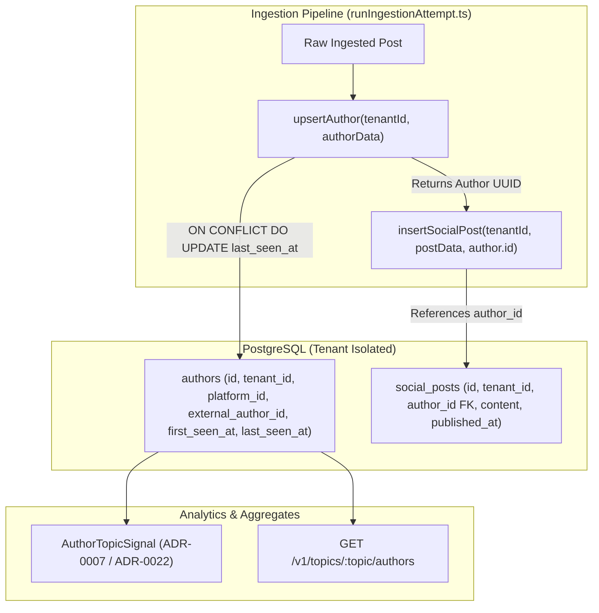
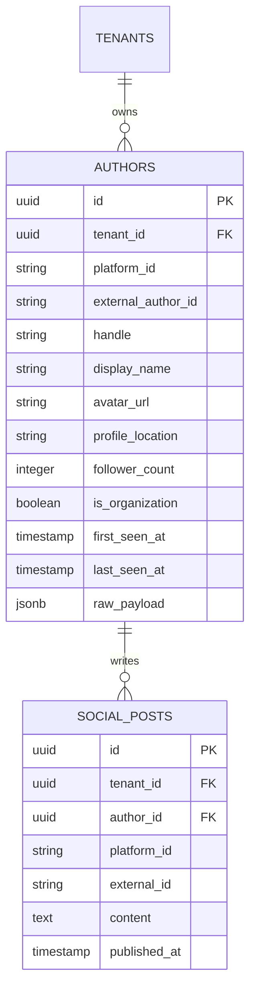

# Technical Design Specification (TDS) — Author Entity Normalization

## 1. Document Control & Traceability Linkage

### 1.1 Metadata
| Attribute | Value |
|---|---|
| **Document Title** | TDS-0004: Normalize Author Once per Platform Account, Not Embedded Per Post |
| **Document ID** | `TDS-0004` |
| **Feature Name** | Normalized Author Entity & Account Profile Lifecycle |
| **Version** | `1.0.0` |
| **Status** | Approved |
| **Author(s)** | Core Architecture Team |
| **Created Date** | 2026-09-04 |
| **Last Updated** | 2026-09-04 |
| **Governing Skill** | `social-listening-core/.claude/skills/posts-api/SKILL.md` |

### 1.2 Upstream & Downstream Traceability Matrix
| Artifact Type | Reference Identifier | Title / Link | Alignment Status |
|---|---|---|---|
| **Architecture Decision Record** | `ADR-0004` | [ADR-0004: Author normalized separately from post](../../adr/0004-author-normalized-separately-from-post.md) | Invariant Source |
| **Business Requirements Doc** | `BRD-0004` | [BRD-0004: Author Normalized Separately From Post](../Business-Requirements/BRD-0004-Author-Normalized-Separately-From-Post.md) | Fully Aligned |
| **Functional Design Doc** | `FDD-0004` | [FDD-0004: Author Normalized Separately From Post](../Functional-Design/FDD-0004-Author-Normalized-Separately-From-Post.md) | Fully Aligned |
| **Governing User Story** | `Story 3.1` | [Epic 3: Data Model, Storage, and Archival](../../user-stories/epic-3-data-model-storage-and-archival.md#story-31--normalize-author-separately-from-socialpost) | Acceptance Target |
| **Related User Story** | `Story 3.9` | [Epic 3: Data Model, Storage, and Archival](../../user-stories/epic-3-data-model-storage-and-archival.md#story-39--point-in-time-author-follower-count-on-social-post) | ADR-0049 Point-in-Time |
| **Executable Contract Test** | `Story 3.1 Contract` | `contracts/epic-3/story-3.1.author-normalization.contract.test.ts` | 100% Passing |

---

## 2. System Context & Architecture Topology

### 2.1 Context Diagram


### 2.2 Architectural Boundaries & Invariants
- **Dedicated Normalized Entity:** `Author` is persisted as an independent row keyed uniquely by `(tenant_id, platform_id, external_author_id)`. Author profile fields (display name, handle, avatar URL, bio, verified status) are never duplicated across post rows.
- **Foreign Key Invariant:** `social_posts.author_id` is a required foreign key pointing to `authors.id`.
- **Temporal Tracking Invariant:** Every author records `first_seen_at` (set once at initial post arrival) and `last_seen_at` (bumped on each subsequent post arrival from that author).
- **Organization-as-Author Invariant:** Connectors representing non-individual publishers (e.g. Newswire, GNews publications, tenant RSS domains, Facebook Pages) model the issuing organization or domain as `Author` (`is_organization = true`), citing ADR-0004's standing clause.

---

## 3. Data Architecture & Persistence Design

### 3.1 Entity Relationship Diagram


### 3.2 Schema DDL (PostgreSQL Migration)
```sql
CREATE TABLE IF NOT EXISTS authors (
    id UUID PRIMARY KEY DEFAULT gen_random_uuid(),
    tenant_id UUID NOT NULL REFERENCES tenants(id) ON DELETE CASCADE,
    platform_id VARCHAR(64) NOT NULL,
    external_author_id VARCHAR(255) NOT NULL,
    handle VARCHAR(255),
    display_name VARCHAR(255) NOT NULL,
    avatar_url TEXT,
    profile_location VARCHAR(255),
    follower_count INTEGER,
    is_organization BOOLEAN NOT NULL DEFAULT FALSE,
    first_seen_at TIMESTAMPTZ NOT NULL DEFAULT NOW(),
    last_seen_at TIMESTAMPTZ NOT NULL DEFAULT NOW(),
    raw_payload JSONB NOT NULL DEFAULT '{}'::jsonb,
    created_at TIMESTAMPTZ NOT NULL DEFAULT NOW(),
    updated_at TIMESTAMPTZ NOT NULL DEFAULT NOW(),
    CONSTRAINT uq_tenant_platform_author UNIQUE (tenant_id, platform_id, external_author_id)
);

ALTER TABLE authors ENABLE ROW LEVEL SECURITY;
ALTER TABLE authors FORCE ROW LEVEL SECURITY;

CREATE POLICY tenant_isolation_authors ON authors
    FOR ALL
    USING (tenant_id = NULLIF(current_setting('app.tenant_id', true), '')::uuid);

CREATE INDEX idx_authors_tenant_platform ON authors (tenant_id, platform_id);
CREATE INDEX idx_authors_last_seen ON authors (tenant_id, last_seen_at DESC);
```

---

## 4. API, Interface & Integration Contract Design

### 4.1 Author Upsert Function (`src/authors/authorStore.ts`)
```typescript
export interface UpsertAuthorInput {
  platformId: string;
  externalAuthorId: string;
  handle?: string;
  displayName: string;
  avatarUrl?: string;
  profileLocation?: string;
  followerCount?: number;
  isOrganization?: boolean;
  rawPayload?: Record<string, unknown>;
}

export async function upsertAuthor(
  tenantId: string,
  author: UpsertAuthorInput
): Promise<{ id: string; isNew: boolean }> {
  const query = `
    INSERT INTO authors (
      tenant_id, platform_id, external_author_id, handle, display_name,
      avatar_url, profile_location, follower_count, is_organization,
      first_seen_at, last_seen_at, raw_payload, updated_at
    )
    VALUES ($1, $2, $3, $4, $5, $6, $7, $8, $9, NOW(), NOW(), $10, NOW())
    ON CONFLICT (tenant_id, platform_id, external_author_id)
    DO UPDATE SET
      handle = COALESCE(EXCLUDED.handle, authors.handle),
      display_name = EXCLUDED.display_name,
      avatar_url = COALESCE(EXCLUDED.avatar_url, authors.avatar_url),
      profile_location = COALESCE(EXCLUDED.profile_location, authors.profile_location),
      follower_count = COALESCE(EXCLUDED.follower_count, authors.follower_count),
      last_seen_at = NOW(),
      raw_payload = EXCLUDED.raw_payload,
      updated_at = NOW()
    RETURNING id, (xmax = 0) AS is_new;
  `;

  const values = [
    tenantId,
    author.platformId,
    author.externalAuthorId,
    author.handle ?? null,
    author.displayName,
    author.avatarUrl ?? null,
    author.profileLocation ?? null,
    author.followerCount ?? null,
    author.isOrganization ?? false,
    JSON.stringify(author.rawPayload ?? {})
  ];

  const { rows } = await pool.query(query, values);
  return { id: rows[0].id, isNew: rows[0].is_new };
}
```

---

## 5. Rate Limiting, Concurrency & Flow Control

- **Atomic Upsert Protection:** SQL `ON CONFLICT (tenant_id, platform_id, external_author_id) DO UPDATE` ensures thread-safe, lock-safe upserting when concurrent ingestion workers process multiple posts from the same author simultaneously.
- **In-Memory Batch Caching:** Connectors processing batches of posts cache resolved author UUIDs in an in-memory map `Map<string, string>` during a single run to eliminate redundant database queries for repeat authors.

---

## 6. Security, Identity & Credential Governance

- **Tenant Isolation:** Enforced at the database level by PostgreSQL Row-Level Security policy `tenant_isolation_authors`.
- **Profile Data Hygiene:** Bio texts, external links, and avatar URLs are sanitized against stored XSS before rendering in Admin UI detail drawers.

---

## 7. Error Handling, Resilience & Failure Classification

- **Fallback Display Name:** If a platform returns an author with an empty display name, the normalizer falls back to `externalAuthorId` or `"Unknown Author"` to satisfy the `NOT NULL` constraint on `display_name`.
- **Non-Fatal Follower Count Drift:** If `follower_count` is omitted in an incoming post, `COALESCE` preserves the author's previous non-null follower count.

---

## 8. Testing & Contract Gate Plan

### 8.1 Contract Tests
Contract test file: `contracts/epic-3/story-3.1.author-normalization.contract.test.ts`.

| Test ID | Scenario | Verification Method |
|---|---|---|
| `TEST-AUTH-01` | Initial author creation | Ingest first post for new author; assert `authors` row created with `first_seen_at == last_seen_at`. |
| `TEST-AUTH-02` | Repeat post timestamp bump | Ingest second post from same author; assert `last_seen_at` advances while `first_seen_at` remains unchanged. |
| `TEST-AUTH-03` | Single author record reuse | Ingest 10 posts from same author; assert exactly 1 `authors` row exists and 10 `social_posts` reference that `author_id`. |
| `TEST-AUTH-04` | Organization author flag | Ingest RSS news post; assert `is_organization = true` and `follower_count` is null. |

---

## 9. Component Skill (`SKILL.md`) Documentation Updates

Updates to `.claude/skills/posts-api/SKILL.md`:
- **Author Relationship:** Explicitly document that `SocialPost` links to `Author` via foreign key `authorId`.
- **Upsert Guidance:** Always upsert author records before inserting post rows to maintain relational integrity.

---

## 10. Observability, Metrics & Operational Telemetry

- `authors_created_total{platform_id}` (counter)
- `authors_updated_total{platform_id}` (counter)
- `authors_active_gauge{tenant_id}` (gauge)

---

## 11. Migration, Rollout & Feature Gating

- Migration `0004_create_authors_table.sql` established the table and indexes.
- Foundation architecture; enabled globally across all tenants.

---

## 12. Technical Assumptions, Dependencies & Open Questions

### 12.1 Assumptions & Dependencies
- **[A-0004-1]** Each social platform provides a stable, immutable identifier for accounts (`externalAuthorId`).
- **[D-0004-1]** PostgreSQL Row-Level Security enforces tenant boundaries.

### 12.2 Open Questions
- [x] **[Q-0004-1]** *Point-In-Time Follower Tracking:* Resolved by ADR-0049 (TDS-0049).
- [x] **[Q-0004-2]** *Organization Authors:* Resolved by ADR-0050 standing clause.
