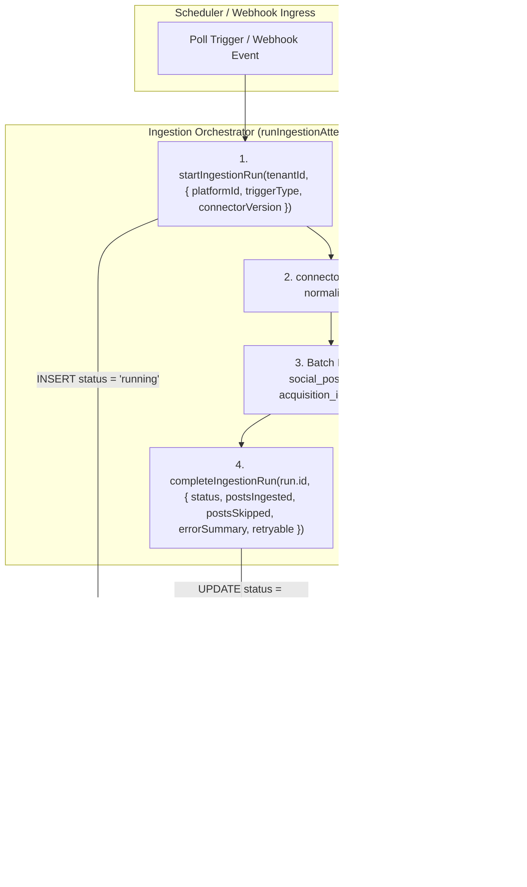

# Technical Design Specification (TDS) — IngestionRun as Audit Anchor

## 1. Document Control & Traceability Linkage

### 1.1 Metadata
| Attribute | Value |
|---|---|
| **Document Title** | TDS-0005: IngestionRun as the Immutable Acquisition & Audit Anchor |
| **Document ID** | `TDS-0005` |
| **Feature Name** | Ingestion Run Lineage & Acquisition Tracking |
| **Version** | `1.0.0` |
| **Status** | Approved |
| **Author(s)** | Core Architecture Team |
| **Created Date** | 2026-09-04 |
| **Last Updated** | 2026-09-04 |
| **Governing Skill** | `social-listening-core/.claude/skills/social-post-lineage/SKILL.md` |

### 1.2 Upstream & Downstream Traceability Matrix
| Artifact Type | Reference Identifier | Title / Link | Alignment Status |
|---|---|---|---|
| **Architecture Decision Record** | `ADR-0005` | [ADR-0005: IngestionRun as the immutable acquisition/audit anchor](../../adr/0005-ingestion-run-as-audit-anchor.md) | Invariant Source |
| **Business Requirements Doc** | `BRD-0005` | [BRD-0005: Ingestion Run as Audit Anchor](../Business-Requirements/BRD-0005-Ingestion-Run-As-Audit-Anchor.md) | Fully Aligned |
| **Functional Design Doc** | `FDD-0005` | [FDD-0005: Ingestion Run as Audit Anchor](../Functional-Design/FDD-0005-Ingestion-Run-As-Audit-Anchor.md) | Fully Aligned |
| **Governing User Story** | `Story 2.1` | [Epic 2: Ingestion Connectors and Rate Limits](../../user-stories/epic-2-ingestion-connectors-and-rate-limits.md#story-21--ingestionrun-as-the-immutable-acquisitionaudit-anchor-for-every-post) | Acceptance Target |
| **Executable Contract Test** | `Story 2.1 Contract` | `contracts/epic-2/story-2.1.ingestion-run.contract.test.ts` | 100% Passing |

---

## 2. System Context & Architecture Topology

### 2.1 Context Diagram


### 2.2 Architectural Boundaries & Invariants
- **Lineage Invariant:** Every `social_posts` record must carry an immutable `acquisition_id` referencing the `ingestion_runs(id)` row that ingested it. No post can be created without an associated run.
- **Run Lifecycle State Machine:** An `IngestionRun` transitions strictly from `running` to either `succeeded` or `failed`. Closed runs are immutable.
- **Zero-Drift Health Derivation:** Connector health status (ADR-0009) is never stored as a mutable state column; it is derived dynamically from historical `ingestion_runs`.
- **Tenant Isolation:** `ingestion_runs` carries a `tenant_id` UUID column and is protected by PostgreSQL Row-Level Security (ADR-0015).

---

## 3. Data Architecture & Persistence Design

### 3.1 DDL Specification
```sql
CREATE TYPE trigger_type AS ENUM ('poll', 'webhook', 'health_check');
CREATE TYPE ingestion_run_status AS ENUM ('running', 'succeeded', 'failed');

CREATE TABLE ingestion_runs (
  id UUID PRIMARY KEY DEFAULT gen_random_uuid(),
  tenant_id UUID NOT NULL REFERENCES tenants(id) ON DELETE CASCADE,
  platform_id VARCHAR(50) NOT NULL,
  trigger_type trigger_type NOT NULL,
  connector_version VARCHAR(50) NOT NULL,
  user_id UUID REFERENCES users(id) ON DELETE SET NULL, -- Tier 3 user context
  page_id VARCHAR(100),                                -- Facebook multi-page fan-out
  status ingestion_run_status NOT NULL DEFAULT 'running',
  started_at TIMESTAMPTZ NOT NULL DEFAULT NOW(),
  completed_at TIMESTAMPTZ,
  posts_ingested INTEGER NOT NULL DEFAULT 0,
  posts_skipped INTEGER NOT NULL DEFAULT 0,
  error_summary TEXT,
  retryable BOOLEAN,
  is_credential_failure BOOLEAN,
  created_at TIMESTAMPTZ NOT NULL DEFAULT NOW()
);

CREATE INDEX idx_ingestion_runs_tenant_platform ON ingestion_runs(tenant_id, platform_id, started_at DESC);
CREATE INDEX idx_ingestion_runs_status ON ingestion_runs(status) WHERE status = 'running';

-- Enable & Force RLS
ALTER TABLE ingestion_runs ENABLE ROW LEVEL SECURITY;
ALTER TABLE ingestion_runs FORCE ROW LEVEL SECURITY;

CREATE POLICY tenant_isolation ON ingestion_runs
  FOR ALL
  USING (tenant_id = NULLIF(current_setting('app.tenant_id', true), '')::uuid)
  WITH CHECK (tenant_id = NULLIF(current_setting('app.tenant_id', true), '')::uuid);
```

### 3.2 Foreign Key Association on `social_posts`
```sql
ALTER TABLE social_posts
  ADD COLUMN acquisition_id UUID NOT NULL REFERENCES ingestion_runs(id);

CREATE INDEX idx_social_posts_acquisition ON social_posts(acquisition_id);
```

---

## 4. API, Interface & Integration Contract Design

### 4.1 Ingestion Run Store Interface (`src/ingestion/ingestionRunStore.ts`)
```typescript
export interface StartIngestionRunInput {
  platformId: string;
  triggerType: 'poll' | 'webhook' | 'health_check';
  connectorVersion: string;
  userId?: string;
  pageId?: string;
}

export interface CompleteIngestionRunInput {
  status: 'succeeded' | 'failed';
  postsIngested: number;
  postsSkipped: number;
  errorSummary?: string;
  retryable?: boolean;
  isCredentialFailure?: boolean;
}

export interface IngestionRunRef {
  id: string;
}

export async function startIngestionRun(
  tenantId: string,
  input: StartIngestionRunInput
): Promise<IngestionRunRef>;

export async function completeIngestionRun(
  tenantId: string,
  runId: string,
  input: CompleteIngestionRunInput
): Promise<void>;
```

---

## 5. Rate Limiting, Concurrency & Flow Control

- **Concurrent Run Concurrency Gate:** Handled via `RequestGate`. A new poll attempt will not execute if an identical `(tenant_id, platform_id)` run is currently in progress.
- **Hanging Run Cleanup:** Scheduled background job checks for runs in `running` state exceeding `DEFAULT_MAX_RUN_DURATION_MS` (15 minutes) and reconciles them to `failed` (ADR-0070).

---

## 6. Security, Identity & Credential Governance

- Standard tenant users cannot manually create or modify `ingestion_runs`. Runs are generated solely by the internal ingestion engine using `withTenant()`.
- Error summaries must sanitize sensitive authentication parameters before persisting to `error_summary`.

---

## 7. Error Handling, Resilience & Failure Classification

### 7.1 Pipeline Failure Transitions
| Error Event | Final Run Status | `retryable` | `isCredentialFailure` |
|---|---|---|---|
| HTTP 429 / Rate Limit | `failed` | `true` | `false` |
| HTTP 401 / Invalid API Key | `failed` | `false` | `true` |
| Network Timeout / Socket Reset | `failed` | `true` | `false` |
| Schema Parse Bug / Unhandled Code Crash | `failed` | `false` | `false` |

---

## 8. Testing & Contract Gate Plan

### 8.1 Contract Tests
Contract test file: `contracts/epic-2/story-2.1.ingestion-run.contract.test.ts`.

| Test ID | Scenario | Verification Method |
|---|---|---|
| `TEST-RUN-01` | Post requires acquisitionId | Attempt to insert post without `acquisition_id`; assert NOT NULL constraint violation. |
| `TEST-RUN-02` | Lifecycle completion | Call `startIngestionRun`, then `completeIngestionRun` with `postsIngested: 10`; assert status updates to `succeeded` and timestamps are set. |
| `TEST-RUN-03` | RLS isolation on runs | Tenant A cannot view Tenant B's `ingestion_runs` records. |
| `TEST-RUN-04` | Error categorization audit | Fail a run with credential error; assert `is_credential_failure = true` and `retryable = false`. |

---

## 9. Component Skill (`SKILL.md`) Documentation Updates

Updates to `.claude/skills/social-post-lineage/SKILL.md`:
- **Lineage Rule:** Never bypass run creation when saving ingested posts.
- **Completion Invariant:** Ensure every run is closed in a `try/finally` block to prevent orphaned `running` records.

---

## 10. Observability, Metrics & Operational Telemetry

- **Metrics:**
  - `ingestion_runs_total{platform, trigger, status}` (counter)
  - `ingestion_posts_ingested_total{platform}` (counter)
  - `ingestion_posts_skipped_total{platform}` (counter)
  - `ingestion_run_duration_seconds{platform}` (histogram)

---

## 11. Migration, Rollout & Feature Gating

- Migration `migrations/0006_create_ingestion_runs_table.sql` creates table and adds foreign key constraint to `social_posts`.

---

## 12. Technical Assumptions, Dependencies & Open Questions

### 12.1 Assumptions & Dependencies
- **[A-0005-1]** All social listening ingestion occurs via `runIngestionAttempt`.
- **[D-0005-1]** PostgreSQL table `tenants` exists.

### 12.2 Open Questions
- [ ] **[Q-0005-1]** *Run Archival Retention:* Define table partitioning or automated retention policy for historical runs older than 90 days. *(Status: Addressed in ADR-0018 / TDS-0018).*
