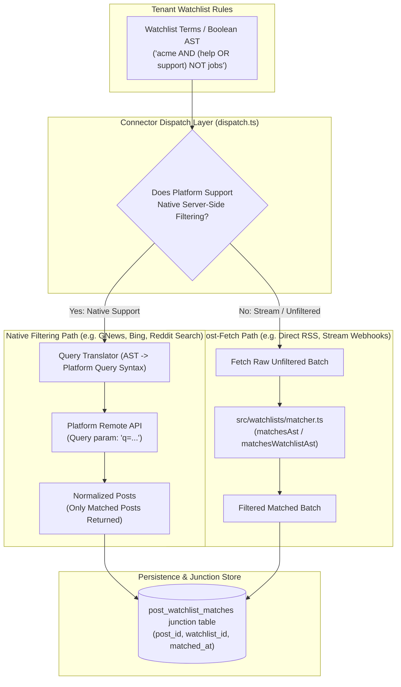

# Technical Design Specification (TDS) — Watchlist Matching Connector-Side with Fallback

## 1. Document Control & Traceability Linkage

### 1.1 Metadata
| Attribute | Value |
|---|---|
| **Document Title** | TDS-0006: Watchlist Matching Connector-Side with Post-Fetch Fallback |
| **Document ID** | `TDS-0006` |
| **Feature Name** | Hybrid Connector-Side Filtering & In-Memory AST Fallback Matcher |
| **Version** | `1.0.0` |
| **Status** | Approved |
| **Author(s)** | Core Architecture Team |
| **Created Date** | 2026-09-04 |
| **Last Updated** | 2026-09-04 |
| **Governing Skill** | `social-listening-core/.claude/skills/watchlist-matching/SKILL.md` |

### 1.2 Upstream & Downstream Traceability Matrix
| Artifact Type | Reference Identifier | Title / Link | Alignment Status |
|---|---|---|---|
| **Architecture Decision Record** | `ADR-0006` | [ADR-0006: Prefer connector-side native filtering for watchlist matching](../../adr/0006-watchlist-matching-connector-side-with-fallback.md) | Invariant Source |
| **Business Requirements Doc** | `BRD-0006` | [BRD-0006: Watchlist Matching Connector-Side With Fallback](../Business-Requirements/BRD-0006-Watchlist-Matching-Connector-Side-With-Fallback.md) | Fully Aligned |
| **Functional Design Doc** | `FDD-0006` | [FDD-0006: Watchlist Matching Connector-Side With Fallback](../Functional-Design/FDD-0006-Watchlist-Matching-Connector-Side-With-Fallback.md) | Fully Aligned |
| **Governing User Story** | `Story 2.2` | [Epic 2: Ingestion Connectors and Rate Limits](../../user-stories/epic-2-ingestion-connectors-and-rate-limits.md#story-22--prefer-connector-side-native-filtering-for-watchlist-matching-with-post-fetch-matching-as-fallback) | Acceptance Target |
| **Executable Contract Test** | `Story 2.2 Contract` | `contracts/epic-2/story-2.2.watchlist-matching.contract.test.ts` | 100% Passing |

---

## 2. System Context & Architecture Topology

### 2.1 Context Diagram


### 2.2 Architectural Boundaries & Invariants
- **Connector-Side Preference Invariant:** Whenever an external provider supports server-side search or query filtering (e.g. GNews, Bing, Brave, Reddit), the connector must translate the watchlist query into native syntax and filter at the API boundary, saving network bandwidth and rate-limit quota.
- **Uniform Fallback Invariant:** For platforms without server-side filtering (e.g. RSS feeds, full-stream webhooks), the core ingestion engine must execute post-fetch matching using `matchesAst(ast, post)` after normalization.
- **Semantic Equivalence Invariant:** The post-fetch matcher and the native query translator must yield semantically equivalent results for boolean operators (`AND`, `OR`, `NOT`), terms, hashtags, and author accounts.
- **Junction Match Recording:** Every post matching one or more watchlists must be linked in the `post_watchlist_matches` junction table (ADR-0063) within the tenant boundary.

---

## 3. Data Architecture & Persistence Design

### 3.1 Watchlist Table Schema (`watchlists`)
```sql
CREATE TABLE watchlists (
  id UUID PRIMARY KEY DEFAULT gen_random_uuid(),
  tenant_id UUID NOT NULL REFERENCES tenants(id) ON DELETE CASCADE,
  user_id UUID REFERENCES users(id) ON DELETE CASCADE, -- User-scoped watchlists
  name VARCHAR(255) NOT NULL,
  match_types VARCHAR(50)[] NOT NULL, -- ARRAY['keyword', 'hashtag', 'account', 'boolean']
  terms JSONB NOT NULL DEFAULT '{}'::jsonb, -- { keywords: [], hashtags: [], accounts: [] }
  query_ast JSONB,                         -- Parsed AST tree representation
  is_active BOOLEAN NOT NULL DEFAULT true,
  created_at TIMESTAMPTZ NOT NULL DEFAULT NOW(),
  updated_at TIMESTAMPTZ NOT NULL DEFAULT NOW()
);

CREATE INDEX idx_watchlists_tenant ON watchlists(tenant_id);

ALTER TABLE watchlists ENABLE ROW LEVEL SECURITY;
ALTER TABLE watchlists FORCE ROW LEVEL SECURITY;

CREATE POLICY tenant_isolation ON watchlists
  FOR ALL
  USING (tenant_id = NULLIF(current_setting('app.tenant_id', true), '')::uuid)
  WITH CHECK (tenant_id = NULLIF(current_setting('app.tenant_id', true), '')::uuid);
```

### 3.2 Junction Table Schema (`post_watchlist_matches`)
```sql
CREATE TABLE post_watchlist_matches (
  post_id UUID NOT NULL REFERENCES social_posts(id) ON DELETE CASCADE,
  watchlist_id UUID NOT NULL REFERENCES watchlists(id) ON DELETE CASCADE,
  tenant_id UUID NOT NULL REFERENCES tenants(id) ON DELETE CASCADE,
  matched_at TIMESTAMPTZ NOT NULL DEFAULT NOW(),
  PRIMARY KEY (post_id, watchlist_id)
);

CREATE INDEX idx_pwm_watchlist ON post_watchlist_matches(watchlist_id);
CREATE INDEX idx_pwm_tenant ON post_watchlist_matches(tenant_id);

ALTER TABLE post_watchlist_matches ENABLE ROW LEVEL SECURITY;
ALTER TABLE post_watchlist_matches FORCE ROW LEVEL SECURITY;

CREATE POLICY tenant_isolation ON post_watchlist_matches
  FOR ALL
  USING (tenant_id = NULLIF(current_setting('app.tenant_id', true), '')::uuid)
  WITH CHECK (tenant_id = NULLIF(current_setting('app.tenant_id', true), '')::uuid);
```

---

## 4. API, Interface & Integration Contract Design

### 4.1 Matcher Interfaces (`src/watchlists/matcher.ts`)
```typescript
export interface MatchablePost {
  id?: string;
  text: string;
  authorExternalId?: string;
  authorHandle?: string;
  providerId?: string;
  sentiment?: string;
  createdAt?: string | Date;
}

export type AstNode =
  | { type: 'AND'; left: AstNode; right: AstNode }
  | { type: 'OR'; left: AstNode; right: AstNode }
  | { type: 'NOT'; operand: AstNode }
  | { type: 'TERM'; value: string }
  | { type: 'HASHTAG'; value: string }
  | { type: 'ACCOUNT'; value: string };

/** Fallback AST Matcher */
export function matchesAst(ast: AstNode, post: MatchablePost): boolean;

/** Simple Term List Matcher */
export function matchesWatchlist(terms: WatchlistTerms, post: MatchablePost): boolean;
```

### 4.2 Query Translator Protocol
In connectors supporting native filtering:
```typescript
export interface QueryTranslator {
  supportsAst(ast: AstNode): boolean;
  translate(ast: AstNode): string; // Translates to e.g. "acme (support OR help) -jobs"
}
```

---

## 5. Rate Limiting, Concurrency & Flow Control

- **Quota Preservation:** Filtering connector-side reduces consumed request quota on external rate-limited providers (e.g. GNews 100 requests/day).
- **In-Memory Matching Performance:** Post-fetch AST evaluation is $O(N \times M)$ where $N$ is batch size and $M$ is the number of active tenant watchlists. Matcher algorithms short-circuit evaluation on boolean operations to keep CPU usage negligible (<1 ms per 100 posts).

---

## 6. Security, Identity & Credential Governance

- Watchlists are tenant-isolated; a tenant's watchlist terms or queries are never shared with or visible to another tenant.
- External query parameters sent over HTTPS to third-party providers must be URL-encoded.

---

## 7. Error Handling, Resilience & Failure Classification

### 7.1 Complex Query Unsupported by Provider
| Scenario | Connector Reaction | System Action |
|---|---|---|
| Provider lacks `NOT` operator support | `QueryTranslator` flags partial syntax support | Connector queries positive terms; core executes post-fetch `NOT` filtering |
| Malformed AST passed to matcher | Matcher encounters unrecognized node type | Throws `INVALID_AST_NODE`; run logged as failed |
| Post contains null/undefined text | Post text sanitized to `""` | Matcher evaluates without crashing; non-matching |

---

## 8. Testing & Contract Gate Plan

### 8.1 Contract Tests
Contract test file: `contracts/epic-2/story-2.2.watchlist-matching.contract.test.ts`.

| Test ID | Scenario | Verification Method |
|---|---|---|
| `TEST-MATCH-01` | Post-fetch keyword matching | Match post containing keyword; assert `matchesWatchlist` returns true. |
| `TEST-MATCH-02` | Boolean AST evaluation | Evaluate `(A AND B) NOT C`; assert post with A and B matches, post with A, B, and C is excluded. |
| `TEST-MATCH-03` | Native query translation | Verify translator produces correct query string for native connector. |
| `TEST-MATCH-04` | Junction table persistence | Run batch through matcher; assert matching posts generate records in `post_watchlist_matches`. |

---

## 9. Component Skill (`SKILL.md`) Documentation Updates

Updates to `.claude/skills/watchlist-matching/SKILL.md`:
- **Matching Rule:** Prioritize connector-side query filtering before falling back to post-fetch matching.
- **AST Compatibility:** When adding a new connector, document any syntax limitations in its connector documentation and ensure unsupported clauses are evaluated post-fetch.

---

## 10. Observability, Metrics & Operational Telemetry

- **Metrics:**
  - `watchlist_evaluation_duration_ms` (histogram)
  - `watchlist_posts_matched_total{tenant_id, watchlist_id}` (counter)
  - `watchlist_posts_discarded_total{platform}` (counter)

---

## 11. Migration, Rollout & Feature Gating

- Migration `migrations/0007_create_watchlists_and_matches.sql` installs `watchlists` and `post_watchlist_matches`.

---

## 12. Technical Assumptions, Dependencies & Open Questions

### 12.1 Assumptions & Dependencies
- **[A-0006-1]** Post normalization extracts clean UTF-8 text before matching.
- **[D-0006-1]** `post_watchlist_matches` table exists.

### 12.2 Open Questions
- [ ] **[Q-0006-1]** *Regex Term Matching:* Should future watchlist specifications support regular expressions in post-fetch matching? *(Status: Deferred per ADR-0021 AST standardization).*
