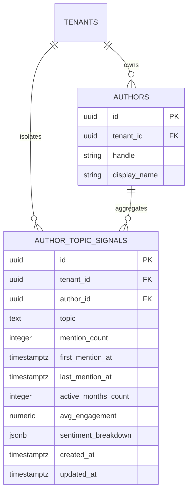
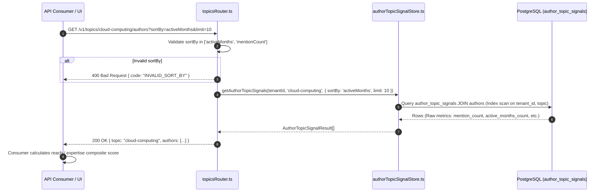

# Technical Design Specification (TDS) — Author-Topic Signals Minimal V1

## 1. Document Control & Traceability Linkage

### 1.1 Metadata
| Attribute | Value |
|---|---|
| **Document Title** | TDS-0007: AuthorTopicSignal Ships with Raw Signals Only, No Computed Expertise Score |
| **Document ID** | `TDS-0007` |
| **Feature Name** | Raw Author-Topic Signal Aggregation & Expert Finder API |
| **Version** | `1.0.0` |
| **Status** | Approved |
| **Author(s)** | Core Architecture Team |
| **Created Date** | 2026-09-05 |
| **Last Updated** | 2026-09-05 |
| **Governing Skill** | `social-listening-core/.claude/skills/author-topic-signals/SKILL.md` |

### 1.2 Upstream & Downstream Traceability Matrix
| Artifact Type | Reference Identifier | Title / Link | Alignment Status |
|---|---|---|---|
| **Architecture Decision Record** | `ADR-0007` | [ADR-0007: AuthorTopicSignal ships with raw signals only](../../adr/0007-author-topic-signal-minimal-v1.md) | Invariant Source |
| **Business Requirements Doc** | `BRD-0007` | [BRD-0007: Author Topic Signal Minimal V1](../Business-Requirements/BRD-0007-Author-Topic-Signal-Minimal-V1.md) | Fully Aligned |
| **Functional Design Doc** | `FDD-0007` | [FDD-0007: Author Topic Signal Minimal V1](../Functional-Design/FDD-0007-Author-Topic-Signal-Minimal-V1.md) | Fully Aligned |
| **Governing User Story** | `Story 4.1` | [Epic 4: Derived Data, Analytics, and Health](../../user-stories/epic-4-derived-data-analytics-and-health.md#story-41--raw-author-topic-signals-for-expert-finding) | Acceptance Target |
| **Related Architecture Decisions** | `ADR-0004`, `ADR-0008`, `ADR-0022`, `ADR-0049` | Author Normalization, Deferred Charting, Refresh Strategy, Point-in-Time Reach | Cross-Referenced |
| **Executable Contract Test** | `Story 4.1 Contract` | `social-listening-core/contracts/epic-4/story-4.1.author-topic-signals.contract.test.ts` | 100% Passing |

---

## 2. System Context & Architecture Topology

### 2.1 Context Diagram
```mermaid
flowchart TD
    subgraph DataSourcing["Historical Post & Enrichment Data"]
        Posts["social_posts (content, published_at, author_id)"]
        Enrichment["enrichment (entities, keyPhrases, sentiment)"]
    end

    subgraph BackgroundRefresh["Scheduled Refresh Engine (ADR-0022 / Story 4.4)"]
        CronJob["pg_cron / refresh_author_topic_signals()"]
        Aggregator["SQL Materialization (GROUP BY tenant_id, author_id, topic)"]
    end

    subgraph SignalStore["PostgreSQL Storage (Tenant-Isolated)"]
        SignalTable["author_topic_signals (tenant_id, author_id, topic, mention_count, active_months_count, avg_engagement, sentiment_breakdown)"]
    end

    subgraph ReadAPI["Expert Finder API Gateway"]
        TopicsRouter["topicsRouter.ts (GET /v1/topics/:topic/authors)"]
        StoreQuery["authorTopicSignalStore.ts (getAuthorTopicSignals)"]
        Consumer["API Consumer / Admin UI (Applies Custom Client Ranking)"]
    end

    Posts --> Aggregator
    Enrichment --> Aggregator
    CronJob --> Aggregator
    Aggregator -->|Periodic Batch Upsert| SignalTable

    Consumer -->|GET /v1/topics/:topic/authors?sortBy=activeMonths| TopicsRouter
    TopicsRouter --> StoreQuery
    StoreQuery -->|Index Scan on author_topic_signals| SignalTable
    SignalTable -->> StoreQuery
    StoreQuery -->> Consumer
```

### 2.2 Architectural Boundaries & Invariants
- **No Inherent Expertise Score Invariant:** `author_topic_signals` deliberately does **not** store an `expertise_score`, composite ranking, or ML weight. The data model exclusively holds raw facts: `mention_count`, `first_mention_at`, `last_mention_at`, `active_months_count`, `avg_engagement`, and `sentiment_breakdown`.
- **Consumer-Driven Ranking:** Composite ranking logic resides with API consumers (such as social selling tools, marketing campaign planners, or PR outreach modules). The API enables consumer control via `sortBy=activeMonths|mentionCount`.
- **Zero Runtime Aggregation Against `social_posts`:** `getAuthorTopicSignals()` **must never query** `social_posts`. Querying high-volume, unbounded post tables at runtime for multi-dimensional topic aggregations creates prohibitive latency. The read path queries pre-materialized rows in `author_topic_signals` exclusively.
- **SQL Injection Prevention on Dynamic Sorts:** Because PostgreSQL `ORDER BY` clauses cannot be parameterized, `sortBy` is validated against a strict compile-time TypeScript union (`AuthorTopicSortBy`) and mapped via hardcoded ternary/switch statements. Unrecognized sort keys are rejected with HTTP `400 Bad Request`.

---

## 3. Data Architecture & Persistence Design

### 3.1 Entity Relationship Diagram


### 3.2 DDL Schema & Database Migration
Implemented in `migrations/0009_create_author_topic_signals.sql`:

```sql
CREATE TABLE IF NOT EXISTS author_topic_signals (
    id UUID PRIMARY KEY DEFAULT gen_random_uuid(),
    tenant_id UUID NOT NULL REFERENCES tenants(id) ON DELETE CASCADE,
    author_id UUID NOT NULL REFERENCES authors(id) ON DELETE CASCADE,
    topic TEXT NOT NULL,
    mention_count INTEGER NOT NULL DEFAULT 1,
    first_mention_at TIMESTAMPTZ NOT NULL DEFAULT NOW(),
    last_mention_at TIMESTAMPTZ NOT NULL DEFAULT NOW(),
    active_months_count INTEGER NOT NULL DEFAULT 1,
    avg_engagement NUMERIC NULL,
    sentiment_breakdown JSONB NULL,
    created_at TIMESTAMPTZ NOT NULL DEFAULT NOW(),
    updated_at TIMESTAMPTZ NOT NULL DEFAULT NOW(),
    UNIQUE (tenant_id, author_id, topic)
);

CREATE INDEX IF NOT EXISTS idx_author_topic_signals_tenant_topic 
    ON author_topic_signals (tenant_id, topic);

CREATE INDEX IF NOT EXISTS idx_author_topic_signals_tenant_author 
    ON author_topic_signals (tenant_id, author_id);

ALTER TABLE author_topic_signals ENABLE ROW LEVEL SECURITY;
ALTER TABLE author_topic_signals FORCE ROW LEVEL SECURITY;

CREATE POLICY tenant_isolation ON author_topic_signals
    FOR ALL
    USING (tenant_id = NULLIF(current_setting('app.tenant_id', true), '')::uuid)
    WITH CHECK (tenant_id = NULLIF(current_setting('app.tenant_id', true), '')::uuid);
```

---

## 4. Component Design & Detailed Processing Logic

### 4.1 Safe Query Construction & Sorting Logic
Implemented in `social-listening-core/src/topics/authorTopicSignalStore.ts`:

```typescript
export type AuthorTopicSortBy = 'activeMonths' | 'mentionCount';

export interface GetAuthorTopicSignalsOptions {
  sortBy?: AuthorTopicSortBy;
  limit?: number;
}

export async function getAuthorTopicSignals(
  tenantId: string,
  topic: string,
  options: GetAuthorTopicSignalsOptions = {}
): Promise<AuthorTopicSignalResult[]> {
  const sortBy = options.sortBy ?? 'mentionCount';
  const limit = Math.min(options.limit ?? 20, 100);

  // Hardcoded mapping ensures no arbitrary string reaches SQL ORDER BY clause
  const orderColumn = sortBy === 'activeMonths' ? 'ats.active_months_count' : 'ats.mention_count';

  return withTenant(tenantId, async (client) => {
    const query = `
      SELECT 
        ats.author_id,
        a.handle AS author_handle,
        a.display_name AS author_name,
        ats.topic,
        ats.mention_count,
        ats.first_mention_at,
        ats.last_mention_at,
        ats.active_months_count,
        ats.avg_engagement,
        ats.sentiment_breakdown
      FROM author_topic_signals ats
      JOIN authors a ON a.id = ats.author_id
      WHERE ats.tenant_id = $1 AND ats.topic = $2
      ORDER BY ${orderColumn} DESC, ats.last_mention_at DESC
      LIMIT $3
    `;
    const { rows } = await client.query(query, [tenantId, topic, limit]);
    return rows.map(mapRowToAuthorTopicSignal);
  });
}
```

### 4.2 Expert Finder Request Flow


---

## 5. Interface & Contract Specifications

### 5.1 REST Endpoint Signature
`GET /v1/topics/:topic/authors` (`social-listening-core/src/http/versions/v1/topicsRouter.ts`)

| Parameter | Type | Required | Default | Description |
|---|---|---|---|---|
| `:topic` | `string` | Yes | - | URL-encoded topic name |
| `sortBy` | `string` | No | `mentionCount` | Sort field: `activeMonths` or `mentionCount` |
| `limit` | `integer` | No | 20 | Result limit (min: 1, max: 100) |

### 5.2 Output JSON Contract
```json
{
  "topic": "cloud-computing",
  "authors": [
    {
      "authorId": "a1b2c3d4-e5f6-7890-abcd-ef1234567890",
      "authorHandle": "@cloudguru",
      "authorName": "Jane Cloud",
      "mentionCount": 142,
      "firstMentionAt": "2025-06-12T10:15:00.000Z",
      "lastMentionAt": "2026-08-30T16:45:00.000Z",
      "activeMonthsCount": 14,
      "avgEngagement": 84.5,
      "sentimentBreakdown": {
        "positive": 95,
        "neutral": 35,
        "negative": 12
      }
    }
  ]
}
```

---

## 6. Security, Tenancy & Isolation Model

### 6.1 Row-Level Security
`author_topic_signals` is partitioned by tenant at the database level via PostgreSQL RLS:
```sql
CREATE POLICY tenant_isolation ON author_topic_signals
  FOR ALL
  USING (tenant_id = NULLIF(current_setting('app.tenant_id', true), '')::uuid)
  WITH CHECK (tenant_id = NULLIF(current_setting('app.tenant_id', true), '')::uuid);
```
Signals aggregated from one tenant's posts can never be observed by another tenant.

---

## 7. Performance, Scalability & Resource Caps

### 7.1 Constant Time Lookup Latency
- The query utilizes the composite B-Tree index `(tenant_id, topic)` joined to `authors` by primary key `id`.
- Read operations execute in $< 2\text{ms}$ even when the tenant's `social_posts` table contains millions of rows.
- The scheduled materialization procedure (ADR-0022) absorbs the computational overhead of scanning post entities offline.

---

## 8. Resilience, Recovery & Failure Semantics

### 8.1 Eventual Consistency Stance
`author_topic_signals` reflects batch refreshes (typically hourly via `pg_cron` per Story 4.4). If an author publishes a post immediately before the query, the raw signal metrics reflect the state as of the last materialization window. This trade-off is accepted to preserve millisecond query response times.

---

## 9. Observability, Telemetry & Auditability

### 9.1 Expert Finder Metrics
- Telemetry captures query throughput and popular searched topics: `expert_finder_queries_total{topic, sort_by}`.
- Latency is monitored via OpenTelemetry histograms (`expert_finder_duration_ms`).

---

## 10. Migration, Compatibility & Rollback Strategy

### 10.1 Schema Rollout & Rollback
- Created in `migrations/0009_create_author_topic_signals.sql`.
- Rollback: `DROP TABLE IF EXISTS author_topic_signals CASCADE;`.

---

## 11. Verification, Testing & Quality Assurance

### 11.1 Contract Test Matrix
Validated by `social-listening-core/contracts/epic-4/story-4.1.author-topic-signals.contract.test.ts`:
- **AC1:** Schema invariant: no `score` or `expertiseScore` column exists; only raw count, timestamp, and breakdown columns exist.
- **AC2:** `GET /v1/topics/:topic/authors` honors `sortBy=activeMonths` and `sortBy=mentionCount`, sorting descending. Invalid `sortBy` returns `400 Bad Request`.
- **AC3:** Architectural isolation: the query execution path never reads from `social_posts`.

---

## 12. Open Questions & Future Enhancements

- [ ] **[Q-0007-1]** **Exposing reach-weighted sorting.** Enabling `sortBy=followerCount` by joining with `authors.follower_count` or point-in-time metrics from ADR-0049.
- [ ] **[Q-0007-2]** **Engagement normalization.** Normalizing `avg_engagement` across diverse platforms (e.g. Reddit upvotes vs LinkedIn impressions).
- [ ] **[Q-0007-3]** **Decay functions for historical mentions.** Evaluating whether historical mentions older than 12 months should carry diminished weight in consumer-facing SDK ranking utilities.
