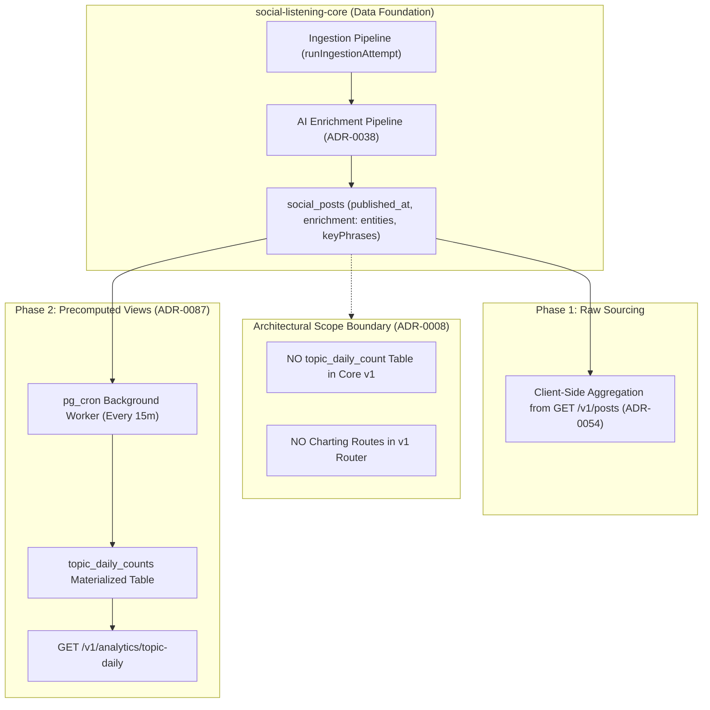
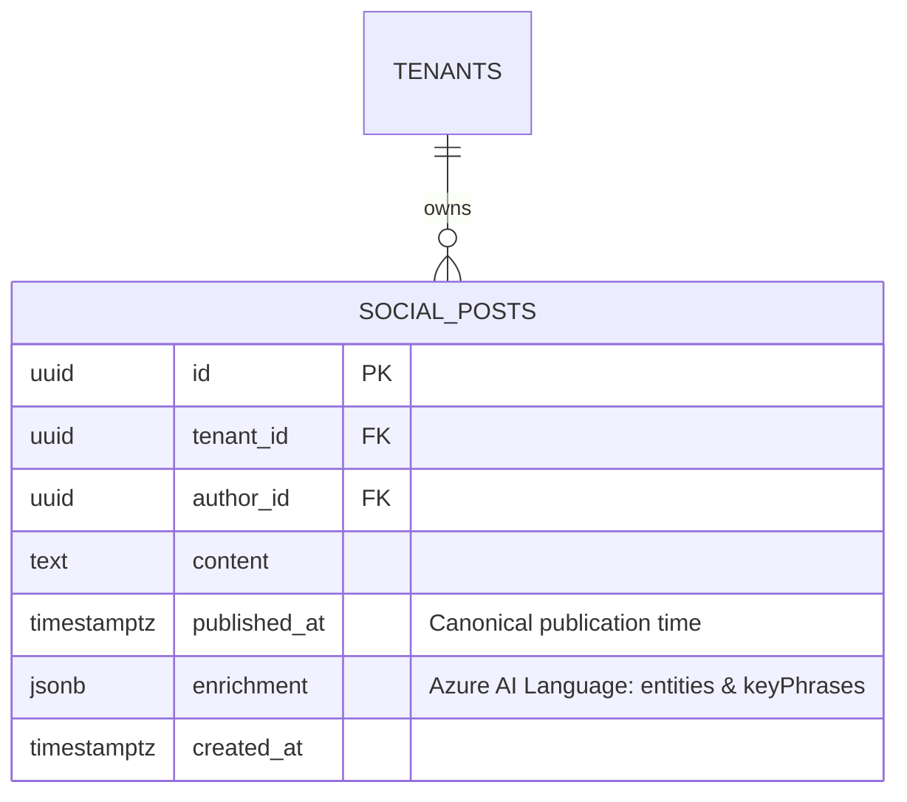
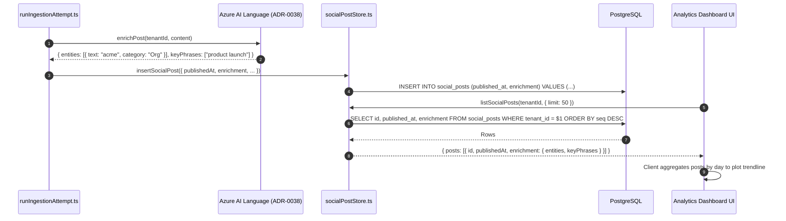

# Technical Design Specification (TDS) — Defer Topic Time-Series and Charting

## 1. Document Control & Traceability Linkage

### 1.1 Metadata
| Attribute | Value |
|---|---|
| **Document Title** | TDS-0008: Defer TopicDailyCount Aggregation and All Charting to a Future Subsystem |
| **Document ID** | `TDS-0008` |
| **Feature Name** | Post Enrichment Sourcing & Architectural Scope Boundary (Topic Time-Series) |
| **Version** | `1.0.0` |
| **Status** | Approved (Progressively Superseded by ADR-0054 and ADR-0087) |
| **Author(s)** | Core Architecture Team |
| **Created Date** | 2026-09-05 |
| **Last Updated** | 2026-09-05 |
| **Governing Skill** | `social-listening-core/.claude/skills/precomputed-analytics-views/SKILL.md` |

### 1.2 Upstream & Downstream Traceability Matrix
| Artifact Type | Reference Identifier | Title / Link | Alignment Status |
|---|---|---|---|
| **Architecture Decision Record** | `ADR-0008` | [ADR-0008: Defer TopicDailyCount aggregation and all charting](../../adr/0008-defer-topic-time-series-and-charting.md) | Invariant Source |
| **Business Requirements Doc** | `BRD-0008` | [BRD-0008: Defer Topic Time Series And Charting](../Business-Requirements/BRD-0008-Defer-Topic-Time-Series-And-Charting.md) | Fully Aligned |
| **Functional Design Doc** | `FDD-0008` | [FDD-0008: Defer Topic Time Series And Charting](../Functional-Design/FDD-0008-Defer-Topic-Time-Series-And-Charting.md) | Fully Aligned |
| **Governing User Story** | `Story 4.2` | [Epic 4: Derived Data, Analytics, and Health](../../user-stories/epic-4-derived-data-analytics-and-health.md#story-42--deferred-topic-time-series-aggregation) | Acceptance Target |
| **Successor Architecture Decisions** | `ADR-0054`, `ADR-0087` | Client-Side Analytics Charting (ADR-0054) & Precomputed Analytics Views (ADR-0087) | Governing Evolution |
| **Executable Contract Test** | `Story 4.2 Contract` | `social-listening-core/contracts/epic-4/story-4.2.topic-time-series-deferred.contract.test.ts` | 100% Passing |

---

## 2. System Context & Architecture Topology

### 2.1 Context Diagram


### 2.2 Architectural Boundaries & Invariants
- **Core Scope Discipline:** The core repository's mandate is ingestion, normalization, enrichment, and safe persistence. Speculatively designing time-series rollup tables before consuming dashboard requirements are validated leads to wasted schema migrations and mismatched aggregation grains.
- **Raw Data Sufficiency Invariant:** Rather than persisting premature aggregations, the data layer guarantees that `SocialPost` captures all raw signals necessary to reconstruct historical time series: `published_at` (timestamp), `enrichment.entities` (`{ text, category, confidenceScore }[]`), and `enrichment.keyPhrases` (`string[]`).
- **Two-Stage Progressive Supersession:**
  1. *ADR-0054 (Accepted 2026-08-17):* Superseded the "no charting UI" clause by authorizing client-side volume charts in `social-listening-admin` (`/tenant/analytics`) calculated on-the-fly from `GET /v1/posts` responses.
  2. *ADR-0087 (Accepted 2026-08-27):* Superseded the "no `TopicDailyCount` table" clause by introducing precomputed, tenant-scoped daily rollup tables refreshed every 15 minutes by `pg_cron` and served via `GET /v1/analytics/:view`.

---

## 3. Data Architecture & Persistence Design

### 3.1 Entity Relationship Diagram


### 3.2 DDL Schema & Database Migration
Implemented in `migrations/0010_add_social_posts_enrichment_fields.sql`:

```sql
-- Add temporal and AI enrichment payload fields to social_posts
ALTER TABLE social_posts
    ADD COLUMN IF NOT EXISTS published_at TIMESTAMPTZ NULL,
    ADD COLUMN IF NOT EXISTS enrichment JSONB NULL;

CREATE INDEX IF NOT EXISTS idx_social_posts_tenant_published_at 
    ON social_posts (tenant_id, published_at DESC);
```

---

## 4. Component Design & Detailed Processing Logic

### 4.1 Raw Time-Series Reconstruction Query
To prove that raw post data is mathematically sufficient to compute daily topic counts without a dedicated pre-aggregated table, the following analytical SQL query reconstructs the identical time-series dataset:

```sql
SELECT 
    DATE_TRUNC('day', sp.published_at) AS day,
    entity->>'text' AS topic,
    COUNT(*) AS mention_count
FROM social_posts sp,
LATERAL jsonb_array_elements(sp.enrichment->'entities') AS entity
WHERE sp.tenant_id = $1
  AND sp.published_at >= $2
  AND sp.published_at < $3
GROUP BY 1, 2
ORDER BY 1 DESC, 3 DESC;
```

### 4.2 Data Flow from Ingestion to Client Paging


---

## 5. Interface & Contract Specifications

### 5.1 Post Store Data Contract
```typescript
// social-listening-core/src/posts/socialPostStore.ts
export interface SocialPostEnrichment {
  entities?: Array<{
    text: string;
    category: string;
    confidenceScore: number;
  }>;
  keyPhrases?: string[];
  sentiment?: string;
}

export interface InsertSocialPostInput {
  tenantId: string;
  runId: string;
  platformId: string;
  externalId: string;
  authorId?: string | null;
  content: string;
  publishedAt?: Date | null;
  enrichment?: SocialPostEnrichment | null;
  rawPayload?: Record<string, unknown>;
}

export interface SocialPostSummary {
  id: string;
  publishedAt?: string | null;
  enrichment?: SocialPostEnrichment | null;
}
```

---

## 6. Security, Tenancy & Isolation Model

### 6.1 Tenant Isolation
The enrichment fields reside on `social_posts`, which is strictly isolated by tenant via PostgreSQL Row-Level Security:
```sql
CREATE POLICY tenant_isolation ON social_posts
    FOR ALL
    USING (tenant_id = NULLIF(current_setting('app.tenant_id', true), '')::uuid)
    WITH CHECK (tenant_id = NULLIF(current_setting('app.tenant_id', true), '')::uuid);
```
Entity mentions, key phrases, and temporal publication metrics cannot leak across tenant boundaries.

---

## 7. Performance, Scalability & Resource Caps

### 7.1 Computational Trade-Off
- **Write-Time Performance:** Deferring server-side rollups saves CPU and I/O during high-throughput ingestion runs. Ingestion runs write directly to `social_posts` without executing table locks or triggers against an auxiliary `topic_daily_count` table.
- **Read-Time Performance:** Client-side aggregation on `GET /v1/posts` results is suitable for low-to-medium post volumes ($< 5,000$ posts). As post volume scales, this model is superseded by the asynchronous materialized architecture in ADR-0087.

---

## 8. Resilience, Recovery & Failure Semantics

### 8.1 Schema Drift Resilience
Because `enrichment` is stored as structured `JSONB`, additions of new AI enrichment properties (e.g. `aspects`, `detectedLanguage`, `sentimentScore`) occur seamlessly without requiring blocking DDL column additions on `social_posts`.

---

## 9. Observability, Telemetry & Auditability

### 9.1 Enrichment Health Telemetry
- Logging tracks whether incoming posts contain valid entity extraction arrays (`enrichment.entities.length > 0`).
- Missing or malformed enrichment structures are flagged in ingestion telemetry to identify AI provider downtime.

---

## 10. Migration, Compatibility & Rollback Strategy

### 10.1 Schema Rollout & Rollback
- Migration `0010_add_social_posts_enrichment_fields.sql` adds `published_at` and `enrichment` without backfilling or locking.
- Rollback:
  ```sql
  ALTER TABLE social_posts 
      DROP COLUMN IF EXISTS published_at,
      DROP COLUMN IF EXISTS enrichment;
  ```

---

## 11. Verification, Testing & Quality Assurance

### 11.1 Contract Test Matrix
Validated by `social-listening-core/contracts/epic-4/story-4.2.topic-time-series-deferred.contract.test.ts`:
- **AC1:** Insertion and query verification: `SocialPost` stores `publishedAt`, `enrichment.entities`, and `enrichment.keyPhrases`, round-tripping through `listSocialPosts()`.
- **AC2:** Scope boundary verification: No `topic_daily_count` table or time-series charting route exists in the v1 core router.
- **AC3:** Mathematical sufficiency: A raw SQL query grouping by `published_at` day and `enrichment.entities` reconstructs the exact daily topic volume.

---

## 12. Open Questions & Future Enhancements

- [x] ~~**[Q-0008-1]** **Time-series aggregation grain.**~~ Resolved in ADR-0087: Daily aggregation bucketed by UTC midnight.
- [x] ~~**[Q-0008-2]** **Client-side vs server-side charting.**~~ Resolved in ADR-0054 (client-side analytics shell) and ADR-0087 (server-side precalculated views).
- [ ] **[Q-0008-3]** **Tenant timezone alignment.** Evaluating whether daily rollups should align with the tenant's primary configured timezone rather than UTC.
