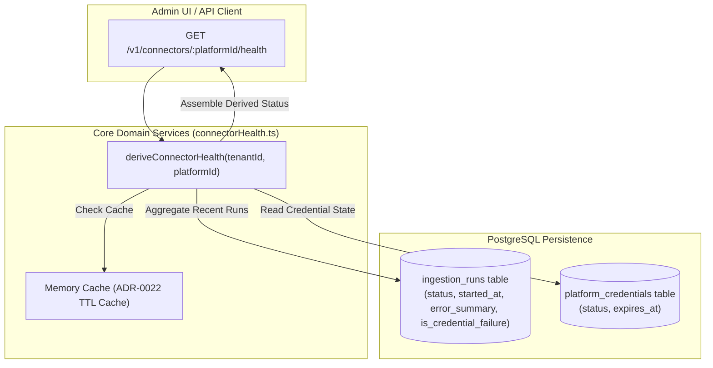

# Technical Design Specification (TDS) — Connector Health Derived Not Stored

## 1. Document Control & Traceability Linkage

### 1.1 Metadata
| Attribute | Value |
|---|---|
| **Document Title** | TDS-0009: Connector Health Derived Not Stored |
| **Document ID** | `TDS-0009` |
| **Feature Name** | Dynamic Ingestion Run Aggregation for Connector Health |
| **Version** | `1.0.0` |
| **Status** | Approved |
| **Author(s)** | Core Architecture Team |
| **Created Date** | 2026-09-04 |
| **Last Updated** | 2026-09-04 |
| **Governing Skill** | `social-listening-core/.claude/skills/connector-health-and-error-handling/SKILL.md` |

### 1.2 Upstream & Downstream Traceability Matrix
| Artifact Type | Reference Identifier | Title / Link | Alignment Status |
|---|---|---|---|
| **Architecture Decision Record** | `ADR-0009` | [ADR-0009: ConnectorHealth is fully derived from IngestionRun history](../../adr/0009-connector-health-derived-not-stored.md) | Invariant Source |
| **Business Requirements Doc** | `BRD-0009` | [BRD-0009: Connector Health Derived Not Stored](../Business-Requirements/BRD-0009-Connector-Health-Derived-Not-Stored.md) | Fully Aligned |
| **Functional Design Doc** | `FDD-0009` | [FDD-0009: Connector Health Derived Not Stored](../Functional-Design/FDD-0009-Connector-Health-Derived-Not-Stored.md) | Fully Aligned |
| **Governing User Story** | `Story 4.3` | [Epic 4: Derived Data, Analytics and Health](../../user-stories/epic-4-derived-data-analytics-and-health.md#story-43--connectorhealth-is-fully-derived-from-ingestionrun-history-not-stored-mutable-state) | Acceptance Target |
| **Executable Contract Test** | `Story 4.3 Contract` | `contracts/epic-4/story-4.3.connector-health.contract.test.ts` | 100% Passing |

---

## 2. System Context & Architecture Topology

### 2.1 Context Diagram


### 2.2 Architectural Boundaries & Invariants
- **Zero-Mutable-State Invariant:** There is no `connector_health` database table. Health metrics (`status`, `consecutiveFailures`, `lastSuccessfulFetchAt`, `lastAttemptAt`) are computed on demand by querying recent `ingestion_runs`.
- **Derivation Logic:**
  - `disconnected`: No `ingestion_runs` exist for `(tenant_id, platform_id)`.
  - `failing`: Consecutive failures meet or exceed the failure threshold (governed by ADR-0023 rate-relative calculation).
  - `degraded`: Recent failure exists, but at least one successful run completed within the lookback window (1 hour).
  - `reconnect_required`: Last error was flagged with `is_credential_failure = true`.
  - `healthy`: Recent successful run with zero consecutive active failures.
- **Independent Credential State:** `credentialStatus` (`valid`, `expiring_soon`, `expired`, `revoked`) is read from `platform_credentials` and composited into the final health object.

---

## 3. Data Architecture & Persistence Design

### 3.1 Aggregation Query Pattern
Health derivation relies on an optimized index scan over `ingestion_runs`:
```sql
SELECT 
  id,
  status,
  started_at,
  completed_at,
  posts_ingested,
  error_summary,
  retryable,
  is_credential_failure
FROM ingestion_runs
WHERE tenant_id = NULLIF(current_setting('app.tenant_id', true), '')::uuid
  AND platform_id = $1
ORDER BY started_at DESC
LIMIT 50;
```

Required index on `ingestion_runs`:
```sql
CREATE INDEX idx_ingestion_runs_health_derivation 
  ON ingestion_runs(tenant_id, platform_id, started_at DESC);
```

---

## 4. API, Interface & Integration Contract Design

### 4.1 TypeScript Types (`src/connectors/health.ts`)
```typescript
export type ConnectorStatus = 'healthy' | 'degraded' | 'failing' | 'disconnected' | 'reconnect_required';
export type CredentialHealthStatus = 'valid' | 'expiring_soon' | 'expired' | 'revoked' | 'none';

export interface ConnectorHealth {
  tenantId: string;
  platformId: string;
  status: ConnectorStatus;
  credentialStatus: CredentialHealthStatus;
  consecutiveFailures: number;
  lastAttemptAt: string | null;
  lastSuccessfulFetchAt: string | null;
  lastErrorSummary?: string | null;
}

export async function deriveConnectorHealth(
  tenantId: string,
  platformId: string
): Promise<ConnectorHealth>;
```

### 4.2 HTTP API Route
- **Route:** `GET /v1/connectors/:platformId/health`
- **Authentication:** Bearer token (`tenant_user` or `tenant_admin`)
- **Response Shape (HTTP 200 OK):**
```json
{
  "tenantId": "550e8400-e29b-41d4-a716-446655440000",
  "platformId": "gnews",
  "status": "healthy",
  "credentialStatus": "valid",
  "consecutiveFailures": 0,
  "lastAttemptAt": "2026-09-04T12:00:00.000Z",
  "lastSuccessfulFetchAt": "2026-09-04T12:00:00.000Z",
  "lastErrorSummary": null
}
```

---

## 5. Rate Limiting, Concurrency & Flow Control

- **Derived Caching:** To prevent database overload from administrative dashboard polling, derived health results are cached in memory using a 10-second TTL (ADR-0022). Cache is invalidated immediately upon run completion (`completeIngestionRun`).

---

## 6. Security, Identity & Credential Governance

- **Tenant Isolation:** Ingestion run queries execute within `withTenant()`, guaranteeing that Tenant A cannot inspect Tenant B's error messages or failure rates.
- **Error Sanitization:** `lastErrorSummary` must never expose secrets, passwords, or authentication bearer tokens.

---

## 7. Error Handling, Resilience & Failure Classification

### 7.1 Health State Transitions
| Sequence of Ingestion Runs | Resulting Derived Status |
|---|---|
| No runs ever executed | `disconnected` |
| Succeeded, Succeeded, Succeeded | `healthy` |
| Succeeded, Failed (Network error) | `degraded` |
| Succeeded, Failed, Failed, Failed ($\ge \text{threshold}$) | `failing` |
| Succeeded, Failed (HTTP 401 Unauthorized) | `reconnect_required` |
| Failed, Succeeded | `healthy` (consecutive failures resets to 0) |

---

## 8. Testing & Contract Gate Plan

### 8.1 Contract Tests
Contract test file: `contracts/epic-4/story-4.3.connector-health.contract.test.ts`.

| Test ID | Scenario | Verification Method |
|---|---|---|
| `TEST-HLT-01` | Disconnected when no runs exist | Query health for unused platform; assert status is `disconnected`. |
| `TEST-HLT-02` | Healthy on success | Seed single succeeded run; assert status is `healthy` and `consecutiveFailures = 0`. |
| `TEST-HLT-03` | Degraded on recent failure with prior success | Seed succeeded run then single failed run; assert status is `degraded`. |
| `TEST-HLT-04` | Failing when exceeding failure threshold | Seed 10 consecutive failed runs; assert status is `failing`. |
| `TEST-HLT-05` | Reconnect required on credential error | Seed failed run with `isCredentialFailure: true`; assert status is `reconnect_required`. |

---

## 9. Component Skill (`SKILL.md`) Documentation Updates

Updates to `.claude/skills/connector-health-and-error-handling/SKILL.md`:
- **Architecture Invariant:** Never create a database table for connector health. Keep health fully derived from `ingestion_runs`.
- **Cache Policy:** Use short in-memory TTL caching; invalidate cache on run completion.

---

## 10. Observability, Metrics & Operational Telemetry

- **Metrics:**
  - `connector_health_status{platform, status}` (gauge)
  - `connector_health_derivation_duration_ms` (histogram)

---

## 11. Migration, Rollout & Feature Gating

- No database schema migrations required (pure functional query over `ingestion_runs` and `platform_credentials`).

---

## 12. Technical Assumptions, Dependencies & Open Questions

### 12.1 Assumptions & Dependencies
- **[A-0009-1]** All runs are durably recorded in `ingestion_runs`.
- **[D-0009-1]** Story 2.1 `ingestion_runs` store.

### 12.2 Open Questions
- [x] **[Q-0009-1]** *Dynamic Failure Threshold:* Replaced flat 10-failure rule with rate-relative rule in ADR-0023 / Story 2.5.
