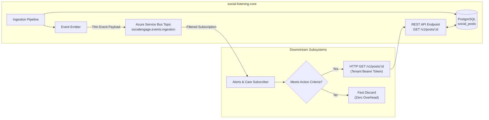

# TDS-0012: Thin Events with REST Fetch On-Demand Specification

**Status:** Approved  
**Date:** 2026-09-06  
**Governing ADR:** [ADR-0012](../../adr/0012-thin-events-with-rest-fetch-on-demand.md)  
**Related Epics/Stories:** [Epic 5 / Story 5.1](../../user-stories/epic-5-adr-0012-to-0015.md#story-51)  
**Target Repositories:** `social-listening-core`  
**Contract Test Citations:**  
- `social-listening-core/contracts/epic-5/story-5.1.thin-events-service-bus.contract.test.ts`  

---

## 1. Architectural Context & Problem Statement

Downstream enterprise subsystems (Brand Reputation & Alerts, Social Care, Social Selling) subscribe to post ingestion events emitted by `social-listening-core`. Including the entire post content (raw body, author profiles, full media arrays, engagement metrics) directly within messaging payloads creates severe architectural bottlenecks:
1. **Message Broker Payload Bloat:** Azure Service Bus Standard enforces a 256 KB message size limit (1 MB on Premium). Full social media posts with embedded metadata risk exceeding broker boundaries.
2. **Schema Coupling & Breaking Migrations:** Modifying post schema representations forces breaking schema updates across all downstream event consumers.
3. **Redundant Egress & Deserialization Costs:** High-volume consumers that only filter on metadata (e.g. sentiment score or brand alert thresholds) pay unnecessary deserialization costs for large text bodies they discard.

To resolve these constraints, this specification formalizes the **Thin Event Architecture**:
- All events carry minimal reference identifiers (`tenantId`, `postId`, `platformId`, `watchlistId`, `sentiment`, `publishedAt`, `occurredAt`).
- Subscribers retrieve complete enriched post payloads on demand via authenticated REST endpoints (`GET /v1/posts/:id`).



---

## 2. Governing ADRs & Decision Log Reference
- **ADR-0012:** Mandates thin event payloads over Azure Service Bus, keeping event size under 2 KB and requiring on-demand REST retrieval for full bodies.
- **ADR-0004:** Separate author normalization from post schema, allowing light author refs in events.
- **ADR-0005:** Ingestion run audit anchoring.

---

## 3. Interface Contracts & Event Schemas

```typescript
export interface SocialPostIngestedEvent {
  specversion: "1.0";
  type: "com.socialengage.post.ingested";
  source: "/connectors/ingestion";
  id: string; // UUID v4
  time: string; // ISO-8601 UTC
  datacontenttype: "application/json";
  data: {
    tenantId: string;
    postId: string;
    platformId: string;
    watchlistId: string;
    sentiment: number; // Normalized -10 to +10 integer scale (ADR-0141)
    publishedAt: string;
    occurredAt: string;
  };
}
```

---

## 4. Verification & Contract Gate
Verified by contract test `social-listening-core/contracts/epic-5/story-5.1.thin-events-service-bus.contract.test.ts` ensuring event payload size <= 1,024 bytes and REST lookup parity.
