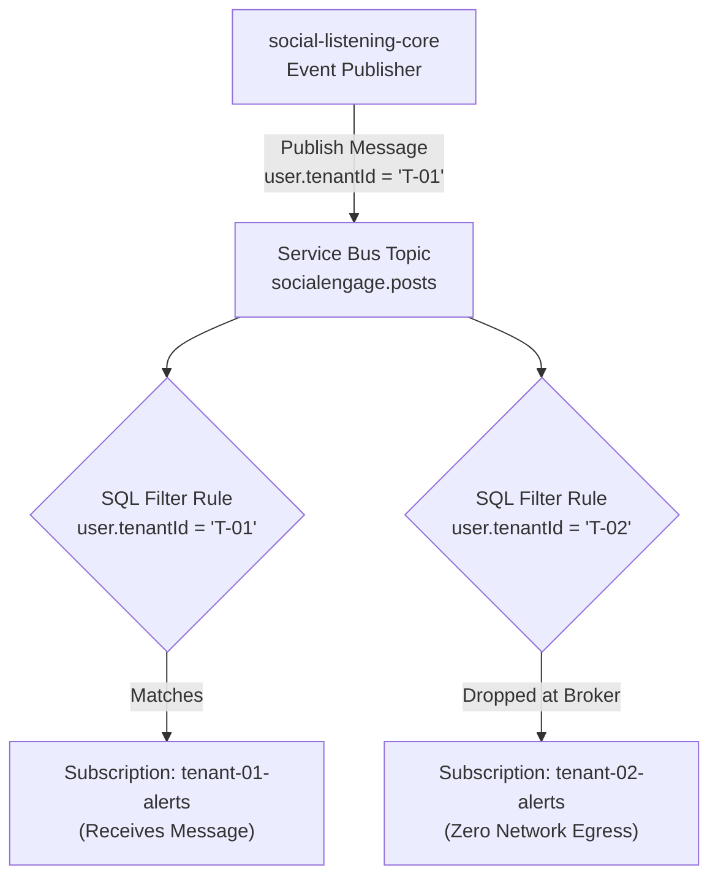

# TDS-0013: Per-Tenant Event Filtering via Subscription Rules Specification

**Status:** Approved  
**Date:** 2026-09-06  
**Governing ADR:** [ADR-0013](../../adr/0013-per-tenant-event-filtering-via-subscription-rules.md)  
**Related Epics/Stories:** [Epic 5 / Story 5.2](../../user-stories/epic-5-adr-0012-to-0015.md#story-52)  
**Target Repositories:** `social-listening-core`  
**Contract Test Citations:**  
- `social-listening-core/contracts/epic-5/story-5.2.tenant-event-subscription-filter.contract.test.ts`  

---

## 1. Architectural Context & Problem Statement

In a sovereign multi-tenant architecture, multiple commercial organizations ingest proprietary social post data concurrently through shared messaging topics. Distributing the entire message stream to every subscriber application and relying on client-side software filtering introduces critical failure vectors:
1. **Cross-Tenant Data Exposure Risk:** A bug or misconfiguration in a downstream subscriber's in-memory filter leaks tenant data to unauthorized subscriber tenants.
2. **Resource Waste & Egress Spikes:** Downstream microservices receive 100% of event traffic while processing only 1-5% of tenants, generating excessive network I/O and garbage collection thrashing.
3. **Noisy Neighbor Disruption:** Burst ingestion for a massive tenant saturates subscriber buffers for smaller unrelated tenants.

This specification formalizes **Broker-Level SQL Filter Rule Provisioning**:
- Every message carries a structured user property: `user.tenantId`.
- Subscriptions define declarative Azure Service Bus SQL Filters: `tenantId = 'tenant_xyz'` or `tenantId IN ('tenant_a', 'tenant_b')`.
- The messaging broker drops unauthorized messages before network delivery to the subscriber's AMQP connection.



---

## 2. Governing ADRs & Decision Log Reference
- **ADR-0013:** Mandates Azure Service Bus SQL Filter rules on `tenantId` so downstream subscriptions receive only entitled events.
- **ADR-0001:** Two-repository split and isolated tenant context.

---

## 3. Subscription Rule Definition

```json
{
  "RuleName": "TenantFilterRule",
  "FilterType": "SqlFilter",
  "SqlExpression": "user.tenantId = @targetTenantId",
  "Parameters": {
    "@targetTenantId": "tenant_4f9a1b"
  }
}
```

---

## 4. Verification & Contract Gate
Verified by `social-listening-core/contracts/epic-5/story-5.2.tenant-event-subscription-filter.contract.test.ts` validating that messages for Tenant B are never delivered to Tenant A's subscription queue.
