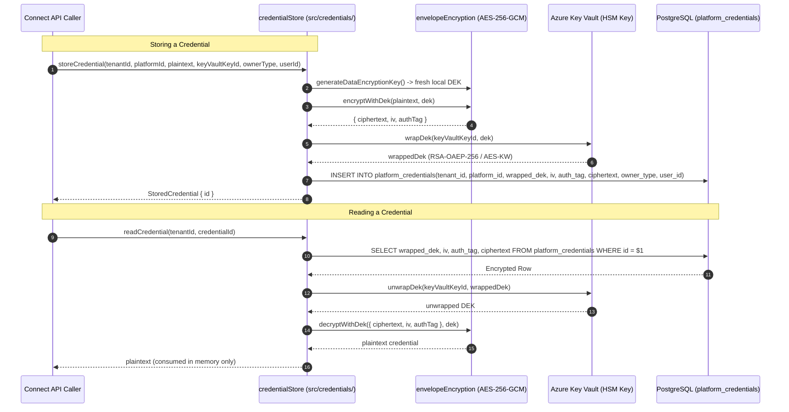

# TDS-0014: Credential Storage, Envelope Encryption & Key Vault Architecture

## 1. Document Control & Traceability Linkage

### 1.1 Document Metadata

| Field | Value |
|---|---|
| **Document ID** | `TDS-0014` |
| **Title** | Envelope-Encrypted Credential Storage via Azure Key Vault |
| **Version** | `1.0.0` |
| **Date** | 2026-07-28 |
| **Author(s)** | Security & Systems Architecture Agent |
| **Technical Reviewer(s)** | Menno (Lead Solutions Architect) |
| **Target Repositories** | `social-listening-core` |
| **Target Epic** | Epic 1 & Epic 5: Security, Isolation, and Platform Foundation |
| **Status** | Implemented |

### 1.2 Upstream Specification Traceability

| Artifact Tier | Document Reference | Governing Scope & Constraints |
|---|---|---|
| **Source ADR** | [ADR-0014](file:///d:/Source/socialengage/docs/adr/0014-credential-storage-envelope-encryption-oauth-first.md) | Accepted: Envelope encryption with Azure Key Vault; OAuth preferred over API keys |
| **Business Requirements (BRD)** | [BRD-0014](file:///d:/Source/socialengage/docs/project%20docs/Business-Requirements/BRD-0014-Credential-Storage-Envelope-Encryption-OAuth-First.md) | Prevent cross-tenant token compromise; zero plaintext credentials in DB |
| **Functional Design (FDD)** | [FDD-0014](file:///d:/Source/socialengage/docs/project%20docs/Functional-Design/FDD-0014-Credential-Storage-Envelope-Encryption-OAuth-First.md) | Token storage, retrieval, unwrap, automatic refresh, ownership tier integration |
| **User Stories** | Story 1.7 in `docs/user-stories/epic-1-repository-and-api-foundation.md` | $AC_1$: Envelope encryption; $AC_2$: Key Vault KEK; $AC_3$: Zero plaintext in logs/DB |
| **Component Skill** | [credential-envelope-encryption](file:///d:/Source/socialengage/social-listening-core/.claude/skills/credential-envelope-encryption/SKILL.md) | Invariant: Plaintext and unwrapped DEK never touch persistent storage |

---

## 2. System Context & Architectural Topology

### 2.1 Encryption & Storage Data Flow



### 2.2 Security Invariants

1. **Zero Plaintext Storage:** Neither the raw token/key nor the unwrapped DEK is ever persisted to disk or emitted to application logs.
2. **Double-Layer Defense:** Compromising the PostgreSQL database alone yields only ciphertext and wrapped DEKs; an attacker cannot decrypt anything without authenticating to Azure Key Vault.
3. **Hardware Backing:** The Key Encryption Key (KEK) is non-exportable and protected inside Azure Key Vault HSM.

---

## 3. Data Architecture & Persistence Design

### 3.1 Table Schema: `platform_credentials`

```sql
-- Migration: migrations/0002_create_platform_credentials.sql and 0023_add_ownership_tier_columns.sql
CREATE TABLE IF NOT EXISTS platform_credentials (
    id                  UUID            PRIMARY KEY DEFAULT gen_random_uuid(),
    tenant_id           UUID            NOT NULL,
    platform_id         TEXT            NOT NULL,
    wrapped_dek         BYTEA           NOT NULL,
    key_vault_key_id    TEXT            NOT NULL,
    iv                  BYTEA           NOT NULL,
    auth_tag            BYTEA           NOT NULL,
    ciphertext          BYTEA           NOT NULL,
    owner_type          TEXT            NOT NULL DEFAULT 'tenant',
    user_id             UUID            NULL,
    created_at          TIMESTAMPTZ     NOT NULL DEFAULT now(),
    updated_at          TIMESTAMPTZ     NOT NULL DEFAULT now(),

    CONSTRAINT platform_credentials_owner_type_check 
        CHECK (owner_type IN ('tenant', 'user')),
    CONSTRAINT uq_platform_credential_scope 
        UNIQUE (tenant_id, platform_id, owner_type, user_id)
);

ALTER TABLE platform_credentials ENABLE ROW LEVEL SECURITY;
ALTER TABLE platform_credentials FORCE ROW LEVEL SECURITY;

CREATE POLICY tenant_isolation ON platform_credentials
    FOR ALL
    USING (tenant_id = NULLIF(current_setting('app.tenant_id', true), '')::uuid)
    WITH CHECK (tenant_id = NULLIF(current_setting('app.tenant_id', true), '')::uuid);
```

---

## 4. API, Interface & Contract Design

### 4.1 TypeScript Cryptographic Interface

```typescript
// src/credentials/envelopeEncryption.ts
export function generateDataEncryptionKey(): Buffer;
export function encryptWithDek(plaintext: string, dek: Buffer): {
  ciphertext: Buffer;
  iv: Buffer;
  authTag: Buffer;
};
export function decryptWithDek(
  encrypted: { ciphertext: Buffer; iv: Buffer; authTag: Buffer },
  dek: Buffer
): string;

// src/credentials/keyVaultProvider.ts
export async function wrapDek(keyVaultKeyId: string, dek: Buffer): Promise<Buffer>;
export async function unwrapDek(keyVaultKeyId: string, wrappedDek: Buffer): Promise<Buffer>;

// src/credentials/credentialStore.ts
export type CredentialOwnerType = 'tenant' | 'user';

export async function storeCredential(
  tenantId: string,
  platformId: string,
  plaintext: string,
  keyVaultKeyId: string,
  ownerType?: CredentialOwnerType,
  userId?: string
): Promise<{ id: string }>;

export async function readCredential(tenantId: string, credentialId: string): Promise<string>;
export async function getLatestCredentialId(
  tenantId: string,
  platformId: string,
  ownerType: CredentialOwnerType,
  userId?: string
): Promise<string | null>;
```

---

## 5. Rate Limiting, Quota & Concurrency Gating

- Key Vault calls are cached per transaction where possible to avoid Azure Key Vault throttling (`429 Too Many Requests`).
- Rate limits on external platforms are managed downstream via `RequestGate` (TDS-0003).

---

## 6. Security, Identity & Credential Governance

- **Ownership Tiers (ADR-0028):**
  - `owner_type = 'tenant'`: Tenant-wide credentials (e.g. GNews, Newswire, Azure AI) managed by `Tenant-Admin`.
  - `owner_type = 'user'`: User-bound credentials (e.g. Facebook User Page tokens, LinkedIn personal tokens) managed by `Tenant-User`.
- Disconnecting a tenant-wide credential (`owner_type='tenant'`) never deletes a user's personal credentials (`owner_type='user'`).

---

## 7. Error Handling, Resilience & Failure Classification

- **Key Vault Unreachable:** When Key Vault unwrapping fails due to network outage or token expiration, the connector classifies it as a retryable `network` error.
- **Malformed Credential:** Corrupted ciphertext or authentication tag failure throws an immediate unrecoverable error and marks derived connector health as `degraded`.

---

## 8. Testing, Verification & Contract Gate Plan

### 8.1 Contract Test Specifications

- `contracts/epic-1/story-1.7.ownership-tier-connect-disconnect.contract.test.ts`
- Tests envelope encryption locally using ephemeral test keys against mocked Key Vault providers.
- Proves tenant isolation: Tenant B cannot decrypt or read Tenant A's credentials even with direct row ID knowledge.

---

## 9. Component Skill Documentation

- Documented in `.claude/skills/credential-envelope-encryption/SKILL.md`.
- Load-bearing constraint: `POST /connect` must fail fast if `KEY_VAULT_KEY_ID` is missing, rather than falling back to placeholder strings.

---

## 10. Implementation Checklist & Sign-Off

- [x] AES-256-GCM envelope encryption implemented
- [x] Azure Key Vault wrap/unwrap integration verified
- [x] Multi-tenant RLS isolation on `platform_credentials` confirmed
- [x] Ownership tiers (`tenant` vs `user`) verified in Story 1.7 contract tests
