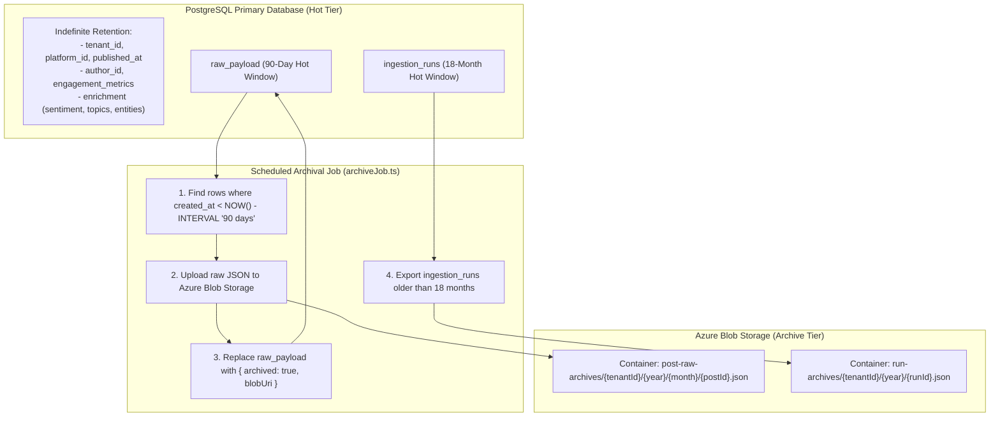

# Technical Design Specification (TDS) — Data Retention and Archival Policy

## 1. Document Control & Traceability Linkage

### 1.1 Metadata
| Attribute | Value |
|---|---|
| **Document Title** | TDS-0018: Field-Level Tiered Data Retention and Archival Policy |
| **Document ID** | `TDS-0018` |
| **Feature Name** | Tiered Storage Architecture, `rawPayload` Blob Offloading, and Monthly Partitioning |
| **Version** | `1.0.0` |
| **Status** | Approved |
| **Author(s)** | Core Architecture Team |
| **Created Date** | 2026-09-04 |
| **Last Updated** | 2026-09-04 |
| **Governing Skill** | `social-listening-core/.claude/skills/data-retention-and-archival/SKILL.md` |

### 1.2 Upstream & Downstream Traceability Matrix
| Artifact Type | Reference Identifier | Title / Link | Alignment Status |
|---|---|---|---|
| **Architecture Decision Record** | `ADR-0018` | [ADR-0018: Data retention and archival policy](../../adr/0018-data-retention-and-archival-policy.md) | Invariant Source |
| **Business Requirements Doc** | `BRD-0018` | [BRD-0018: Data Retention And Archival Policy](../Business-Requirements/BRD-0018-Data-Retention-And-Archival-Policy.md) | Fully Aligned |
| **Functional Design Doc** | `FDD-0018` | [FDD-0018: Data Retention And Archival Policy](../Functional-Design/FDD-0018-Data-Retention-And-Archival-Policy.md) | Fully Aligned |
| **Governing User Story** | `Story 3.5` | [Epic 3: Data Model, Storage, and Archival](../../user-stories/epic-3-data-model-storage-and-archival.md#story-35--tiered-retention-and-archival-for-socialpost-and-ingestionrun) | Acceptance Target |
| **Related User Story** | `Story 3.8` | [Epic 3: Data Model, Storage, and Archival](../../user-stories/epic-3-data-model-storage-and-archival.md#story-38--self-service-tenant-initiated-account-deletion) | Offboarding Purge Target |
| **Executable Contract Test** | `Story 3.5 Contract` | `contracts/epic-3/story-3.5.tiered-retention-and-archival.contract.test.ts` | 100% Passing |

---

## 2. System Context & Architecture Topology

### 2.1 Context Diagram


### 2.2 Architectural Boundaries & Invariants
- **Field-Level Tiering Invariant:** Retention is segmented per data category rather than by entire row deletion. Analytical and aggregation-relevant fields (`published_at`, `sentiment`, `topics`, `metrics`) remain in primary PostgreSQL storage indefinitely to support multi-year historical trend reporting.
- **`rawPayload` 90-Day Hot Window:** The bulky platform JSON payload is preserved hot for **90 days** (configurable). After 90 days, it is offloaded to Azure Blob Storage and replaced with a lightweight JSON reference pointer `{ "archived": true, "blobUri": "..." }`.
- **`IngestionRun` 18-Month Hot Window:** Ingestion audit anchors are preserved in PostgreSQL for **18 months** (configurable) before archival export. They are never hard-deleted while active tenant posts reference them.
- **Partitioning Mechanism:** `social_posts` and `ingestion_runs` use PostgreSQL monthly range partitioning keyed on `created_at`.
- **Application-Enforced Audit Referential Integrity:** `social_posts.acquisition_id` references `ingestion_runs.id` at the application layer without a rigid database-level foreign key constraint, allowing historical partitions of `ingestion_runs` to be detached without constraint violations.

---

## 3. Data Architecture & Persistence Design

### 3.1 Partitioned Table DDL
```sql
-- Partitioned social_posts table
CREATE TABLE IF NOT EXISTS social_posts (
    id UUID NOT NULL DEFAULT gen_random_uuid(),
    tenant_id UUID NOT NULL,
    platform_id VARCHAR(64) NOT NULL,
    external_id VARCHAR(255) NOT NULL,
    acquisition_id UUID NOT NULL,
    author_id UUID NOT NULL,
    content TEXT NOT NULL,
    raw_payload JSONB NOT NULL,
    published_at TIMESTAMPTZ,
    ingested_at TIMESTAMPTZ NOT NULL DEFAULT NOW(),
    created_at TIMESTAMPTZ NOT NULL DEFAULT NOW(),
    PRIMARY KEY (created_at, id)
) PARTITION BY RANGE (created_at);

-- Archival Pointer JSON Structure
/*
{
  "archived": true,
  "archivedAt": "2026-11-01T00:00:00.000Z",
  "blobUri": "https://account.blob.core.windows.net/post-raw-archives/tenant1/2026/05/post-uuid.json"
}
*/
```

---

## 4. API, Interface & Integration Contract Design

### 4.1 Archival Engine Interfaces (`src/archival/types.ts`)
```typescript
export interface ArchivalPolicyConfig {
  rawPayloadRetentionDays: number;   // default: 90
  ingestionRunRetentionMonths: number; // default: 18
  blobContainerName: string;
}

export interface RawPayloadArchivePointer {
  archived: true;
  archivedAt: string;
  blobUri: string;
}

export interface ArchiveRunResult {
  postsArchived: number;
  runsArchived: number;
  bytesOffloaded: number;
}
```

### 4.2 Raw Payload Archival Algorithm (`src/archival/archiveService.ts`)
```typescript
export async function archiveAgedRawPayloads(
  tenantId: string,
  cutoffDate: Date,
  blobClient: BlobStorageClient
): Promise<number> {
  // Query rows older than cutoff that haven't been archived yet
  const selectQuery = `
    SELECT id, created_at, raw_payload
    FROM social_posts
    WHERE tenant_id = $1
      AND created_at < $2
      AND (raw_payload->>'archived') IS NULL
    LIMIT 500;
  `;

  const { rows } = await pool.query(selectQuery, [tenantId, cutoffDate]);
  let count = 0;

  for (const row of rows) {
    const blobPath = `${tenantId}/${row.created_at.getFullYear()}/${row.id}.json`;
    await blobClient.uploadJson(blobPath, row.raw_payload);

    const pointer: RawPayloadArchivePointer = {
      archived: true,
      archivedAt: new Date().toISOString(),
      blobUri: blobClient.getBlobUri(blobPath)
    };

    await pool.query(
      `UPDATE social_posts 
       SET raw_payload = $1 
       WHERE id = $2 AND created_at = $3`,
      [JSON.stringify(pointer), row.id, row.created_at]
    );
    count++;
  }

  return count;
}
```

---

## 5. Rate Limiting, Concurrency & Flow Control

- **Batched Archival Sweeps:** Offloading executes in small, bounded chunks (500 rows per transaction batch), avoiding long-running table locks on hot partitions.
- **Off-Peak Execution:** Archival cron routines execute during low-traffic maintenance windows (e.g. 02:00 UTC).

---

## 6. Security, Identity & Credential Governance

- **Encrypted Blob Storage:** Offloaded JSON files in Azure Blob Storage are encrypted at rest using platform-managed AES-256 keys or customer-managed Key Vault keys.
- **Tenant Isolation in Blob Hierarchy:** Blobs are strictly partitioned into tenant-specific directory prefixes: `post-raw-archives/{tenantId}/...`.

---

## 7. Error Handling, Resilience & Failure Classification

- **Two-Phase Commit Discipline:** The database `raw_payload` pointer is updated *only after* the blob upload returns HTTP 201 Created. If the blob write fails, the database row is unmodified, ensuring zero data loss.
- **Transparent Hydration:** The post retrieval API (`GET /v1/posts/:id`) detects `{ "archived": true }` pointers and dynamically fetches the raw payload from blob storage when callers explicitly request `includeRaw=true`.

---

## 8. Testing & Contract Gate Plan

### 8.1 Contract Tests
Contract test file: `contracts/epic-3/story-3.5.tiered-retention-and-archival.contract.test.ts`.

| Test ID | Scenario | Verification Method |
|---|---|---|
| `TEST-RET-01` | 90-day payload offload | Insert post dated 91 days ago; run archival job; verify blob created and DB payload updated to pointer. |
| `TEST-RET-02` | Retain recent payload | Insert post dated 10 days ago; run archival job; verify DB `raw_payload` retains full JSON. |
| `TEST-RET-03` | Analytical field permanence | Verify `published_at`, `sentiment`, and metrics remain intact on 91-day-old post. |
| `TEST-RET-04` | Transparent blob retrieval | Request post with `includeRaw=true`; assert API fetches and returns raw JSON from blob. |

---

## 9. Component Skill (`SKILL.md`) Documentation Updates

Updates to `.claude/skills/data-retention-and-archival/SKILL.md`:
- **Archival Invariant:** Document that `rawPayload` is offloaded to blob storage after 90 days.
- **Partitioning Rule:** Highlight that `social_posts` is partitioned by `created_at`, not `published_at`.

---

## 10. Observability, Metrics & Operational Telemetry

- `archival_payloads_offloaded_total{tenant_id}` (counter)
- `archival_blob_bytes_stored_total` (gauge)
- `archival_job_duration_ms` (histogram)

---

## 11. Migration, Rollout & Feature Gating

- Migration `0018_create_partitioned_social_posts.sql` applies table partitioning.
- Storage containers provisioned in Azure Blob Storage.

---

## 12. Technical Assumptions, Dependencies & Open Questions

### 12.1 Assumptions & Dependencies
- **[A-0018-1]** Azure Blob Storage account available with IAM writer permissions.
- **[D-0018-1]** PostgreSQL declarative range partitioning supported.

### 12.2 Open Questions
- [x] **[Q-0018-1]** *Window Lengths:* Settled at 90 days for `rawPayload` and 18 months for `IngestionRun`.
- [x] **[Q-0018-2]** *Partition Key:* Settled on `created_at` (immutable `NOT NULL` timestamp).
- [x] **[Q-0018-3]** *Offboarding Integration:* Resolved by ADR-0039 (TDS-0039).
