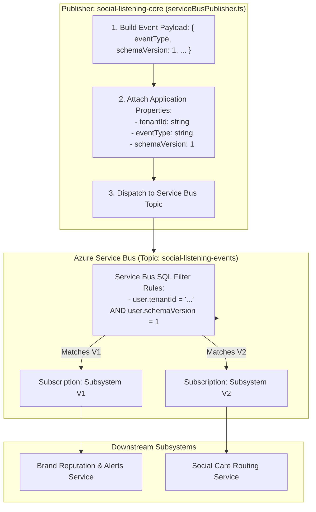

# Technical Design Specification (TDS) — Event Schema Versioning Policy

## 1. Document Control & Traceability Linkage

### 1.1 Metadata
| Attribute | Value |
|---|---|
| **Document Title** | TDS-0019: Service Bus Event Schema Versioning Policy |
| **Document ID** | `TDS-0019` |
| **Feature Name** | Asynchronous Thin Event Versioning & Message Property Filtering |
| **Version** | `1.0.0` |
| **Status** | Approved |
| **Author(s)** | Core Architecture Team |
| **Created Date** | 2026-09-04 |
| **Last Updated** | 2026-09-04 |
| **Governing Skill** | `social-listening-core/.claude/skills/ingestion-events/SKILL.md` |

### 1.2 Upstream & Downstream Traceability Matrix
| Artifact Type | Reference Identifier | Title / Link | Alignment Status |
|---|---|---|---|
| **Architecture Decision Record** | `ADR-0019` | [ADR-0019: Event schema versioning policy](../../adr/0019-event-schema-versioning-policy.md) | Invariant Source |
| **Business Requirements Doc** | `BRD-0019` | [BRD-0019: Event Schema Versioning Policy](../Business-Requirements/BRD-0019-Event-Schema-Versioning-Policy.md) | Fully Aligned |
| **Functional Design Doc** | `FDD-0019` | [FDD-0019: Event Schema Versioning Policy](../Functional-Design/FDD-0019-Event-Schema-Versioning-Policy.md) | Fully Aligned |
| **Governing User Story** | `Story 5.5` | [Epic 5: Security, Isolation, and Messaging](../../user-stories/epic-5-security-isolation-and-messaging.md#story-55--event-schema-versioning) | Acceptance Target |
| **Related User Stories** | `Story 5.1`, `Story 5.2` | [Epic 5: Security, Isolation, and Messaging](../../user-stories/epic-5-security-isolation-and-messaging.md) | Thin Events & SQL Filters |
| **Executable Contract Test** | `Story 5.5 Contract` | `contracts/epic-5/story-5.5.event-schema-versioning.contract.test.ts` | 100% Passing |

---

## 2. System Context & Architecture Topology

### 2.1 Context Diagram


### 2.2 Architectural Boundaries & Invariants
- **Transport-Level Version Header:** `schemaVersion` (an integer starting at `1`) must be attached as a **Service Bus custom application property** (`applicationProperties.schemaVersion`). This allows Service Bus broker filters and Dead-Letter routing to act on versioning without inspecting or deserializing the message body.
- **Dual-Representation Consistency:** `schemaVersion` is also mirrored directly within the JSON payload body for consumer deserialization convenience, but the message property remains the authoritative source of truth.
- **Additive Evolution Invariant:** Backward-compatible changes (adding optional properties) do *not* bump `schemaVersion`. Consumers must ignore unknown fields without throwing parse exceptions.
- **Coordinated Cutover for Breaking Changes:** Breaking changes (removing/renaming required fields or changing value semantics) bump `schemaVersion` (e.g. from `1` to `2`). During migration, publishers dual-publish both versions until all registered internal subsystems have upgraded.

---

## 3. Data Architecture & Persistence Design

- Event payloads are stateless notifications and are not stored permanently in the database.
- Audit history of emitted events is captured indirectly through `ingestion_runs` logs.

---

## 4. API, Interface & Integration Contract Design

### 4.1 Service Bus Message Envelope Contract (`src/events/types.ts`)
```typescript
export interface BaseEventPayload {
  eventType: string;
  schemaVersion: number;
  tenantId: string;
  occurredAt: string;
}

export interface ServiceBusMessageEnvelope<T extends BaseEventPayload> {
  body: T;
  applicationProperties: {
    tenantId: string;
    eventType: string;
    schemaVersion: number;
    [key: string]: string | number | boolean;
  };
}
```

### 4.2 Publisher Implementation (`src/events/serviceBusPublisher.ts`)
```typescript
import { ServiceBusClient, ServiceBusMessage } from '@azure/service-bus';
import { BaseEventPayload } from './types';

export class ServiceBusPublisher {
  constructor(private client: ServiceBusClient, private topicName: string) {}

  public async publishEvent<T extends BaseEventPayload>(event: T): Promise<void> {
    const sender = this.client.createSender(this.topicName);

    const message: ServiceBusMessage = {
      body: event,
      contentType: 'application/json',
      applicationProperties: {
        tenantId: event.tenantId,
        eventType: event.eventType,
        schemaVersion: event.schemaVersion
      }
    };

    try {
      await sender.sendMessages(message);
    } finally {
      await sender.close();
    }
  }
}
```

---

## 5. Rate Limiting, Concurrency & Flow Control

- Publisher uses SDK internal connection pooling; message sending executes asynchronously.
- Subscription rules partition traffic at the cloud broker level, eliminating compute overhead for mismatched schema versions.

---

## 6. Security, Identity & Credential Governance

- Authenticates to Azure Service Bus using Azure Managed Identity or shared access signatures stored in Azure Key Vault.
- `tenantId` application property enables Azure SQL Rule filters (`tenantId = '...'`), guaranteeing that tenant-specific subscribers never receive cross-tenant events.

---

## 7. Error Handling, Resilience & Failure Classification

- **Dead-Letter Forwarding:** Messages with unsupported `schemaVersion` can be rejected by consumers with `deadLetter({ deadLetterReason: 'UnsupportedSchemaVersion' })`.
- **Non-Fatal Delivery:** Publisher failures do not abort upstream ingestion (ADR-0058).

---

## 8. Testing & Contract Gate Plan

### 8.1 Contract Tests
Contract test file: `contracts/epic-5/story-5.5.event-schema-versioning.contract.test.ts`.

| Test ID | Scenario | Verification Method |
|---|---|---|
| `TEST-ESCH-01` | Mandatory `schemaVersion` property | Dispatch event; assert message contains `applicationProperties.schemaVersion = 1`. |
| `TEST-ESCH-02` | Body and header synchronization | Assert payload body `schemaVersion` matches header application property value. |
| `TEST-ESCH-03` | Additive non-breaking compatibility | Add optional field `tags?: string[]` to event; assert existing version 1 consumer parses without error. |
| `TEST-ESCH-04` | Service Bus SQL filter verification | Mock subscription with filter `schemaVersion = 2`; verify version 1 messages are ignored. |

---

## 9. Component Skill (`SKILL.md`) Documentation Updates

Updates to `.claude/skills/ingestion-events/SKILL.md`:
- **Event Versioning Standard:** Document that all events must attach `schemaVersion` as both an application property and a payload field.
- **Additive Rule:** Clarify that adding optional properties does not require a version increment.

---

## 10. Observability, Metrics & Operational Telemetry

- `events_published_total{event_type, schema_version}` (counter)
- `events_dead_lettered_total{event_type, reason}` (counter)

---

## 11. Migration, Rollout & Feature Gating

- Phase 0 foundation policy; all events deployed from Day 1 adhere to this contract.

---

## 12. Technical Assumptions, Dependencies & Open Questions

### 12.1 Assumptions & Dependencies
- **[A-0019-1]** Azure Service Bus SDK supports custom application properties on outgoing messages.
- **[D-0019-1]** Subscriptions configure SQL rule filters matching application properties.

### 12.2 Open Questions
- [x] **[Q-0019-1]** *Property vs Body:* Decided as custom message property for broker-level filtering.
- [x] **[Q-0019-2]** *Deprecation Mechanism:* Coordinated cutover adopted for internal subsystems.
