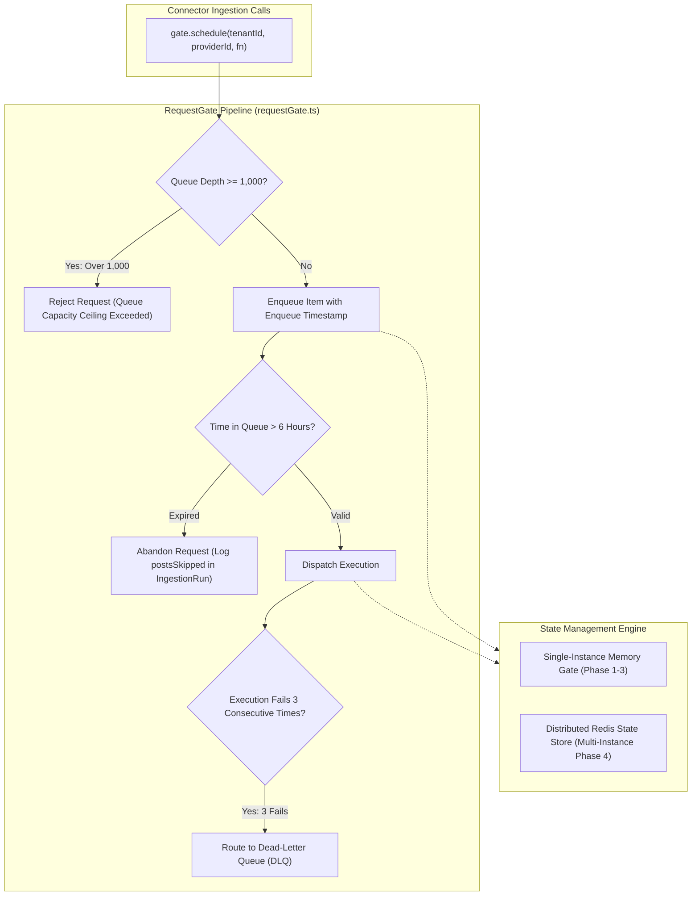

# Technical Design Specification (TDS) — Rate-Limit Queue Bounds and Distributed Gate State

## 1. Document Control & Traceability Linkage

### 1.1 Metadata
| Attribute | Value |
|---|---|
| **Document Title** | TDS-0020: Rate-Limit Queue Bounds & Distributed Gate State |
| **Document ID** | `TDS-0020` |
| **Feature Name** | Bounded Queuing, Dead-Letter Isolation & Distributed RequestGate Architecture |
| **Version** | `1.0.0` |
| **Status** | Approved |
| **Author(s)** | Core Architecture Team |
| **Created Date** | 2026-09-04 |
| **Last Updated** | 2026-09-04 |
| **Governing Skill** | `social-listening-core/.claude/skills/provider-connector-framework/SKILL.md` |

### 1.2 Upstream & Downstream Traceability Matrix
| Artifact Type | Reference Identifier | Title / Link | Alignment Status |
|---|---|---|---|
| **Architecture Decision Record** | `ADR-0020` | [ADR-0020: Rate-limit queue bounds, dead-letter handling, and distributed gate state](../../adr/0020-rate-limit-queue-bounds-and-distributed-gate-state.md) | Invariant Source |
| **Business Requirements Doc** | `BRD-0020` | [BRD-0020: Rate-Limit Queue Bounds and Distributed Gate State](../Business-Requirements/BRD-0020-Rate-Limit-Queue-Bounds-And-Distributed-Gate-State.md) | Fully Aligned |
| **Functional Design Doc** | `FDD-0020` | [FDD-0020: Rate-Limit Queue Bounds and Distributed Gate State](../Functional-Design/FDD-0020-Rate-Limit-Queue-Bounds-And-Distributed-Gate-State.md) | Fully Aligned |
| **Governing User Story** | `Story 2.4` | [Epic 2: Ingestion Connectors and Rate Limits](../../user-stories/epic-2-ingestion-connectors-and-rate-limits.md#story-24--rate-limit-queue-bounds-dead-letter-handling-and-distributed-gate-state) | Acceptance Target |
| **Executable Contract Test** | `Story 2.4 Contract` | `contracts/epic-2/story-2.4.rate-limit-queue-bounds.contract.test.ts` | 100% Passing |

---

## 2. System Context & Architecture Topology

### 2.1 Context Diagram


### 2.2 Architectural Boundaries & Invariants
- **Queue Depth Ceiling Invariant:** The rate-limit queue must never exceed **1,000** pending requests for any `(tenantId, providerId)` tuple. Once depth reaches 1,000, subsequent requests are rejected immediately with a capacity error.
- **Queue TTL Invariant:** A queued request waiting longer than **6 hours** (21,600,000 ms) is abandoned as stale and never executed against the remote provider API.
- **Auditable Abandonment:** Abandonment is recorded on the `ingestion_runs` table as `posts_skipped` with a clear `error_summary` (`"Queue TTL exceeded"`), satisfying ADR-0003's "never dropped silently" guarantee.
- **Dead-Letter Invariant:** An individual request that fails execution **3 consecutive times** upon dispatch is quarantined to a dead-letter queue (DLQ) to prevent worker pool poisoning.
- **Distributed State Strategy:** In-memory queue state is used for single-instance development/staging. When scaling horizontally, `RequestGate` leverages Redis atomic scripts for token-bucket and queue depth synchronization.

---

## 3. Data Architecture & Persistence Design

### 3.1 Redis Data Structures (Distributed Gate Strategy)
```
Key: gate:{tenant_id}:{provider_id}:tokens       -> String (float token count)
Key: gate:{tenant_id}:{provider_id}:last_updated -> String (timestamp in ms)
Key: gate:{tenant_id}:{provider_id}:queue        -> ZSet (score = enqueue_timestamp, member = serialized_request)
Key: gate:{tenant_id}:{provider_id}:dlq          -> List (dead-letter payloads)
```

### 3.2 Abandonment Audit Logging
When a queued request expires:
```sql
UPDATE ingestion_runs
SET posts_skipped = posts_skipped + 1,
    error_summary = 'Queue TTL exceeded (6h timeout)',
    status = 'failed'
WHERE id = $1;
```

---

## 4. API, Interface & Integration Contract Design

### 4.1 TypeScript RequestGate Options (`src/rateLimiting/types.ts`)
```typescript
export interface RequestGateConfig {
  /** Maximum queue depth per tenant-provider pair. Default: 1,000 */
  maxQueueDepth: number;
  /** Maximum time a request may sit in queue before abandonment. Default: 6 hours (ms) */
  queueTtlMs: number;
  /** Maximum execution attempts for a single request before dead-lettering. Default: 3 */
  maxExecutionRetries: number;
  /** Storage strategy */
  backend: 'memory' | 'redis';
}

export interface QueueStatus {
  tenantId: string;
  providerId: string;
  depth: number;
  oldestItemAgeMs: number | null;
  deadLetterCount: number;
}
```

### 4.2 Error Definitions
- `QueueDepthExceededError`: Thrown when queue depth $\ge 1,000$.
- `QueueItemExpiredError`: Emitted when an item exceeds the 6-hour TTL.
- `DeadLetterError`: Emitted when an item exhausts 3 consecutive dispatch attempts.

---

## 5. Rate Limiting, Concurrency & Flow Control

- **Sliding Window Token Bucket:** Tokens replenish continuously according to provider limits (e.g. 100 requests per 86,400 seconds for GNews).
- **Concurrency Serialization:** For a given `(tenantId, providerId)`, requests dequeue sequentially to respect remote concurrency guidelines.

---

## 6. Security, Identity & Credential Governance

- Dead-letter payloads must redact API keys, access tokens, and Authorization headers prior to moving to the DLQ.

---

## 7. Error Handling, Resilience & Failure Classification

### 7.1 Queue Overload Actions
| Condition | System Reaction | User/Admin Impact |
|---|---|---|
| Queue Depth $\ge 1,000$ | Immediate HTTP 429 / Rejection | Connector detail surfaces `degraded` / capacity ceiling warning |
| Enqueued Item Age $> 6\text{h}$ | Drop item; increment `posts_skipped` | Audited in `ingestion_runs`; no downstream post created |
| Execution Failure count $= 3$ | Item moved to DLQ; worker freed | Error summary recorded; administrator can inspect dead-letter log |

---

## 8. Testing & Contract Gate Plan

### 8.1 Contract Tests
Contract test file: `contracts/epic-2/story-2.4.rate-limit-queue-bounds.contract.test.ts`.

| Test ID | Scenario | Verification Method |
|---|---|---|
| `TEST-Q-01` | Queue depth ceiling | Enqueue 1,000 items; assert 1,001st item rejects with `QueueDepthExceededError`. |
| `TEST-Q-02` | Queue TTL expiration | Enqueue item with synthetic past timestamp (>6h); assert item is discarded with `QueueItemExpiredError`. |
| `TEST-Q-03` | Dead-letter dispatch | Mock function that fails 3 consecutive times; assert item routes to DLQ and stops retrying. |
| `TEST-Q-04` | Audit logging of expired items | Verify that discarded items update `posts_skipped` on the active `IngestionRun`. |

---

## 9. Component Skill (`SKILL.md`) Documentation Updates

Updates to `.claude/skills/provider-connector-framework/SKILL.md`:
- **Queue Limits:** Always initialize `RequestGate` with bounded depth (1,000) and TTL (6h). Never allow unbound array growth.
- **DLQ Policy:** Inspect DLQ before resetting dead-lettered tasks to avoid re-poisoning active workers.

---

## 10. Observability, Metrics & Operational Telemetry

- `request_gate_queue_depth{tenant_id, provider_id}` (gauge)
- `request_gate_expired_items_total{tenant_id, provider_id}` (counter)
- `request_gate_dead_letter_items_total{tenant_id, provider_id}` (counter)
- `request_gate_queue_wait_duration_ms` (histogram)

---

## 11. Migration, Rollout & Feature Gating

- Phase 1-3 runs single-instance memory gate.
- Phase 4 rollout enables Redis-backed distributed state via environment configuration (`REDIS_URL`).

---

## 12. Technical Assumptions, Dependencies & Open Questions

### 12.1 Assumptions & Dependencies
- **[A-0020-1]** Ingested data older than 6 hours in queue is functionally obsolete for real-time social listening.
- **[D-0020-1]** ADR-0003 `RequestGate` baseline.

### 12.2 Open Questions
- [x] **[Q-0020-1]** *Per-Platform Variance:* Flat thresholds (6h / 1,000 / 3) retained for v1 per acceptance note.
- [x] **[Q-0020-2]** *Health Status Representation:* Queue rejection folded into existing `degraded`/`failing` statuses per ADR-0009.
