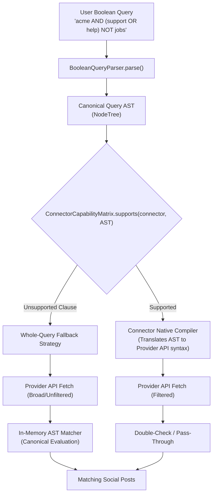

# TDS-0021: Watchlist Boolean Query AST and Capability Matrix Specification

**Status:** Approved  
**Date:** 2026-09-06  
**Governing ADR:** [ADR-0021](../../adr/0021-watchlist-boolean-query-ast-and-capability-matrix.md)  
**Related Epics/Stories:** [Epic 3 / Story 3.6](../../user-stories/epic-3-adr-0004-to-0011.md#story-36)  
**Target Repositories:** `social-listening-core`  
**Contract Test Citations:**  
- `social-listening-core/contracts/epic-3/story-3.6.watchlist-boolean-query-ast.contract.test.ts`  

---

## 1. Architectural Context & Problem Statement

SocialEngage watchlists allow operators to express complex search criteria using boolean expressions (e.g. `"brand" AND ("support" OR "complaint") NOT "hiring"`). 
Per ADR-0006, watchlist matching executes connector-side when native platform APIs support query parameters, falling back to core-side in-memory matching otherwise. However:
1. Native platform query grammars differ radically (e.g. Twitter/X supports `-is:retweet`, Reddit supports subreddit boolean syntax, RSS feeds support zero native boolean filtering).
2. Ad-hoc string translation causes query semantics to diverge between connector-side filtering and post-fetch fallback matching.

This specification formalizes the **Unified Boolean Query AST & Connector Capability Matrix**:
- A single canonical Abstract Syntax Tree (AST) representing terms, boolean operators (`AND`, `OR`, `NOT`), phrases, and groupings.
- A declared `ConnectorCapabilityMatrix` specifying supported AST feature flags per connector.
- Whole-query fallback degradation: if a connector cannot express any part of the query natively, it fetches broad results and applies the canonical core matcher without semantic divergence.



---

## 2. Governing ADRs & Decision Log Reference
- **ADR-0021:** Defines the unified boolean-query AST and connector capability matrix with whole-query degradation for v1.
- **ADR-0006:** Watchlist matching connector-side with core fallback.

---

## 3. Abstract Syntax Tree (AST) Model

```typescript
export type ASTNode =
  | { type: "TERM"; value: string; field?: string }
  | { type: "PHRASE"; value: string; field?: string }
  | { type: "AND"; left: ASTNode; right: ASTNode }
  | { type: "OR"; left: ASTNode; right: ASTNode }
  | { type: "NOT"; operand: ASTNode };

export interface ConnectorCapabilityMatrix {
  supportsAnd: boolean;
  supportsOr: boolean;
  supportsNot: boolean;
  supportsPhrases: boolean;
  supportsFieldScoping: boolean;
  maxQueryLength: number;
}
```

---

## 4. Verification & Contract Gate
Verified by `social-listening-core/contracts/epic-3/story-3.6.watchlist-boolean-query-ast.contract.test.ts` verifying identical match results across native compilation and core fallback.
