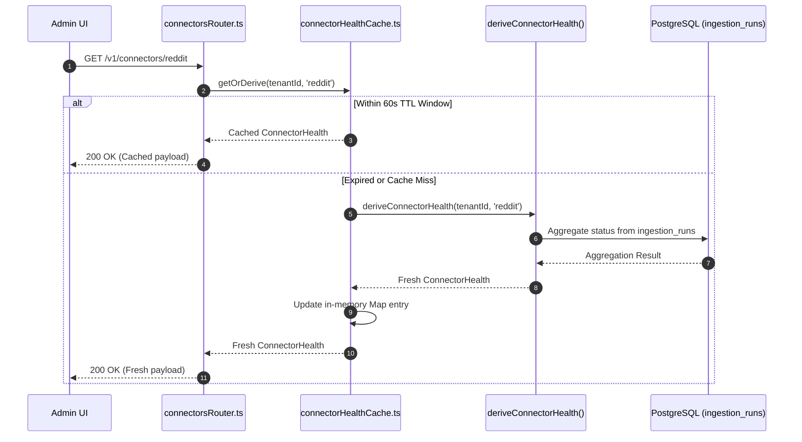

# Technical Design Specification (TDS) — Derived-Data Caching and Refresh Strategy

## 1. Document Control & Traceability Linkage

### 1.1 Metadata
| Attribute | Value |
|---|---|
| **Document Title** | TDS-0022: Derived-Data Caching and Refresh Strategy |
| **Document ID** | `TDS-0022` |
| **Feature Name** | In-Process ConnectorHealth Read Cache & Hourly pg_cron Signal Materialization |
| **Version** | `1.0.0` |
| **Status** | Approved |
| **Author(s)** | Core Architecture Team |
| **Created Date** | 2026-09-05 |
| **Last Updated** | 2026-09-05 |
| **Governing Skill** | `social-listening-core/.claude/skills/derived-data-caching-and-refresh/SKILL.md` |

### 1.2 Upstream & Downstream Traceability Matrix
| Artifact Type | Reference Identifier | Title / Link | Alignment Status |
|---|---|---|---|
| **Architecture Decision Record** | `ADR-0022` | [ADR-0022: Derived-data caching and refresh strategy](../../adr/0022-derived-data-caching-and-refresh-strategy.md) | Invariant Source |
| **Business Requirements Doc** | `BRD-0022` | [BRD-0022: Derived Data Caching And Refresh Strategy](../Business-Requirements/BRD-0022-Derived-Data-Caching-And-Refresh-Strategy.md) | Fully Aligned |
| **Functional Design Doc** | `FDD-0022` | [FDD-0022: Derived Data Caching And Refresh Strategy](../Functional-Design/FDD-0022-Derived-Data-Caching-And-Refresh-Strategy.md) | Fully Aligned |
| **Governing User Story** | `Story 4.4` | [Epic 4: Derived Data, Analytics, and Health](../../user-stories/epic-4-derived-data-analytics-and-health.md#story-44--derived-data-caching-and-refresh-strategy) | Acceptance Target |
| **Related Architecture Decisions** | `ADR-0007`, `ADR-0009`, `ADR-0020`, `ADR-0051` | Author-Topic Signals, Connector Health, RequestGate Redis, Connector Activation | Cross-Referenced |
| **Executable Contract Test** | `Story 4.4 Contract` | `social-listening-core/contracts/epic-4/story-4.4.derived-data-caching-and-refresh.contract.test.ts` | 100% Passing |

---

## 2. System Context & Architecture Topology

### 2.1 Context Diagram
```mermaid
flowchart TD
    subgraph UIClient["UI & Polling Clients"]
        Dashboard["Admin UI / Connector Status Screen"]
        ExpertFinder["Expert Finder API Consumers"]
    end

    subgraph ServiceLayer["social-listening-core API Layer"]
        ConnectorsRouter["connectorsRouter.ts (GET /v1/connectors/:id)"]
        HealthCache["ConnectorHealthCache (In-Process, 60s TTL)"]
        TopicsRouter["topicsRouter.ts (GET /v1/topics/:topic/authors)"]
    end

    subgraph DatabaseEngine["PostgreSQL Database"]
        IngestionRuns["ingestion_runs (Immutable Audit Anchor)"]
        AuthorSignals["author_topic_signals (Materialized Signals)"]
        PostsTable["social_posts (Enriched Posts)"]
        PgCron["pg_cron (Hourly Schedule: 0 * * * *)"]
        RefreshProc["refresh_author_topic_signals() Procedure"]
    end

    Dashboard --> ConnectorsRouter
    ConnectorsRouter --> HealthCache
    HealthCache -->|Cache Miss / TTL Expired| IngestionRuns
    HealthCache -->|Cache Hit (< 60s)| Dashboard

    ExpertFinder --> TopicsRouter
    TopicsRouter -->|Fast Index Scan| AuthorSignals

    PgCron -->|Triggers Hourly| RefreshProc
    RefreshProc -->|Batch Aggregate| PostsTable
    RefreshProc -->|UPSERT Signals| AuthorSignals
```

### 2.2 Architectural Boundaries & Invariants
- **Dual-Mechanism Architecture:** Addresses freshness across two distinct operational access patterns:
  1. *`ConnectorHealth`:* A high-frequency operational read backed by an in-process, read-through cache with a 60-second TTL.
  2. *`AuthorTopicSignal`:* A heavy, multi-dimensional analytical aggregate backed by a database-level scheduled batch refresh executing hourly via `pg_cron`.
- **Pure Derivation Cache (No Independent State):** `ConnectorHealthCache` is strictly an optimization layer in front of `deriveConnectorHealth()`. It is never mutated independently; it is populated solely by recomputing from `ingestion_runs`. Flushing the cache is always safe, non-lossy, and produces identical results upon subsequent read.
- **In-Process Locality Without Distributed Dependencies:** Unlike rate limiting (`RequestGate` per ADR-0020) which strictly requires shared Redis state to enforce hard platform limits, health caching uses in-process memory (`Map<string, CacheEntry>`). A Redis outage does not impact `GET /connectors/:id`. Minor cross-instance display inconsistency (showing states computed seconds apart) is accepted.
- **Database-Native Scheduling via `pg_cron`:** To avoid running, monitoring, and deploying a separate background scheduling microservice, periodic signal materialization executes natively within PostgreSQL via `pg_cron`.

---

## 3. Data Architecture & Persistence Design

### 3.1 In-Process Cache Data Structure
```typescript
interface HealthCacheEntry {
  health: ConnectorHealth;
  cachedAt: number; // Date.now() timestamp
}

// Module-level in-process cache map
private cache = new Map<string, HealthCacheEntry>();
```
Cache keys are strictly formatted as `${tenantId}:${platformId}`, ensuring complete tenant isolation in memory.

### 3.2 DDL Schema & Database Migration
Implemented in `migrations/0013_enable_pg_cron_and_refresh_author_topic_signals.sql`:

```sql
-- Enable pg_cron extension
CREATE EXTENSION IF NOT EXISTS pg_cron;

-- Refresh procedure aggregating signals from social_posts
CREATE OR REPLACE FUNCTION refresh_author_topic_signals()
RETURNS void AS $$
BEGIN
    INSERT INTO author_topic_signals (
        tenant_id,
        author_id,
        topic,
        mention_count,
        first_mention_at,
        last_mention_at,
        active_months_count,
        updated_at
    )
    SELECT
        sp.tenant_id,
        sp.author_id,
        entity->>'text' AS topic,
        COUNT(*) AS mention_count,
        MIN(sp.published_at) AS first_mention_at,
        MAX(sp.published_at) AS last_mention_at,
        COUNT(DISTINCT DATE_TRUNC('month', sp.published_at)) AS active_months_count,
        NOW() AS updated_at
    FROM social_posts sp,
    LATERAL jsonb_array_elements(sp.enrichment->'entities') AS entity
    WHERE sp.author_id IS NOT NULL 
      AND sp.published_at IS NOT NULL
      AND sp.enrichment ? 'entities'
    GROUP BY sp.tenant_id, sp.author_id, entity->>'text'
    ON CONFLICT (tenant_id, author_id, topic) DO UPDATE SET
        mention_count = EXCLUDED.mention_count,
        first_mention_at = LEAST(author_topic_signals.first_mention_at, EXCLUDED.first_mention_at),
        last_mention_at = GREATEST(author_topic_signals.last_mention_at, EXCLUDED.last_mention_at),
        active_months_count = EXCLUDED.active_months_count,
        updated_at = NOW();
END;
$$ LANGUAGE plpgsql;

-- Schedule hourly execution at minute 0
SELECT cron.schedule('refresh_author_topic_signals_hourly', '0 * * * *', 'SELECT refresh_author_topic_signals()');
```

---

## 4. Component Design & Detailed Processing Logic

### 4.1 In-Process Cache Implementation
Implemented in `social-listening-core/src/connectors/connectorHealthCache.ts`:

```typescript
export const DEFAULT_HEALTH_CACHE_TTL_MS = 60_000; // 60 seconds

export class ConnectorHealthCache {
  private cache = new Map<string, { health: ConnectorHealth; cachedAt: number }>();
  private readonly ttlMs: number;

  constructor(ttlMs = DEFAULT_HEALTH_CACHE_TTL_MS) {
    this.ttlMs = ttlMs;
  }

  async getOrDerive(
    tenantId: string,
    platformId: string,
    deriveFn: () => Promise<ConnectorHealth>
  ): Promise<ConnectorHealth> {
    const key = `${tenantId}:${platformId}`;
    const now = Date.now();
    const entry = this.cache.get(key);

    if (entry && (now - entry.cachedAt) < this.ttlMs) {
      return entry.health;
    }

    const health = await deriveFn();
    this.cache.set(key, { health, cachedAt: now });
    return health;
  }

  flush(): void {
    this.cache.clear();
  }
}
```

### 4.2 Health Request Dataflow


---

## 5. Interface & Contract Specifications

### 5.1 REST Endpoint Signature
`GET /v1/connectors/:platformId` (`social-listening-core/src/http/versions/v1/connectorsRouter.ts`)

| Header / Param | Type | Description |
|---|---|---|
| `Authorization` | `Bearer <token>` | Tenant user or admin identity token |
| `:platformId` | `string` | Connector platform identifier (e.g. `reddit`, `gnews`) |
| `?fresh` | `boolean` (optional) | Optional query parameter to bypass cache for troubleshooting |

### 5.2 ConnectorHealth JSON Schema
```json
{
  "platformId": "gnews",
  "status": "healthy",
  "lastSuccessfulFetchAt": "2026-09-05T14:45:00.000Z",
  "lastAttemptAt": "2026-09-05T15:00:00.000Z",
  "consecutiveFailures": 0,
  "cached": true
}
```

---

## 6. Security, Tenancy & Isolation Model

### 6.1 Multi-Tenant In-Memory Cache Isolation
In-memory cache entries prefix the key with `tenantId`. Even within a multi-tenant Node.js process, a request for tenant A cannot retrieve cached health state calculated for tenant B.

### 6.2 Procedure Security
`refresh_author_topic_signals()` runs under PostgreSQL database owner permissions, joining `social_posts` across tenants and upserting into `author_topic_signals`. Row-level security on `author_topic_signals` guarantees that API callers only read their tenant's partitioned signals.

---

## 7. Performance, Scalability & Resource Caps

### 7.1 Database Load Reduction
- When an admin user refreshes the dashboard status page repeatedly, health reads hit local Node.js heap memory, returning in $< 0.1\text{ms}$ with zero database queries.
- Peak query load on `ingestion_runs` is bounded to at most 1 query per connector per tenant per minute.

### 7.2 Memory Bounding
With 1,000 active tenants each monitoring 10 connectors, the cache contains 10,000 small JavaScript objects, consuming $< 5\text{MB}$ of heap space.

---

## 8. Resilience, Recovery & Failure Semantics

### 8.1 Zero-Loss Cache Eviction
The cache holds no uncommitted data. Process crashes, container restarts, or memory garbage collection evictions simply force the next request to re-derive from `ingestion_runs`.

### 8.2 Accepted Cross-Instance Inconsistency
If `social-listening-core` scales to multiple instances behind a load balancer, instances maintain independent 60s caches. A status change may take up to 60s to reflect across all instances. Because health is a diagnostic indicator rather than a billing or security boundary, this inconsistency is formally accepted.

---

## 9. Observability, Telemetry & Auditability

### 9.1 Cache Telemetry & Cron Health
- Internal metrics record `health_cache_hits_total` and `health_cache_misses_total`.
- Scheduled job execution is audited in `cron.job_run_details`, tracking start time, end time, and status (`succeeded` / `failed`).

---

## 10. Migration, Compatibility & Rollback Strategy

### 10.1 Schema Rollout & Rollback
- Implemented in `migrations/0013_enable_pg_cron_and_refresh_author_topic_signals.sql`.
- Rollback Procedure:
  ```sql
  SELECT cron.unschedule('refresh_author_topic_signals_hourly');
  DROP FUNCTION IF EXISTS refresh_author_topic_signals();
  ```

---

## 11. Verification, Testing & Quality Assurance

### 11.1 Contract Test Matrix
Validated by `social-listening-core/contracts/epic-4/story-4.4.derived-data-caching-and-refresh.contract.test.ts`:
- **AC1:** `GET /v1/connectors/:platformId` serves `ConnectorHealth` via cache; two reads within 60s return identical results even if new runs are inserted.
- **AC2:** Cache module has zero Redis dependencies; operates entirely in local memory.
- **AC3:** Flushing cache and immediately re-reading recomputes without data loss.
- **AC4:** Independent cache instances can show acceptable cross-instance display inconsistency.
- **AC5:** `pg_cron` schedule exists (`0 * * * *`) and `refresh_author_topic_signals()` recomputes mention counts and advances timestamps.

---

## 12. Open Questions & Future Enhancements

- [x] ~~**[Q-0022-1]** **60-second staleness tolerance.**~~ Confirmed at acceptance: 60s is appropriate for health diagnostics.
- [x] ~~**[Q-0022-2]** **Hourly refresh for AuthorTopicSignal.**~~ Confirmed at acceptance: Hourly schedule bounds staleness of long-window signals.
- [x] ~~**[Q-0022-3]** **In-process vs shared Redis cache.**~~ Confirmed at acceptance: In-process avoids unnecessary Redis dependency for non-critical reads.
