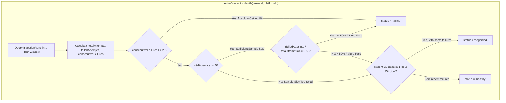

# Technical Design Specification (TDS) — Proportional Connector Failure Threshold

## 1. Document Control & Traceability Linkage

### 1.1 Metadata
| Attribute | Value |
|---|---|
| **Document Title** | TDS-0023: Proportional Connector Failure Threshold |
| **Document ID** | `TDS-0023` |
| **Feature Name** | Rate-Relative Health Derivation & Failure Evaluation Logic |
| **Version** | `1.0.0` |
| **Status** | Approved |
| **Author(s)** | Core Architecture Team |
| **Created Date** | 2026-09-04 |
| **Last Updated** | 2026-09-04 |
| **Governing Skill** | `social-listening-core/.claude/skills/connector-health-and-error-handling/SKILL.md` |

### 1.2 Upstream & Downstream Traceability Matrix
| Artifact Type | Reference Identifier | Title / Link | Alignment Status |
|---|---|---|---|
| **Architecture Decision Record** | `ADR-0023` | [ADR-0023: Proportional (rate-relative) connector failure threshold for auto-disable](../../adr/0023-proportional-connector-failure-threshold.md) | Invariant Source |
| **Business Requirements Doc** | `BRD-0023` | [BRD-0023: Proportional Connector Failure Threshold](../Business-Requirements/BRD-0023-Proportional-Connector-Failure-Threshold.md) | Fully Aligned |
| **Functional Design Doc** | `FDD-0023` | [FDD-0023: Proportional Connector Failure Threshold](../Functional-Design/FDD-0023-Proportional-Connector-Failure-Threshold.md) | Fully Aligned |
| **Governing User Story** | `Story 2.5` | [Epic 2: Ingestion Connectors and Rate Limits](../../user-stories/epic-2-ingestion-connectors-and-rate-limits.md#story-25--proportional-rate-relative-connector-failure-threshold-for-auto-disable) | Acceptance Target |
| **Executable Contract Test** | `Story 2.5 Contract` | `contracts/epic-2/story-2.5.proportional-failure-threshold.contract.test.ts` | 100% Passing |

---

## 2. System Context & Architecture Topology

### 2.1 Context Diagram


### 2.2 Architectural Boundaries & Invariants
- **Rate-Relative Invariant:** Connector health status is evaluated on failure *rate* relative to attempt volume over a rolling 1-hour window, superseding the flat 10-failure rule from ADR-0009.
- **Statistical Floor:** To avoid tripping auto-disable on statistical noise (e.g. 1 failure out of 2 attempts), the rate threshold is evaluated only when total attempts within the 1-hour window are $\ge \mathbf{5}$.
- **Absolute Ceiling:** If a connector accumulates $\ge \mathbf{20}$ consecutive failures, it transitions to `failing` regardless of attempt volume or time window (protecting slow-polling feeds).
- **Recovery Path:** A successful run resets `consecutiveFailures` to 0 and re-evaluates the health state.

---

## 3. Data Architecture & Persistence Design

PostgreSQL query aggregation for health calculation:
```sql
SELECT 
  COUNT(*) AS total_attempts,
  COUNT(*) FILTER (WHERE status = 'failed' AND retryable = false) AS non_retryable_failures,
  COUNT(*) FILTER (WHERE status = 'failed') AS total_failures,
  MAX(started_at) FILTER (WHERE status = 'succeeded') AS last_successful_fetch_at,
  MAX(started_at) AS last_attempt_at
FROM ingestion_runs
WHERE tenant_id = NULLIF(current_setting('app.tenant_id', true), '')::uuid
  AND platform_id = $1
  AND started_at >= NOW() - INTERVAL '1 hour';
```

---

## 4. API, Interface & Integration Contract Design

### 4.1 Calculation Engine Interface (`src/connectors/healthCalculation.ts`)
```typescript
export interface HealthMetricsInput {
  totalAttempts: number;
  failedAttempts: number;
  consecutiveFailures: number;
  hasRecentSuccess: boolean;
  isCredentialFailure: boolean;
}

export function evaluateConnectorStatus(metrics: HealthMetricsInput): ConnectorStatus {
  if (metrics.isCredentialFailure) {
    return 'reconnect_required';
  }

  // 1. Absolute ceiling: 20 consecutive failures
  if (metrics.consecutiveFailures >= 20) {
    return 'failing';
  }

  // 2. Proportional threshold: >= 50% failure rate with 5-attempt floor
  if (metrics.totalAttempts >= 5) {
    const failureRate = metrics.failedAttempts / metrics.totalAttempts;
    if (failureRate >= 0.5) {
      return 'failing';
    }
  }

  // 3. Degraded vs Healthy
  if (metrics.failedAttempts > 0 && metrics.hasRecentSuccess) {
    return 'degraded';
  }

  return 'healthy';
}
```

---

## 5. Rate Limiting, Concurrency & Flow Control

- By judging high-volume connectors proportionally, transient rate-limit spikes (e.g. 10 failures out of 200 polls, 5% error rate) do not shut down healthy ingestion pipelines.

---

## 6. Security, Identity & Credential Governance

- Standard evaluation runs strictly inside tenant RLS boundaries; failure statistics are never mixed across tenants.

---

## 7. Error Handling, Resilience & Failure Classification

### 7.1 Scenario Matrix
| Attempt History (1-Hour Window) | Floor Met? | Failure Rate | Resulting Status |
|---|---|---|---|
| 2 attempts, 2 failures | No (2 < 5) | 100% | `degraded` (floor not met, ceiling not hit) |
| 5 attempts, 3 failures | Yes (5 >= 5) | 60% | `failing` ($\ge 50\%$) |
| 100 attempts, 10 failures | Yes (100 >= 5) | 10% | `degraded` (< 50%, has successes) |
| 20 attempts, 20 failures across 6 hours | N/A | 100% | `failing` (consecutive ceiling $\ge 20$) |

---

## 8. Testing & Contract Gate Plan

### 8.1 Contract Tests
Contract test file: `contracts/epic-2/story-2.5.proportional-failure-threshold.contract.test.ts`.

| Test ID | Scenario | Verification Method |
|---|---|---|
| `TEST-PROP-01` | Floor prevents premature trip | Seed 2 failed attempts; assert status is not `failing`. |
| `TEST-PROP-02` | 50% rate trips failing | Seed 3 failures out of 5 attempts; assert status transitions to `failing`. |
| `TEST-PROP-03` | High volume resilience | Seed 10 failures out of 100 attempts with recent success; assert status remains `degraded`. |
| `TEST-PROP-04` | 20 consecutive ceiling trips failing | Seed 20 consecutive failures; assert status is `failing`. |

---

## 9. Component Skill (`SKILL.md`) Documentation Updates

Updates to `.claude/skills/connector-health-and-error-handling/SKILL.md`:
- **Formula Standards:** Adhere strictly to the three evaluation rules (Floor: 5, Rate: 50%, Ceiling: 20).
- **Audit Requirement:** The calculation logic must read from `ingestion_runs` using the `(tenant_id, platform_id, started_at DESC)` index.

---

## 10. Observability, Metrics & Operational Telemetry

- `connector_failure_rate_ratio{platform, tenant_id}` (gauge)
- `connector_consecutive_failures_count{platform, tenant_id}` (gauge)

---

## 11. Migration, Rollout & Feature Gating

- Pure software update in `deriveConnectorHealth()` and `evaluateConnectorStatus()`.

---

## 12. Technical Assumptions, Dependencies & Open Questions

### 12.1 Assumptions & Dependencies
- **[A-0023-1]** Default 1-hour rolling calculation window.
- **[D-0023-1]** Story 4.3 derived health architecture.

### 12.2 Open Questions
- [x] **[Q-0023-1]** *Threshold Defaults:* Confirmed as launch defaults: 50% / 5 attempts / 20 consecutive.
- [x] **[Q-0023-2]** *Push-mode connectors:* Deferred until push-mode ingestion is scheduled.
