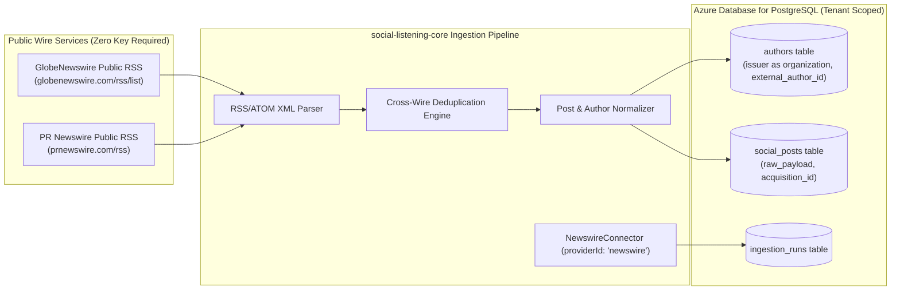

# Technical Design Specification (TDS) — Newswire Connector: Direct Wire RSS, Issuer as Author

## 1. Document Control & Traceability Linkage

### 1.1 Metadata
| Attribute | Value |
|---|---|
| **Document Title** | TDS-0024: Newswire Connector — Direct Wire RSS & Issuer-as-Author |
| **Document ID** | `TDS-0024` |
| **Feature Name** | Direct Wire-Service RSS Ingestion & Organization Author Modeling |
| **Version** | `1.0.0` |
| **Status** | Approved |
| **Author(s)** | Core Architecture Team |
| **Created Date** | 2026-09-04 |
| **Last Updated** | 2026-09-04 |
| **Governing Skill** | `social-listening-core/.claude/skills/provider-connector-framework/SKILL.md` |

### 1.2 Upstream & Downstream Traceability Matrix
| Artifact Type | Reference Identifier | Title / Link | Alignment Status |
|---|---|---|---|
| **Architecture Decision Record** | `ADR-0024` | [ADR-0024: Newswire connector — direct wire-service RSS feeds](../../adr/0024-newswire-connector-direct-wire-rss-issuer-as-author.md) | Invariant Source |
| **Business Requirements Doc** | `BRD-0024` | [BRD-0024: Newswire Connector Direct Wire RSS Issuer As Author](../Business-Requirements/BRD-0024-Newswire-Connector-Direct-Wire-RSS-Issuer-As-Author.md) | Fully Aligned |
| **Functional Design Doc** | `FDD-0024` | [FDD-0024: Newswire Connector Direct Wire RSS Issuer As Author](../Functional-Design/FDD-0024-Newswire-Connector-Direct-Wire-RSS-Issuer-As-Author.md) | Fully Aligned |
| **Governing User Story** | `Story 2.6` | [Epic 2: Ingestion Connectors and Rate Limits](../../user-stories/epic-2-ingestion-connectors-and-rate-limits.md#story-26--newswire-connector--direct-wire-service-rss-feeds-with-issuer-as-author-modeling) | Acceptance Target |
| **Executable Contract Test** | `Story 2.6 Contract` | `contracts/epic-2/story-2.6.newswire-connector.contract.test.ts` | 100% Passing |

---

## 2. System Context & Architecture Topology

### 2.1 Context Diagram


### 2.2 Architectural Boundaries & Invariants
- **Direct Public Ingestion Invariant:** Newswire content is pulled directly from open, public RSS/ATOM endpoints (GlobeNewswire and PR Newswire). `authMode` is `'none'`; no API keys, accounts, or aggregator subscriptions are used.
- **Issuer-as-Author Invariant:** For the `newswire` provider, the `authors` record models the *issuing organization* (company name or stock ticker), not an individual human. `follower_count` is null/omitted.
- **Deduplication Strategy:** Press releases syndicated simultaneously across both wire services are deduplicated via canonical URL or hash of `(normalized_headline, issuer_name, date)`.
- **Lookback Boundary:** As RSS feeds only supply recent items, no historical backfill prior to connector deployment is guaranteed.

---

## 3. Data Architecture & Persistence Design

### 3.1 Author Model Mapping (`authors`)
```sql
-- Organization author record generated by NewswireConnector
INSERT INTO authors (
  tenant_id,
  platform_id,
  external_author_id,
  handle,
  display_name,
  is_verified,
  follower_count
) VALUES (
  '550e8400-e29b-41d4-a716-446655440000',
  'newswire',
  'NASDAQ:AAPL',           -- Issuer identifier / Ticker or normalized company name
  'Apple Inc.',             -- Organization handle / display
  'Apple Inc.',
  true,
  NULL                      -- Omitted for organizations
);
```

### 3.2 Ingestion Deduplication Constraint
```sql
CREATE UNIQUE INDEX idx_social_posts_newswire_guid 
  ON social_posts(tenant_id, platform_id, external_post_id);
```

---

## 4. API, Interface & Integration Contract Design

### 4.1 Connector Implementation Contract (`src/connectors/newswire/newswireConnector.ts`)
```typescript
import { ProviderConnector, NormalizedPostBatch, IngestionCursor } from '../types';

export class NewswireConnector implements ProviderConnector {
  public readonly id = 'newswire';
  public readonly name = 'Newswire RSS Feeds';
  public readonly authType = 'none';
  public readonly deliveryMode = 'poll';

  public async validateCredential(): Promise<{ valid: boolean }> {
    return { valid: true }; // No credentials required
  }

  public async poll(
    context: ConnectorExecutionContext,
    cursor?: IngestionCursor
  ): Promise<NormalizedPostBatch> {
    // 1. Fetch XML feeds from GlobeNewswire and PR Newswire
    // 2. Parse items and deduplicate across feeds
    // 3. Normalize into Standard Post format with issuer as author
    // 4. Return NormalizedPostBatch
  }
}
```

---

## 5. Rate Limiting, Concurrency & Flow Control

- **Polite Polling Cadence:** Feeds are polled conservatively (default interval: 15 minutes) with conditional HTTP `If-Modified-Since` and `ETag` headers to minimize upstream bandwidth.
- **RequestGate Integration:** Fixed-window rate limiting (1 request per second max per wire domain) protects third-party feed servers from burst traffic.

---

## 6. Security, Identity & Credential Governance

- **Zero Credential Overhead:** Because `authType: 'none'`, no sensitive secrets or OAuth tokens are stored in `platform_credentials`.
- **Feed URL Allowlist:** Feed targets are strictly constrained to verified domains (`*.globenewswire.com`, `*.prnewswire.com`) to prevent SSRF vulnerabilities.

---

## 7. Error Handling, Resilience & Failure Classification

### 7.1 Failure Responses
| Scenario | Error Classification | System Action |
|---|---|---|
| HTTP 404 / 410 on feed URL | `Permanent` | Disable polling on specific feed URL; alert operators |
| Malformed XML in feed | `Transient` | Discard malformed item; parse remaining valid XML items |
| Network Timeout | `Transient` | Exponential backoff retry |

---

## 8. Testing & Contract Gate Plan

### 8.1 Contract Tests
Contract test file: `contracts/epic-2/story-2.6.newswire-connector.contract.test.ts`.

| Test ID | Scenario | Verification Method |
|---|---|---|
| `TEST-NW-01` | No credential required | Assert `validateCredential()` returns valid without API keys. |
| `TEST-NW-02` | Issuer mapped as author | Ingest mock press release XML; assert created `Author` record has `external_author_id = 'Acme Corp'` and `follower_count = NULL`. |
| `TEST-NW-03` | Cross-wire deduplication | Ingest identical release from GlobeNewswire and PR Newswire fixtures; assert only one `SocialPost` record is persisted. |

---

## 9. Component Skill (`SKILL.md`) Documentation Updates

Updates to `.claude/skills/provider-connector-framework/SKILL.md`:
- **Newswire Invariant:** Do not require API key entry for Newswire connector activation.
- **Author Invariant:** Document issuer-as-organization exception to the standard user author profile.

---

## 10. Observability, Metrics & Operational Telemetry

- `newswire_items_parsed_total{feed_source}` (counter)
- `newswire_duplicate_releases_skipped_total` (counter)
- `newswire_fetch_duration_seconds{feed_source}` (histogram)

---

## 11. Migration, Rollout & Feature Gating

- Registration of `'newswire'` in `src/connectors/registry.ts`.

---

## 12. Technical Assumptions, Dependencies & Open Questions

### 12.1 Assumptions & Dependencies
- **[A-0024-1]** GlobeNewswire and PR Newswire continue publishing open public RSS feeds without requiring paid media partner logins.
- **[D-0024-1]** Fast XML parser library (`fast-xml-parser`).

### 12.2 Open Questions
- [ ] **[Q-0024-1]** *Business Wire Partner Onboarding:* Evaluate if enterprise accounts warrant adding media-partner authenticated feeds from Business Wire or AccessWire in a future phase. *(Status: Deferred to enterprise customer requests).*
