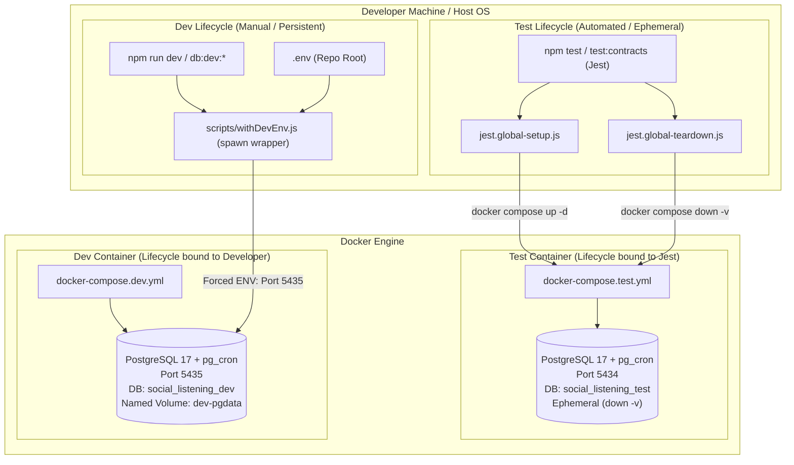

# Technical Design Specification (TDS) — Persistent Local Dev Database Separate from Test Database

## 1. Document Control & Traceability Linkage

### 1.1 Metadata
| Attribute | Value |
|---|---|
| **Document Title** | TDS-0025: Persistent Local Dev Database Separate from Test Database |
| **Document ID** | `TDS-0025` |
| **Feature Name** | Deterministic Local Dev vs. Test PostgreSQL Isolation Architecture |
| **Version** | `1.0.0` |
| **Status** | Approved |
| **Author(s)** | Core Architecture Team |
| **Created Date** | 2026-09-04 |
| **Last Updated** | 2026-09-04 |
| **Governing Skill** | `social-listening-core/.claude/skills/postgres-tenant-db/SKILL.md` |

### 1.2 Upstream & Downstream Traceability Matrix
| Artifact Type | Reference Identifier | Title / Link | Alignment Status |
|---|---|---|---|
| **Architecture Decision Record** | `ADR-0025` | [ADR-0025: Persistent local dev database, kept separate from the ephemeral test database](../../adr/0025-persistent-local-dev-database-separate-from-test-database.md) | Invariant Source |
| **Business Requirements Doc** | `BRD-0025` | [BRD-0025: Persistent Local Dev Database](../Business-Requirements/BRD-0025-Persistent-Local-Dev-Database-Separate-From-Test-Database.md) | Fully Aligned |
| **Functional Design Doc** | `FDD-0025` | [FDD-0025: Persistent Local Dev Database](../Functional-Design/FDD-0025-Persistent-Local-Dev-Database-Separate-From-Test-Database.md) | Fully Aligned |
| **Governing User Story** | `Story 1.4` | [Epic 1: Repository and API Foundation](../../user-stories/epic-1-repository-and-api-foundation.md) | Acceptance Target |
| **Executable Contract Test** | `Story 1.4 Contract` | `contracts/epic-1/story-1.4.persistent-local-dev-database.contract.test.ts` | 100% Passing |

---

## 2. System Context & Architecture Topology

### 2.1 Context Diagram


### 2.2 Architectural Invariants
- **Port Disjunction Invariant:** The test container listens strictly on port `5434`; the dev container listens strictly on port `5435`. Neither uses default `5432` (avoiding host service collisions).
- **Volume Persistence Invariant:** Development data persists across container restarts via the named volume `dev-pgdata`. A plain `docker compose -f docker-compose.dev.yml down` retains all ingested data. Destruction requires an explicit `npm run db:dev:reset` (`down -v`).
- **Test Teardown Non-Interference:** Jest's `globalTeardown` exclusively destroys the test compose project (`social-listening-core-test`). Running `npm test` concurrently while `npm run dev` is active must never drop or interfere with the dev database.
- **Image Parity:** Both compose files reference the identical Dockerfile (`docker/test-postgres/Dockerfile`, based on `postgres:17` with `pg_cron`), ensuring zero version or extension drift.

---

## 3. Data Architecture & Persistence Design

### 3.1 Docker Compose Definitions

#### `docker-compose.dev.yml`
```yaml
version: '3.8'
services:
  postgres-dev:
    build:
      context: .
      dockerfile: docker/test-postgres/Dockerfile
    container_name: social-listening-core-dev-pg
    environment:
      POSTGRES_DB: social_listening_dev
      POSTGRES_USER: postgres
      POSTGRES_PASSWORD: postgres_password
      APP_USER: app_user
      APP_PASSWORD: app_user_password
    ports:
      - "5435:5432"
    volumes:
      - dev-pgdata:/var/lib/postgresql/data
volumes:
  dev-pgdata:
```

### 3.2 Forced Environment Resolution in `scripts/withDevEnv.js`
To eliminate subtle host environment overrides, `scripts/withDevEnv.js` forces PostgreSQL connection parameters unconditionally:
```javascript
const forcedDevEnv = {
  PGHOST: 'localhost',
  PGPORT: '5435',
  PGDATABASE: 'social_listening_dev',
  PGUSER: 'postgres',
  PGPASSWORD: 'postgres_password',
  APP_PGUSER: 'app_user',
  APP_PGPASSWORD: 'app_user_password',
};
```

---

## 4. API, Interface & Integration Contract Design

### 4.1 CLI Execution Protocol: `scripts/withDevEnv.js`
The runner adheres to three critical design criteria:
1. **Deterministic `.env` Loading:** Loads environment variables from `path.join(__dirname, '..', '.env')` (absolute repo root) rather than relative `process.cwd()`.
2. **Forced Overrides:** Overwrites any stray `PG*` variables from the caller shell with the deterministic dev container values.
3. **Cross-Platform Child Process Spawning:** Uses `child_process.spawn()` with array-based arguments (`process.argv.slice(2)`), avoiding shell argument re-parsing and quoting bugs on Windows.

```javascript
const { spawn } = require('child_process');
const path = require('path');
const dotenv = require('dotenv');

// 1. Load root .env
dotenv.config({ path: path.join(__dirname, '..', '.env') });

// 2. Build forced environment
const env = {
  ...process.env,
  ...forcedDevEnv
};

// 3. Spawn target command
const [cmd, ...args] = process.argv.slice(2);
const child = spawn(cmd, args, { stdio: 'inherit', env, shell: true });
child.on('exit', (code) => process.exit(code ?? 0));
```

### 4.2 NPM Scripts Surface
| Command | Action | Lifespan / Side Effects |
|---|---|---|
| `npm run db:dev:up` | `docker compose -f docker-compose.dev.yml up -d` | Starts dev database on port 5435 |
| `npm run db:dev:migrate` | Runs all `migrations/*.sql` against dev DB | Applies pending schema updates |
| `npm run dev` | Runs `scripts/withDevEnv.js ts-node src/http/server.ts` | Launches long-running development API server |
| `npm run db:dev:down` | `docker compose -f docker-compose.dev.yml down` | Stops dev container; data preserved |
| `npm run db:dev:reset` | `docker compose -f docker-compose.dev.yml down -v` | Stops dev container and wipes `dev-pgdata` volume |

---

## 5. Rate Limiting, Concurrency & Flow Control

- **Concurrent Execution:** Host CPU and RAM must accommodate concurrent execution of both Docker containers (`5434` and `5435`) without port conflicts or socket starvation.
- **Port Allocation Strategy:** Explicit host port binding avoids Docker dynamic port assignment non-determinism.

---

## 6. Security, Identity & Credential Governance

- **Local Development Secrets:** Passwords (`postgres_password`, `app_user_password`) are strictly local and disposable.
- **`.env` Separation:** Secrets in `.env` (such as `GNEWS_API_KEY` or `ENTRA_*` tenant IDs) are loaded locally by `withDevEnv.js` and gitignored to prevent credential leaks.

---

## 7. Error Handling, Resilience & Failure Classification

### 7.1 Failure Modes & Mitigations
| Failure Mode | Root Cause | System Behavior | Mitigation Strategy |
|---|---|---|---|
| Host Shell Dirty Env | Developer exported `PGPORT=5432` in bash/PowerShell | Dev server connects to wrong database | `withDevEnv.js` unconditionally overrides `process.env.PG*` |
| Argument Mangling on Windows | Using `execSync` with joined string | Space-delimited CLI parameters broken | Migrated to `spawn` with argument array |
| Orphaned Port 5435 | Previous docker process crashed or hung | Docker refuses to bind port | Script diagnostics prompt user to run `docker stop social-listening-core-dev-pg` |

---

## 8. Testing & Contract Gate Plan

### 8.1 Contract Tests
Contract test file: `contracts/epic-1/story-1.4.persistent-local-dev-database.contract.test.ts`.

| Test ID | Scenario | Verification Method |
|---|---|---|
| `TEST-DEV-01` | Non-interference during concurrent test run | Spin up dev DB and insert probe row. Run `jest.global-teardown.js` (simulating `npm test` completion). Assert dev DB remains running and probe row persists. |
| `TEST-DEV-02` | `withDevEnv.js` environment forcing | Set host `PGPORT=9999` in shell. Execute probe via `withDevEnv.js`. Assert runtime process receives `PGPORT=5435`. |
| `TEST-DEV-03` | Root `.env` loading | Place mock key in `.env`. Run script via `withDevEnv.js`. Assert mock key is visible in child process `process.env`. |

---

## 9. Component Skill (`SKILL.md`) Documentation Updates

Updates to `.claude/skills/postgres-tenant-db/SKILL.md`:
- **Development vs. Test Database Rule:** Never point manual demo servers or interactive scripts at the test database (port 5434), as Jest wipes it on every run. Always use `npm run dev` or port 5435.
- **Volume Lifecycle:** Do not run `docker compose down -v` on `docker-compose.dev.yml` unless an explicit database reset is intended.

---

## 10. Observability, Metrics & Operational Telemetry

- Docker health checks on containers:
  ```yaml
  healthcheck:
    test: ["CMD-SHELL", "pg_isready -U postgres -d social_listening_dev"]
    interval: 5s
    timeout: 5s
    retries: 5
  ```

---

## 11. Migration, Rollout & Feature Gating

- **Migration Tooling:** `npm run db:dev:migrate` applies the single shared source of truth `migrations/*.sql` to the dev DB using `postgres` superuser role, then grants necessary privileges to `app_user`.

---

## 12. Technical Assumptions, Dependencies & Open Questions

### 12.1 Assumptions & Dependencies
- **[A-0025-1]** Local machine has Docker Desktop or Docker daemon installed and running.
- **[A-0025-2]** Ports 5434 and 5435 are unreserved on the host system.

### 12.2 Open Questions
- [x] **[Q-0025-1]** *Schema-drift between compose files:* Resolved via shared custom image build `docker/test-postgres/Dockerfile`.
- [x] **[Q-0025-2]** *Documentation of dev DB requirements:* Resolved in `docs/environment-gotchas.md`.
