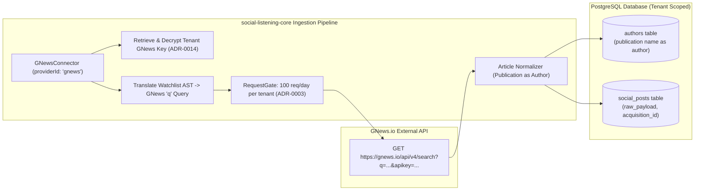

# Technical Design Specification (TDS) — RSS/News Connector: GNews API, Publication as Author

## 1. Document Control & Traceability Linkage

### 1.1 Metadata
| Attribute | Value |
|---|---|
| **Document Title** | TDS-0026: RSS/News Connector — GNews API & Publication-as-Author |
| **Document ID** | `TDS-0026` |
| **Feature Name** | GNews Ingestion Connector, Native Query Translation & Publication Modeling |
| **Version** | `1.0.0` |
| **Status** | Approved |
| **Author(s)** | Core Architecture Team |
| **Created Date** | 2026-09-04 |
| **Last Updated** | 2026-09-04 |
| **Governing Skill** | `social-listening-core/.claude/skills/provider-connector-framework/SKILL.md` |

### 1.2 Upstream & Downstream Traceability Matrix
| Artifact Type | Reference Identifier | Title / Link | Alignment Status |
|---|---|---|---|
| **Architecture Decision Record** | `ADR-0026` | [ADR-0026: RSS/News connector — GNews API](../../adr/0026-rss-news-connector-gnews-api-publication-as-author.md) | Invariant Source |
| **Business Requirements Doc** | `BRD-0026` | [BRD-0026: RSS News Connector GNews API Publication As Author](../Business-Requirements/BRD-0026-RSS-News-Connector-GNews-API-Publication-As-Author.md) | Fully Aligned |
| **Functional Design Doc** | `FDD-0026` | [FDD-0026: RSS News Connector GNews API Publication As Author](../Functional-Design/FDD-0026-RSS-News-Connector-GNews-API-Publication-As-Author.md) | Fully Aligned |
| **Governing User Story** | `Story 2.7` | [Epic 2: Ingestion Connectors and Rate Limits](../../user-stories/epic-2-ingestion-connectors-and-rate-limits.md#story-27--rssnews-connector--gnews-api-with-publication-as-author-modeling) | Acceptance Target |
| **Executable Contract Test** | `Story 2.7 Contract` | `contracts/epic-2/story-2.7.rss-news-connector.contract.test.ts` | 100% Passing |

---

## 2. System Context & Architecture Topology

### 2.1 Context Diagram


### 2.2 Architectural Boundaries & Invariants
- **Per-Tenant API Key Invariant:** Each tenant supplies and registers its own GNews API key (`authMode: 'apiKey'`). SocialEngage never provides a shared or pooled key.
- **Quota Boundary Invariant:** The free-tier ceiling of **100 requests per 24 hours** applies per tenant, tracked via `RequestGate` (ADR-0003).
- **Publication-as-Author Invariant:** GNews article responses carry no personal journalist bylines; the `authors` record models the *source news outlet / publication* (`source.name` / `source.id`), with `follower_count = NULL`.
- **Native Query Pushdown:** Watchlist boolean queries (`AND`, `OR`, `NOT`, quoted phrases) are translated directly into GNews search syntax (`"phrase" AND term NOT excluded`) to filter at the provider boundary.

---

## 3. Data Architecture & Persistence Design

### 3.1 GNews Normalized Article Structure (`social_posts.raw_payload`)
```json
{
  "id": "gnews-123456",
  "title": "Major Tech Innovation Unveiled",
  "description": "Summary of recent product announcement...",
  "content": "Full article text content...",
  "url": "https://news.example.com/article-123",
  "image": "https://news.example.com/image.jpg",
  "publishedAt": "2026-09-04T10:00:00Z",
  "source": {
    "name": "Tech Daily",
    "url": "https://news.example.com"
  }
}
```

### 3.2 Publication Author Model Mapping
```sql
INSERT INTO authors (
  tenant_id,
  platform_id,
  external_author_id,
  handle,
  display_name,
  is_verified,
  follower_count
) VALUES (
  $1,
  'gnews',
  'Tech Daily',
  'Tech Daily',
  'Tech Daily',
  false,
  NULL
) ON CONFLICT (tenant_id, platform_id, external_author_id) DO UPDATE
SET updated_at = NOW();
```

---

## 4. API, Interface & Integration Contract Design

### 4.1 Connector Implementation (`src/connectors/gnews/gnewsConnector.ts`)
```typescript
import { ProviderConnector, ConnectorExecutionContext, NormalizedPostBatch } from '../types';

export class GNewsConnector implements ProviderConnector {
  public readonly id = 'gnews';
  public readonly name = 'GNews API';
  public readonly authType = 'apiKey';
  public readonly deliveryMode = 'poll';

  public async validateCredential(context: ConnectorExecutionContext): Promise<{ valid: boolean }> {
    const apiKey = context.credential.apiKey;
    // Probe GNews search endpoint with minimal query
    const res = await fetch(`https://gnews.io/api/v4/search?q=test&max=1&apikey=${apiKey}`);
    return { valid: res.ok };
  }

  public async poll(
    context: ConnectorExecutionContext,
    cursor?: IngestionCursor
  ): Promise<NormalizedPostBatch> {
    // 1. Translate active watchlist query AST
    // 2. Fetch from GNews search endpoint
    // 3. Normalize JSON response
    // 4. Return NormalizedPostBatch
  }
}
```

### 4.2 Query Translation Rules
| AST Node | GNews Parameter Format | Example Translation |
|---|---|---|
| `AND(A, B)` | `A AND B` | `microsoft AND ai` |
| `OR(A, B)` | `A OR B` | `azure OR aws` |
| `NOT(A)` | `NOT A` | `cloud NOT private` |
| Quoted Phrase | `"phrase text"` | `"machine learning"` |

---

## 5. Rate Limiting, Concurrency & Flow Control

- **Rate Limit Window:** `RequestGate` enforces 100 requests per 86,400 seconds (24h sliding window).
- **Burst Protection:** Max 1 request every 5 seconds per tenant to avoid provider concurrency throttling.

---

## 6. Security, Identity & Credential Governance

- **Envelope Encryption:** GNews API keys are stored in `platform_credentials` encrypted with tenant-specific DEKs via Azure Key Vault (ADR-0014).
- **Non-Commercial Attestation:** UI connection flow (Story 6.3) displays the required GNews terms acknowledgment regarding free-tier non-commercial development use.

---

## 7. Error Handling, Resilience & Failure Classification

### 7.1 GNews API Error Mappings
| GNews Error Status | Error Message / Code | Classification | System Action |
|---|---|---|---|
| 401 Unauthorized | Invalid API key | `Credential` (Non-retryable) | Flag credential invalid; auto-disable connector |
| 403 Forbidden | Monthly / Daily limit reached | `RateLimit` (Retryable) | Enforce backoff until next UTC day window |
| 429 Too Many Requests | Rate limit exceeded | `RateLimit` (Retryable) | Backoff for 60 seconds |
| 500 / 503 Server Error | Upstream outage | `Transient` (Retryable) | Retry up to 3 times |

---

## 8. Testing & Contract Gate Plan

### 8.1 Contract Tests
Contract test file: `contracts/epic-2/story-2.7.rss-news-connector.contract.test.ts`.

| Test ID | Scenario | Verification Method |
|---|---|---|
| `TEST-GN-01` | Credential validation against GNews | Mock GNews 200 vs 401; assert `validateCredential` returns true and false accordingly. |
| `TEST-GN-02` | Publication as author normalization | Parse mock GNews JSON response; assert `Author` record is created for `source.name` with `follower_count = NULL`. |
| `TEST-GN-03` | Native query translation | Provide nested boolean AST; assert generated `q` parameter matches GNews query grammar. |
| `TEST-GN-04` | Per-tenant rate ceiling | Execute 100 requests under Tenant A; assert 101st request is queued or throttled by `RequestGate`. |

---

## 9. Component Skill (`SKILL.md`) Documentation Updates

Updates to `.claude/skills/provider-connector-framework/SKILL.md`:
- **GNews Provider Invariant:** Always route GNews requests through `RequestGate` with 100 req/day quota.
- **Publication Invariant:** Map article `source.name` to `authors.external_author_id`.

---

## 10. Observability, Metrics & Operational Telemetry

- `gnews_api_requests_total{tenant_id, status_code}` (counter)
- `gnews_quota_consumed_ratio{tenant_id}` (gauge: `requests_today / 100`)
- `gnews_articles_ingested_total{tenant_id}` (counter)

---

## 11. Migration, Rollout & Feature Gating

- Registration of `'gnews'` in `src/connectors/registry.ts`.

---

## 12. Technical Assumptions, Dependencies & Open Questions

### 12.1 Assumptions & Dependencies
- **[A-0026-1]** GNews API v4 retains JSON schema stability.
- **[D-0026-1]** Story 1.7 `platform_credentials` store for API key persistence.

### 12.2 Open Questions
- [ ] **[Q-0026-1]** *Commercial Tier Migration:* When moving beyond solo/dev testing, verify upgrade procedures to GNews paid tiers or alternatives (NewsData.io). *(Status: Deferred to commercial phase).*
