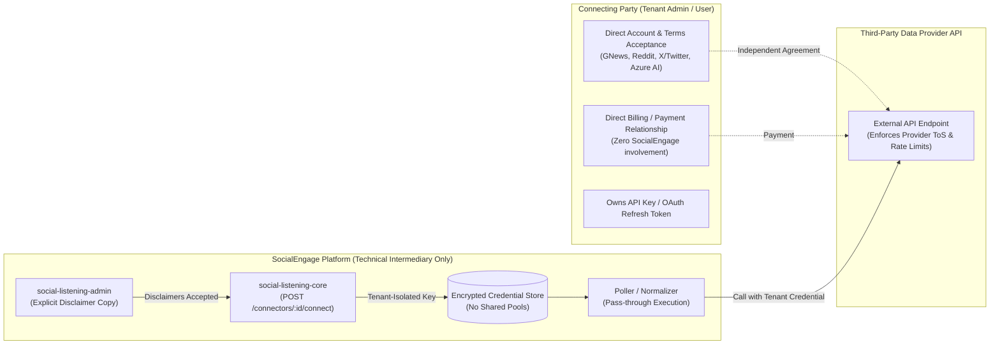

# Technical Design Specification (TDS) — Connector as Technical Intermediary, Not Contracting Party

## 1. Document Control & Traceability Linkage

### 1.1 Metadata
| Attribute | Value |
|---|---|
| **Document Title** | TDS-0027: Connector as Technical Intermediary, Not Contracting Party |
| **Document ID** | `TDS-0027` |
| **Feature Name** | Technical Pass-Through Architectural Standard & Non-Intermediary Constraint |
| **Version** | `1.0.0` |
| **Status** | Approved |
| **Author(s)** | Core Architecture Team |
| **Created Date** | 2026-09-04 |
| **Last Updated** | 2026-09-04 |
| **Governing Skill** | `social-listening-core/.claude/skills/provider-connector-framework/SKILL.md` |

### 1.2 Upstream & Downstream Traceability Matrix
| Artifact Type | Reference Identifier | Title / Link | Alignment Status |
|---|---|---|---|
| **Architecture Decision Record** | `ADR-0027` | [ADR-0027: Connector architecture is a technical intermediary only](../../adr/0027-connector-is-technical-intermediary-not-contracting-party.md) | Invariant Source |
| **Business Requirements Doc** | `BRD-0027` | [BRD-0027: Connector as Technical Intermediary Only](../Business-Requirements/BRD-0027-Connector-Is-Technical-Intermediary-Not-Contracting-Party.md) | Fully Aligned |
| **Functional Design Doc** | `FDD-0027` | [FDD-0027: Connector as Technical Intermediary Only](../Functional-Design/FDD-0027-Connector-Is-Technical-Intermediary-Not-Contracting-Party.md) | Fully Aligned |
| **Governing User Story** | `Category 1 No-Story ADR` | Governs Stories 1.7 (ADR-0034), 2.7 (ADR-0026), 6.3 (Epic 6) | Acceptance Baseline |
| **Executable Contract Tests** | `Connector Contracts` | `contracts/epic-1/story-1.7.connector-crud.contract.test.ts`, `contracts/epic-2/story-2.7.rss-news-connector.contract.test.ts` | 100% Passing |

---

## 2. System Context & Architecture Topology

### 2.1 Context Diagram


### 2.2 Architectural Boundaries & Invariants
- **Technical Pass-Through Invariant:** SocialEngage provides software protocol adapters (`ProviderConnector`) only. It does not act as a reseller, broker, or billing agent.
- **No Shared Pool Invariant:** SocialEngage never maintains or falls back to a platform-level shared API key or pooled quota. Every connector operation requires an active, envelope-encrypted credential registered by the connecting party.
- **No Pass-Through Billing Invariant:** SocialEngage does not invoice, mark up, or front payment for third-party API costs. The connecting party contracts and pays the provider directly.
- **Mandatory UI Disclaimer Invariant:** Any frontend interface collecting credentials (e.g. Story 6.3, Story 2.21, Story 2.22) must display unambiguous disclosure copy stating that the user is contracting directly with the provider under the provider's terms.

---

## 3. Data Architecture & Persistence Design

### 3.1 Schema Isolation Rules
- Credential records in `platform_credentials` must be strictly partitioned by `tenant_id` (and optionally `user_id` for Tier 3 user-bound credentials).
- The schema forbids any record where `tenant_id IS NULL` representing a "system-wide" or "global" fallback key for external data sources.

```sql
-- Architectural Constraint: No system-wide credential rows in platform_credentials
ALTER TABLE platform_credentials 
  ADD CONSTRAINT chk_tenant_required 
  CHECK (tenant_id IS NOT NULL);
```

---

## 4. API, Interface & Integration Contract Design

### 4.1 Connector Protocol Enforcement
In `social-listening-core/src/connectors/types.ts`:
- Connectors declare `authType` (`oauth2` or `apiKey`).
- Connectors never accept platform-level credentials; `poll()` and `validateApiKey()` strictly require a tenant-scoped credential context:

```typescript
export interface ConnectorExecutionContext {
  tenantId: string;
  userId?: string;
  credential: DecryptedCredential;
}

export interface ProviderConnector {
  readonly id: string;
  readonly name: string;
  readonly authType: 'oauth2' | 'apiKey' | 'none';
  
  validateCredential(context: ConnectorExecutionContext): Promise<CredentialValidationResult>;
  poll(context: ConnectorExecutionContext, state?: IngestionCursor): Promise<NormalizedPostBatch>;
}
```

### 4.2 Frontend Disclaimer Contract (Story 6.3 / Epic 6)
Every connector connection UI modal must require acknowledgment of the provider terms:
```typescript
export interface ConnectorConnectPayload {
  platformId: string;
  credential: Record<string, string>;
  termsAcknowledged: boolean; // Must be true, acknowledging direct relationship
}
```

---

## 5. Rate Limiting, Concurrency & Flow Control

- **Per-Tenant Quota Boundary:** Because credentials are held directly by each tenant, rate limits enforced by providers (e.g. GNews 100 req/day free tier) apply strictly per tenant.
- **Local Flow Control:** `RequestGate` (ADR-0003) models the external provider's per-account rate limits locally to prevent accidental account suspension by the provider.

---

## 6. Security, Identity & Credential Governance

- **Envelope Encryption (ADR-0014):** Tenant credentials are encrypted using tenant-specific or platform-managed Azure Key Vault DEKs before storage.
- **Zero Third-Party Account Liability:** SocialEngage developers or operators have no access to tenant-owned third-party account credentials or billing consoles.

---

## 7. Error Handling, Resilience & Failure Classification

### 7.1 Provider Account Error Mappings
| Provider Error | Classification (`ErrorKind`) | System Action | User Guidance |
|---|---|---|---|
| HTTP 401 Unauthorized / Invalid Key | `Permanent` | Disable connector run; flag credential invalid | Tenant admin must update API key in admin UI |
| HTTP 402 Payment Required | `Permanent` | Auto-disable connector with clear reason | Tenant must pay provider directly on provider portal |
| HTTP 403 Forbidden (ToS / Quota Exceeded) | `RateLimit` or `Permanent` | Enter backoff or suspend polling | Tenant must upgrade provider subscription directly |

---

## 8. Testing & Contract Gate Plan

### 8.1 Contract Tests
Verified across connector contracts (`story-1.7.connector-crud.contract.test.ts`, `story-2.7.rss-news-connector.contract.test.ts`):

| Test ID | Scenario | Verification Method |
|---|---|---|
| `TEST-INT-01` | Missing tenant credential rejects execution | Attempt connector poll without tenant credential; assert operation throws missing credential error without falling back to any global secret. |
| `TEST-INT-02` | Multi-tenant credential isolation | Tenant A and Tenant B configure distinct API keys for provider. Assert Tenant A's poll uses Key A and Tenant B's poll uses Key B. |
| `TEST-INT-03` | No credential pooling | Verify that exhausting Tenant A's quota has zero effect on Tenant B's `RequestGate` state. |

---

## 9. Component Skill (`SKILL.md`) Documentation Updates

Updates to `.claude/skills/provider-connector-framework/SKILL.md`:
- **Load-Bearing Constraint:** Never implement or propose shared credential pools across tenants.
- **Provider Candidacy Rule:** Only build connectors for providers whose published developer terms explicitly permit third-party software integration.
- **Billing Boundary:** Never integrate payment processing or automated subscription upgrades for third-party providers.

---

## 10. Observability, Metrics & Operational Telemetry

- Metric: `connector_execution_total{platform, tenant_id, status}`
- Metric: `connector_provider_error_total{platform, error_kind}`
- Invariant: Telemetry never records API key strings or authentication tokens.

---

## 11. Migration, Rollout & Feature Gating

- **Rollout Impact:** Standard design pattern applicable across all current and future connectors (RSS, GNews, Reddit, MediaWiki, Facebook, Instagram, LinkedIn, Brave, Bing).

---

## 12. Technical Assumptions, Dependencies & Open Questions

### 12.1 Assumptions & Dependencies
- **[A-0027-1]** Connecting parties possess legal capacity to accept third-party terms of service.
- **[D-0027-1]** Third-party APIs offer self-service API key or OAuth registration.

### 12.2 Open Questions
- [ ] **[Q-0027-1]** *Formal Platform Terms of Use:* Should SocialEngage deploy an explicit Terms of Use document during Phase 5 production-readiness detailing the intermediary boundary? *(Status: Open; tracked for Phase 5).*
