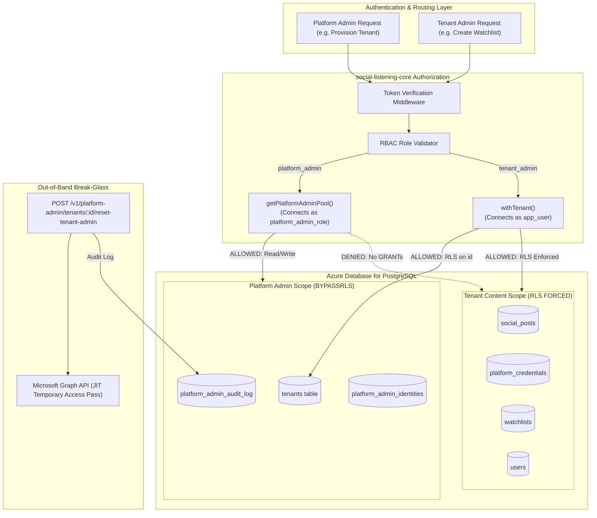

# Technical Design Specification (TDS) — Admin-Tier Design: Platform Admin RLS Exception

## 1. Document Control & Traceability Linkage

### 1.1 Metadata
| Attribute | Value |
|---|---|
| **Document Title** | TDS-0030: Admin-Tier Design: Platform Admin RLS Exception |
| **Document ID** | `TDS-0030` |
| **Feature Name** | Platform Admin BYPASSRLS Role & Tenant-Admin Application-Layer RBAC |
| **Version** | `1.0.0` |
| **Status** | Approved |
| **Author(s)** | Core Architecture Team |
| **Created Date** | 2026-09-04 |
| **Last Updated** | 2026-09-04 |
| **Governing Skill** | `social-listening-core/.claude/skills/platform-admin-access/SKILL.md` |

### 1.2 Upstream & Downstream Traceability Matrix
| Artifact Type | Reference Identifier | Title / Link | Alignment Status |
|---|---|---|---|
| **Architecture Decision Record** | `ADR-0030` | [ADR-0030: Admin-tier design — Platform Admin via BYPASSRLS](../../adr/0030-admin-tier-design-platform-admin-rls-exception.md) | Invariant Source |
| **Business Requirements Doc** | `BRD-0030` | [BRD-0030: Admin-Tier Design — Platform Admin RLS Exception](../Business-Requirements/BRD-0030-Admin-Tier-Design-Platform-Admin-RLS-Exception.md) | Fully Aligned |
| **Functional Design Doc** | `FDD-0030` | [FDD-0030: Admin-Tier Design — Platform Admin RLS Exception](../Functional-Design/FDD-0030-Admin-Tier-Design-Platform-Admin-RLS-Exception.md) | Fully Aligned |
| **Governing User Story** | `Story 5.7` | [Epic 5: Security, Isolation and Messaging](../../user-stories/epic-5-security-isolation-and-messaging.md#story-57--platform-admins-audited-narrowly-scoped-rls-bypass) | Acceptance Target |
| **Executable Contract Test** | `Story 5.7 Contract` | `contracts/epic-5/story-5.7.platform-admin-rls-bypass.contract.test.ts` | 100% Passing |

---

## 2. System Context & Architecture Topology

### 2.1 Context Diagram


### 2.2 Architectural Boundaries & Invariants
- **Dual Mechanism Invariant:**
  - **Tenant-Admin** has *zero* database-level bypasses. It uses the standard `app_user` database connection, standard `withTenant` context, and has elevated privileges enforced purely at the application layer.
  - **Platform Admin** operates via a dedicated non-superuser role `platform_admin_role` equipped with the Postgres `BYPASSRLS` attribute.
- **Strict Table Grant Boundary:** `platform_admin_role` is granted table permissions *only* on `tenants`, `platform_admin_identities`, and `platform_admin_audit_log`. It has zero `SELECT`, `INSERT`, `UPDATE`, or `DELETE` grants on tenant-content tables (`social_posts`, `authors`, `watchlists`, `platform_credentials`, `users`).
- **Provisioning-Only Invariant:** Platform Admin cannot query, browse, export, or modify any tenant's operational data.
- **Break-Glass Invariant:** The emergency recovery procedure is restricted strictly to resetting a Tenant-Admin's Entra credentials and issuing a Temporary Access Pass (TAP). It never grants access to tenant post content or encrypted API keys, and must be executed in two explicit steps (Request $\rightarrow$ Execution).
- **Mandatory Audit Trail:** Every write executed by Platform Admin is durably committed to `platform_admin_audit_log`.

---

## 3. Data Architecture & Persistence Design

### 3.1 DDL Definition: Role Provisioning & Grant Standard
```sql
-- Dedicated Platform Admin Role (Non-superuser, BYPASSRLS)
DO $$
BEGIN
  IF NOT EXISTS (SELECT 1 FROM pg_roles WHERE rolname = 'platform_admin_role') THEN
    CREATE ROLE platform_admin_role LOGIN PASSWORD 'platform_admin_password' BYPASSRLS;
  END IF;
END
$$;

-- Explicit Table Grants for Platform Admin
GRANT USAGE ON SCHEMA public TO platform_admin_role;
GRANT SELECT, INSERT, UPDATE, DELETE ON tenants TO platform_admin_role;
GRANT SELECT, INSERT, UPDATE, DELETE ON platform_admin_identities TO platform_admin_role;
GRANT SELECT, INSERT ON platform_admin_audit_log TO platform_admin_role;

-- Revoke all access to tenant content tables
REVOKE ALL ON social_posts, authors, watchlists, platform_credentials, users FROM platform_admin_role;
```

### 3.2 Audit Log Table Schema
```sql
CREATE TABLE platform_admin_audit_log (
  id UUID PRIMARY KEY DEFAULT gen_random_uuid(),
  actor_subject VARCHAR(255) NOT NULL,
  action VARCHAR(100) NOT NULL,
  target_tenant_id UUID REFERENCES tenants(id),
  target_resource VARCHAR(100),
  details JSONB NOT NULL DEFAULT '{}'::jsonb,
  created_at TIMESTAMPTZ NOT NULL DEFAULT NOW()
);

CREATE INDEX idx_pa_audit_tenant ON platform_admin_audit_log(target_tenant_id);
CREATE INDEX idx_pa_audit_actor ON platform_admin_audit_log(actor_subject);
```

---

## 4. API, Interface & Integration Contract Design

### 4.1 Connection Pool Separation
In `social-listening-core/src/db/pool.ts`:
```typescript
let platformAdminPool: Pool | null = null;

export function getPlatformAdminPool(): Pool {
  if (!platformAdminPool) {
    platformAdminPool = new Pool({
      host: process.env.PGHOST || 'localhost',
      port: parseInt(process.env.PGPORT || '5432', 10),
      database: process.env.PGDATABASE || 'socialengage_dev',
      user: process.env.PLATFORM_ADMIN_PGUSER || 'platform_admin_role',
      password: process.env.PLATFORM_ADMIN_PGPASSWORD || 'platform_admin_password',
      max: 5
    });
  }
  return platformAdminPool;
}
```

### 4.2 Break-Glass Two-Phase Execution Contract
1. **Initiate Reset Request:**
   - `POST /v1/platform-admin/tenants/:id/tenant-admin-resets`
   - Payload: `{ "targetUserId": "...", "reason": "Loss of MFA token" }`
   - Response: `201 Created` with `{ "requestId": "...", "status": "pending" }`.
2. **Execute Break-Glass Execution:**
   - `POST /v1/platform-admin/tenant-admin-resets/:requestId/execute`
   - Calls Microsoft Graph API out-of-band to generate temporary access pass.
   - Audits action without logging TAP secret value.
   - Response: `200 OK` with `{ "temporaryAccessPass": "...", "expiresAt": "..." }`.

---

## 5. Rate Limiting, Concurrency & Flow Control

- Platform Admin routes are protected by dedicated rate limiting (`RequestGate`) to prevent brute-force tenant enumeration or denial-of-service on provisioning endpoints.
- Break-glass endpoints enforce a strict ceiling: max 3 reset requests per tenant per 24 hours.

---

## 6. Security, Identity & Credential Governance

### 6.1 Privilege Matrix
| Surface | Platform Admin | Tenant Admin | Tenant User |
|---|---|---|---|
| `tenants` (Create / Suspend) | **READ / WRITE** | READ (Own tenant only via RLS) | READ (Own tenant only) |
| `social_posts` / `authors` | **NO ACCESS (SQL Error)** | READ (Tenant RLS) | READ (Tenant RLS) |
| `platform_credentials` | **NO ACCESS (SQL Error)** | READ / WRITE (Tenant RLS) | READ (User Tier 3 only) |
| Entra Tenant-Admin TAP Reset | **EXECUTE (Audited)** | NO ACCESS | NO ACCESS |

---

## 7. Error Handling, Resilience & Failure Classification

### 7.1 Security Boundary Enforcement
| Attempted Action | Enforcement Point | Observed Result | Error Code |
|---|---|---|---|
| Platform Admin queries `social_posts` | PostgreSQL Engine | Permission denied for table `social_posts` | `42501` (Forbidden) |
| Tenant Admin requests `platform_admin` endpoint | Auth Middleware | Role mismatch (`tenant_admin` != `platform_admin`) | `403 Forbidden` |
| Second execution of break-glass reset | Domain Logic | Request already completed | `409 Conflict` |

---

## 8. Testing & Contract Gate Plan

### 8.1 Contract Tests
Contract test file: `contracts/epic-5/story-5.7.platform-admin-rls-bypass.contract.test.ts`.

| Test ID | Scenario | Verification Method |
|---|---|---|
| `TEST-PA-01` | Platform Admin can query all tenants | Execute query against `tenants` via `platformAdminPool`; assert visibility across multiple distinct tenants. |
| `TEST-PA-02` | Platform Admin blocked from tenant content | Attempt `SELECT * FROM social_posts` using `platformAdminPool`; assert query fails with `permission denied` SQL exception. |
| `TEST-PA-03` | Audit log record generated on write | Perform tenant status update via platform admin route; assert row exists in `platform_admin_audit_log`. |
| `TEST-PA-04` | Break-glass TAP execution | Execute break-glass workflow; verify two-phase state machine transition and absence of credentials in audit log. |

---

## 9. Component Skill (`SKILL.md`) Documentation Updates

Updates to `.claude/skills/platform-admin-access/SKILL.md`:
- **Grant Boundary Invariant:** Never grant `platform_admin_role` permissions on content tables (`social_posts`, `watchlists`, `platform_credentials`).
- **Separate Identity Table:** Platform Admin identities must reside in `platform_admin_identities`, never in tenant-scoped `users`.
- **Break-Glass Rule:** Break-glass password reset is strictly for Tenant-Admin accounts; never invoke for standard tenant users.

---

## 10. Observability, Metrics & Operational Telemetry

- **Metrics:**
  - `platform_admin_actions_total{action, status}` (counter)
  - `platform_admin_break_glass_total{tenant_id}` (counter)
- **Security Audit Alerts:** Immediate alert triggered when any break-glass reset request is executed.

---

## 11. Migration, Rollout & Feature Gating

- Schema migration `migrations/0003_create_platform_admin_role.sql` provisions `platform_admin_role` and applies strict REVOKE/GRANT rules.

---

## 12. Technical Assumptions, Dependencies & Open Questions

### 12.1 Assumptions & Dependencies
- **[A-0030-1]** Postgres supports `BYPASSRLS` attribute on non-superuser roles.
- **[D-0030-1]** Microsoft Graph API application credentials configured for Break-Glass TAP generation.

### 12.2 Open Questions
- [ ] **[Q-0030-1]** *Graph API Permissions:* Verify minimal delegated vs. application permission scopes (`User.EnableDisableAccount.All`) required for JIT Temporary Access Pass generation. *(Status: Open; verified in production setup).*
