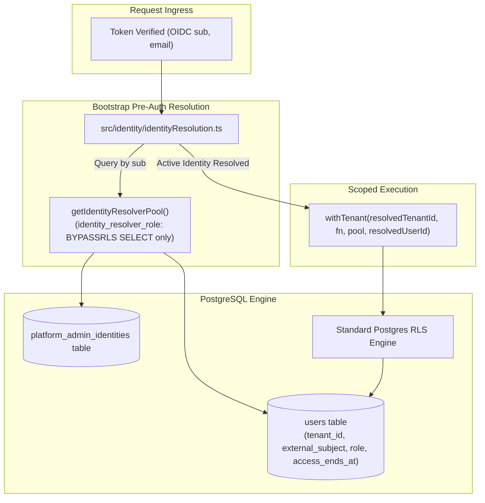

# Technical Design Specification (TDS) — Users Table Shape and RLS

## 1. Document Control & Traceability Linkage

### 1.1 Metadata
| Attribute | Value |
|---|---|
| **Document Title** | TDS-0032: Users Table Shape, RLS & Identity Resolution |
| **Document ID** | `TDS-0032` |
| **Feature Name** | User Entity Schema, Access Windowing & Pre-Auth Identity Resolution |
| **Version** | `1.0.0` |
| **Status** | Approved |
| **Author(s)** | Core Architecture Team |
| **Created Date** | 2026-09-04 |
| **Last Updated** | 2026-09-04 |
| **Governing Skill** | `social-listening-core/.claude/skills/users-table-schema/SKILL.md` |

### 1.2 Upstream & Downstream Traceability Matrix
| Artifact Type | Reference Identifier | Title / Link | Alignment Status |
|---|---|---|---|
| **Architecture Decision Record** | `ADR-0032` | [ADR-0032: `users` table shape, RLS, and identity resolution](../../adr/0032-users-table-shape-and-rls.md) | Invariant Source |
| **Business Requirements Doc** | `BRD-0032` | [BRD-0032: `users` Table Shape and RLS](../Business-Requirements/BRD-0032-Users-Table-Shape-And-RLS.md) | Fully Aligned |
| **Functional Design Doc** | `FDD-0032` | [FDD-0032: `users` Table Shape and RLS](../Functional-Design/FDD-0032-Users-Table-Shape-And-RLS.md) | Fully Aligned |
| **Governing User Story** | `Story 5.9` | [Epic 5: Security, Isolation and Messaging](../../user-stories/epic-5-security-isolation-and-messaging.md#story-59--users-table-shape-and-rls) | Acceptance Target |
| **Executable Contract Test** | `Story 5.9 Contract` | `contracts/epic-5/story-5.9.users-table-shape-and-rls.contract.test.ts` | 100% Passing |

---

## 2. System Context & Architecture Topology

### 2.1 Context Diagram


### 2.2 Architectural Boundaries & Invariants
- **Chicken-and-Egg Identity Resolution Invariant:** Before `app.tenant_id` can be set, the validated `sub` claim must be resolved to a `(tenant_id, user_id, role)`. This query uses a dedicated, least-privilege role (`identity_resolver_role`) granted `BYPASSRLS` and `SELECT` *only* on the minimal identity-mapping columns.
- **Tenant Isolation Invariant:** Once resolved, subsequent queries execute via standard `app_user` using `withTenant(tenant_id, ...)`, where standard RLS prevents any cross-tenant user record visibility.
- **Separate Platform Admin Entity:** Platform Admin accounts do not reside in `users` with a null `tenant_id`. They reside in `platform_admin_identities`.
- **Temporal Access Windowing (`access_ends_at`):** Account suspension is governed by a nullable timestamp `access_ends_at`. If `access_ends_at` is non-null and $\le \text{NOW()}$, the account is considered expired and requests are rejected with HTTP 403. Clearing or extending `access_ends_at` restores access immediately.

---

## 3. Data Architecture & Persistence Design

### 3.1 DDL Specification
```sql
CREATE TYPE user_role AS ENUM ('tenant_admin', 'tenant_user');
CREATE TYPE user_status AS ENUM ('invited', 'active');

CREATE TABLE users (
  id UUID PRIMARY KEY DEFAULT gen_random_uuid(),
  tenant_id UUID NOT NULL REFERENCES tenants(id) ON DELETE CASCADE,
  external_subject VARCHAR(255) UNIQUE,
  email VARCHAR(255) NOT NULL,
  display_name VARCHAR(255),
  role user_role NOT NULL DEFAULT 'tenant_user',
  status user_status NOT NULL DEFAULT 'invited',
  invited_at TIMESTAMPTZ NOT NULL DEFAULT NOW(),
  activated_at TIMESTAMPTZ,
  access_ends_at TIMESTAMPTZ,
  created_at TIMESTAMPTZ NOT NULL DEFAULT NOW(),
  updated_at TIMESTAMPTZ NOT NULL DEFAULT NOW()
);

CREATE INDEX idx_users_tenant_id ON users(tenant_id);
CREATE INDEX idx_users_external_subject ON users(external_subject);
CREATE UNIQUE INDEX idx_users_tenant_email ON users(tenant_id, email);

-- Enable & Force RLS
ALTER TABLE users ENABLE ROW LEVEL SECURITY;
ALTER TABLE users FORCE ROW LEVEL SECURITY;

-- Standard tenant isolation policy
DROP POLICY IF EXISTS tenant_isolation ON users;
CREATE POLICY tenant_isolation ON users
  FOR ALL
  USING (tenant_id = NULLIF(current_setting('app.tenant_id', true), '')::uuid)
  WITH CHECK (tenant_id = NULLIF(current_setting('app.tenant_id', true), '')::uuid);
```

### 3.2 Role Provisioning: `identity_resolver_role`
```sql
DO $$
BEGIN
  IF NOT EXISTS (SELECT 1 FROM pg_roles WHERE rolname = 'identity_resolver_role') THEN
    CREATE ROLE identity_resolver_role LOGIN PASSWORD 'id_resolver_password' BYPASSRLS;
  END IF;
END
$$;

GRANT USAGE ON SCHEMA public TO identity_resolver_role;
GRANT SELECT (id, tenant_id, role, status, external_subject, access_ends_at) ON users TO identity_resolver_role;
GRANT SELECT ON platform_admin_identities TO identity_resolver_role;
```

---

## 4. API, Interface & Integration Contract Design

### 4.1 TypeScript Identity Resolution Function (`src/identity/identityResolution.ts`)
```typescript
export interface ResolvedIdentity {
  kind: 'tenant_user' | 'platform_admin';
  userId: string;
  tenantId?: string;
  role: 'platform_admin' | 'tenant_admin' | 'tenant_user';
  email: string;
}

export async function resolveIdentityBySubject(
  subject: string,
  email?: string
): Promise<ResolvedIdentity | null> {
  const client = await getIdentityResolverPool().connect();
  try {
    // 1. Check platform admin identities
    const pa = await client.query(
      'SELECT id, email FROM platform_admin_identities WHERE external_subject = $1',
      [subject]
    );
    if (pa.rows.length > 0) {
      return {
        kind: 'platform_admin',
        userId: pa.rows[0].id,
        role: 'platform_admin',
        email: pa.rows[0].email
      };
    }

    // 2. Check standard users table
    const res = await client.query(
      `SELECT u.id, u.tenant_id, u.role, u.status, u.email, u.access_ends_at, t.status AS tenant_status
       FROM users u
       JOIN tenants t ON t.id = u.tenant_id
       WHERE u.external_subject = $1`,
      [subject]
    );

    if (res.rows.length === 0) {
      // Check for pending invited user match by email if first sign-in
      if (email) {
        return handleFirstTimeInviteLinking(client, subject, email);
      }
      return null;
    }

    const row = res.rows[0];

    // Check account expiry
    if (row.access_ends_at && new Date(row.access_ends_at) <= new Date()) {
      throw new Error('ACCESS_EXPIRED');
    }

    // Check tenant suspension
    if (row.tenant_status === 'suspended') {
      throw new Error('TENANT_SUSPENDED');
    }

    return {
      kind: 'tenant_user',
      userId: row.id,
      tenantId: row.tenant_id,
      role: row.role,
      email: row.email
    };
  } finally {
    client.release();
  }
}
```

---

## 5. Rate Limiting, Concurrency & Flow Control

- Identity resolution runs once per authenticated API request.
- Results are cached in an in-memory short-lived cache (TTL = 30 seconds) keyed by `external_subject` to prevent database connection exhaustion under rapid burst traffic from the same client.

---

## 6. Security, Identity & Credential Governance

- **Opaque Subject Storage:** `external_subject` stores only the opaque OIDC `sub` string. No password hashes, salt keys, or MFA secrets are stored in SocialEngage.
- **First-Time Linking Discipline:** An invited user row is linked to an Entra `sub` only if the verified email claim on the incoming token exactly matches `users.email`. Once set, `external_subject` is immutable.

---

## 7. Error Handling, Resilience & Failure Classification

### 7.1 Identity Resolution Exceptions
| Exception Condition | HTTP Code | Error Payload | Description |
|---|---|---|---|
| `ACCESS_EXPIRED` | 403 Forbidden | `{ "error": "AccessExpired", "message": "User access window has expired" }` | `access_ends_at` is past |
| `TENANT_SUSPENDED` | 403 Forbidden | `{ "error": "TenantSuspended", "message": "Organization access is suspended" }` | Tenant status is suspended |
| Unmapped Subject | 403 Forbidden | `{ "error": "UserNotInvited", "message": "No active tenant membership found" }` | Subject is not in database |

---

## 8. Testing & Contract Gate Plan

### 8.1 Contract Tests
Contract test file: `contracts/epic-5/story-5.9.users-table-shape-and-rls.contract.test.ts`.

| Test ID | Scenario | Verification Method |
|---|---|---|
| `TEST-USR-01` | Multi-tenant isolation on `users` | Seed users for Tenant A and Tenant B. Execute `SELECT * FROM users` under Tenant A session context; assert zero Tenant B rows returned. |
| `TEST-USR-02` | Pre-auth identity resolution bypass | Call `resolveIdentityBySubject` with valid `sub` using resolver pool; assert correct `(tenant_id, user_id, role)` returned. |
| `TEST-USR-03` | First-time invite linking | Seed user with `external_subject = NULL`, `status = 'invited'`. Resolve with matching email; assert `external_subject` is populated and status becomes `'active'`. |
| `TEST-USR-04` | Expired `access_ends_at` blocks resolution | Set `access_ends_at` to past date; assert resolution throws `ACCESS_EXPIRED`. |

---

## 9. Component Skill (`SKILL.md`) Documentation Updates

Updates to `.claude/skills/users-table-schema/SKILL.md`:
- **Identity Resolution Principle:** Identity resolution is the only approved SELECT bypass query across all tenant users.
- **Account Suspension Invariant:** Suspend users via `access_ends_at = NOW()`, not by deleting rows. Re-enable by setting `access_ends_at = NULL`.
- **Foreign Key Invariant:** All references to users must use `users.id`, never `external_subject`.

---

## 10. Observability, Metrics & Operational Telemetry

- **Metrics:**
  - `identity_resolution_duration_ms` (histogram)
  - `identity_resolution_cache_hit_ratio` (counter)
  - `user_access_expired_rejections_total` (counter)

---

## 11. Migration, Rollout & Feature Gating

- Migration `migrations/0005_create_users_table.sql` provisions table, indexes, and installs RLS policy.

---

## 12. Technical Assumptions, Dependencies & Open Questions

### 12.1 Assumptions & Dependencies
- **[A-0032-1]** OIDC `sub` claim is immutable and unique per external tenant.
- **[D-0032-1]** Story 5.8 `tenants` table exists.

### 12.2 Open Questions
- [ ] **[Q-0032-1]** *Role Granularity:* Should `tenant_user` be partitioned into `tenant_reader` vs `tenant_analyst` in a future phase? *(Status: Deferred per ADR-0032 §4 until distinct authorization permissions are required).*
