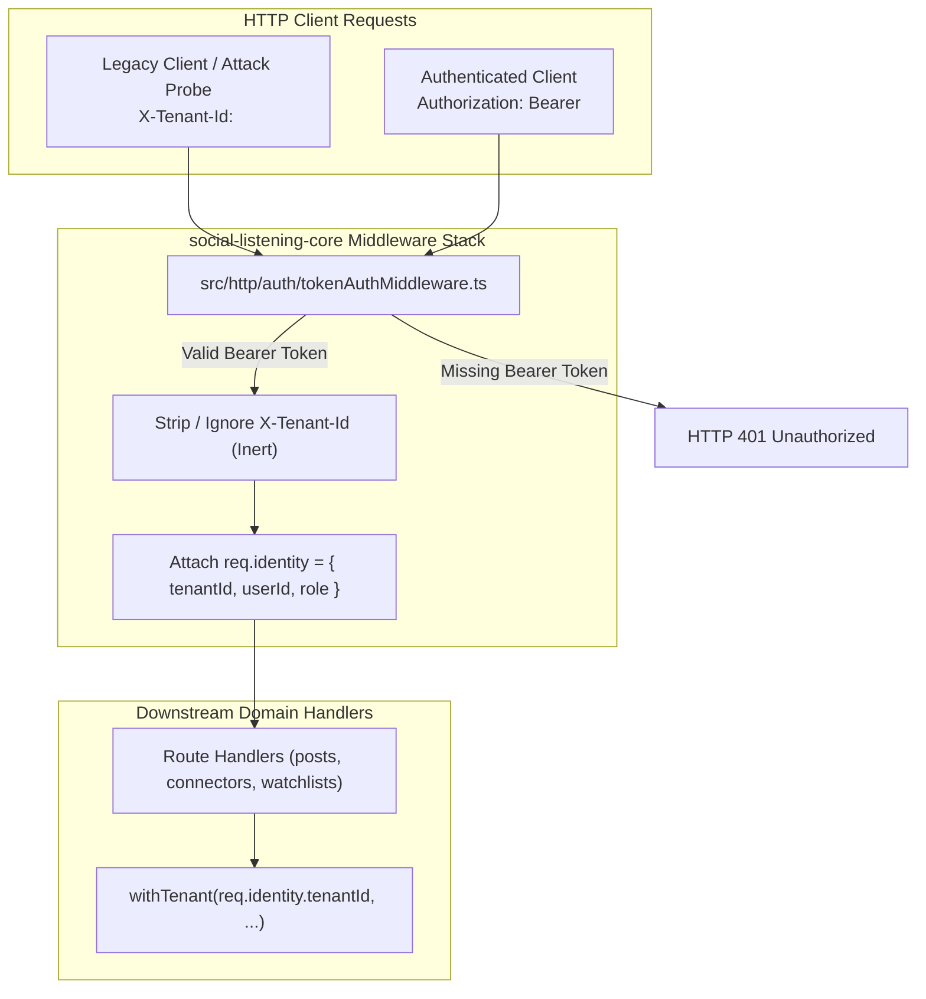

# Technical Design Specification (TDS) — Retire X-Tenant-Id Header Placeholder

## 1. Document Control & Traceability Linkage

### 1.1 Metadata
| Attribute | Value |
|---|---|
| **Document Title** | TDS-0033: Retire X-Tenant-Id Header Placeholder |
| **Document ID** | `TDS-0033` |
| **Feature Name** | Retirement of Client-Supplied Tenant Header in Favor of Verified Bearer Auth |
| **Version** | `1.0.0` |
| **Status** | Approved |
| **Author(s)** | Core Architecture Team |
| **Created Date** | 2026-09-04 |
| **Last Updated** | 2026-09-04 |
| **Governing Skill** | `social-listening-core/.claude/skills/tenant-auth-middleware/SKILL.md` |

### 1.2 Upstream & Downstream Traceability Matrix
| Artifact Type | Reference Identifier | Title / Link | Alignment Status |
|---|---|---|---|
| **Architecture Decision Record** | `ADR-0033` | [ADR-0033: Retire `X-Tenant-Id` as the tenant-identity trust mechanism](../../adr/0033-retire-x-tenant-id-header-placeholder.md) | Invariant Source |
| **Business Requirements Doc** | `BRD-0033` | [BRD-0033: Retire `X-Tenant-Id` Header Placeholder](../Business-Requirements/BRD-0033-Retire-X-Tenant-Id-Header-Placeholder.md) | Fully Aligned |
| **Functional Design Doc** | `FDD-0033` | [FDD-0033: Retire `X-Tenant-Id` Header Placeholder](../Functional-Design/FDD-0033-Retire-X-Tenant-Id-Header-Placeholder.md) | Fully Aligned |
| **Governing User Story** | `Story 5.10` | [Epic 5: Security, Isolation and Messaging](../../user-stories/epic-5-security-isolation-and-messaging.md) | Acceptance Target |
| **Executable Contract Test** | `Story 5.10 Contract` | `contracts/epic-5/story-5.10.retire-x-tenant-id-header.contract.test.ts` | 100% Passing |

---

## 2. System Context & Architecture Topology

### 2.1 Context Diagram


### 2.2 Architectural Boundaries & Invariants
- **Zero-Trust Client Header Invariant:** The HTTP header `X-Tenant-Id` is completely retired as a trust boundary. Any `X-Tenant-Id` header supplied in an incoming request must be silently ignored and never read, merged, or allowed to override the token's authenticated tenant.
- **Mandatory Bearer Auth Invariant:** Every protected `/v1` endpoint requires a valid `Authorization: Bearer <token>` header issued by Microsoft Entra External ID (ADR-0029).
- **Single-Seam Architecture:** Tenant identity resolution occurs in a single middleware layer at the root of `/v1`. Downstream function signatures (`withTenant`, stores, connectors) remain strictly untouched.
- **Test Seam Invariant:** For contract and unit tests, a dedicated non-production middleware `testClaimsBypassMiddleware` allows mocking verified token claims without requiring live external Entra network calls.

---

## 3. Data Architecture & Persistence Design

- No direct database schema modifications are required for header retirement.
- `req.identity.tenantId` is passed directly to `withTenant()`, which enforces PostgreSQL Row-Level Security via `set_config('app.tenant_id', tenantId, true)` (ADR-0015).

---

## 4. API, Interface & Integration Contract Design

### 4.1 Authentication Middleware Implementation (`src/http/auth/tokenAuthMiddleware.ts`)
```typescript
import { Request, Response, NextFunction } from 'express';
import { resolveIdentityBySubject } from '../../identity/identityResolution';
import { verifyEntraJwt } from './jwtVerification';

export async function tokenAuthMiddleware(
  req: Request,
  res: Response,
  next: NextFunction
): Promise<void> {
  // 1. Explicitly ignore X-Tenant-Id header
  delete req.headers['x-tenant-id'];

  // 2. Extract Authorization Bearer header
  const authHeader = req.headers.authorization;
  if (!authHeader || !authHeader.startsWith('Bearer ')) {
    res.status(401).json({
      error: 'Unauthorized',
      message: 'Missing or malformed Authorization header'
    });
    return;
  }

  const token = authHeader.slice(7);

  try {
    // 3. Verify token signature, issuer, and audience
    const claims = await verifyEntraJwt(token);

    // 4. Resolve sub to SocialEngage identity
    const identity = await resolveIdentityBySubject(claims.sub, claims.email);
    if (!identity) {
      res.status(403).json({
        error: 'Forbidden',
        message: 'No tenant membership linked to this identity'
      });
      return;
    }

    // 5. Attach identity to request
    (req as any).identity = identity;
    next();
  } catch (err: any) {
    if (err.message === 'ACCESS_EXPIRED') {
      res.status(403).json({ error: 'Forbidden', message: 'User access has expired' });
      return;
    }
    if (err.message === 'TENANT_SUSPENDED') {
      res.status(403).json({ error: 'Forbidden', message: 'Tenant is suspended' });
      return;
    }
    res.status(401).json({ error: 'Unauthorized', message: 'Invalid or expired token' });
  }
}
```

### 4.2 Test Harness Seam (`src/testUtils/testIdentityHeader.ts`)
For contract testing:
```typescript
export function createTestAuthHeader(identity: {
  sub: string;
  tenantId: string;
  userId: string;
  role: 'platform_admin' | 'tenant_admin' | 'tenant_user';
}): Record<string, string> {
  return {
    'x-test-claims': Buffer.from(JSON.stringify(identity)).toString('base64')
  };
}
```

---

## 5. Rate Limiting, Concurrency & Flow Control

- Unauthenticated probe traffic lacking a valid Bearer token is rejected at the HTTP gateway layer (`401 Unauthorized`) before invoking the PostgreSQL connection pool or `RequestGate`.

---

## 6. Security, Identity & Credential Governance

- **Spoofing Vector Elimination:** Attackers submitting arbitrary `X-Tenant-Id: <victim-tenant-uuid>` are completely neutered; the system never reads the header.
- **Audited Tenant Boundary:** The caller's tenant is derived immutably from the cryptographic signature of the Entra access token and PostgreSQL identity mapping.

---

## 7. Error Handling, Resilience & Failure Classification

### 7.1 Rejection Statuses
| Request Condition | HTTP Response | Diagnostic Log Reason |
|---|---|---|
| Request with `X-Tenant-Id` only (no Bearer) | `401 Unauthorized` | Missing Authorization Bearer token |
| Request with both Bearer and conflicting `X-Tenant-Id` | `200 OK` (processed under Bearer tenant) | `X-Tenant-Id` stripped; Bearer token authoritative |
| Malformed Bearer token string | `401 Unauthorized` | JWT decode error |

---

## 8. Testing & Contract Gate Plan

### 8.1 Contract Tests
Contract test file: `contracts/epic-5/story-5.10.retire-x-tenant-id-header.contract.test.ts`.

| Test ID | Scenario | Verification Method |
|---|---|---|
| `TEST-RET-01` | Request with only `X-Tenant-Id` rejected | Call `GET /v1/posts` with `X-Tenant-Id` header and no `Authorization` header; assert HTTP 401 Unauthorized. |
| `TEST-RET-02` | `X-Tenant-Id` spoofing ignored | Call protected endpoint with valid Bearer token for Tenant A and `X-Tenant-Id: Tenant B`; assert response returns data *only* for Tenant A. |
| `TEST-RET-03` | Valid Bearer token populates `req.identity` | Call protected endpoint with valid token; assert handler receives verified `tenantId` and `userId`. |

---

## 9. Component Skill (`SKILL.md`) Documentation Updates

Updates to `.claude/skills/tenant-auth-middleware/SKILL.md`:
- **Load-Bearing Rule:** Never reintroduce `req.header('X-Tenant-Id')` in any router or middleware.
- **Contract Rule:** Route handlers must extract tenant identity exclusively from `req.identity.tenantId`.
- **Test Standard:** In automated contract tests, use `createTestAuthHeader` to establish tenant context.

---

## 10. Observability, Metrics & Operational Telemetry

- **Metrics:**
  - `legacy_header_detections_total` (counter: increments when `X-Tenant-Id` header is stripped, alerting operators to outdated clients).
  - `auth_unauthorized_rejections_total` (counter).

---

## 11. Migration, Rollout & Feature Gating

- Coordinated atomic deployment between `social-listening-core` and `social-listening-admin`.
- `social-listening-admin` client updated to attach `Authorization: Bearer <msal_token>` via `core-client.ts`.

---

## 12. Technical Assumptions, Dependencies & Open Questions

### 12.1 Assumptions & Dependencies
- **[A-0033-1]** No external third-party API clients depend on `/v1` with `X-Tenant-Id`.
- **[D-0033-1]** Entra ID CIAM tenant configured and operational.

### 12.2 Open Questions
- [x] **[Q-0033-1]** *Test Harness Replacement:* Resolved via `testClaimsBypassMiddleware` and `createTestAuthHeader`.
- [x] **[Q-0033-2]** *Staged Transition:* Rejected in favor of direct atomic cutover per ADR-0033 §4.
