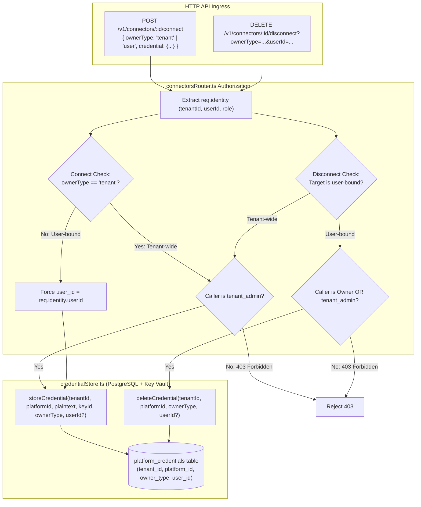

# Technical Design Specification (TDS) — Connector Connect/Disconnect CRUD Ownership Tier Aware

## 1. Document Control & Traceability Linkage

### 1.1 Metadata
| Attribute | Value |
|---|---|
| **Document Title** | TDS-0034: Connector Connect/Disconnect CRUD — Ownership-Tier-Aware |
| **Document ID** | `TDS-0034` |
| **Feature Name** | Tier-Discriminated Connector Registration & Scoped Revocation Protocol |
| **Version** | `1.0.0` |
| **Status** | Approved |
| **Author(s)** | Core Architecture Team |
| **Created Date** | 2026-09-04 |
| **Last Updated** | 2026-09-04 |
| **Governing Skill** | `social-listening-core/.claude/skills/credential-envelope-encryption/SKILL.md` |

### 1.2 Upstream & Downstream Traceability Matrix
| Artifact Type | Reference Identifier | Title / Link | Alignment Status |
|---|---|---|---|
| **Architecture Decision Record** | `ADR-0034` | [ADR-0034: Connector connect/disconnect CRUD — ownership-tier-aware](../../adr/0034-connector-connect-disconnect-crud-ownership-tier-aware.md) | Invariant Source |
| **Business Requirements Doc** | `BRD-0034` | [BRD-0034: Connector Connect Disconnect CRUD Ownership Tier Aware](../Business-Requirements/BRD-0034-Connector-Connect-Disconnect-CRUD-Ownership-Tier-Aware.md) | Fully Aligned |
| **Functional Design Doc** | `FDD-0034` | [FDD-0034: Connector Connect Disconnect CRUD Ownership Tier Aware](../Functional-Design/FDD-0034-Connector-Connect-Disconnect-CRUD-Ownership-Tier-Aware.md) | Fully Aligned |
| **Governing User Story** | `Story 1.7` | [Epic 1: Repository and API Foundation](../../user-stories/epic-1-repository-and-api-foundation.md#story-17--connector-connectdisconnect-crud-endpoints-ownership-tier-aware) | Acceptance Target |
| **Executable Contract Test** | `Story 1.7 Contract` | `contracts/epic-1/story-1.7.connector-crud.contract.test.ts` | 100% Passing |

---

## 2. System Context & Architecture Topology

### 2.1 Context Diagram


### 2.2 Architectural Boundaries & Invariants
- **Anti-Impersonation Invariant:** When `ownerType === 'user'`, the database column `user_id` is unconditionally assigned from `req.identity.userId`. Any client-supplied `user_id` in the request body is discarded.
- **Tenant-Admin Sole Authority for Tenant Credentials:** Creating or deleting `owner_type = 'tenant'` credentials requires `req.identity.role === 'tenant_admin'`.
- **Revocation Safety Valve:** A user-bound credential may be deleted by the owning user *or* by a `tenant_admin` of the same tenant (enabling offboarding cleanup for departed employees).
- **Targeted Deletion Invariant:** `deleteCredential()` must accept `(tenantId, platformId, ownerType, userId?)`. It must never execute blanket deletions of all platform credentials, which would accidentally wipe concurrent user-bound connections.

---

## 3. Data Architecture & Persistence Design

### 3.1 DDL Migration (`platform_credentials`)
```sql
ALTER TABLE platform_credentials
  ADD COLUMN owner_type VARCHAR(20) NOT NULL DEFAULT 'tenant' CHECK (owner_type IN ('tenant', 'user')),
  ADD COLUMN user_id UUID REFERENCES users(id) ON DELETE CASCADE;

ALTER TABLE platform_credentials
  ADD CONSTRAINT chk_platform_credentials_owner_shape
  CHECK (
    (owner_type = 'tenant' AND user_id IS NULL) OR
    (owner_type = 'user' AND user_id IS NOT NULL)
  );

-- Index for scoped credential lookups
CREATE INDEX idx_platform_credentials_scoped 
  ON platform_credentials(tenant_id, platform_id, owner_type, user_id);
```

---

## 4. API, Interface & Integration Contract Design

### 4.1 TypeScript Credential Store Contracts (`src/credentials/credentialStore.ts`)
```typescript
export interface StoreCredentialInput {
  tenantId: string;
  platformId: string;
  plaintextSecret: string;
  keyVaultKeyId: string;
  ownerType: 'tenant' | 'user';
  userId?: string;
}

export async function storeCredential(input: StoreCredentialInput): Promise<string>;

export async function deleteCredential(
  tenantId: string,
  platformId: string,
  ownerType: 'tenant' | 'user',
  userId?: string
): Promise<boolean>;

export async function getLatestCredentialId(
  tenantId: string,
  platformId: string,
  ownerType: 'tenant' | 'user',
  userId?: string
): Promise<string | null>;
```

### 4.2 HTTP API Routes (`connectorsRouter.ts`)
1. **Connect Endpoint:**
   - `POST /v1/connectors/:platformId/connect`
   - Headers: `Authorization: Bearer <token>`
   - Body:
     ```json
     {
       "ownerType": "tenant",
       "credential": { "apiKey": "..." }
     }
     ```
2. **Disconnect Endpoint:**
   - `DELETE /v1/connectors/:platformId/disconnect?ownerType=tenant`
   - Or for user: `DELETE /v1/connectors/:platformId/disconnect?ownerType=user&userId=...`

---

## 5. Rate Limiting, Concurrency & Flow Control

- Registration requests are throttled at 5 requests per minute per IP to mitigate credential guessing and brute-force token generation.

---

## 6. Security, Identity & Credential Governance

- **Envelope Encryption Standard:** All stored credentials utilize AES-256-GCM envelope encryption backed by Azure Key Vault (ADR-0014).
- **Access Control:** Normal users cannot view decrypted credentials or access other users' connection tokens.

---

## 7. Error Handling, Resilience & Failure Classification

### 7.1 Security & Validation Faults
| Fault Scenario | HTTP Code | Error Code | Message |
|---|---|---|---|
| User attempts tenant-wide connect | 403 Forbidden | `INSUFFICIENT_PERMISSIONS` | Only Tenant-Admins may create tenant-wide credentials |
| User attempts to disconnect another user's credential | 403 Forbidden | `CANNOT_DELETE_OTHER_USER_CREDENTIAL` | Only the owning user or a Tenant-Admin may revoke this credential |
| Credential invalid on probe | 400 Bad Request | `INVALID_CREDENTIAL` | Third-party provider rejected supplied API key / OAuth code |

---

## 8. Testing & Contract Gate Plan

### 8.1 Contract Tests
Contract test file: `contracts/epic-1/story-1.7.connector-crud.contract.test.ts`.

| Test ID | Scenario | Verification Method |
|---|---|---|
| `TEST-CRUD-01` | Tenant-admin creates tenant credential | Call `POST /connect` with `ownerType: 'tenant'` as `tenant_admin`; assert 201 Created and persisted with `owner_type = 'tenant'`. |
| `TEST-CRUD-02` | Normal user blocked from tenant connect | Call `POST /connect` with `ownerType: 'tenant'` as `tenant_user`; assert 403 Forbidden. |
| `TEST-CRUD-03` | User self-connects personal credential | Call `POST /connect` with `ownerType: 'user'`; assert credential is saved with caller's `user_id`. |
| `TEST-CRUD-04` | Scoped disconnect non-interference | Seed tenant-wide key and user-bound key for same platform. Disconnect tenant key; assert user key remains active. |

---

## 9. Component Skill (`SKILL.md`) Documentation Updates

Updates to `.claude/skills/credential-envelope-encryption/SKILL.md`:
- **Scoping Rule:** Always pass `ownerType` and `userId` when querying or deleting credentials.
- **Deletion Invariant:** Never execute unconditional `DELETE FROM platform_credentials WHERE platform_id = $1`.

---

## 10. Observability, Metrics & Operational Telemetry

- `connector_credentials_created_total{platform, owner_type}` (counter)
- `connector_credentials_revoked_total{platform, owner_type}` (counter)

---

## 11. Migration, Rollout & Feature Gating

- Migration `migrations/0009_add_owner_type_to_platform_credentials.sql` applies column additions and constraints.

---

## 12. Technical Assumptions, Dependencies & Open Questions

### 12.1 Assumptions & Dependencies
- **[A-0034-1]** Auth middleware populates verified `req.identity`.
- **[D-0034-1]** Story 5.9 `users` table exists.

### 12.2 Open Questions
- [x] **[Q-0034-1]** *Admin Revocation Authority:* Confirmed that Tenant-Admin can delete user-bound credentials for offboarding safety.
