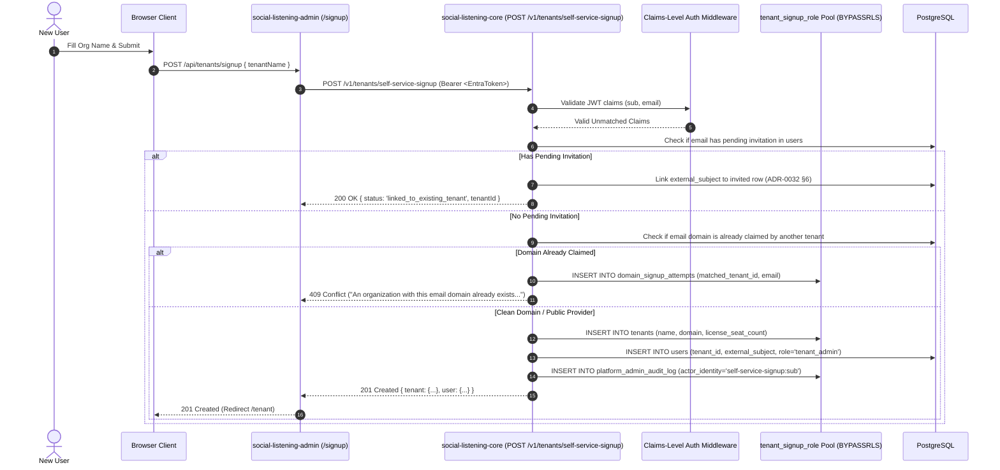

# Technical Design Specification (TDS) — Self-Service Tenant Sign-Up & First Tenant-Admin Provisioning

## 1. Document Control & Traceability Linkage

### 1.1 Metadata
| Attribute | Value |
|---|---|
| **Document Title** | TDS-0037: Self-Service Tenant Sign-Up — Unauthenticated Tenant Creation, Corporate Domain Claiming, Public Email Denylist & First Tenant-Admin Provisioning |
| **Document ID** | `TDS-0037` |
| **Feature Name** | Self-Service Tenant Onboarding & Domain Matching Engine |
| **Version** | `1.0.0` |
| **Status** | Approved |
| **Author(s)** | Core Architecture Team |
| **Created Date** | 2026-09-05 |
| **Last Updated** | 2026-09-05 |
| **Governing Skill** | `social-listening-core/.claude/skills/tenant-onboarding/SKILL.md` |

### 1.2 Upstream & Downstream Traceability Matrix
| Artifact Type | Reference Identifier | Title / Link | Alignment Status |
|---|---|---|---|
| **Architecture Decision Record** | `ADR-0037` | [ADR-0037: Self-service tenant sign-up](../../adr/0037-self-service-tenant-signup-and-first-tenant-admin-provisioning.md) | Invariant Source |
| **Business Requirements Doc** | `BRD-0037` | [BRD-0037: Self-Service Tenant Signup And First Tenant Admin Provisioning](../Business-Requirements/BRD-0037-Self-Service-Tenant-Signup-And-First-Tenant-Admin-Provisioning.md) | Fully Aligned |
| **Functional Design Doc** | `FDD-0037` | [FDD-0037: Self-Service Tenant Signup And First Tenant Admin Provisioning](../Functional-Design/FDD-0037-Self-Service-Tenant-Signup-And-First-Tenant-Admin-Provisioning.md) | Fully Aligned |
| **Governing User Story** | `Story 5.15` | [Epic 5: Security & Isolation](../../user-stories/epic-5-security-isolation-and-messaging.md#story-515--self-service-tenant-sign-up-backend-endpoint) | Acceptance Target |
| **Related User Stories** | `Story 5.16`, `Story 5.18`, `Story 6.7`, `Story 6.10` | Same-Domain Invite Assist, Signup Rate Limiting, UI Onboarding | Ecosystem Modules |
| **Related Architecture Decisions** | `ADR-0015`, `ADR-0030`, `ADR-0031`, `ADR-0040` | Tenant RLS, Admin Tier, Tenants Table Shape, Signup Abuse Prevention | Architectural Foundation |
| **Executable Contract Test** | `Story 5.15 Contract` | `social-listening-core/contracts/epic-5/story-5.15.self-service-tenant-signup.contract.test.ts` | 100% Passing |

---

## 2. System Context & Architecture Topology

### 2.1 Context Diagram


### 2.2 Architectural Boundaries & Invariants
- **Dedicated Database Role (`tenant_signup_role`):** Because self-service onboarding executes before a tenant ID exists, it cannot run under tenant-scoped RLS (`app_user`). The operation executes through a strictly constrained database role `tenant_signup_role` with `BYPASSRLS`, restricted to:
  - `INSERT` on `tenants`
  - Column-scoped `SELECT(id)` on `tenants` (for domain lookup)
  - `INSERT` on `domain_signup_attempts`
  - `INSERT` on `platform_admin_audit_log`
- **Claims-Level Auth Middleware:** Standard API routes reject unmatched callers with HTTP 403. `/v1/tenants/self-service-signup` is mounted behind a dedicated claims-level middleware that permits authenticated Entra users where `resolveIdentity() === null`.
- **Public Provider Denylist:** Common personal email domains (`gmail.com`, `outlook.com`, `yahoo.com`, `icloud.com`, etc.) are permitted to create tenants, but `tenants.domain` is stored as `null`, preventing accidental organization-level domain locking by a personal address.
- **Vague Anti-Enumeration Collision Error:** If a corporate domain is already claimed by an existing tenant, the API rejects the request with a generic message: *"An organization with this email domain already exists. Please ask your administrator for an invite."* It **never** reveals the target tenant's legal name, seat count, or administrator contacts.
- **Same-Domain Invite Assist Capture:** When a domain collision occurs, the system logs the event to `domain_signup_attempts`, allowing the existing tenant's administrator to view and invite the user via Story 5.16 / Story 6.10.

---

## 3. Data Architecture & Persistence Design

### 3.1 DDL Schema Definitions
Migration `0021_create_tenant_signup_role.sql` and `0022_create_domain_signup_attempts.sql`:

```sql
-- 1. Dedicated Signup Database Role
DO $$
BEGIN
  IF NOT EXISTS (SELECT FROM pg_roles WHERE rolname = 'tenant_signup_role') THEN
    CREATE ROLE tenant_signup_role LOGIN PASSWORD '...';
    ALTER ROLE tenant_signup_role BYPASSRLS;
  END IF;
END $$;

GRANT INSERT, SELECT (id, domain) ON tenants TO tenant_signup_role;
GRANT INSERT ON domain_signup_attempts TO tenant_signup_role;
GRANT INSERT ON platform_admin_audit_log TO tenant_signup_role;

-- 2. Domain Signup Attempts Table
CREATE TABLE IF NOT EXISTS domain_signup_attempts (
    id UUID PRIMARY KEY DEFAULT gen_random_uuid(),
    matched_tenant_id UUID NOT NULL REFERENCES tenants(id) ON DELETE CASCADE,
    email TEXT NOT NULL,
    attempted_at TIMESTAMPTZ NOT NULL DEFAULT NOW(),
    resolved_at TIMESTAMPTZ,
    status TEXT NOT NULL DEFAULT 'pending' CHECK (status IN ('pending', 'invited', 'dismissed'))
);

ALTER TABLE domain_signup_attempts ENABLE ROW LEVEL SECURITY;
CREATE POLICY domain_signup_attempts_tenant_isolation ON domain_signup_attempts
    FOR ALL USING (matched_tenant_id = current_setting('app.current_tenant_id', true)::uuid);

CREATE INDEX IF NOT EXISTS idx_domain_signup_attempts_lookup 
    ON domain_signup_attempts (matched_tenant_id, status, attempted_at DESC);
```

---

## 4. Component Design & Detailed Processing Logic

### 4.1 Public Email Denylist
Defined in `social-listening-core/src/tenants/selfServiceSignup.ts`:

```typescript
export const PUBLIC_EMAIL_DOMAINS = new Set([
  'gmail.com',
  'googlemail.com',
  'yahoo.com',
  'hotmail.com',
  'outlook.com',
  'live.com',
  'icloud.com',
  'me.com',
  'mac.com',
  'aol.com',
  'proton.me',
  'protonmail.com',
]);

export function extractCorporateDomain(email: string): string | null {
  const parts = email.toLowerCase().split('@');
  if (parts.length !== 2) return null;
  const domain = parts[1].trim();
  return PUBLIC_EMAIL_DOMAINS.has(domain) ? null : domain;
}
```

---

## 5. Interface & Contract Specifications

### 5.1 Endpoint Specification
`POST /v1/tenants/self-service-signup`

- **Headers:** `Authorization: Bearer <valid_entra_token>`
- **Request Body:**
```json
{
  "tenantName": "Acme Global Dynamics"
}
```
- **Response Format (201 Created):**
```json
{
  "status": "created",
  "tenant": {
    "id": "e492b490-4821-419b-a912-4c2819842104",
    "name": "Acme Global Dynamics",
    "domain": "acmeglobal.com",
    "licenseSeatCount": 10
  },
  "user": {
    "id": "usr-9102482a-9214-4123-8124-129481249812",
    "email": "sarah@acmeglobal.com",
    "role": "tenant_admin"
  }
}
```

---

## 6. Security, Tenancy & Isolation Model
- **Least-Privilege Principle:** `tenant_signup_role` has zero `UPDATE` or `DELETE` permissions on `tenants` and cannot `SELECT` sensitive tenant columns (such as `license_seat_count` or API settings).
- **Audit Immutability:** Successful signups immediately append an audit record to `platform_admin_audit_log` under the actor identity `self-service-signup:<sub>`.

---

## 7. Performance, Scalability & Resource Caps
- **Transactional Provisioning:** The tenant creation and first `tenant_admin` user insertion execute within a single isolated atomic transaction, taking $< 40\text{ms}$.

---

## 8. Resilience, Recovery & Failure Semantics
- **Collision Rollback:** If the `users` table insertion collides on a pre-existing `external_subject`, the transaction rolls back cleanly, logging the diagnostic error without leaving orphaned tenant records.

---

## 9. Observability, Telemetry & Auditability
- Emits security logs:
  - `tenant_self_service_signup_success{tenant_id, domain}`
  - `tenant_self_service_signup_domain_collision{domain}`

---

## 10. Migration, Compatibility & Rollback Strategy
- Uses additive migrations `0021` and `0022`. Backward-compatible with platform-admin tenant provisioning.

---

## 11. Verification, Testing & Quality Assurance
- **Story 5.15 Contract:** `social-listening-core/contracts/epic-5/story-5.15.self-service-tenant-signup.contract.test.ts`
  - AC1: Provisions tenant + first `tenant_admin` user for unlinked caller.
  - AC2: Existing invited user is linked to existing tenant instead of creating new.
  - AC3: Existing active tenant member is rejected with 409 Conflict.
  - AC4: Public email domains store `domain: null`.
  - AC6: Claimed domain collision returns non-org-revealing error and logs attempt.
  - AC8: Writes audit log entry to `platform_admin_audit_log`.

---

## 12. Open Questions & Future Enhancements

- [x] ~~**[Q-0037-1]** **Public provider exclusion.**~~ Decided in ADR-0037: Allowed to sign up with `domain = null`.
- [x] ~~**[Q-0037-2]** **Domain collision behavior.**~~ Decided in ADR-0037: Generic error message + `domain_signup_attempts` row.
- [ ] **[Q-0037-3]** **Automated DNS domain verification.** Supporting automatic domain verification via DNS TXT records before granting corporate domain claiming.
