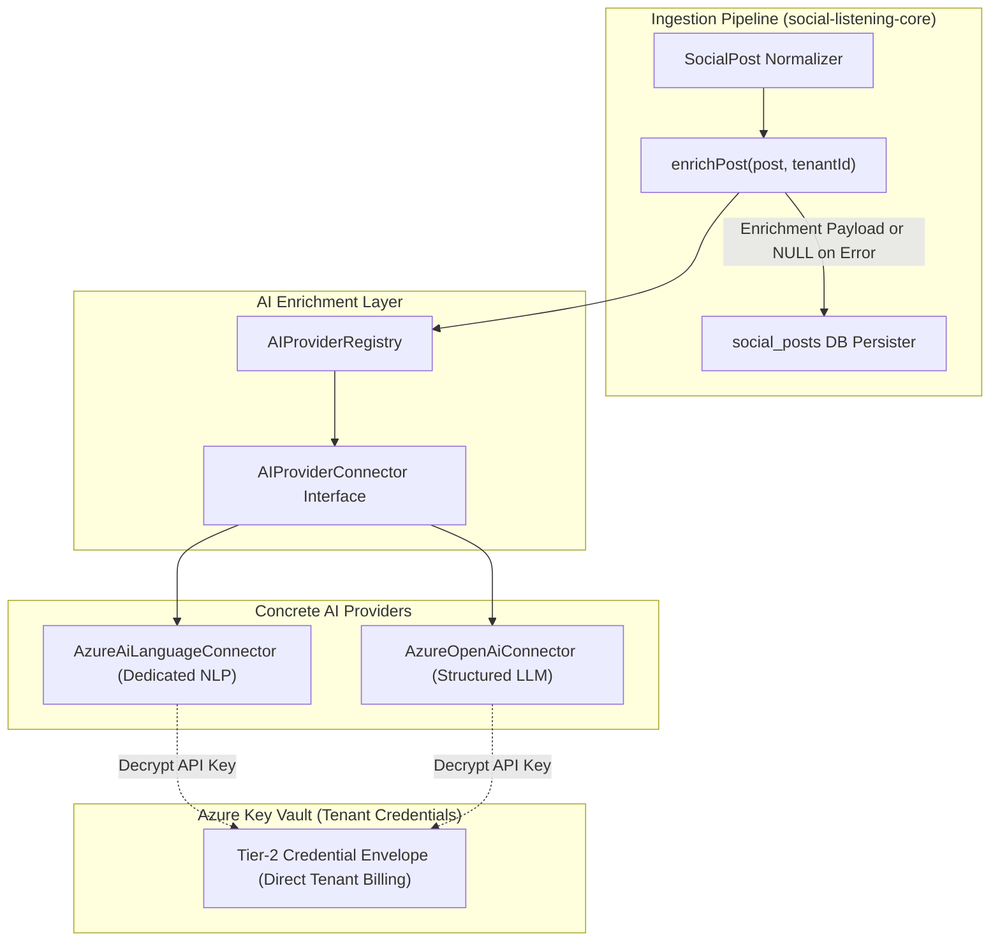

# Technical Design Specification (TDS) — AI Enrichment Provider Selection

## 1. Document Control & Traceability Linkage

### 1.1 Metadata
| Attribute | Value |
|---|---|
| **Document Title** | TDS-0038: AI Enrichment Provider Selection — Azure AI Language & Azure OpenAI Swappable Connectors |
| **Document ID** | `TDS-0038` |
| **Feature Name** | Ingestion Post AI Enrichment Pipeline & Dual-Provider Architecture |
| **Version** | `1.0.0` |
| **Status** | Approved |
| **Author(s)** | Core Architecture Team |
| **Created Date** | 2026-09-05 |
| **Last Updated** | 2026-09-05 |
| **Governing Skill** | `social-listening-core/.claude/skills/ai-enrichment/SKILL.md` |

### 1.2 Upstream & Downstream Traceability Matrix
| Artifact Type | Reference Identifier | Title / Link | Alignment Status |
|---|---|---|---|
| **Architecture Decision Record** | `ADR-0038` | [ADR-0038: AI Enrichment Provider Selection](../../adr/0038-ai-enrichment-provider-selection-azure-ai-language-first-llm-structured-extraction-named-second-candidate.md) | Invariant Source |
| **Business Requirements Doc** | `BRD-0038` | [BRD-0038: AI Enrichment Provider Selection](../Business-Requirements/BRD-0038-AI-Enrichment-Provider-Selection.md) | Fully Aligned |
| **Functional Design Doc** | `FDD-0038` | [FDD-0038: AI Enrichment Provider Selection](../Functional-Design/FDD-0038-AI-Enrichment-Provider-Selection.md) | Fully Aligned |
| **Governing User Story** | `Story 2.8` | [Epic 2: Ingestion & Rate Limits](../../user-stories/epic-2-ingestion-connectors-and-rate-limits.md#story-28--concrete-ai-enrichment-provider-connector-azure-ai-language) | Acceptance Target |
| **Related User Stories** | `Story 2.9`, `Story 2.16`, `Story 2.17` | Second AI Provider, Error Handling, Summary Enrichment | Architectural Family |
| **Related Architecture Decisions** | `ADR-0002`, `ADR-0014`, `ADR-0027`, `ADR-0028` | Connector Pattern, Credential Envelope, Technical Intermediary, Tier-2 Scoping | Architectural Foundations |
| **Executable Contract Tests** | `Story 2.8 & 2.9 Contracts` | `social-listening-core/contracts/epic-2/story-2.8.azure-ai-language-connector.contract.test.ts`<br>`social-listening-core/contracts/epic-2/story-2.9.ai-provider-connector.contract.test.ts` | 100% Passing |

---

## 2. System Context & Architecture Topology

### 2.1 Context Diagram


### 2.2 Architectural Boundaries & Invariants
- **Non-Blocking Ingestion Invariant:** AI enrichment is strictly best-effort and additive. If the external AI service times out, rate-limits (HTTP 429), or rejects a malformed document, the ingestion pipeline **must never crash or drop the post**. The post is stored with `enrichment = NULL`, and a classified operational log event is recorded.
- **Strict Tier-2 Credential Isolation:** SocialEngage is a technical pass-through (ADR-0027/0028). The tenant directly holds their own Azure subscription and API credentials. SocialEngage never maintains a shared platform subscription or acts as a billing intermediary.
- **Provider Agnostic Contract:** The `AIProviderConnector` interface guarantees swappability. Switching between `AzureAiLanguageConnector` and `AzureOpenAiConnector` requires zero core pipeline modifications.
- **Structured Schema Conformance:** Output conforms strictly to `AnalyzeResult` (`sentiment: 'positive' | 'neutral' | 'negative' | 'mixed'`, `sentimentScores: { positive, neutral, negative }`, `keyPhrases: string[]`, `entities: Entity[]`, `summary: string`, `detectedLanguage: string`).

---

## 3. Data Architecture & Persistence Design

### 3.1 JSONB Schema Definition in `social_posts`
```sql
-- Stored in social_posts.enrichment (JSONB)
{
  "sentiment": "positive",
  "sentimentScores": {
    "positive": 0.88,
    "neutral": 0.08,
    "negative": 0.04
  },
  "overallConfidence": 0.88,
  "keyPhrases": ["cloud architecture", "kubernetes", "data governance"],
  "entities": [
    {
      "text": "Microsoft",
      "category": "Organization",
      "confidenceScore": 0.99
    }
  ],
  "summary": "Discussion of enterprise cloud architecture and governance practices.",
  "detectedLanguage": "en",
  "provider": "azure-ai-language",
  "enrichedAt": "2026-09-05T15:30:00.000Z"
}
```

### 3.2 TypeScript Contracts
`social-listening-core/src/ai/types.ts`:
```typescript
export interface Entity {
  text: string;
  category: string;
  subCategory?: string;
  confidenceScore: number;
}

export interface SentimentScores {
  positive: number;
  neutral: number;
  negative: number;
}

export interface AnalyzeResult {
  sentiment: 'positive' | 'neutral' | 'negative' | 'mixed';
  sentimentScores: SentimentScores;
  overallConfidence: number;
  keyPhrases: string[];
  entities: Entity[];
  summary?: string;
  detectedLanguage: string;
  provider: 'azure-ai-language' | 'azure-openai';
}

export interface AIProviderConnector {
  readonly providerId: string;
  analyze(text: string, options?: { language?: string }): Promise<AnalyzeResult>;
  probeHealth(): Promise<{ healthy: boolean; latencyMs: number }>;
}
```

---

## 4. Application Logic & Workflows

### 4.1 Resilient Enrichment Wrapper (`enrichPost.ts`)
```typescript
export async function enrichPost(
  text: string,
  tenantId: string,
  connector: AIProviderConnector
): Promise<AnalyzeResult | null> {
  if (!text || text.trim().length === 0) {
    return null;
  }

  try {
    const result = await connector.analyze(text);
    return result;
  } catch (error: any) {
    // Never propagate error to caller; log classified error and return null
    logger.warn('AI enrichment failed for post; persisting un-enriched', {
      tenantId,
      provider: connector.providerId,
      errorKind: classifyError(error),
      message: error.message,
    });
    return null;
  }
}
```

---

## 5. Interface & API Contracts

### 5.1 Internal Connector Interface
| Method | Input | Output | Error Policy |
|---|---|---|---|
| `analyze(text, options)` | Post string, optional language hint | `Promise<AnalyzeResult>` | Maps 429 to `RATE_LIMITED`, 400 to `INVALID_DOCUMENT`, 5xx to `UPSTREAM_ERROR` |
| `probeHealth()` | Void | `{ healthy: boolean, latencyMs: number }` | Pings provider endpoint with lightweight echo text |

---

## 6. Security, Tenancy & Isolation Model
- **Credential Storage:** Stored encrypted via AES-256-GCM in PostgreSQL using tenant-scoped DEKs managed by Azure Key Vault.
- **Zero Cross-Tenant Key Leaks:** Connection pools fetch tenant credentials just-in-time and zero memory buffers immediately after HTTP client invocation.

---

## 7. Performance, Scalability & Resource Caps
- **Timeout Ceiling:** Single document analysis enforces a hard 4-second HTTP timeout. Slow responses abort to protect ingestion pipeline throughput.
- **Character Truncation:** Inputs exceeding 5,000 characters are safely truncated to avoid unexpected Azure text-record multi-billing.

---

## 8. Resilience, Recovery & Failure Semantics
- **Circuit Breaker:** 5 consecutive timeouts or 5xx errors from the AI provider trip a circuit breaker for 60 seconds, bypassing downstream calls and allowing fast-path ingestion.

---

## 9. Observability, Telemetry & Auditability
- **Metrics Tracked:**
  - `ai_enrichment_requests_total{provider, status}`
  - `ai_enrichment_duration_ms{provider}`
  - `ai_enrichment_failures_total{provider, error_kind}`

---

## 10. Migration, Compatibility & Rollback Strategy
- **Swappability Rollout:** Tenant settings allow selecting the active AI provider (`azure-ai-language` or `azure-openai`) via `tenants.settings->>'ai_provider'`.

---

## 11. Verification, Testing & Quality Assurance
- **Executable Contract Tests:**
  - `social-listening-core/contracts/epic-2/story-2.8.azure-ai-language-connector.contract.test.ts`:
    - (1) Proves connector normalizes multi-capability response into `AnalyzeResult`.
    - (2) Verifies rejection when tenant credential is missing.
    - (3) Proves graceful null handling on rejected documents.
  - `social-listening-core/contracts/epic-2/story-2.9.ai-provider-connector.contract.test.ts`:
    - (1) Proves `AzureOpenAiConnector` implements identical `AIProviderConnector` contract.

---

## 12. Open Questions & Future Enhancements

- [ ] **[Q-0038-1]** **Azure AI Language Volume Pricing:** Verifying the live S-tier rate beyond the initial 5,000 free monthly text records.
- [x] ~~**[Q-0038-2]** **Model Selection:** Resolved in favor of `gpt-4o-mini` for the LLM connector.~~
- [ ] **[Q-0038-5]** **GDPR Third-Party Processing:** Ensuring tenant DPA schedules explicitly enumerate Azure AI Language cognitive processing.
- [ ] **[Q-0038-6]** **Probability Calibration Alignment:** Harmonizing self-reported LLM confidence scores with dedicated NLP probability outputs.
