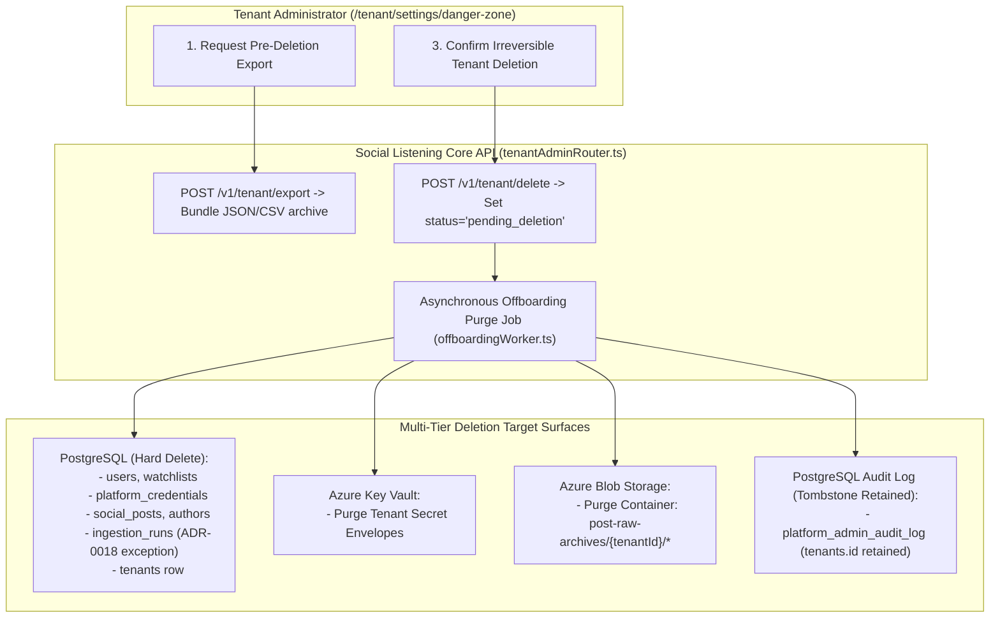

# Technical Design Specification (TDS) — Tenant Offboarding Data Lifecycle: Export and Deletion

## 1. Document Control & Traceability Linkage

### 1.1 Metadata
| Attribute | Value |
|---|---|
| **Document Title** | TDS-0039: Tenant Offboarding Data Lifecycle — Export Before Deletion and Storage Purge Engine |
| **Document ID** | `TDS-0039` |
| **Feature Name** | Tenant Self-Service Offboarding, Pre-Deletion Export & Multi-Tier Data Purge |
| **Version** | `1.0.0` |
| **Status** | Approved |
| **Author(s)** | Core Architecture Team |
| **Created Date** | 2026-09-04 |
| **Last Updated** | 2026-09-04 |
| **Governing Skill** | `social-listening-core/.claude/skills/self-service-tenant-deletion/SKILL.md` |

### 1.2 Upstream & Downstream Traceability Matrix
| Artifact Type | Reference Identifier | Title / Link | Alignment Status |
|---|---|---|---|
| **Architecture Decision Record** | `ADR-0039` | [ADR-0039: Tenant offboarding data lifecycle](../../adr/0039-tenant-offboarding-data-lifecycle-export-and-deletion.md) | Invariant Source |
| **Architecture Decision Record** | `ADR-0043` | [ADR-0043: Self-service tenant-initiated deletion](../../adr/0043-self-service-tenant-initiated-deletion.md) | Authority Supersession |
| **Business Requirements Doc** | `BRD-0039` | [BRD-0039: Tenant Offboarding Data Lifecycle Export And Deletion](../Business-Requirements/BRD-0039-Tenant-Offboarding-Data-Lifecycle-Export-And-Deletion.md) | Fully Aligned |
| **Functional Design Doc** | `FDD-0039` | [FDD-0039: Tenant Offboarding Data Lifecycle Export And Deletion](../Functional-Design/FDD-0039-Tenant-Offboarding-Data-Lifecycle-Export-And-Deletion.md) | Fully Aligned |
| **Governing User Story** | `Story 3.7` | [Epic 3: Data Model, Storage, and Archival](../../user-stories/epic-3-data-model-storage-and-archival.md#story-37--tenant-data-export-prior-to-offboarding) | Export Specification |
| **Related User Story** | `Story 3.8` | [Epic 3: Data Model, Storage, and Archival](../../user-stories/epic-3-data-model-storage-and-archival.md#story-38--self-service-tenant-initiated-account-deletion) | Deletion Execution Target |
| **Executable Contract Test** | `Story 3.8 Contract` | `contracts/epic-3/story-3.8.self-service-tenant-initiated-deletion.contract.test.ts` | 100% Passing |

---

## 2. System Context & Architecture Topology

### 2.1 Context Diagram


### 2.2 Architectural Boundaries & Invariants
- **Sole Authority: Tenant-Admin Self-Service (ADR-0043 Supersession):** Tenant deletion is triggered *strictly* by an authenticated `tenant_admin` for their own tenant. Platform Admin is strictly barred from deleting or modifying tenant-content tables directly, upholding the zero-content-access boundary (ADR-0030).
- **Pre-Deletion Data Portability Guarantee:** Tenant administrators can generate a full structured export of all tenant assets (`social_posts`, `authors`, `watchlists`, `ingestion_runs`) prior to deletion.
- **Complete Multi-Tier Purge:**
  - **PostgreSQL:** `users`, `watchlists`, `platform_credentials`, `social_posts`, `authors`, and `ingestion_runs` are hard-deleted.
  - **Azure Key Vault:** Associated encryption keys and OAuth tokens are permanently deleted.
  - **Azure Blob Storage:** All archived raw payload JSON blobs under `post-raw-archives/{tenantId}/` are purged.
- **Audit-Anchor Exception to ADR-0018:** While ADR-0018 mandates that `ingestion_runs` are archived and never hard-deleted during active operations, offboarding completely removes the tenant's `ingestion_runs` because all referencing `social_posts` rows are deleted simultaneously.
- **Audit Tombstone Preservation:** Rows in `platform_admin_audit_log` are preserved with the deleted `tenant_id` string as an immutable historical record.

---

## 3. Data Architecture & Persistence Design

### 3.1 Tenant Deletion Cascade Sequence
```sql
-- Executed inside tenant-scoped background transaction
DELETE FROM social_posts WHERE tenant_id = $1;
DELETE FROM authors WHERE tenant_id = $1;
DELETE FROM watchlists WHERE tenant_id = $1;
DELETE FROM platform_credentials WHERE tenant_id = $1;
DELETE FROM connector_activations WHERE tenant_id = $1;
DELETE FROM connector_user_activations WHERE tenant_id = $1;
DELETE FROM ingestion_runs WHERE tenant_id = $1;
DELETE FROM users WHERE tenant_id = $1;

-- Finally remove the tenant anchor itself
DELETE FROM tenants WHERE id = $1;
```

---

## 4. API, Interface & Integration Contract Design

### 4.1 Export & Deletion Endpoints Contract
```typescript
// POST /v1/tenant/export
export interface TenantExportResponse {
  exportId: string;
  status: 'completed';
  downloadUrl: string; // Pre-signed SAS URL valid for 24h
  expiresAt: string;
}

// POST /v1/tenant/delete
export interface TenantDeletionRequest {
  confirmationText: string; // Must equal tenant.name
  adminPassword?: string;
}

export interface TenantDeletionResponse {
  tenantId: string;
  status: 'pending_deletion';
  scheduledPurgeAt: string;
}
```

---

## 5. Rate Limiting, Concurrency & Flow Control

- **Asynchronous Batching:** Deletion executes in the background across table partitions to prevent table locking on shared databases.
- **Deletion Lockout:** When a tenant enters `status = 'pending_deletion'`, `tenantAuthMiddleware` immediately rejects incoming API requests with `403 Forbidden` (`TENANT_DEACTIVATED`).

---

## 6. Security, Identity & Credential Governance

- **Confirmed Irreversibility:** The request must match the exact tenant name string in `confirmationText`.
- **Key Vault Cryptographic Erasure:** Deletion destroys the tenant's master Key Vault wrapping key, rendering any un-purged disk blocks unrecoverable.

---

## 7. Error Handling, Resilience & Failure Classification

- **Partial Failure Retry:** If Azure Blob Storage deletion fails due to network timeout, the background offboarding job enters a retry loop with exponential backoff before marking deletion complete.

---

## 8. Testing & Contract Gate Plan

### 8.1 Contract Tests
Contract test file: `contracts/epic-3/story-3.8.self-service-tenant-initiated-deletion.contract.test.ts`.

| Test ID | Scenario | Verification Method |
|---|---|---|
| `TEST-OFF-01` | Pre-deletion export creation | Call `/v1/tenant/export`; verify structured archive contains posts, watchlists, and authors. |
| `TEST-OFF-02` | Unauthorized deletion rejection | Attempt deletion using `tenant_user` credentials; assert `403 Forbidden`. |
| `TEST-OFF-03` | Database hard-delete purge | Execute confirmed deletion; assert zero rows remain for tenant in `social_posts`, `authors`, and `users`. |
| `TEST-OFF-04` | Key Vault secret destruction | Verify secret deletion API invoked for tenant's stored credentials. |
| `TEST-OFF-05` | Platform audit preservation | Query `platform_admin_audit_log`; verify historical audit logs retain tombstone `tenant_id`. |

---

## 9. Component Skill (`SKILL.md`) Documentation Updates

Updates to `.claude/skills/self-service-tenant-deletion/SKILL.md`:
- **Self-Service Rule:** Note that deletion is initiated by `tenant_admin`, never Platform Admin.
- **Multi-Tier Checklist:** Reiterate the required purge order (Postgres $\to$ Blob Storage $\to$ Key Vault $\to$ Tenant record).

---

## 10. Observability, Metrics & Operational Telemetry

- `tenant_offboarding_initiated_total` (counter)
- `tenant_offboarding_completed_total` (counter)
- `tenant_offboarding_purge_duration_seconds` (histogram)

---

## 11. Migration, Rollout & Feature Gating

- Danger Zone UI mounted in `social-listening-admin` under tenant settings.
- Backward-compatible; enabled for all tenants.

---

## 12. Technical Assumptions, Dependencies & Open Questions

### 12.1 Assumptions & Dependencies
- **[A-0039-1]** Calling user is confirmed `tenant_admin`.
- **[D-0039-1]** ADR-0043 supersession governing deletion initiation.

### 12.2 Open Questions
- [x] **[Q-0039-1]** *Initiation Authority:* Superseded by ADR-0043 to be `tenant_admin` self-service only.
- [x] **[Q-0039-2]** *Export Format:* Structured ZIP archive containing JSON/CSV datasets.
- [x] **[Q-0039-3]** *Blob Purge SLA:* Completed within 24 hours of deletion initiation.
