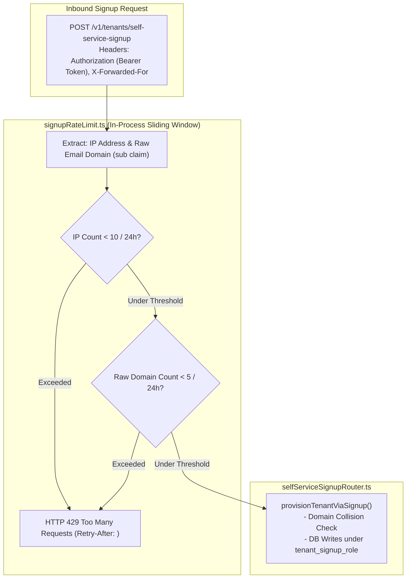

# Technical Design Specification (TDS) — Self-Service Sign-Up Rate Limiting & Abuse Prevention Mechanism

## 1. Document Control & Traceability Linkage

### 1.1 Metadata
| Attribute | Value |
|---|---|
| **Document Title** | TDS-0040: Self-Service Sign-Up Rate Limiting & Abuse Prevention — Dual-Keyed Sliding Window (IP & Raw Domain), HTTP 429 Rejection & DoS Mitigation |
| **Document ID** | `TDS-0040` |
| **Feature Name** | Dual-Dimension Sign-Up Rate Limiter & Abuse Prevention Gate |
| **Version** | `1.0.0` |
| **Status** | Approved |
| **Author(s)** | Core Architecture Team |
| **Created Date** | 2026-09-05 |
| **Last Updated** | 2026-09-05 |
| **Governing Skill** | `social-listening-core/.claude/skills/self-service-tenant-signup/SKILL.md` |

### 1.2 Upstream & Downstream Traceability Matrix
| Artifact Type | Reference Identifier | Title / Link | Alignment Status |
|---|---|---|---|
| **Architecture Decision Record** | `ADR-0040` | [ADR-0040: Self-service tenant sign-up rate limiting](../../adr/0040-self-service-signup-rate-limiting-and-abuse-prevention-mechanism.md) | Invariant Source |
| **Business Requirements Doc** | `BRD-0040` | [BRD-0040: Self-Service Signup Rate Limiting And Abuse Prevention](../Business-Requirements/BRD-0040-Self-Service-Signup-Rate-Limiting-And-Abuse-Prevention-Mechanism.md) | Fully Aligned |
| **Functional Design Doc** | `FDD-0040` | [FDD-0040: Self-Service Signup Rate Limiting And Abuse Prevention](../Functional-Design/FDD-0040-Self-Service-Signup-Rate-Limiting-And-Abuse-Prevention-Mechanism.md) | Fully Aligned |
| **Governing User Story** | `Story 5.18` | [Epic 5: Security & Isolation](../../user-stories/epic-5-security-isolation-and-messaging.md#story-518--self-service-sign-up-rate-limiting-and-abuse-prevention) | Acceptance Target |
| **Related User Stories** | `Story 5.15`, `Story 5.16`, `Story 6.7` | Self-Service Signup, Same-Domain Assist, Signup UI | Integration Target |
| **Related Architecture Decisions** | `ADR-0003`, `ADR-0020`, `ADR-0037` | Rate Limiting Baseline, Queue Bounds, Tenant Signup Architecture | Architectural Family |
| **Executable Contract Test** | `Story 5.18 Contract` | `social-listening-core/contracts/epic-5/story-5.18.signup-rate-limiting.contract.test.ts` | 100% Passing |

---

## 2. System Context & Architecture Topology

### 2.1 Context Diagram


### 2.2 Architectural Boundaries & Invariants
- **Outright Rejection vs. Queue-and-Wait:** Unlike `RequestGate` (ADR-0003/ADR-0020), which buffers and delays provider API calls, the signup rate limiter rejects abusive calls immediately with HTTP 429 (`TOO_MANY_REQUESTS`). Unauthenticated or untrusted callers are never permitted to consume server memory in sleep queues.
- **Dual-Dimension Sliding Window:**
  1. *IP-Keyed Ceiling:* Defaults to 10 signups per 24 hours per IP address (`SIGNUP_RATE_LIMIT_IP_MAX`).
  2. *Raw-Domain-Keyed Ceiling:* Defaults to 5 signups per 24 hours per raw email domain (`SIGNUP_RATE_LIMIT_DOMAIN_MAX`).
- **Raw Domain Keying Invariant:** The domain counter evaluates the **raw email domain** (e.g. `gmail.com`, `acme.com`) before the public email denylist filter runs. This prevents distributed bot networks from exhausting server resources via automated Gmail accounts.
- **Clean Isolation from Audit Tables:** An HTTP 429 rejection occurs at the perimeter gate before any database connection is acquired. It **never** inserts rows into `domain_signup_attempts` or triggers Same-Domain Invite Assist escalation logic.

---

## 3. Data Architecture & Persistence Design

### 3.1 In-Process Sliding Window Storage
Implemented in `social-listening-core/src/tenants/signupRateLimit.ts`:

```typescript
export interface RateLimitEntry {
  timestamps: number[];          // Unix millisecond timestamps of accepted attempts
}

export interface SignupRateLimitConfig {
  ipMax: number;                 // Default: 10
  ipWindowMs: number;            // Default: 86,400,000 (24h)
  domainMax: number;             // Default: 5
  domainWindowMs: number;        // Default: 86,400,000 (24h)
}
```

---

## 4. Component Design & Detailed Processing Logic

### 4.1 Sliding-Window Rate Limiter Engine
```typescript
export class SignupRateLimiter {
  private ipBuckets = new Map<string, number[]>();
  private domainBuckets = new Map<string, number[]>();

  constructor(private config: SignupRateLimitConfig) {}

  checkAndRecord(ip: string, rawDomain: string, now: number = Date.now()): { allowed: boolean; retryAfterSec?: number } {
    // 1. Evaluate IP Limit
    const ipTimestamps = (this.ipBuckets.get(ip) || []).filter(t => now - t < this.config.ipWindowMs);
    if (ipTimestamps.length >= this.config.ipMax) {
      const oldest = ipTimestamps[0];
      const retryAfter = Math.ceil((oldest + this.config.ipWindowMs - now) / 1000);
      return { allowed: false, retryAfterSec: Math.max(1, retryAfter) };
    }

    // 2. Evaluate Raw Domain Limit
    const domainTimestamps = (this.domainBuckets.get(rawDomain) || []).filter(t => now - t < this.config.domainWindowMs);
    if (domainTimestamps.length >= this.config.domainMax) {
      const oldest = domainTimestamps[0];
      const retryAfter = Math.ceil((oldest + this.config.domainWindowMs - now) / 1000);
      return { allowed: false, retryAfterSec: Math.max(1, retryAfter) };
    }

    // 3. Record attempt
    ipTimestamps.push(now);
    domainTimestamps.push(now);
    this.ipBuckets.set(ip, ipTimestamps);
    this.domainBuckets.set(rawDomain, domainTimestamps);

    return { allowed: true };
  }
}
```

---

## 5. Interface & Contract Specifications

### 5.1 HTTP 429 Response Contract
- **Headers:**
  - `Retry-After: <seconds>`
  - `Content-Type: application/json`
- **Response Body:**
```json
{
  "error": "TOO_MANY_REQUESTS",
  "message": "Too many sign-up attempts from this IP address or email domain. Please try again later.",
  "retryAfterSeconds": 3600
}
```

---

## 6. Security, Tenancy & Isolation Model
- **Memory Leak Protection:** Bucket arrays purge entries older than the rolling window on every evaluation. Inactive IP keys are swept periodically via background cleanup timers.
- **Client IP Extraction:** Evaluates `req.ip`, respecting trusted proxy hops (`app.set('trust proxy', true)`) in Azure Container App environments.

---

## 7. Performance, Scalability & Resource Caps
- **Microsecond Gate Execution:** In-process map lookups complete in $< 0.1\text{ms}$, shielding downstream PostgreSQL pools from connection exhaustion during registration denial-of-service spikes.

---

## 8. Resilience, Recovery & Failure Semantics
- **Single-Instance Deployment Alignment:** Per ADR-0040 §2, in-process memory state is fully aligned with the single-replica App Service deployment pattern. In the event of a container restart, rate limit counters reset cleanly without database corruption.

---

## 9. Observability, Telemetry & Auditability
- Security metric: `signup_rate_limit_exceeded_total{key_type: 'ip' | 'domain'}`.

---

## 10. Migration, Compatibility & Rollback Strategy
- Middleware wrapper in `selfServiceSignupRouter.ts`; zero database migrations required.

---

## 11. Verification, Testing & Quality Assurance
- **Story 5.18 Contract:** `social-listening-core/contracts/epic-5/story-5.18.signup-rate-limiting.contract.test.ts`
  - AC1/AC2: Rejects with 429 once IP threshold is crossed; returns `Retry-After`.
  - AC3: Rejects with 429 once raw email domain threshold is crossed.
  - AC4: Confirms distinct IPs and domains are completely independent.
  - AC5: Proves rejection never writes to `domain_signup_attempts`.

---

## 12. Open Questions & Future Enhancements

- [ ] **[Q-0040-1]** **Distributed Redis store.** Evaluating moving counters to Redis or Azure Cache if `social-listening-core` scales to multi-replica horizontal clustering.
- [ ] **[Q-0040-2]** **CAPTCHA integration on threshold approach.** Permitting users approaching limits to solve a Cloudflare Turnstile challenge.
