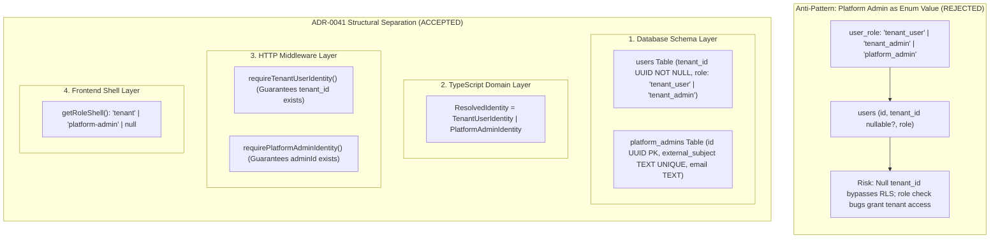

# Technical Design Specification (TDS) — Platform Admin Is a Distinct Identity Kind, Not a Role Value

## 1. Document Control & Traceability Linkage

### 1.1 Metadata
| Attribute | Value |
|---|---|
| **Document Title** | TDS-0041: Structural Separation of Platform Admin — Distinct Identity Kind, Discriminated Union Architecture & Multi-Layer Type Safety |
| **Document ID** | `TDS-0041` |
| **Feature Name** | Structural Platform Admin Identity Kind & Discriminated Union Typing |
| **Version** | `1.0.0` |
| **Status** | Approved |
| **Author(s)** | Core Architecture Team |
| **Created Date** | 2026-09-05 |
| **Last Updated** | 2026-09-05 |
| **Governing Skill** | `social-listening-core/.claude/skills/identity-resolution/SKILL.md` |

### 1.2 Upstream & Downstream Traceability Matrix
| Artifact Type | Reference Identifier | Title / Link | Alignment Status |
|---|---|---|---|
| **Architecture Decision Record** | `ADR-0041` | [ADR-0041: Platform Admin is a distinct identity kind](../../adr/0041-platform-admin-is-a-distinct-identity-kind-not-a-role-value.md) | Invariant Source |
| **Business Requirements Doc** | `BRD-0041` | [BRD-0041: Platform Admin Is A Distinct Identity Kind Not A Role Value](../Business-Requirements/BRD-0041-Platform-Admin-Is-A-Distinct-Identity-Kind-Not-A-Role-Value.md) | Fully Aligned |
| **Functional Design Doc** | `FDD-0041` | [FDD-0041: Platform Admin Is A Distinct Identity Kind Not A Role Value](../Functional-Design/FDD-0041-Platform-Admin-Is-A-Distinct-Identity-Kind-Not-A-Role-Value.md) | Fully Aligned |
| **Governing User Stories** | `Story 5.7`, `Story 5.11` | [Epic 5: Security & Isolation](../../user-stories/epic-5-security-isolation-and-messaging.md) | Acceptance Targets |
| **Related User Stories** | `Story 6.2`, `Story 6.6` | Role-Gated Shell, Platform Admin Console | UI Implementation |
| **Related Architecture Decisions** | `ADR-0015`, `ADR-0030`, `ADR-0032`, `ADR-0035` | Postgres RLS, Platform Admin Tier, Users Table, UI Shell | Architectural System |
| **Executable Contract Tests** | `Stories 5.7, 5.11, 6.2 Contracts` | `social-listening-core/contracts/epic-5/story-5.7.platform-admin-rls-bypass.contract.test.ts`<br>`social-listening-core/contracts/epic-5/story-5.11.get-v1-me.contract.test.ts`<br>`social-listening-admin/contracts/epic-6/story-6.2.role-gated-routing-shell.contract.test.ts` | 100% Passing |

---

## 2. System Context & Architecture Topology

### 2.1 Context Diagram


### 2.2 Architectural Boundaries & Invariants
- **Rejection of Enum-Value Representation:** `platform_admin` is **never** an allowable value within `user_role`. Coercing platform operators into the `users` table with a `tenant_id = NULL` creates catastrophic RLS vulnerabilities, where poorly written SQL queries (`WHERE tenant_id = current_tenant OR tenant_id IS NULL`) leak global data.
- **Dedicated Physical Storage:** Platform administrators reside exclusively in table `platform_admins`, completely unlinked from the multi-tenant `users` table.
- **Discriminated Union Type Safety:** In TypeScript, `ResolvedIdentity` is a discriminated union on property `type`. A `PlatformAdminIdentity` structurally lacks `tenantId` and `role` fields. Code attempting to access `identity.tenantId` without narrowing fails at compile time.
- **Explicit Middleware Gating:** Route handlers strictly declare required identity kinds:
  - `requireTenantUserIdentity()`: Throws HTTP 403 if caller is a `platform_admin`.
  - `requirePlatformAdminIdentity()`: Throws HTTP 403 if caller is a `tenant_user`.

---

## 3. Data Architecture & Persistence Design

### 3.1 DDL Schema Separation
```sql
-- 1. Tenant Users Table (RLS Enabled, tenant_id NOT NULL)
CREATE TABLE IF NOT EXISTS users (
    id UUID PRIMARY KEY DEFAULT gen_random_uuid(),
    tenant_id UUID NOT NULL REFERENCES tenants(id) ON DELETE CASCADE,
    external_subject TEXT UNIQUE,
    email TEXT NOT NULL,
    role TEXT NOT NULL CHECK (role IN ('tenant_user', 'tenant_admin')),
    created_at TIMESTAMPTZ NOT NULL DEFAULT NOW()
);

-- 2. Platform Admins Table (Global, No Tenant Reference, No RLS needed)
CREATE TABLE IF NOT EXISTS platform_admins (
    id UUID PRIMARY KEY DEFAULT gen_random_uuid(),
    external_subject TEXT NOT NULL UNIQUE,
    email TEXT NOT NULL,
    created_at TIMESTAMPTZ NOT NULL DEFAULT NOW()
);
```

### 3.2 TypeScript Type Definitions
```typescript
export interface TenantUserIdentity {
  type: 'tenant_user';
  userId: string;
  tenantId: string;              // Guaranteed non-null
  role: 'tenant_user' | 'tenant_admin';
  email: string;
}

export interface PlatformAdminIdentity {
  type: 'platform_admin';
  adminId: string;               // Guaranteed non-null
  email: string;
}

export type ResolvedIdentity = TenantUserIdentity | PlatformAdminIdentity;
```

---

## 4. Component Design & Detailed Processing Logic

### 4.1 Strict Middleware Guard Functions
Implemented in `social-listening-core/src/http/auth/requireTenantUser.ts`:

```typescript
export function requireTenantUserIdentity(req: Request): TenantUserIdentity {
  const identity = req.identity;
  if (!identity || identity.type !== 'tenant_user') {
    throw new ForbiddenError('This operation requires a tenant user identity');
  }
  return identity;
}

export function requirePlatformAdminIdentity(req: Request): PlatformAdminIdentity {
  const identity = req.identity;
  if (!identity || identity.type !== 'platform_admin') {
    throw new ForbiddenError('This operation requires platform admin authorization');
  }
  return identity;
}
```

---

## 5. Interface & Contract Specifications
- **`GET /v1/me` Serialization:** Directly reflects the discriminated union discriminator (`type: "tenant_user"` vs `type: "platform_admin"`).
- **No Masquerade Bleed:** Platform Admins cannot invoke tenant APIs (`/v1/posts`, `/v1/watchlists`) without invoking explicit break-glass credentials (ADR-0030).

---

## 6. Security, Tenancy & Isolation Model
- **Compile-Time & Runtime Dual Enforcement:** TypeScript enforces compile-time field safety, while Express middleware and PostgreSQL role boundaries enforce runtime containment.

---

## 7. Performance, Scalability & Resource Caps
- **Index Lookups:** Fast indexed queries on `platform_admins.external_subject` complete in $< 1\text{ms}$.

---

## 8. Resilience, Recovery & Failure Semantics
- Identity resolution fails safely to `null` if subject exists in neither table.

---

## 9. Observability, Telemetry & Auditability
- Security audit logs tag identity kinds: `audit_actor_type: 'platform_admin' | 'tenant_user'`.

---

## 10. Migration, Compatibility & Rollback Strategy
- Formally locks in the schema split established in early Phase 5.

---

## 11. Verification, Testing & Quality Assurance
- **Story 5.7 & 5.11 Contracts:** Validates strict separation and compile-time type exhaustiveness.
- **Story 6.2 Contract:** Proves Next.js shell routing switches cleanly on `identity.type`.

---

## 12. Open Questions & Future Enhancements

- [x] ~~**[Q-0041-1]** **Platform Admin identity kind vs role value.**~~ Decided in ADR-0041: Distinct identity kind at every layer.
- [ ] **[Q-0041-2]** **Break-glass session audit duration.** Standardizing session timeout for break-glass operator overrides.
