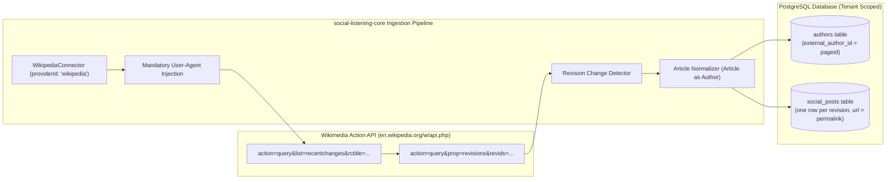

# Technical Design Specification (TDS) — Wikipedia Connector: MediaWiki API, Article as Author

## 1. Document Control & Traceability Linkage

### 1.1 Metadata
| Attribute | Value |
|---|---|
| **Document Title** | TDS-0042: Wikipedia Connector — MediaWiki API, Revision Cadence & Article-as-Author |
| **Document ID** | `TDS-0042` |
| **Feature Name** | Wikipedia Ingestion Connector, Revision Polling & Document Author Modeling |
| **Version** | `1.0.0` |
| **Status** | Approved |
| **Author(s)** | Core Architecture Team |
| **Created Date** | 2026-09-04 |
| **Last Updated** | 2026-09-04 |
| **Governing Skill** | `social-listening-core/.claude/skills/provider-connector-framework/SKILL.md` |

### 1.2 Upstream & Downstream Traceability Matrix
| Artifact Type | Reference Identifier | Title / Link | Alignment Status |
|---|---|---|---|
| **Architecture Decision Record** | `ADR-0042` | [ADR-0042: Wikipedia connector — MediaWiki API, revision re-poll cadence](../../adr/0042-wikipedia-connector-mediawiki-api-article-as-author.md) | Invariant Source |
| **Business Requirements Doc** | `BRD-0042` | [BRD-0042: Wikipedia Connector MediaWiki API Article As Author](../Business-Requirements/BRD-0042-Wikipedia-Connector-MediaWiki-API-Article-As-Author.md) | Fully Aligned |
| **Functional Design Doc** | `FDD-0042` | [FDD-0042: Wikipedia Connector MediaWiki API Article As Author](../Functional-Design/FDD-0042-Wikipedia-Connector-MediaWiki-API-Article-As-Author.md) | Fully Aligned |
| **Governing User Story** | `Story 2.8` | [Epic 2: Ingestion Connectors and Rate Limits](../../user-stories/epic-2-ingestion-connectors-and-rate-limits.md#story-28--wikipedia-connector--mediawiki-api-with-article-as-author-modeling) | Acceptance Target |
| **Executable Contract Test** | `Story 2.8 Contract` | `contracts/epic-2/story-2.8.wikipedia-connector.contract.test.ts` | 100% Passing |

---

## 2. System Context & Architecture Topology

### 2.1 Context Diagram


### 2.2 Architectural Boundaries & Invariants
- **Public No-Key Invariant:** Wikipedia ingestion requires no API key or user account (`authMode: 'none'`). It is authenticated solely via a compliant HTTP `User-Agent` header containing contact details.
- **Revision Cadence Invariant:** The connector polls for edits over time via `recentchanges`. Each qualifying revision generates a new `SocialPost` record linked to the same underlying `Author` row.
- **Article-as-Author Invariant:** The `authors` row models the *Wikipedia Article entity* itself, keyed immutably by its stable `pageid`. `handle` and `display_name` reflect the current page title. `follower_count` is null.
- **CC BY-SA 4.0 Compliance:** Attribution is satisfied by populating `social_posts.url` with the immutable revision permalink (`https://en.wikipedia.org/w/index.php?title=...&oldid=...`), linking directly to edit history.

---

## 3. Data Architecture & Persistence Design

### 3.1 Author Model Mapping (`authors`)
```sql
INSERT INTO authors (
  tenant_id,
  platform_id,
  external_author_id,
  handle,
  display_name,
  is_verified,
  follower_count,
  first_seen_at,
  last_seen_at
) VALUES (
  $1,
  'wikipedia',
  '12345678',             -- PageID (immutable integer as string)
  'Acme_Corporation',     -- Article title
  'Acme Corporation',
  true,
  NULL,
  NOW(),
  NOW()
) ON CONFLICT (tenant_id, platform_id, external_author_id) DO UPDATE
SET handle = EXCLUDED.handle,
    display_name = EXCLUDED.display_name,
    last_seen_at = NOW();
```

### 3.2 Social Post Revision Record
```sql
INSERT INTO social_posts (
  tenant_id,
  platform_id,
  external_post_id,
  acquisition_id,
  author_id,
  content,
  url,
  created_at,
  raw_payload
) VALUES (
  $1,
  'wikipedia',
  '987654321',             -- revid (revision ID)
  $2,
  $3,
  'Summary of edit / diff comments and section content...',
  'https://en.wikipedia.org/w/index.php?title=Acme_Corporation&oldid=987654321',
  '2026-09-04T10:00:00Z',
  '{"revid": 987654321, "pageid": 12345678, "comment": "Updated Q3 revenue figures"}'::jsonb
);
```

---

## 4. API, Interface & Integration Contract Design

### 4.1 Connector Implementation (`src/connectors/wikipedia/wikipediaConnector.ts`)
```typescript
import { ProviderConnector, ConnectorExecutionContext, NormalizedPostBatch } from '../types';

export class WikipediaConnector implements ProviderConnector {
  public readonly id = 'wikipedia';
  public readonly name = 'Wikipedia (MediaWiki)';
  public readonly authType = 'none';
  public readonly deliveryMode = 'poll';

  public async validateCredential(): Promise<{ valid: boolean }> {
    return { valid: true }; // Keyless
  }

  public async poll(
    context: ConnectorExecutionContext,
    cursor?: IngestionCursor
  ): Promise<NormalizedPostBatch> {
    // 1. Fetch recent changes for tracked page titles/IDs
    // 2. Query revision details for new revids
    // 3. Normalize into SocialPost with Article as Author
    // 4. Return batch
  }
}
```

---

## 5. Rate Limiting, Concurrency & Flow Control

- **Wikimedia Etiquette:** Polling intervals must respect Wikimedia's rate recommendations (max 1 req/sec). Polling intervals are configured at 10 minutes by default.
- **Sliding Window:** `recentchanges` is queried using `rcend` matching the timestamp of the last successful run, capped at a maximum of 30 days lookback (`$wgRCMaxAge`).

---

## 6. Security, Identity & Credential Governance

- **User-Agent Policy:** All outgoing HTTP requests MUST include the header:
  ```
  User-Agent: SocialEngage-Ingest/1.0 (https://socialengage.ai; ops@socialengage.ai)
  ```
  Requests lacking this header risk an immediate Wikimedia IP ban (HTTP 403).

---

## 7. Error Handling, Resilience & Failure Classification

### 7.1 MediaWiki Error Responses
| MediaWiki Error | Classification | System Action |
|---|---|---|
| HTTP 403 Forbidden | `Permanent` | Alert operator: User-Agent policy violation or IP block |
| HTTP 429 Too Many Requests | `RateLimit` | Backoff for 60 seconds |
| Page Moved / Deleted | `Permanent` | Note in `error_summary`; track new title via redirect API |

---

## 8. Testing & Contract Gate Plan

### 8.1 Contract Tests
Contract test file: `contracts/epic-2/story-2.8.wikipedia-connector.contract.test.ts`.

| Test ID | Scenario | Verification Method |
|---|---|---|
| `TEST-WK-01` | Header validation | Assert all outgoing requests carry valid `User-Agent`. |
| `TEST-WK-02` | Article-as-author mapping | Ingest revision; assert `external_author_id = pageid` and `follower_count = NULL`. |
| `TEST-WK-03` | Multi-revision author reuse | Ingest 2 distinct revisions for same page; assert 2 `social_posts` point to 1 `authors` record. |
| `TEST-WK-04` | Attribution URL integrity | Assert `social_posts.url` contains `oldid=<revid>`. |

---

## 9. Component Skill (`SKILL.md`) Documentation Updates

Updates to `.claude/skills/provider-connector-framework/SKILL.md`:
- **Wikipedia Invariant:** Always format `User-Agent` with contact information.
- **Attribution Standard:** Revision URLs must use `oldid` permalink format for CC BY-SA compliance.

---

## 10. Observability, Metrics & Operational Telemetry

- `wikipedia_revisions_ingested_total{page_id}` (counter)
- `wikipedia_poll_duration_seconds` (histogram)

---

## 11. Migration, Rollout & Feature Gating

- Registration of `'wikipedia'` in `src/connectors/registry.ts`.

---

## 12. Technical Assumptions, Dependencies & Open Questions

### 12.1 Assumptions & Dependencies
- **[A-0042-1]** MediaWiki Action API remains open without paid commercial subscription requirements.
- **[D-0042-1]** Story 2.1 `ingestion_runs` framework.

### 12.2 Open Questions
- [ ] **[Q-0042-1]** *Wikidata Entity Linking:* Evaluate whether to link `pageid` to Wikidata Q-identifiers in Phase 9 knowledge-graph integration. *(Status: Deferred to Phase 9).*
