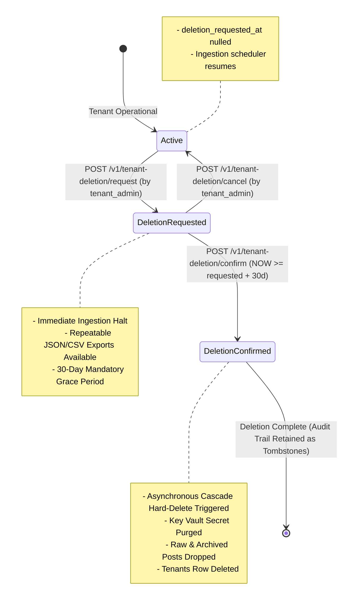

# Technical Design Specification (TDS) — Self-Service Tenant-Initiated Deletion

## 1. Document Control & Traceability Linkage

### 1.1 Metadata
| Attribute | Value |
|---|---|
| **Document Title** | TDS-0043: Self-Service Tenant Deletion & Offboarding — Autonomous Lifecycle, Ingestion Halt, 30-Day Export Window & Irreversible Cascade Hard-Delete |
| **Document ID** | `TDS-0043` |
| **Feature Name** | Self-Service Tenant Offboarding, Ingestion Halt & Cryptographic Deletion Cascade |
| **Version** | `1.0.0` |
| **Status** | Approved |
| **Author(s)** | Core Architecture Team |
| **Created Date** | 2026-09-05 |
| **Last Updated** | 2026-09-05 |
| **Governing Skill** | `social-listening-core/.claude/skills/tenant-offboarding/SKILL.md` |

### 1.2 Upstream & Downstream Traceability Matrix
| Artifact Type | Reference Identifier | Title / Link | Alignment Status |
|---|---|---|---|
| **Architecture Decision Record** | `ADR-0043` | [ADR-0043: Self-Service Tenant-Initiated Deletion](../../adr/0043-self-service-tenant-initiated-deletion.md) | Invariant Source (Supersedes ADR-0039 §1) |
| **Business Requirements Doc** | `BRD-0043` | [BRD-0043: Self-Service Tenant Initiated Deletion](../Business-Requirements/BRD-0043-Self-Service-Tenant-Initiated-Deletion.md) | Fully Aligned |
| **Functional Design Doc** | `FDD-0043` | [FDD-0043: Self-Service Tenant Initiated Deletion](../Functional-Design/FDD-0043-Self-Service-Tenant-Initiated-Deletion.md) | Fully Aligned |
| **Governing User Story** | `Story 3.8` | [Epic 3: Data Model & Archival](../../user-stories/epic-3-data-model-storage-and-archival.md#story-38--self-service-tenant-initiated-deletion) | Acceptance Target |
| **Related User Stories** | `Story 3.7` (Retired), `Story 6.13`, `Story 6.40` | Deletion UI, Tenant Settings Export | Ecosystem Modules |
| **Related Architecture Decisions** | `ADR-0014`, `ADR-0015`, `ADR-0018`, `ADR-0030`, `ADR-0039` | Credential Security, Tenant RLS, Retention Policy, Admin Tier, Offboarding Baseline | Architectural Lineage |
| **Executable Contract Tests** | `Story 3.8 & 6.13 Contracts` | `social-listening-core/contracts/epic-3/story-3.8.self-service-tenant-initiated-deletion.contract.test.ts`<br>`social-listening-admin/contracts/epic-6/story-6.13.tenant-deletion-offboarding.contract.test.ts` | 100% Passing |

---

## 2. System Context & Architecture Topology

### 2.1 Context Diagram


### 2.2 Architectural Boundaries & Invariants
- **100% Autonomous Self-Service (Zero Platform-Admin Gate):** Full supersession of ADR-0039 Decision §1. A `tenant_admin` can initiate, export, cancel, and confirm deletion without human platform operator approval. Platform administrators possess zero access to tenant tables during the offboarding lifecycle.
- **Immediate Ingestion Halt:** Calling `/v1/tenant-deletion/request` sets `tenants.deletion_requested_at`. Ingestion workers immediately detect this flag and abort all inbound polling and webhook processing for the tenant.
- **Mandatory 30-Day Grace & Export Period:** The confirmation endpoint rejects execution with HTTP 400 until the 30-day grace period has elapsed. During this period, tenant administrators can repeatably download full workspace data and post archives.
- **Permanent Irreversible Hard-Delete:** Confirmation permanently drops all tenant records across both hot and archived tables (`social_posts`, `authors`, `watchlists`, `post_watchlist_matches`, `users`, `tenants`) and revokes Key Vault credentials.
- **Audit Immutability & Tombstones:** Compliance audit records in `platform_admin_audit_log` and `domain_signup_attempts` survive tenant deletion as permanent anonymized tombstones.

---

## 3. Data Architecture & Persistence Design

### 3.1 DDL Schema Migration
Migration `0023_add_tenant_deletion_lifecycle.sql`:
```sql
ALTER TABLE tenants 
    ADD COLUMN IF NOT EXISTS deletion_requested_at TIMESTAMPTZ,
    ADD COLUMN IF NOT EXISTS deletion_confirmed_at TIMESTAMPTZ;

-- Grant app_user update authority strictly on deletion columns for own tenant
GRANT UPDATE (deletion_requested_at, deletion_confirmed_at) ON tenants TO app_user;

-- Create dedicated deletion runner role
DO $$
BEGIN
  IF NOT EXISTS (SELECT FROM pg_roles WHERE rolname = 'tenant_deletion_role') THEN
    CREATE ROLE tenant_deletion_role LOGIN PASSWORD '...';
    ALTER ROLE tenant_deletion_role BYPASSRLS;
  END IF;
END $$;

GRANT DELETE ON tenants, users, watchlists, social_posts, authors TO tenant_deletion_role;
GRANT INSERT ON platform_admin_audit_log TO tenant_deletion_role;
```

---

## 4. Component Design & Detailed Processing Logic

### 4.1 Deletion State Machine Transitions
Implemented in `social-listening-core/src/tenants/tenantDeletion.ts`:

```typescript
export async function requestTenantDeletion(tenantId: string, adminUserId: string): Promise<Tenant> {
  return withTenant(tenantId, async (client) => {
    const { rows } = await client.query<TenantRow>(
      `SELECT * FROM tenants WHERE id = $1 FOR UPDATE`,
      [tenantId]
    );
    const tenant = mapRowToTenant(rows[0]);

    if (tenant.deletionRequestedAt) {
      throw new ConflictError('Tenant deletion has already been requested');
    }

    const now = new Date().toISOString();
    await client.query(
      `UPDATE tenants SET deletion_requested_at = $1 WHERE id = $2`,
      [now, tenantId]
    );

    await logPlatformAdminAction({
      action: 'tenant_deletion_requested',
      actorIdentity: `tenant-admin:${adminUserId}`,
      targetTenantId: tenantId,
      details: { requestedAt: now },
    });

    return { ...tenant, deletionRequestedAt: now };
  });
}
```

### 4.2 Ingestion Halt Guard
Implemented in `social-listening-core/src/ingestion/runIngestionAttempt.ts`:
```typescript
export async function shouldHaltIngestionForTenant(client: PoolClient, tenantId: string): Promise<boolean> {
  const { rows } = await client.query<{ deletion_requested_at: string | null }>(
    `SELECT deletion_requested_at FROM tenants WHERE id = $1`,
    [tenantId]
  );
  return rows.length > 0 && rows[0].deletion_requested_at !== null;
}
```

---

## 5. Interface & Contract Specifications

### 5.1 REST Endpoints Contract
Mounted at `/v1/tenant-deletion/*` (Gated to `role === 'tenant_admin'`):

| Endpoint | Method | Purpose | Behavior |
|---|---|---|---|
| `/request` | `POST` | Request offboarding | Sets `deletion_requested_at = NOW()`, halts ingestion |
| `/export` | `GET` | Export tenant data | Returns streaming CSV or JSON archive |
| `/cancel` | `POST` | Cancel offboarding | Resets `deletion_requested_at = NULL`, resumes ingestion |
| `/confirm` | `POST` | Finalize deletion | Rejects if $<30\text{d}$; executes hard delete if $\ge 30\text{d}$ |

---

## 6. Security, Tenancy & Isolation Model
- **Caller Scope Enforcement:** Deletion endpoints inspect `req.identity.tenantId`. Callers can never pass an arbitrary `:id` to delete another organization.
- **Platform Admin Non-Interference:** The `platform_admin_role` is barred from updating `deletion_requested_at` or `deletion_confirmed_at`, ensuring platform operators cannot maliciously trigger or cancel tenant offboarding.

---

## 7. Performance, Scalability & Resource Caps
- **Bounded Cascade Execution:** Cross-table deletion runs in chunked batches (5,000 rows per transaction) to prevent Postgres buffer pool saturation and lock starvation.

---

## 8. Resilience, Recovery & Failure Semantics
- **Crash Safety:** If an asynchronous hard-delete job crashes midway, the surviving `tenants` record with `deletion_confirmed_at` marks it for immediate resumption by the deletion recovery worker.

---

## 9. Observability, Telemetry & Auditability
- Invocations permanently logged in `platform_admin_audit_log`:
  - `action: 'tenant_deletion_requested' | 'tenant_deletion_cancelled' | 'tenant_deletion_confirmed'`
  - `actor_identity: 'tenant-admin:<user_id>'`

---

## 10. Migration, Compatibility & Rollback Strategy
- Non-breaking additive columns. Fully supersedes the retired Platform-Admin deletion path (Story 3.7).

---

## 11. Verification, Testing & Quality Assurance
- **Story 3.8 Contract:** `social-listening-core/contracts/epic-3/story-3.8.self-service-tenant-initiated-deletion.contract.test.ts`
  - AC1: Only `tenant_admin` role reaches deletion routes.
  - AC2: Request halts further ingestion runs immediately.
  - AC3: Data export is repeatable across hot and archival tiers.
  - AC4: Cancellation restores active state and restarts ingestion.
  - AC5: Confirmation rejects until 30-day grace period genuinely elapses.
  - AC6: Executes hard-delete across all tables; audit logs survive as tombstones.

---

## 12. Open Questions & Future Enhancements

- [ ] **[Q-0043-1]** **Grace period warning notifications.** Automated email warnings sent at day 20 and day 28 of the 30-day offboarding window.
- [x] ~~**[Q-0043-2]** **`requireTenantAdmin()` middleware helper.**~~ Resolved: Added to `selfServiceTenantDeletionRouter.ts`.
- [x] ~~**[Q-0043-3]** **Rate-limiting repeat requests.**~~ Resolved: Handled via state machine validation (`already_active` returned on duplicates).
