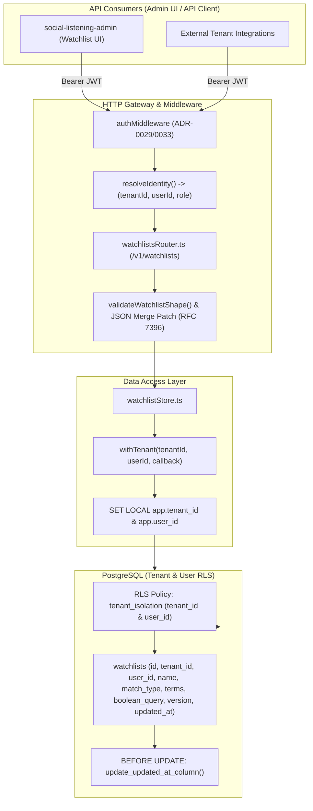
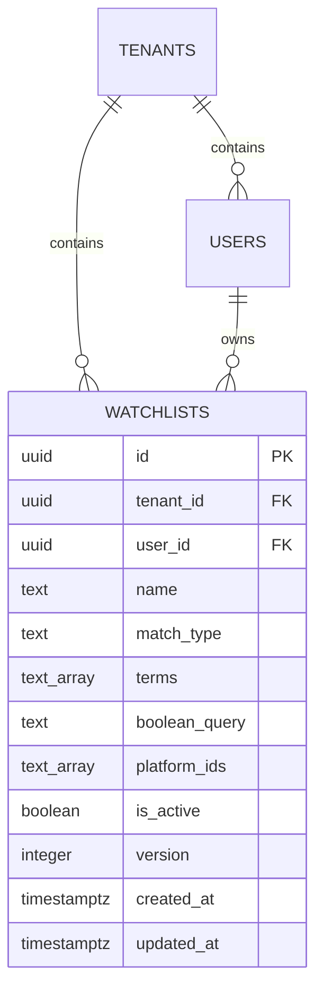
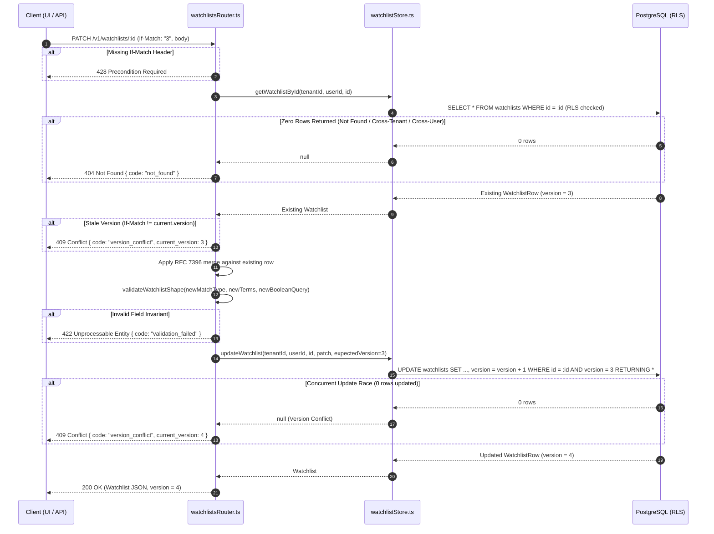

# Technical Design Specification (TDS) — Watchlist CRUD API & Schema Standardization

## 1. Document Control & Traceability Linkage

### 1.1 Metadata
| Attribute | Value |
|---|---|
| **Document Title** | TDS-0044: Watchlist CRUD Contract — PATCH Semantics, Error Mapping, and Updated_At Policy |
| **Document ID** | `TDS-0044` |
| **Feature Name** | Watchlist REST CRUD, RFC 7396 Merge Patch, Optimistic Locking & RLS Ownership |
| **Version** | `1.0.0` |
| **Status** | Approved |
| **Author(s)** | Core Architecture Team |
| **Created Date** | 2026-09-05 |
| **Last Updated** | 2026-09-05 |
| **Governing Skill** | `social-listening-core/.claude/skills/watchlist-crud/SKILL.md` |

### 1.2 Upstream & Downstream Traceability Matrix
| Artifact Type | Reference Identifier | Title / Link | Alignment Status |
|---|---|---|---|
| **Architecture Decision Record** | `ADR-0044` | [ADR-0044: Watchlist CRUD contract](../../adr/0044-watchlist-api-design-and-database-schema-standardization.md) | Invariant Source |
| **Business Requirements Doc** | `BRD-0044` | [BRD-0044: Watchlist API Design and Database Schema Standardization](../Business-Requirements/BRD-0044-Watchlist-API-Design-And-Database-Schema-Standardization.md) | Fully Aligned |
| **Functional Design Doc** | `FDD-0044` | [FDD-0044: Watchlist API Design and Database Schema Standardization](../Functional-Design/FDD-0044-Watchlist-API-Design-And-Database-Schema-Standardization.md) | Fully Aligned |
| **Governing User Story** | `Story 1.5` | [Epic 1: Repository and API Foundation](../../user-stories/epic-1-repository-and-api-foundation.md#story-15--watchlist-management) | Acceptance Target |
| **Related Architecture Decisions** | `ADR-0015`, `ADR-0021`, `ADR-0030`, `ADR-0032`, `ADR-0033` | RLS Isolation, Boolean AST, Admin Role Checks, Session Auth | Cross-Referenced |
| **Executable Contract Test** | `Story 1.5 Contract` | `social-listening-core/contracts/epic-1/story-1.5.watchlist-crud.contract.test.ts` | 100% Passing |

---

## 2. System Context & Architecture Topology

### 2.1 Context Diagram


### 2.2 Architectural Boundaries & Invariants
- **RFC 7396 JSON Merge Patch Standard:** All `/v1` partial updates use RFC 7396 semantics across the entire project. Setting a field to `null` deletes/clears it; omitted fields remain unchanged; arrays (e.g. `terms`, `platform_ids`) are replaced in full rather than merged element-wise.
- **Cause-Specific HTTP Error Mapping:** Explicit split between `404 Not Found` (resource non-existent in tenant, belongs to another tenant, or belongs to another user in the same tenant to prevent enumeration) and `403 Forbidden` (application-layer role check failure where resource exists in caller's tenant but caller role is insufficient per ADR-0030 §1).
- **Optimistic Concurrency Control:** Concurrency is guarded by an integer `version` column. Clients issuing `PATCH /v1/watchlists/:id` must send an `If-Match: "<version>"` header; a missing header yields `428 Precondition Required`, and a mismatched version yields `409 Conflict` with `{ code: "version_conflict", current_version: <int> }`.
- **Database-Enforced Ownership & RLS:** Watchlists are strictly personal, per-user resources created by either `tenant_admin` or `tenant_user`. The database enforces privacy via PostgreSQL RLS on both `tenant_id` and `user_id`. There is no Tenant-Admin oversight override or bypass mechanism.
- **Trigger-Maintained `updated_at`:** Mutable tenant-scoped tables update `updated_at` via a PostgreSQL `BEFORE UPDATE` trigger calling `update_updated_at_column()`, keeping timestamps honest across all write paths.

---

## 3. Data Architecture & Persistence Design

### 3.1 Entity Relationship Diagram


### 3.2 DDL Schema & Trigger Implementation
From `migrations/0014_create_watchlists.sql` and `migrations/0025_watchlists_ownership_and_versioning.sql`:

```sql
-- Trigger function for automated updated_at maintenance
CREATE OR REPLACE FUNCTION update_updated_at_column()
RETURNS TRIGGER AS $$
BEGIN
    NEW.updated_at = NOW();
    RETURN NEW;
END;
$$ LANGUAGE plpgsql;

-- Table definition
CREATE TABLE IF NOT EXISTS watchlists (
    id UUID PRIMARY KEY DEFAULT gen_random_uuid(),
    tenant_id UUID NOT NULL REFERENCES tenants(id) ON DELETE CASCADE,
    user_id UUID NOT NULL REFERENCES users(id) ON DELETE CASCADE,
    name TEXT NOT NULL,
    match_type TEXT NOT NULL,
    terms TEXT[] NULL,
    boolean_query TEXT NULL,
    platform_ids TEXT[] NOT NULL DEFAULT '{}',
    is_active BOOLEAN NOT NULL DEFAULT true,
    version INTEGER NOT NULL DEFAULT 1,
    created_at TIMESTAMPTZ NOT NULL DEFAULT NOW(),
    updated_at TIMESTAMPTZ NOT NULL DEFAULT NOW(),
    CONSTRAINT chk_watchlists_match_type CHECK (
        match_type IN ('keyword', 'hashtag', 'account', 'boolean')
    )
);

-- Trigger attachment
CREATE TRIGGER update_watchlists_updated_at
    BEFORE UPDATE ON watchlists
    FOR EACH ROW
    EXECUTE FUNCTION update_updated_at_column();

-- Indexes
CREATE INDEX IF NOT EXISTS idx_watchlists_tenant_id ON watchlists(tenant_id);
CREATE INDEX IF NOT EXISTS idx_watchlists_tenant_match_type ON watchlists(tenant_id, match_type);
CREATE INDEX IF NOT EXISTS idx_watchlists_tenant_user_id ON watchlists(tenant_id, user_id);

-- Row-Level Security Policies (Tenant & User Isolation)
ALTER TABLE watchlists ENABLE ROW LEVEL SECURITY;
ALTER TABLE watchlists FORCE ROW LEVEL SECURITY;

CREATE POLICY tenant_isolation ON watchlists
    FOR ALL
    USING (
        tenant_id = NULLIF(current_setting('app.tenant_id', true), '')::uuid
        AND user_id = NULLIF(current_setting('app.user_id', true), '')::uuid
    )
    WITH CHECK (
        tenant_id = NULLIF(current_setting('app.tenant_id', true), '')::uuid
        AND user_id = NULLIF(current_setting('app.user_id', true), '')::uuid
    );
```

---

## 4. Component Design & Detailed Processing Logic

### 4.1 Match Type Validation Invariant
Watchlists support four match types mapped to two mutual exclusive storage modes:
1. `matchType ∈ {'keyword', 'hashtag', 'account'}`: `terms` is a non-empty `text[]` array; `booleanQuery` must be `null` or omitted.
2. `matchType = 'boolean'`: `booleanQuery` is a non-empty string representing the Boolean AST source; `terms` must be `null` or omitted.

Any input violating this mutual exclusivity fails validation immediately with `422 Unprocessable Entity` (`{ code: "validation_failed", details: [...] }`).

```typescript
// Validation logic in social-listening-core/src/watchlists/watchlistStore.ts
export function validateWatchlistShape(
  matchType: string,
  terms?: string[] | null,
  booleanQuery?: string | null
): { valid: boolean; error?: string } {
  if (matchType === 'boolean') {
    if (!booleanQuery || booleanQuery.trim().length === 0) {
      return { valid: false, error: 'booleanQuery is required when matchType is boolean' };
    }
    if (terms && terms.length > 0) {
      return { valid: false, error: 'terms must be null or empty when matchType is boolean' };
    }
  } else if (['keyword', 'hashtag', 'account'].includes(matchType)) {
    if (!terms || terms.length === 0) {
      return { valid: false, error: `terms array is required when matchType is ${matchType}` };
    }
    if (booleanQuery && booleanQuery.trim().length > 0) {
      return { valid: false, error: `booleanQuery must be null when matchType is ${matchType}` };
    }
  } else {
    return { valid: false, error: `Invalid matchType: ${matchType}` };
  }
  return { valid: true };
}
```

### 4.2 RFC 7396 JSON Merge Patch Execution Flow


---

## 5. Interface & Contract Specifications

### 5.1 REST API Endpoint Signatures
All endpoints reside in `social-listening-core/src/http/versions/v1/watchlistsRouter.ts` under `/v1/watchlists`.

| HTTP Verb | Path | Request Headers | Request Body | Success Code | Error Codes |
|---|---|---|---|---|---|
| `POST` | `/v1/watchlists` | `Authorization: Bearer <token>` | `CreateWatchlistInput` | `201 Created` | 400, 401, 422 |
| `GET` | `/v1/watchlists` | `Authorization: Bearer <token>` | None (query: `matchType`, `isActive`) | `200 OK` | 401 |
| `GET` | `/v1/watchlists/:id` | `Authorization: Bearer <token>` | None | `200 OK` | 401, 404 |
| `PATCH` | `/v1/watchlists/:id` | `Authorization`, `If-Match: "<version>"` | `PatchWatchlistInput` (RFC 7396) | `200 OK` | 400, 401, 404, 409, 422, 428 |
| `DELETE` | `/v1/watchlists/:id` | `Authorization: Bearer <token>` | None | `204 No Content` | 401, 404 |

### 5.2 Error Response Envelopes & Mapping Rules
```json
// 404 Not Found (Cross-tenant, non-existent, or other user's watchlist)
{ "code": "not_found" }

// 403 Forbidden (Only for tenant-admin role-check boundary, never for watchlist ownership)
{ "code": "forbidden", "required_role": "tenant_admin" }

// 409 Conflict (Optimistic locking version mismatch)
{ "code": "version_conflict", "current_version": 4 }

// 422 Unprocessable Entity (Schema/AST invariant failure)
{ "code": "validation_failed", "details": ["terms must be null or empty when matchType is boolean"] }

// 428 Precondition Required (Missing If-Match header)
{ "code": "precondition_required" }
```

---

## 6. Security, Tenancy & Isolation Model

### 6.1 Double RLS Predicate (`tenant_id` + `user_id`)
Unlike typical tenant-shared resources, watchlists are private per-user. The connection helper `withTenant(tenantId, userId, callback)` executes within a transaction:
```sql
SELECT set_config('app.tenant_id', $1, true);
SELECT set_config('app.user_id', $2, true);
```
Both session variables are evaluated by the PostgreSQL engine. Even if an attacker passes an ID of a watchlist belonging to another user in the same tenant, PostgreSQL RLS returns 0 rows, which the application translates cleanly to `404 Not Found`.

### 6.2 Platform Admin & Tenant Admin Boundary
- **Platform Admin Boundary:** In accordance with ADR-0030 §2 and ADR-0041, `platform_admin_role` has no database grants on `watchlists`. Calling `/v1/watchlists` with a platform admin token fails with `403 Forbidden`.
- **Tenant Admin Boundary:** Tenant Admins have full administrative authority over tenant settings and users, but have **zero oversight override** over personal watchlists. A Tenant Admin's watchlists are private to that admin; other users' watchlists remain invisible (`404`) to them.

---

## 7. Performance, Scalability & Resource Caps

### 7.1 Array Matching vs JSONB Containment
- Non-boolean watchlists store `terms` as PostgreSQL native `text[]`. PostgreSQL array operators (`terms && ARRAY[...]`, `terms @> ARRAY[...]`, and `ANY(terms)`) evaluate with significantly lower serialization and memory overhead than JSONB arrays.
- Boolean watchlists leave `terms = NULL` and store raw query strings in `boolean_query`. At query execution time, the string is evaluated via the boolean AST engine (ADR-0021).

### 7.2 Indexing Strategy & Deferred GIN Optimization
- Composite B-Tree indexes on `(tenant_id, user_id)` and `(tenant_id, match_type)` satisfy all standard CRUD queries and ownership filters in under 1ms.
- Full GIN indexing (`CREATE INDEX ... USING gin(terms)`) is deferred per ADR-0044 §5a until per-user watchlist volume makes array containment measurably slow in production profiling.

---

## 8. Resilience, Recovery & Failure Semantics

### 8.1 Lost-Update Prevention Under Concurrent Edits
If two browser sessions or automated agents concurrently update a watchlist:
1. Both read `version: 2`.
2. Agent A sends `PATCH` with `If-Match: "2"`. Update succeeds; database increments version to `3`.
3. Agent B sends `PATCH` with `If-Match: "2"`. Server compares header `"2"` with database row version `3`, rejects the request with `409 Conflict`, and returns `{ "code": "version_conflict", "current_version": 3 }`.
4. Agent B receives the current version, refreshes local state, resolves differences, and retries with `If-Match: "3"`.

---

## 9. Observability, Telemetry & Auditability

### 9.1 Structured Audit & Change Tracking
- Every mutation automatically tracks `created_at`, `updated_at`, and `version`.
- Audit logs for administrative and system operations are directed to `platform_admin_audit_log` (ADR-0030). Tenant-level content mutation audit logging (`activity_logs`) is explicitly deferred per ADR-0044 §6 and ADR-0037.

---

## 10. Migration, Compatibility & Rollback Strategy

### 10.1 Schema Evolution Path
1. `migrations/0014_create_watchlists.sql`: Initial creation of `watchlists` with `tenant_id`, `name`, `match_type`, `terms`, and timestamps.
2. `migrations/0025_watchlists_ownership_and_versioning.sql`:
   - Added `user_id UUID NOT NULL REFERENCES users(id) ON DELETE CASCADE`.
   - Added `version INTEGER NOT NULL DEFAULT 1`.
   - Updated RLS policy `tenant_isolation` to enforce `user_id = current_setting('app.user_id', true)::uuid`.
   - Attached `update_updated_at_column()` trigger.

### 10.2 Rollback Safety
Rollback requires reverting to migration 0024. Downward migration preserves `watchlists` data but drops the `version` column and restores the single-predicate RLS policy on `tenant_id`.

---

## 11. Verification, Testing & Quality Assurance

### 11.1 Contract Test Execution
The contract test `social-listening-core/contracts/epic-1/story-1.5.watchlist-crud.contract.test.ts` validates the complete specification:
- **AC0:** Schema validation — checks `user_id`, `version`, `updated_at` trigger, and RLS policy existence.
- **AC1:** POST creates a watchlist owned by the caller and assigns `version: 1`.
- **AC2:** Client-supplied `user_id` in POST body is strictly ignored; caller's resolved identity is enforced.
- **AC3:** GET list returns only caller's personal watchlists.
- **AC4:** GET `/:id` returns caller's watchlist; returns `404` for other users' or other tenants' watchlists.
- **AC5:** PATCH updates scalar fields (`name`) using RFC 7396 semantics and increments `version`.
- **AC6:** PATCH with `null` deletes nullable fields; omitted fields remain unchanged.
- **AC7:** PATCH replaces array fields (`terms`, `platform_ids`) in full rather than merging elements.
- **AC8:** Missing `If-Match` returns `428 Precondition Required`.
- **AC9:** Stale `If-Match` returns `409 Conflict` with `current_version`.
- **AC10:** Invalid `matchType` ↔ `terms`/`booleanQuery` combinations return `422 Unprocessable Entity`.
- **AC11:** Malformed request bodies return `400 Bad Request`.
- **AC12:** DELETE removes the watchlist (`204 No Content`); subsequent GET returns `404`.
- **AC13:** Cross-user DELETE returns `404 Not Found`.
- **AC14:** Platform Admin requests return `403 Forbidden`.

---

## 12. Open Questions & Future Enhancements

- [ ] **[Q-0044-1]** **Whether personal, per-user watchlists need a cap on count or complexity, given the shared per-tenant quota in ADR-0003.** Watchlists are personal and unbounded per user. Connector-side queries (ADR-0006) consume the shared per-tenant rate quota. Usage data in production will determine whether explicit per-user quotas are required.
- [ ] **[Q-0044-2]** **Whether a compliance need will eventually surface for tenant-mutation audit history (`activity_logs`).** Deferred pending enterprise regulatory requirements.
- [ ] **[Q-0044-3]** **Whether partial GIN indexing on `terms` (`WHERE match_type != 'boolean'`) is required once watchlist volume scales.** Deferred until database performance telemetry warrants optimization.
