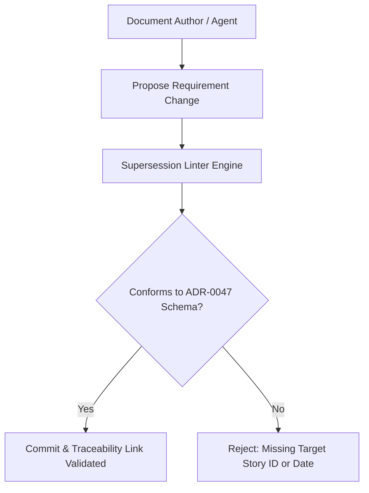

# TDS-0047: Standard Pattern for Cross-Story References and Supersession Language Specification

**Status:** Approved  
**Date:** 2026-09-06  
**Governing ADR:** [ADR-0047](../../adr/0047-standard-pattern-for-cross-story-references-and-supersession-language.md)  
**Related Epics/Stories:** Project Governance & Engineering Standards  
**Target Repositories:** `social-listening-core`, `social-listening-admin`, `docs`  
**Contract Test Citations:**  
- `social-listening-core/contracts/governance/adr-0047.supersession-language.contract.test.ts`  

---

## 1. Architectural Context & Problem Statement

As requirements, acceptance criteria (ACs), and technical specifications evolve across 18 Epics and 140+ ADRs, contracts and requirements inevitably undergo amendments and supersessions. Unstandardized supersession phrasing creates severe delivery risks:
1. **Ambiguous Live Contracts:** Developers and AI coding agents cannot determine whether an older acceptance criterion is actively binding or has been superseded by a later story.
2. **Broken Traceability Chains:** Automated linters cannot parse unstructured free-text comments indicating superseded behavior.

This specification formalizes the **Standardized Supersession Schema**:
- Canonical frontmatter tags: `supersedes: ["Story X.Y"]` and `superseded_by: ["Story A.B"]`.
- Structured alert callout blocks in Markdown:
  `> [!WARNING] Superseded Requirement`
  specifying superseding artifact ID, date of supersession, and precise delta.



---

## 2. Governing ADRs & Decision Log Reference
- **ADR-0047:** Standardizes cross-story references and supersession language across all documentation and user stories.
- **ADR-0027:** Project management and governance baseline.

---

## 3. Markdown Formatting Standards

```markdown
> [!WARNING] Superseded Acceptance Criterion
> **Superseded by:** [[Story 2.5]] via [[ADR-0023]] on 2026-07-30
> **Original Requirement:** Flat failure threshold (5 failures)
> **Active Requirement:** Rate-relative sliding failure threshold (> 15% in 60 seconds)
```

---

## 4. Verification & Contract Gate
Verified by automated documentation validation scripts ensuring 0 broken cross-story references and valid supersession links.
