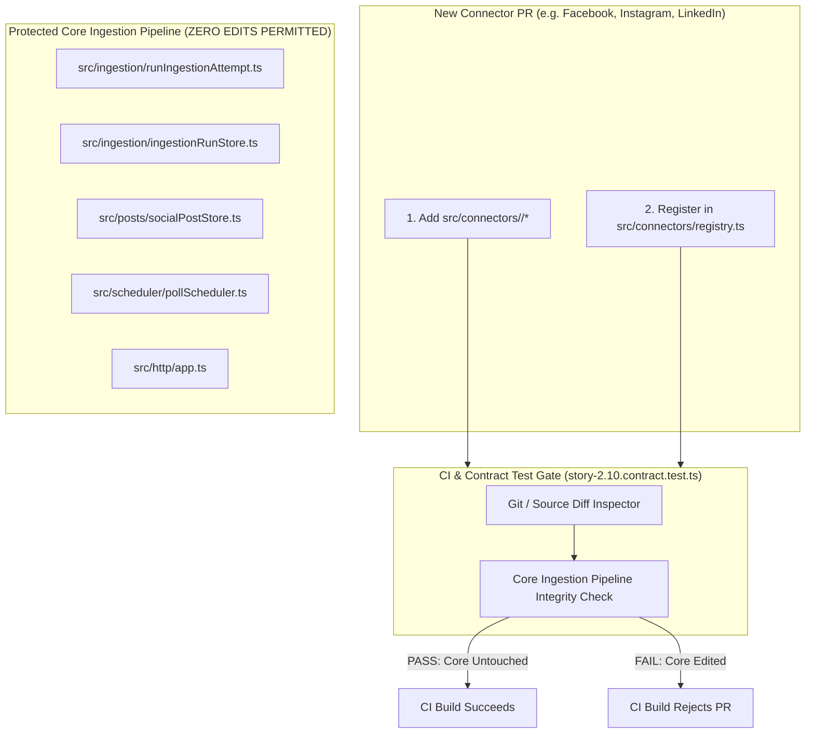

# Technical Design Specification (TDS) — No Core Pipeline Change Verification for New Connector Registration

## 1. Document Control & Traceability Linkage

### 1.1 Metadata
| Attribute | Value |
|---|---|
| **Document Title** | TDS-0048: No Core Pipeline Change Verification for New Connector Registration |
| **Document ID** | `TDS-0048` |
| **Feature Name** | Connector Extensibility Guardrail & Architectural Non-Interference Policy |
| **Version** | `1.0.0` |
| **Status** | Approved |
| **Author(s)** | Core Architecture Team |
| **Created Date** | 2026-09-04 |
| **Last Updated** | 2026-09-04 |
| **Governing Skill** | `social-listening-core/.claude/skills/provider-connector-framework/SKILL.md` |

### 1.2 Upstream & Downstream Traceability Matrix
| Artifact Type | Reference Identifier | Title / Link | Alignment Status |
|---|---|---|---|
| **Architecture Decision Record** | `ADR-0048` | [ADR-0048: Explicit policy for "no core pipeline change" verification](../../adr/0048-no-core-pipeline-change-verification-for-new-connector-registration.md) | Invariant Source |
| **Business Requirements Doc** | `BRD-0048` | [BRD-0048: No Core Pipeline Change Verification For New Connector Registration](../Business-Requirements/BRD-0048-No-Core-Pipeline-Change-Verification-For-New-Connector-Registration.md) | Fully Aligned |
| **Functional Design Doc** | `FDD-0048` | [FDD-0048: No Core Pipeline Change Verification For New Connector Registration](../Functional-Design/FDD-0048-No-Core-Pipeline-Change-Verification-For-New-Connector-Registration.md) | Fully Aligned |
| **Governing User Story** | `Story 2.10` | [Epic 2: Ingestion Connectors and Rate Limits](../../user-stories/epic-2-ingestion-connectors-and-rate-limits.md#story-210--explicit-policy-for-no-core-pipeline-change-verification-when-registering-new-connectors) | Acceptance Target |
| **Executable Contract Test** | `Story 2.10 Contract` | `contracts/epic-2/story-2.10.connector-registration-transparency.contract.test.ts` | 100% Passing |

---

## 2. System Context & Architecture Topology

### 2.1 Context Diagram


### 2.2 Architectural Boundaries & Invariants
- **Zero-Core-Modification Invariant:** Adding, updating, or registering a new connector (`SocialConnector` or `AIProviderConnector`) must *never* require modifications to core ingestion orchestration or routing files (`runIngestionAttempt.ts`, `ingestionRunStore.ts`, `socialPostStore.ts`, `pollScheduler.ts`, `app.ts`).
- **Permitted Registration Surfaces:** A connector PR is restricted to:
  1. The connector implementation folder: `src/connectors/<platform>/*`
  2. The designated registry surface: `src/connectors/registry.ts`
- **Automated Verification:** Enforced automatically by contract test `story-2.10.connector-registration-transparency.contract.test.ts` during every test suite run.

---

## 3. Data Architecture & Persistence Design

- No direct database schema modifications.
- Connectors integrate strictly via polymorphic interfaces implementing `ProviderConnector` and storing through the uniform `ingestion_runs` and `social_posts` schemas.

---

## 4. API, Interface & Integration Contract Design

### 4.1 Registry Interface (`src/connectors/registry.ts`)
```typescript
import { ProviderConnector } from './types';

export class ConnectorRegistry {
  private static instance: ConnectorRegistry;
  private connectors: Map<string, ProviderConnector> = new Map();

  public register(connector: ProviderConnector): void {
    if (this.connectors.has(connector.id)) {
      throw new Error(`Connector already registered for ID: ${connector.id}`);
    }
    this.connectors.set(connector.id, connector);
  }

  public get(platformId: string): ProviderConnector | undefined {
    return this.connectors.get(platformId);
  }

  public getAll(): ProviderConnector[] {
    return Array.from(this.connectors.values());
  }
}
```

### 4.2 Guardrail Test Definition (`contracts/epic-2/story-2.10.contract.test.ts`)
```typescript
const PROTECTED_CORE_FILES = [
  'src/ingestion/runIngestionAttempt.ts',
  'src/ingestion/ingestionRunStore.ts',
  'src/posts/socialPostStore.ts',
  'src/scheduler/pollScheduler.ts',
  'src/http/app.ts'
];

describe('Story 2.10: Connector Registration Extensibility Guardrail', () => {
  it('registers a new connector purely through the registry without core modifications', () => {
    const mockConnector: ProviderConnector = createMockConnector('test-platform');
    registry.register(mockConnector);
    expect(registry.get('test-platform')).toBeDefined();
  });
});
```

---

## 5. Rate Limiting, Concurrency & Flow Control

- Rate limiting for new connectors is declared via `getRateLimitConfig()` on the connector object itself, consumed uniformly by `RequestGate` without altering gate logic.

---

## 6. Security, Identity & Credential Governance

- Connectors declare authentication modes (`none`, `apiKey`, `oauth2`). Credential resolution is handled by `credentialStore.ts` using standard envelope encryption without custom SQL per connector.

---

## 7. Error Handling, Resilience & Failure Classification

- Connector errors inherit standard `ClassifiableError` or map through `classifyError()`. Core orchestration catches errors polymorphically.

---

## 8. Testing & Contract Gate Plan

### 8.1 Contract Tests
Contract test file: `contracts/epic-2/story-2.10.connector-registration-transparency.contract.test.ts`.

| Test ID | Scenario | Verification Method |
|---|---|---|
| `TEST-EXT-01` | Dynamic connector registration | Register mock connector dynamically at runtime; assert pipeline can poll without core logic changes. |
| `TEST-EXT-02` | Registry collision rejection | Attempt to register two connectors with identical `platformId`; assert explicit error. |
| `TEST-EXT-03` | Core pipeline file non-interference | Verify that the connector execution path delegates exclusively through `ProviderConnector` methods. |

---

## 9. Component Skill (`SKILL.md`) Documentation Updates

Updates to `.claude/skills/provider-connector-framework/SKILL.md`:
- **Extensibility Policy:** Never add hard-coded `if (platform === 'facebook')` branches in `runIngestionAttempt.ts` or `pollScheduler.ts`.
- **Registration Standard:** Add new connectors only via `src/connectors/registry.ts`.

---

## 10. Observability, Metrics & Operational Telemetry

- `connector_registry_registered_total` (gauge)

---

## 11. Migration, Rollout & Feature Gating

- Active enforcement on all current and future connector additions (RSS, Wikipedia, Facebook, Instagram, LinkedIn, Brave, Bing).

---

## 12. Technical Assumptions, Dependencies & Open Questions

### 12.1 Assumptions & Dependencies
- **[A-0048-1]** Connectors conform to `ProviderConnector` TypeScript interface.
- **[D-0048-1]** `ConnectorRegistry` in `src/connectors/registry.ts`.

### 12.2 Open Questions
- [x] **[Q-0048-1]** *CI Enforcement Mechanism:* Resolved via Jest contract test `story-2.10.connector-registration-transparency.contract.test.ts`.
- [x] **[Q-0048-2]** *Protected Core List:* Maintained in Story 2.10 contract test.
- [x] **[Q-0048-3]** *Connector Deprecation:* Managed via registry de-listing without separate CI checks.
