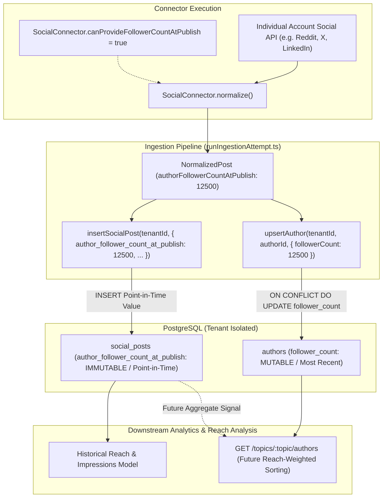
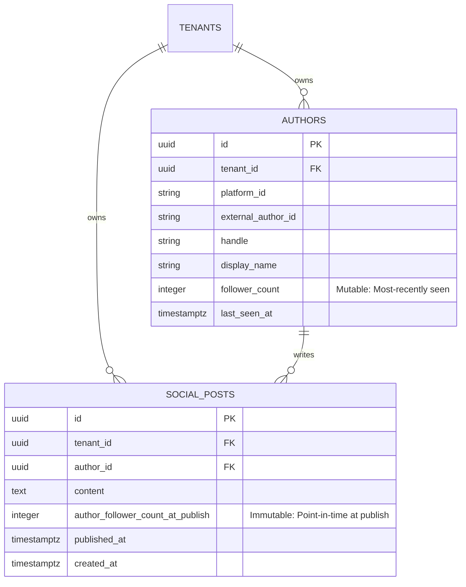
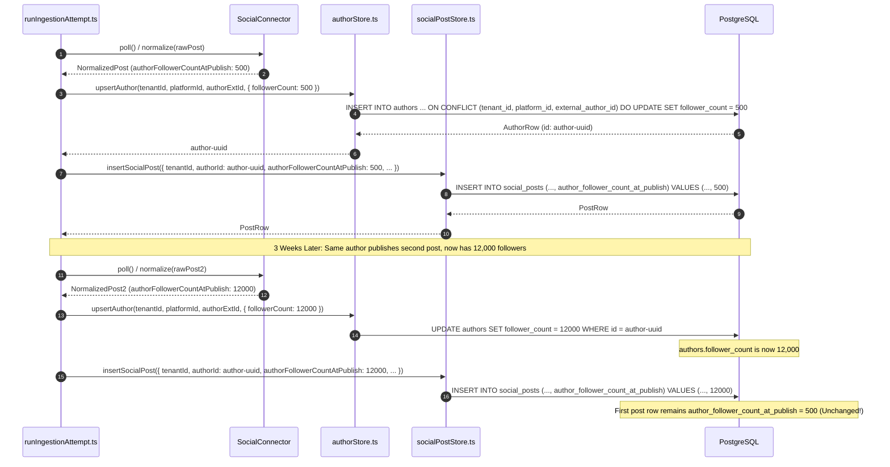

# Technical Design Specification (TDS) — Point-in-Time Author Follower Count on SocialPost

## 1. Document Control & Traceability Linkage

### 1.1 Metadata
| Attribute | Value |
|---|---|
| **Document Title** | TDS-0049: Point-in-Time Author Follower Count on SocialPost |
| **Document ID** | `TDS-0049` |
| **Feature Name** | Historical Audience Reach & Point-in-Time Author Follower Count Snapshot |
| **Version** | `1.0.0` |
| **Status** | Approved |
| **Author(s)** | Core Architecture Team |
| **Created Date** | 2026-09-05 |
| **Last Updated** | 2026-09-05 |
| **Governing Skill** | `social-listening-core/.claude/skills/posts-api/SKILL.md` |

### 1.2 Upstream & Downstream Traceability Matrix
| Artifact Type | Reference Identifier | Title / Link | Alignment Status |
|---|---|---|---|
| **Architecture Decision Record** | `ADR-0049` | [ADR-0049: Retain point-in-time author follower count on SocialPost](../../adr/0049-point-in-time-author-follower-count-on-social-post.md) | Invariant Source |
| **Business Requirements Doc** | `BRD-0049` | [BRD-0049: Point-In-Time Author Follower Count On Social Post](../Business-Requirements/BRD-0049-Point-In-Time-Author-Follower-Count-On-Social-Post.md) | Fully Aligned |
| **Functional Design Doc** | `FDD-0049` | [FDD-0049: Point-In-Time Author Follower Count On Social Post](../Functional-Design/FDD-0049-Point-In-Time-Author-Follower-Count-On-Social-Post.md) | Fully Aligned |
| **Governing User Story** | `Story 3.9` | [Epic 3: Data Model, Storage, and Archival](../../user-stories/epic-3-data-model-storage-and-archival.md#story-39--point-in-time-author-follower-count-on-socialpost) | Acceptance Target |
| **Related Architecture Decisions** | `ADR-0004`, `ADR-0007`, `ADR-0011`, `ADR-0018`, `ADR-0021` | Author Normalization, Expert Finder, Posts Pagination, Retention | Governed Exception |
| **Executable Contract Test** | `Story 3.9 Contract` | `social-listening-core/contracts/epic-3/story-3.9.author-follower-count-at-publish.contract.test.ts` | 100% Passing |

---

## 2. System Context & Architecture Topology

### 2.1 Context Diagram


### 2.2 Architectural Boundaries & Invariants
- **Narrow Scoped Exception to ADR-0004:** Only a single field (`author_follower_count_at_publish`) is stored redundantly on `social_posts`. Full author profile fields (`handle`, `display_name`, `avatar_url`, `profile_location`, `verified_status`) remain strictly normalized in `authors` per ADR-0004.
- **Append-Only Immutability:** Once written during post insertion, `social_posts.author_follower_count_at_publish` is never modified, never recalculated, and never updated when a subsequent post arrives from the same author with an updated audience count.
- **Independence from Author Upsert:** `authors.follower_count` continues to reflect the most recently observed audience count. `social_posts.author_follower_count_at_publish` is never derived from or reconciled against `authors.follower_count`.
- **First-Class Three-Way NULL Semantics:** A `NULL` value in this column carries explicit semantic meaning:
  1. *Connector-Level Non-Applicability:* Non-individual or organizational connectors (e.g. Newswire, GNews, Wikipedia, RSS domains) where follower counts are meaningless.
  2. *Platform-Level Omission:* The connector supports follower counts, but the platform API omitted author audience metrics for that specific post payload.
  3. *Historical Row Horizon:* The post was ingested prior to migration `0027`, and the column was not retroactively backfilled.
- **No Automatic REST Surface Exposure:** The column is added to the persistence layer (`social_posts` table and `InsertSocialPostInput`) but is not exposed on `GET /v1/posts` or `GET /v1/topics/:topic/authors` until authorized by future API design specifications.

---

## 3. Data Architecture & Persistence Design

### 3.1 Entity Relationship Diagram


### 3.2 DDL Schema & Database Migration
Implemented in `migrations/0027_add_social_posts_author_follower_count_at_publish.sql`:

```sql
-- Add nullable point-in-time follower count column to social_posts
ALTER TABLE social_posts
ADD COLUMN IF NOT EXISTS author_follower_count_at_publish INTEGER NULL;

-- Queryable Postgres Column Comment documenting the three-way NULL interpretation
COMMENT ON COLUMN social_posts.author_follower_count_at_publish IS
'Author follower count captured at the point in time the post was ingested. '
'NULL indicates: (1) connector does not report follower counts (e.g. Newswire, GNews), '
'(2) platform omitted the value for this specific post, or (3) post was ingested prior to this column being introduced.';
```

---

## 4. Component Design & Detailed Processing Logic

### 4.1 Connector Capability Declaration
Connectors declare whether they can capture point-in-time author follower counts using the `SocialConnector` interface contract:

```typescript
// social-listening-core/src/connectors/types.ts
export interface SocialConnector {
  id: string;
  name: string;
  version: string;
  // Capability flag analogous to supportedQueryFeatures (ADR-0021)
  canProvideFollowerCountAtPublish?: boolean;
  normalize(rawPost: unknown): NormalizedPost;
}

export interface NormalizedPost {
  externalId: string;
  content: string;
  authorExternalId: string;
  authorHandle?: string;
  authorDisplayName?: string;
  authorFollowerCount?: number;
  // Point-in-time snapshot value returned by the platform
  authorFollowerCountAtPublish?: number | null;
  publishedAt: Date;
}
```

### 4.2 Ingestion Pipeline Persistence Flow


---

## 5. Interface & Contract Specifications

### 5.1 Internal TypeScript Signatures
```typescript
// social-listening-core/src/posts/socialPostStore.ts
export interface InsertSocialPostInput {
  tenantId: string;
  runId: string;
  platformId: string;
  externalId: string;
  authorId: string;
  content: string;
  authorFollowerCountAtPublish?: number | null;
  publishedAt: Date;
  rawPayload?: Record<string, unknown>;
}
```

### 5.2 External REST Surface Exemption
In accordance with ADR-0049 §Decision and Story 3.9 AC8:
- `GET /v1/posts` response types (`SocialPostFull`, `SocialPostSummary`) do not include `authorFollowerCountAtPublish`.
- `GET /v1/topics/:topic/authors` does not include `sortBy=followerCountAtPublish`.
- This field serves internal analytical queries, export services (ADR-0074/0090), and future metric explainability pipelines (ADR-0086) without introducing uncoordinated breaking changes to existing public v1 contracts.

---

## 6. Security, Tenancy & Isolation Model

### 6.1 Tenant Isolation via PostgreSQL RLS
`social_posts` is protected by the tenant isolation policy defined in ADR-0015:
```sql
CREATE POLICY tenant_isolation ON social_posts
  FOR ALL
  USING (tenant_id = NULLIF(current_setting('app.tenant_id', true), '')::uuid)
  WITH CHECK (tenant_id = NULLIF(current_setting('app.tenant_id', true), '')::uuid);
```
Point-in-time follower counts cannot be accessed across tenant boundaries. Analytical batch queries and exports operate strictly within the tenant's execution context via `withTenant(tenantId, ...)`.

---

## 7. Performance, Scalability & Resource Caps

### 7.1 Storage Overhead
- The `INTEGER` column consumes 4 bytes per row in PostgreSQL. For an active tenant with 10,000,000 posts, the total raw storage consumed is ~40 MB, representing less than 0.5% of the total post table storage footprint.
- No default B-Tree index is added to `author_follower_count_at_publish`. Indexes are created conditionally in future analytics migrations (ADR-0086 / ADR-0105) if range filters on reach are required.

### 7.2 Integer Range Bounds
`INTEGER` supports signed values up to $2,147,483,647$. All known individual social media accounts (including the largest global accounts with 100M–600M followers) fit comfortably within 32-bit signed integers. In the event a platform returns higher metrics, migration to `BIGINT` is defined as a non-breaking future change.

---

## 8. Resilience, Recovery & Failure Semantics

### 8.1 Graceful Platform API Degradation
If an individual account connector encounters a platform rate limit or a post format that lacks author metrics, the connector returns `authorFollowerCountAtPublish: null`. The ingestion pipeline inserts the post successfully with a `NULL` follower count rather than failing the run or dropping the post.

---

## 9. Observability, Telemetry & Auditability

### 9.1 Data Quality & Ingestion Auditing
- Ingestion telemetry logs record the percentage of ingested posts per run that successfully captured `authorFollowerCountAtPublish`.
- For connectors with `canProvideFollowerCountAtPublish = true`, an alert is triggered if `null_follower_count_ratio` reaches 100% over a 1-hour window, signalling upstream platform API schema drift.

---

## 10. Migration, Compatibility & Rollback Strategy

### 10.1 Forward Migration Strategy
- `migrations/0027_add_social_posts_author_follower_count_at_publish.sql` is strictly non-blocking and executes in $< 10\text{ms}$ via `ALTER TABLE social_posts ADD COLUMN IF NOT EXISTS ...`.
- No `UPDATE` statement is executed on historical data, preserving the append-only integrity of historical posts.

### 10.2 Downward Rollback Procedure
```sql
ALTER TABLE social_posts DROP COLUMN IF EXISTS author_follower_count_at_publish;
```
Dropping the column restores the pre-0027 schema with zero data loss to core post content or author entities.

---

## 11. Verification, Testing & Quality Assurance

### 11.1 Contract Test Coverage
`social-listening-core/contracts/epic-3/story-3.9.author-follower-count-at-publish.contract.test.ts` validates:
- **AC1:** Schema verification — one new nullable `INTEGER` column; no unauthorized author fields added.
- **AC2:** Immutability — a second post with a different follower count does not alter the first post's snapshot.
- **AC3:** Author independence — updating `authors.follower_count` via upsert does not overwrite existing post snapshot values.
- **AC4:** Author model consistency — `Author.followerCount` continues to track current upserted metrics.
- **AC5:** Non-participating connectors — Newswire and GNews unmodified pollers write `NULL` values.
- **AC6:** SQL documentation — column comment is queryable via `pg_description`.
- **AC7:** Append-only horizon — pre-existing rows retain `NULL` without retroactive backfill.
- **AC8:** API immutability — REST responses for `/v1/posts` and `/v1/topics/:topic/authors` remain untouched.

---

## 12. Open Questions & Future Enhancements

- [ ] **[Q-0049-1]** **Documentation of NULL semantics across consumer documentation.** Maintained in column comments; should be reflected in developer API documentation if the field is exposed publicly.
- [ ] **[Q-0049-2]** **BIGINT vs INTEGER column type for extreme audience counts.** INTEGER (2.1B cap) is sufficient for v1; revisit if YouTube channel subscriber counts or TikTok view/follower counts exceed 32-bit limits.
- [ ] **[Q-0049-3]** **Whether `GET /topics/:topic/authors` should accept reach-weighted sorting (`sortBy=followerCountAtPublish`).** Requires analytical composite scoring definition (ADR-0007 / ADR-0022).
- [ ] **[Q-0049-4]** **Whether historical backfill from platform APIs is ever in scope.** Historical posts remain `NULL`; platform API policies and costs will determine if backfills are ever viable.
- [x] ~~**[Q-0049-5]** **Connector-capability declaration shape.** Resolved via `SocialConnector.canProvideFollowerCountAtPublish: boolean` in `src/connectors/types.ts`.~~
