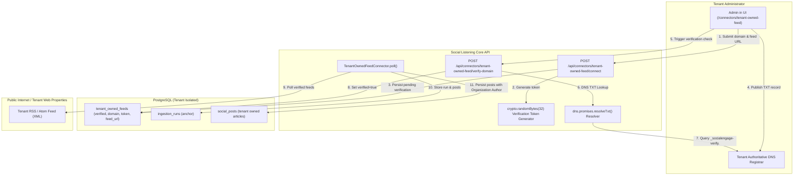
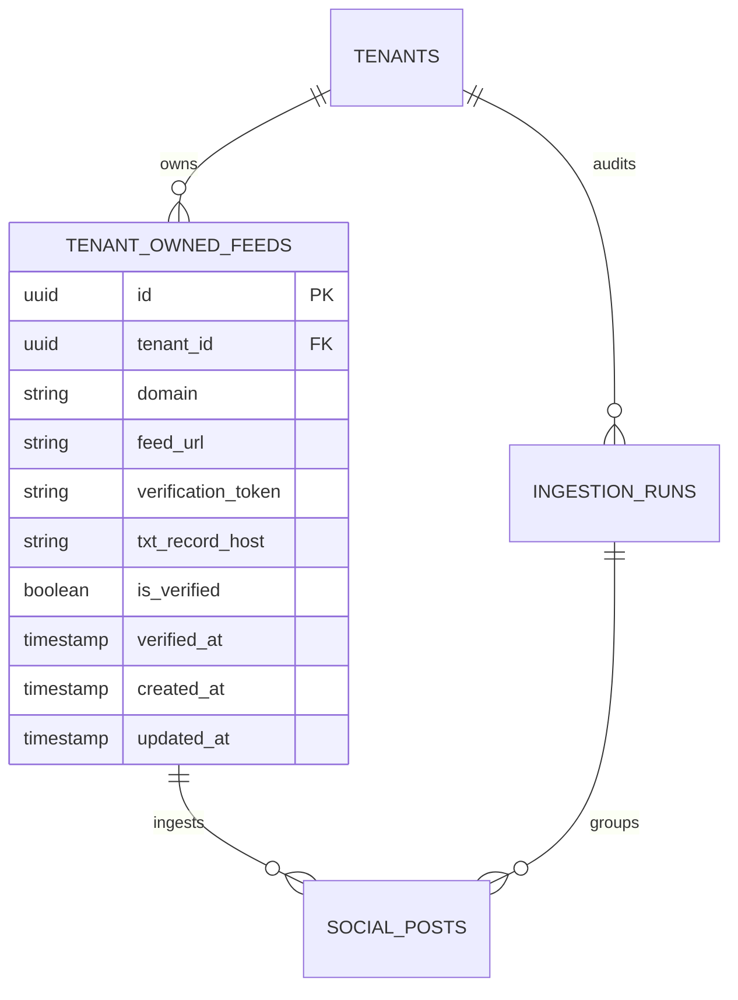

# Technical Design Specification (TDS) — Tenant-Owned-Domain RSS/Content-Feed Connector

## 1. Document Control & Traceability Linkage

### 1.1 Metadata
| Attribute | Value |
|---|---|
| **Document Title** | TDS-0050: Tenant-Owned-Domain RSS/Content-Feed Connector with DNS TXT Verification |
| **Document ID** | `TDS-0050` |
| **Feature Name** | Tenant-Owned RSS/Atom Feed Ingestion & DNS TXT Ownership Verification |
| **Version** | `1.0.0` |
| **Status** | Approved |
| **Author(s)** | Core Ingestion Team |
| **Created Date** | 2026-09-04 |
| **Last Updated** | 2026-09-04 |
| **Governing Skill** | `social-listening-core/.claude/skills/tenant-owned-feed-connector/SKILL.md` |

### 1.2 Upstream & Downstream Traceability Matrix
| Artifact Type | Reference Identifier | Title / Link | Alignment Status |
|---|---|---|---|
| **Architecture Decision Record** | `ADR-0050` | [ADR-0050: Tenant-owned-domain RSS/content-feed connector with DNS TXT domain ownership verification](../../adr/0050-tenant-owned-domain-rss-content-feed-connector.md) | Invariant Source |
| **Business Requirements Doc** | `BRD-0050` | [BRD-0050: Tenant-Owned-Domain RSS Content-Feed Connector](../Business-Requirements/BRD-0050-Tenant-Owned-Domain-RSS-Content-Feed-Connector.md) | Fully Aligned |
| **Functional Design Doc** | `FDD-0050` | [FDD-0050: Tenant-Owned-Domain RSS Content-Feed Connector](../Functional-Design/FDD-0050-Tenant-Owned-Domain-RSS-Content-Feed-Connector.md) | Fully Aligned |
| **Governing User Story** | `Story 2.11` | [Epic 2: Ingestion Connectors and Rate Limits](../../user-stories/epic-2-ingestion-connectors-and-rate-limits.md#story-211--tenant-owned-feed-connector-with-dns-txt-verification) | Acceptance Target |
| **Executable Contract Test** | `Story 2.11 Contract` | `contracts/epic-2/story-2.11.tenant-owned-feed-connector.contract.test.ts` | 100% Passing |

---

## 2. System Context & Architecture Topology

### 2.1 Context Diagram


### 2.2 Architectural Boundaries & Invariants
- **Ownership Gating Invariant:** Ingestion runs must *never* execute for a tenant-owned feed until DNS TXT record ownership has been affirmatively verified. An unverified feed row must be completely ignored by `TenantOwnedFeedConnector.poll()`.
- **Zero Third-Party Vendor Auth:** The connector operates under `authMode: 'none'`. No API keys or OAuth credentials are stored in `tenant_credentials`.
- **Organization-as-Author Invariant:** RSS `<item>` records default to modeling the tenant's organization as the post `Author` (e.g. `Author.name = tenant.name` or channel title), with individual bylines (if present in `<author>` or `<dc:creator>`) mapped to metadata.
- **Deduplication Invariant:** Posts are uniquely identified and deduplicated across runs using the RSS `<guid>` element, with fallback to `<link>` if `<guid>` is missing.

---

## 3. Data Architecture & Persistence Design

### 3.1 Entity Relationship Diagram


### 3.2 Schema DDL (PostgreSQL Migration)
```sql
CREATE TABLE IF NOT EXISTS tenant_owned_feeds (
    id UUID PRIMARY KEY DEFAULT gen_random_uuid(),
    tenant_id UUID NOT NULL REFERENCES tenants(id) ON DELETE CASCADE,
    domain VARCHAR(255) NOT NULL,
    feed_url TEXT NOT NULL,
    verification_token VARCHAR(128) NOT NULL,
    txt_record_host VARCHAR(255) NOT NULL,
    is_verified BOOLEAN NOT NULL DEFAULT FALSE,
    verified_at TIMESTAMPTZ,
    created_at TIMESTAMPTZ NOT NULL DEFAULT NOW(),
    updated_at TIMESTAMPTZ NOT NULL DEFAULT NOW(),
    CONSTRAINT uq_tenant_feed UNIQUE (tenant_id, feed_url)
);

ALTER TABLE tenant_owned_feeds ENABLE ROW LEVEL SECURITY;
ALTER TABLE tenant_owned_feeds FORCE ROW LEVEL SECURITY;

CREATE POLICY tenant_isolation_tenant_owned_feeds ON tenant_owned_feeds
    FOR ALL
    USING (tenant_id = NULLIF(current_setting('app.tenant_id', true), '')::uuid);

CREATE INDEX idx_tenant_owned_feeds_poll ON tenant_owned_feeds (tenant_id, is_verified) 
    WHERE is_verified = TRUE;
```

---

## 4. API, Interface & Integration Contract Design

### 4.1 TypeScript Interfaces (`src/connectors/tenant-owned-feed/types.ts`)
```typescript
export interface TenantOwnedFeed {
  id: string;
  tenantId: string;
  domain: string;
  feedUrl: string;
  verificationToken: string;
  txtRecordHost: string;
  isVerified: boolean;
  verifiedAt: string | null;
  createdAt: string;
  updatedAt: string;
}

export interface ConnectFeedRequest {
  domain: string;
  feedUrl: string;
}

export interface ConnectFeedResponse {
  feedId: string;
  txtRecordHost: string;
  txtRecordValue: string;
  isVerified: boolean;
}

export interface VerifyDomainResponse {
  feedId: string;
  isVerified: boolean;
  message: string;
}
```

### 4.2 DNS Verification Engine (`src/connectors/tenant-owned-feed/dnsVerifier.ts`)
```typescript
import dns from 'dns/promises';

export class DnsVerifier {
  public static async verifyTxtRecord(host: string, expectedToken: string): Promise<boolean> {
    try {
      const records = await dns.resolveTxt(host);
      // Flatten chunks in TXT responses
      const flattened = records.map(chunks => chunks.join(''));
      return flattened.some(rec => rec.trim() === `socialengage-verify=${expectedToken}`);
    } catch (err: any) {
      if (err.code === 'ENODATA' || err.code === 'ENOTFOUND') {
        return false;
      }
      throw err;
    }
  }
}
```

---

## 5. Rate Limiting, Concurrency & Flow Control

- **Polite Crawl Rate Limiting:** Outbound HTTP requests to the tenant's RSS feed are governed by `RequestGate` with:
  - Max 1 concurrent request per tenant feed.
  - Minimum request interval: 10 seconds between consecutive feed fetches.
- **Poll Interval Cadence:** Feeds are polled according to tenant settings or standard interval (default: 30 minutes), respecting `<ttl>` or `Cache-Control` max-age headers when present.

---

## 6. Security, Identity & Credential Governance

- **Authorization Requirement:** Only users with `Admin` or `Owner` roles within the tenant may register or verify feeds.
- **Token Entropy:** `verification_token` uses 32 bytes of cryptographically secure randomness via `crypto.randomBytes(32).toString('hex')`.
- **SSRF Prevention:** The backend validates `feedUrl` to block private IP addresses, localhost (`127.0.0.1`, `::1`), link-local metadata addresses (`169.254.169.254`), and non-standard HTTP/HTTPS ports.

---

## 7. Error Handling, Resilience & Failure Classification

| Error Scenario | Classification | Behavior & Recovery |
|---|---|---|
| **DNS TXT Not Found / Propagating** | Transient / Informational | Returns `isVerified: false` with guidance to wait for DNS propagation. No failure run recorded. |
| **HTTP 404 / 410 on Feed URL** | Non-Retryable Error | Increments connector error counter. After 5 consecutive failures, flags feed as unreachable. |
| **Malformed XML / Parse Error** | Non-Retryable Error | Records `ingestion_run` failure with error summary `XML parse failed`; skips unparseable items. |
| **Network Timeout (> 15s)** | Retryable Error | Backs off with exponential jitter; does not fail entire run if partial items parsed. |

---

## 8. Testing & Contract Gate Plan

### 8.1 Contract Tests
Contract test file: `contracts/epic-2/story-2.11.tenant-owned-feed-connector.contract.test.ts`.

| Test ID | Scenario | Verification Method |
|---|---|---|
| `TEST-FEED-01` | Initiate feed registration | Submit domain and feed URL; verify token generation and unverified state. |
| `TEST-FEED-02` | DNS verification success | Mock DNS resolver returning valid TXT token; assert `is_verified` switches to true. |
| `TEST-FEED-03` | Ingestion poll gating | Assert `poll()` ignores unverified feeds and ingests items from verified feeds. |
| `TEST-FEED-04` | Organization Author mapping | Verify parsed posts assign the tenant organization as `Author`. |
| `TEST-FEED-05` | Deduplication on `<guid>` | Ingest feed twice; assert duplicate `<guid>` items are ignored. |

---

## 9. Component Skill (`SKILL.md`) Documentation Updates

Updates to `.claude/skills/tenant-owned-feed-connector/SKILL.md`:
- **Verification Workflow:** Document TXT record host convention `_socialengage-verify.<domain>` and value string format `socialengage-verify=<token>`.
- **Feed Polling Safety:** Explicit instructions on URL validation and SSRF filtering before initiating external requests.

---

## 10. Observability, Metrics & Operational Telemetry

- `tenant_feed_verifications_total{status="success|pending|failed"}` (counter)
- `tenant_feed_ingested_posts_total` (counter)
- `tenant_feed_fetch_duration_seconds` (histogram)

---

## 11. Migration, Rollout & Feature Gating

- Migration `20260811000000_create_tenant_owned_feeds.sql` creates table and RLS policy.
- Zero downtime rollout; feature enabled immediately upon deployment.

---

## 12. Technical Assumptions, Dependencies & Open Questions

### 12.1 Assumptions & Dependencies
- **[A-0050-1]** Tenant has administrative authority over their DNS zone.
- **[D-0050-1]** Node.js native `dns/promises` available in runtime environment.

### 12.2 Open Questions
- [x] **[Q-0050-1]** *DNS TTL & Propagation Delay:* Acknowledged 5 min to 72 hours; UI provides explicit copy instructing users on propagation.
- [x] **[Q-0050-2]** *Multi-Feed Administration:* Resolved by ADR-0057 (TDS-0057).
- [x] **[Q-0050-3]** *Author Identity Formulation:* Resolved by modeling the publication/organization as Author with byline metadata.
