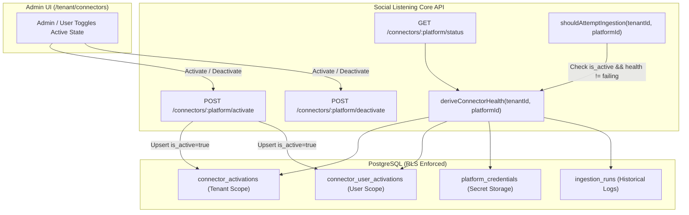
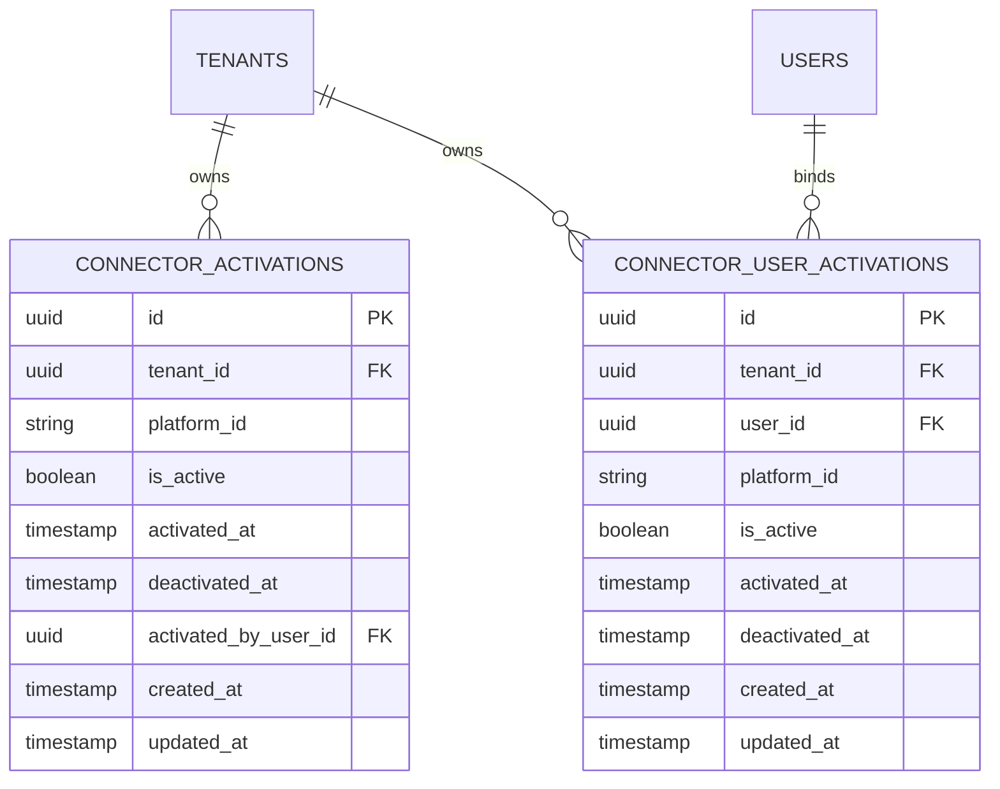

# Technical Design Specification (TDS) — Connector Activation Decoupled from Credential Storage

## 1. Document Control & Traceability Linkage

### 1.1 Metadata
| Attribute | Value |
|---|---|
| **Document Title** | TDS-0051: Connector Activation Decoupled from Credential Storage |
| **Document ID** | `TDS-0051` |
| **Feature Name** | Decoupled Connector Activation Architecture (`connector_activations` & `connector_user_activations`) |
| **Version** | `1.0.0` |
| **Status** | Approved |
| **Author(s)** | Core Architecture Team |
| **Created Date** | 2026-09-04 |
| **Last Updated** | 2026-09-04 |
| **Governing Skill** | `social-listening-core/.claude/skills/connector-activation/SKILL.md` |

### 1.2 Upstream & Downstream Traceability Matrix
| Artifact Type | Reference Identifier | Title / Link | Alignment Status |
|---|---|---|---|
| **Architecture Decision Record** | `ADR-0051` | [ADR-0051: Connector activation decoupled from credential storage](../../adr/0051-connector-activation-decoupled-from-credential.md) | Invariant Source |
| **Business Requirements Doc** | `BRD-0051` | [BRD-0051: Connector Activation Decoupled From Credential](../Business-Requirements/BRD-0051-Connector-Activation-Decoupled-From-Credential.md) | Fully Aligned |
| **Functional Design Doc** | `FDD-0051` | [FDD-0051: Connector Activation Decoupled From Credential](../Functional-Design/FDD-0051-Connector-Activation-Decoupled-From-Credential.md) | Fully Aligned |
| **Governing User Story** | `Story 1.11` | [Epic 1: Repository and API Foundation](../../user-stories/epic-1-repository-and-api-foundation.md#story-111--connector-activation-decoupled-from-credential-storage) | Acceptance Target |
| **Executable Contract Test** | `Story 1.11 Contract` | `contracts/epic-1/story-1.11.connector-activation.contract.test.ts` | 100% Passing |
| **Dependent Contract Test** | `Story 1.12 Contract` | `contracts/epic-1/story-1.12.connector-status-includes-activation.contract.test.ts` | 100% Passing |

---

## 2. System Context & Architecture Topology

### 2.1 Context Diagram


### 2.2 Architectural Boundaries & Invariants
- **Decoupling Invariant:** Storing a credential must *never* automatically activate a connector, and deactivating a connector must *never* delete stored credentials. Deactivation is a non-destructive pause.
- **Two-Scope Storage Model:**
  - Tenant-level connectors (`owner_type = 'tenant'`) persist activation state in `connector_activations`.
  - User-level connectors (`owner_type = 'user'`) persist activation state in `connector_user_activations`.
- **Zero-Credential (`authMode: 'none'`) Support:** Activation for connectors with no credentials (e.g. Newswire, Wikipedia) is governed solely by `connector_activations.is_active`.
- **Lazy Row Evaluation:** Absence of a row in `connector_activations` indicates that the connector is **inactive** (`is_active = false`).
- **Retryable Health Isolation:** Failures with `retryable = true` (transient network, rate limits) do not increment the non-retryable consecutive failure counter that causes `failing` lockouts.

---

## 3. Data Architecture & Persistence Design

### 3.1 Entity Relationship Diagram


### 3.2 Schema DDL (PostgreSQL Migration)
```sql
-- 1. Tenant-level connector activations
CREATE TABLE IF NOT EXISTS connector_activations (
    id UUID PRIMARY KEY DEFAULT gen_random_uuid(),
    tenant_id UUID NOT NULL REFERENCES tenants(id) ON DELETE CASCADE,
    platform_id VARCHAR(64) NOT NULL,
    is_active BOOLEAN NOT NULL DEFAULT FALSE,
    activated_at TIMESTAMPTZ,
    deactivated_at TIMESTAMPTZ,
    activated_by_user_id UUID REFERENCES users(id) ON DELETE SET NULL,
    created_at TIMESTAMPTZ NOT NULL DEFAULT NOW(),
    updated_at TIMESTAMPTZ NOT NULL DEFAULT NOW(),
    CONSTRAINT uq_tenant_platform_activation UNIQUE (tenant_id, platform_id)
);

ALTER TABLE connector_activations ENABLE ROW LEVEL SECURITY;
ALTER TABLE connector_activations FORCE ROW LEVEL SECURITY;

CREATE POLICY tenant_isolation_connector_activations ON connector_activations
    FOR ALL
    USING (tenant_id = NULLIF(current_setting('app.tenant_id', true), '')::uuid);

-- 2. User-level connector activations (Tier 3)
CREATE TABLE IF NOT EXISTS connector_user_activations (
    id UUID PRIMARY KEY DEFAULT gen_random_uuid(),
    tenant_id UUID NOT NULL REFERENCES tenants(id) ON DELETE CASCADE,
    user_id UUID NOT NULL REFERENCES users(id) ON DELETE CASCADE,
    platform_id VARCHAR(64) NOT NULL,
    is_active BOOLEAN NOT NULL DEFAULT FALSE,
    activated_at TIMESTAMPTZ,
    deactivated_at TIMESTAMPTZ,
    created_at TIMESTAMPTZ NOT NULL DEFAULT NOW(),
    updated_at TIMESTAMPTZ NOT NULL DEFAULT NOW(),
    CONSTRAINT uq_user_platform_activation UNIQUE (tenant_id, user_id, platform_id)
);

ALTER TABLE connector_user_activations ENABLE ROW LEVEL SECURITY;
ALTER TABLE connector_user_activations FORCE ROW LEVEL SECURITY;

CREATE POLICY tenant_isolation_connector_user_activations ON connector_user_activations
    FOR ALL
    USING (tenant_id = NULLIF(current_setting('app.tenant_id', true), '')::uuid);
```

---

## 4. API, Interface & Integration Contract Design

### 4.1 TypeScript Interfaces (`src/connectors/activation/types.ts`)
```typescript
export interface ConnectorActivationStatus {
  platformId: string;
  isActive: boolean;
  activatedAt: string | null;
  deactivatedAt: string | null;
  hasCredential: boolean;
  canActivate: boolean;
}

export interface ActivationToggleRequest {
  active: boolean;
}

export interface ConnectorHealthWithActivation {
  platformId: string;
  status: 'healthy' | 'degraded' | 'failing' | 'disconnected' | 'reconnect_required';
  isActive: boolean;
  credentialStatus: 'valid' | 'expired' | 'invalid' | null;
  lastAttemptAt: string | null;
  lastSuccessfulFetchAt: string | null;
}
```

### 4.2 Activation Store Functions (`src/connectors/activation/activationStore.ts`)
```typescript
export async function setConnectorActive(
  tenantId: string,
  platformId: string,
  active: boolean,
  userId?: string
): Promise<void> {
  const now = new Date();
  if (userId) {
    await pool.query(
      `INSERT INTO connector_user_activations (tenant_id, user_id, platform_id, is_active, activated_at, deactivated_at, updated_at)
       VALUES ($1, $2, $3, $4, CASE WHEN $4 THEN $5 ELSE NULL END, CASE WHEN NOT $4 THEN $5 ELSE NULL END, $5)
       ON CONFLICT (tenant_id, user_id, platform_id)
       DO UPDATE SET is_active = $4,
                     activated_at = CASE WHEN $4 THEN $5 ELSE connector_user_activations.activated_at END,
                     deactivated_at = CASE WHEN NOT $4 THEN $5 ELSE connector_user_activations.deactivated_at END,
                     updated_at = $5`,
      [tenantId, userId, platformId, active, now]
    );
  } else {
    await pool.query(
      `INSERT INTO connector_activations (tenant_id, platform_id, is_active, activated_at, deactivated_at, updated_at)
       VALUES ($1, $2, $3, CASE WHEN $3 THEN $4 ELSE NULL END, CASE WHEN NOT $3 THEN $4 ELSE NULL END, $4)
       ON CONFLICT (tenant_id, platform_id)
       DO UPDATE SET is_active = $3,
                     activated_at = CASE WHEN $3 THEN $4 ELSE connector_activations.activated_at END,
                     deactivated_at = CASE WHEN NOT $3 THEN $4 ELSE connector_activations.deactivated_at END,
                     updated_at = $4`,
      [tenantId, platformId, active, now]
    );
  }
}
```

---

## 5. Rate Limiting, Concurrency & Flow Control

- **Pre-Activation Quota Protection:** Connectors in an inactive state (`is_active = false`) are entirely bypassed by the polling scheduler; zero API calls are made and zero quota is consumed.
- **Concurrent Toggle Safety:** SQL `ON CONFLICT DO UPDATE` ensures idempotent, atomic state transitions when concurrent activation requests occur.

---

## 6. Security, Identity & Credential Governance

- **Role-Based Activation Authority:**
  - Tenant-level connectors require `Admin` or `Owner` role.
  - User-level connectors (Tier 3) may be activated or deactivated by the individual owning user.
- **Credential Storage Independence:** Credentials remain securely encrypted in `platform_credentials` regardless of activation state. Deactivation does not purge or overwrite encryption envelopes.

---

## 7. Error Handling, Resilience & Failure Classification

- **Decoupled Circuit Breaker:** When `deriveConnectorHealth()` detects a hard failure (`failing`), it updates health status without mutating `is_active` in `connector_activations`.
- **Retryable vs. Non-Retryable Error Differentiation:** Failures with `retryable = true` (e.g. rate limit HTTP 429) do not trip the 20-consecutive-failure circuit breaker; only persistent non-retryable errors (e.g. HTTP 401/403) transition status to `reconnect_required` or `failing`.

---

## 8. Testing & Contract Gate Plan

### 8.1 Contract Tests
Contract test file: `contracts/epic-1/story-1.11.connector-activation.contract.test.ts`.

| Test ID | Scenario | Verification Method |
|---|---|---|
| `TEST-ACT-01` | Initial state evaluation | Query status for newly initialized tenant; assert `isActive = false` via lazy resolution. |
| `TEST-ACT-02` | Activate without credential (`authMode: 'none'`) | Activate Newswire; assert `isActive = true` and `shouldAttemptIngestion = true`. |
| `TEST-ACT-03` | Non-destructive deactivation | Store GNews API key, activate, then deactivate; assert key remains in `platform_credentials` while `isActive = false`. |
| `TEST-ACT-04` | Scope independence | Deactivate tenant-level connector; assert user-level activation for same platform remains intact. |
| `TEST-ACT-05` | Retryable error health preservation | Simulate 5 consecutive HTTP 429 errors with `retryable: true`; assert health does not enter `failing`. |

---

## 9. Component Skill (`SKILL.md`) Documentation Updates

Updates to `.claude/skills/connector-activation/SKILL.md`:
- **Operational Guidance:** Never equate `hasCredential` with "connected". Always check both `hasCredential` (if applicable) and `isActive`.
- **Destructive Deletion Policy:** Clarify that "Disconnect" in the UI should deactivate the connector, offering a separate explicit "Remove Credentials" action if deletion is desired.

---

## 10. Observability, Metrics & Operational Telemetry

- `connector_activation_status{platform_id, tenant_id, is_active}` (gauge)
- `connector_activation_transitions_total{platform_id, action="activate|deactivate"}` (counter)

---

## 11. Migration, Rollout & Feature Gating

- Migration `20260812000000_create_connector_activations.sql` applied.
- Backfill script sets `is_active = true` for existing tenants with stored credentials to preserve existing behavior seamlessly.

---

## 12. Technical Assumptions, Dependencies & Open Questions

### 12.1 Assumptions & Dependencies
- **[A-0051-1]** Postgres RLS enforces tenant isolation across both activation tables.
- **[D-0051-1]** `platform_credentials` stores envelope-encrypted secrets independently.

### 12.2 Open Questions
- [x] **[Q-0051-1]** *Table Structure:* Resolved into two dedicated tables (`connector_activations` and `connector_user_activations`).
- [x] **[Q-0051-2]** *Lazy Creation:* Resolved; missing row defaults to `is_active = false`.
- [x] **[Q-0051-3]** *Retryable Handling in Health:* Resolved; `deriveConnectorHealth()` checks `retryable` column.
