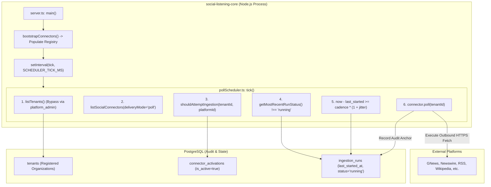
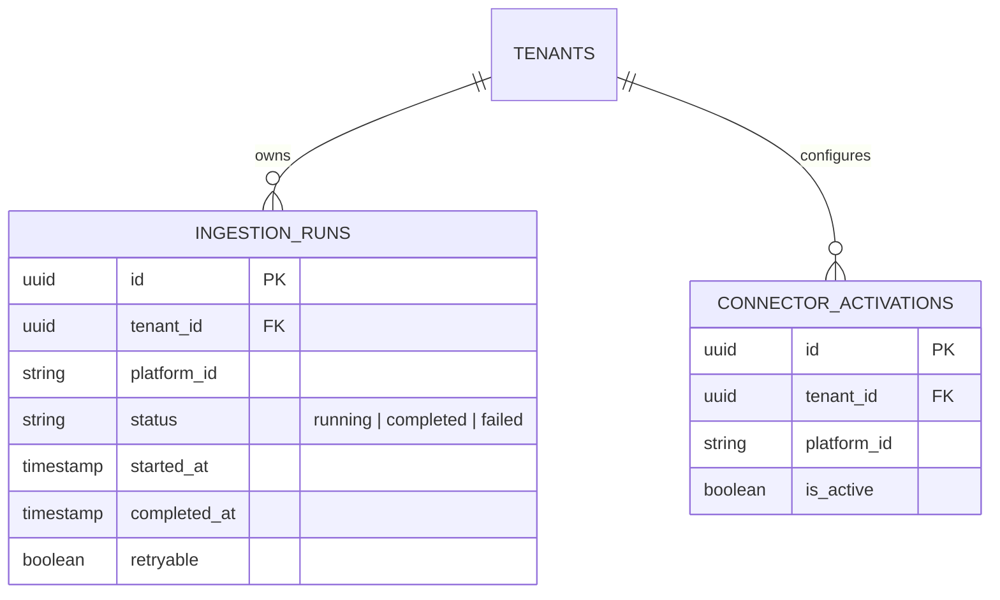

# Technical Design Specification (TDS) — Live Ingestion Polling Scheduler

## 1. Document Control & Traceability Linkage

### 1.1 Metadata
| Attribute | Value |
|---|---|
| **Document Title** | TDS-0052: Live Ingestion Polling Scheduler |
| **Document ID** | `TDS-0052` |
| **Feature Name** | In-Process Multi-Tenant Polling Scheduler Engine with Derived Cadence & In-Flight Guards |
| **Version** | `1.0.0` |
| **Status** | Approved |
| **Author(s)** | Core Architecture Team |
| **Created Date** | 2026-09-04 |
| **Last Updated** | 2026-09-04 |
| **Governing Skill** | `social-listening-core/.claude/skills/live-ingestion-polling-scheduler/SKILL.md` |

### 1.2 Upstream & Downstream Traceability Matrix
| Artifact Type | Reference Identifier | Title / Link | Alignment Status |
|---|---|---|---|
| **Architecture Decision Record** | `ADR-0052` | [ADR-0052: Live ingestion-polling scheduler](../../adr/0052-live-ingestion-polling-scheduler.md) | Invariant Source |
| **Business Requirements Doc** | `BRD-0052` | [BRD-0052: Live Ingestion Polling Scheduler](../Business-Requirements/BRD-0052-Live-Ingestion-Polling-Scheduler.md) | Fully Aligned |
| **Functional Design Doc** | `FDD-0052` | [FDD-0052: Live Ingestion Polling Scheduler](../Functional-Design/FDD-0052-Live-Ingestion-Polling-Scheduler.md) | Fully Aligned |
| **Governing User Story** | `Story 1.13` | [Epic 1: Repository and API Foundation](../../user-stories/epic-1-repository-and-api-foundation.md#story-113--live-ingestion-polling-scheduler) | Acceptance Target |
| **Dependent User Story** | `Story 1.14` | [Epic 1: Repository and API Foundation](../../user-stories/epic-1-repository-and-api-foundation.md#story-114--poll-scheduler-skip-in-flight-runs) | In-Flight Guard Target |
| **Executable Contract Test** | `Story 1.13 Contract` | `contracts/epic-1/story-1.13.live-ingestion-polling-scheduler.contract.test.ts` | 100% Passing |
| **Executable Contract Test** | `Story 1.14 Contract` | `contracts/epic-1/story-1.14.poll-scheduler-skip-in-flight.contract.test.ts` | 100% Passing |

---

## 2. System Context & Architecture Topology

### 2.1 Context Diagram


### 2.2 Architectural Boundaries & Invariants
- **In-Process Application Layer Scheduling:** Polling runs inside `social-listening-core`'s Node.js process using native `setInterval` ticks (default: every 30 seconds). External schedulers (`pg_cron`, separate cron containers) are explicitly rejected because outbound network requests, Key Vault decrypts, and in-memory rate gates (`RequestGate`) reside in the Node runtime.
- **Generic Polymorphic Ingestion (`ADR-0048` Compliance):** The scheduler *must never* contain hard-coded platform branches (e.g. `if (platform === 'gnews')`). Connectors declare optional `poll?(tenantId: string)` and `pollCadenceMs?: number` on their `SocialConnector` registration.
- **Derived Cadence Invariant:** Cadence is derived purely from `now - last_started_at >= cadence * (1 + jitter)`. No "next_poll_at" column is ever persisted.
- **Deterministic Jitter (Thundering-Herd Defense):** `jitterFraction(tenantId, platformId)` computes a stable ±5% offset via `(hash(tenantId + ':' + platformId) % 1000) / 1000 * 0.1 - 0.05`, spreading out requests across tenants without randomness during test assertions.
- **In-Flight Concurrency Guard (§5b):** If the most recent `ingestion_runs` row for a given `(tenantId, platformId)` has `status = 'running'`, polling is unconditionally skipped on that tick.
- **Process Resilience & Failure Isolation:** Unhandled exceptions from any individual connector poll must be caught at the scheduler loop level and logged, never crashing the Node process or aborting subsequent tenant evaluations.

---

## 3. Data Architecture & Persistence Design

### 3.1 Entity Relationship Diagram


### 3.2 Key Database Query (Cadence & In-Flight Status)
```sql
-- Evaluates the last run start time and current running state for a tenant-platform pair
SELECT 
    started_at,
    status
FROM ingestion_runs
WHERE tenant_id = $1 
  AND platform_id = $2
ORDER BY started_at DESC
LIMIT 1;
```

---

## 4. API, Interface & Integration Contract Design

### 4.1 Extended Connector Interfaces (`src/connectors/types.ts`)
```typescript
import { RunIngestionAttemptResult } from '../ingestion/runIngestionAttempt';

export interface SocialConnector {
  id: string;
  displayName: string;
  authMode: 'none' | 'apiKey' | 'oauth2';
  deliveryMode: 'poll' | 'webhook' | 'push';
  
  // Generic scheduler surfaces
  poll?(tenantId: string): Promise<RunIngestionAttemptResult>;
  pollCadenceMs?: number;
  
  normalize?(payload: unknown): unknown;
  translateWatchlistQuery?(query: unknown): unknown;
}
```

### 4.2 Scheduler Implementation (`src/scheduler/pollScheduler.ts`)
```typescript
import { listTenants } from '../tenants/tenantStore';
import { listSocialConnectors } from '../connectors/registry';
import { shouldAttemptIngestion } from '../connectors/connectorHealth';
import { getMostRecentRun } from '../ingestion/ingestionRunStore';

export function computeJitterFraction(tenantId: string, platformId: string): number {
  let hash = 0;
  const str = `${tenantId}:${platformId}`;
  for (let i = 0; i < str.length; i++) {
    hash = ((hash << 5) - hash) + str.charCodeAt(i);
    hash |= 0;
  }
  const normalized = Math.abs(hash % 1000) / 1000; // 0.0 to 1.0
  return (normalized * 0.1) - 0.05; // -0.05 to +0.05
}

export async function runSchedulerTick(now: Date = new Date()): Promise<void> {
  const tenants = await listTenants();
  const pollConnectors = listSocialConnectors().filter(c => c.deliveryMode === 'poll' && typeof c.poll === 'function');

  for (const tenant of tenants) {
    for (const connector of pollConnectors) {
      try {
        const eligible = await shouldAttemptIngestion(tenant.id, connector.id);
        if (!eligible) continue;

        const lastRun = await getMostRecentRun(tenant.id, connector.id);
        
        // In-flight guard: skip if prior run is still running
        if (lastRun && lastRun.status === 'running') {
          continue;
        }

        const cadenceMs = connector.pollCadenceMs ?? (15 * 60 * 1000);
        const jitter = computeJitterFraction(tenant.id, connector.id);
        const effectiveCadenceMs = cadenceMs * (1 + jitter);

        const lastStartedAt = lastRun ? lastRun.startedAt.getTime() : -Infinity;
        if (now.getTime() - lastStartedAt >= effectiveCadenceMs) {
          // Trigger poll asynchronously without blocking subsequent tenant iterations
          connector.poll!(tenant.id).catch(err => {
            console.error(`Unhandled poll error for tenant=${tenant.id} platform=${connector.id}:`, err);
          });
        }
      } catch (loopErr) {
        console.error(`Scheduler evaluation failure for tenant=${tenant.id} platform=${connector.id}:`, loopErr);
      }
    }
  }
}
```

---

## 5. Rate Limiting, Concurrency & Flow Control

- **Pre-Execution Rate Gate:** The scheduler triggers `connector.poll(tenantId)`. Internal to `poll()`, all HTTP traffic flows through `RequestGate.acquireForProvider()` (ADR-0003/ADR-0020).
- **Concurrency Isolation:** Polling tasks execute in parallel without sequential deadlocks.
- **In-Flight Lock Protection:** Same-process poll overlaps are prevented by checking `status !== 'running'`.

---

## 6. Security, Identity & Credential Governance

- **Tenant Enumeration Scope:** Tenant enumeration runs under `platform_admin_role` session context to list all registered tenants.
- **Tenant Execution Isolation:** When executing `connector.poll(tenantId)`, all downstream database operations are executed inside `withTenant(tenantId, fn)`. Session variable `app.tenant_id` is set, enforcing Row-Level Security.

---

## 7. Error Handling, Resilience & Failure Classification

- **Connector Error Contract:** Connector implementations must *never* swallow `ClassifiableError`s. They must propagate to `runIngestionAttempt()` to maintain accurate health calculation (`deriveConnectorHealth`).
- **Loop Level Exception Trap:** Any uncaught runtime exceptions (e.g. database pool disconnection, JSON parse failure in core) are caught inside the inner loop and logged, preserving scheduler continuity.

---

## 8. Testing & Contract Gate Plan

### 8.1 Contract Tests
Contract test files:
- `contracts/epic-1/story-1.13.live-ingestion-polling-scheduler.contract.test.ts`
- `contracts/epic-1/story-1.14.poll-scheduler-skip-in-flight.contract.test.ts`

| Test ID | Scenario | Verification Method |
|---|---|---|
| `TEST-SCHED-01` | Bootstrap registration | Assert all shipped poll connectors are present in registry before first tick. |
| `TEST-SCHED-02` | Cadence elapsed trigger | Mock last run at `now - (cadence + jitter + 1s)`; assert `connector.poll()` is called. |
| `TEST-SCHED-03` | Cadence not elapsed skip | Mock last run at `now - 10s`; assert `connector.poll()` is skipped. |
| `TEST-SCHED-04` | In-flight skip guard | Mock last run with `status = 'running'`; assert poll is skipped even if cadence elapsed. |
| `TEST-SCHED-05` | Deterministic jitter distribution | Assert that jitter fraction remains constant for identical `(tenantId, platformId)` and varies across different tenants. |
| `TEST-SCHED-06` | Inactive connector skip | Assert `shouldAttemptIngestion = false` skips invocation without database lookups. |

---

## 9. Component Skill (`SKILL.md`) Documentation Updates

Updates to `.claude/skills/live-ingestion-polling-scheduler/SKILL.md`:
- **Polymorphic Poll Standard:** New connectors must declare `poll(tenantId)` and `pollCadenceMs` in their connector registration.
- **Exception Discipline:** Never catch and swallow exceptions inside connector poll methods; let `ClassifiableError` reach `runIngestionAttempt()`.

---

## 10. Observability, Metrics & Operational Telemetry

- `scheduler_ticks_total` (counter)
- `scheduler_polls_triggered_total{platform_id, tenant_id}` (counter)
- `scheduler_polls_skipped_in_flight_total{platform_id, tenant_id}` (counter)
- `scheduler_tick_duration_ms` (histogram)

---

## 11. Migration, Rollout & Feature Gating

- In-process scheduler starts upon `server.ts` initialization.
- Can be disabled in test environments by omitting `startScheduler()` or setting `DISABLE_INGESTION_SCHEDULER=true`.

---

## 12. Technical Assumptions, Dependencies & Open Questions

### 12.1 Assumptions & Dependencies
- **[A-0052-1]** Single-instance Node process deployment for core API (ADR-0020 solo-developer premise).
- **[D-0052-1]** `ingestion_runs` table exists and records `started_at` and `status`.

### 12.2 Open Questions
- [x] **[Q-0052-1]** *Scheduler Mechanism:* In-process `setInterval` chosen over `pg_cron`.
- [x] **[Q-0052-2]** *Tier-3 Scheduling:* Deferred to ADR-0061 (TDS-0061).
- [x] **[Q-0052-3]** *Thundering-Herd Mitigation:* Resolved via deterministic ±5% jitter.
- [x] **[Q-0052-4]** *In-Flight Overlaps:* Resolved via §5b `status !== 'running'` guard.
