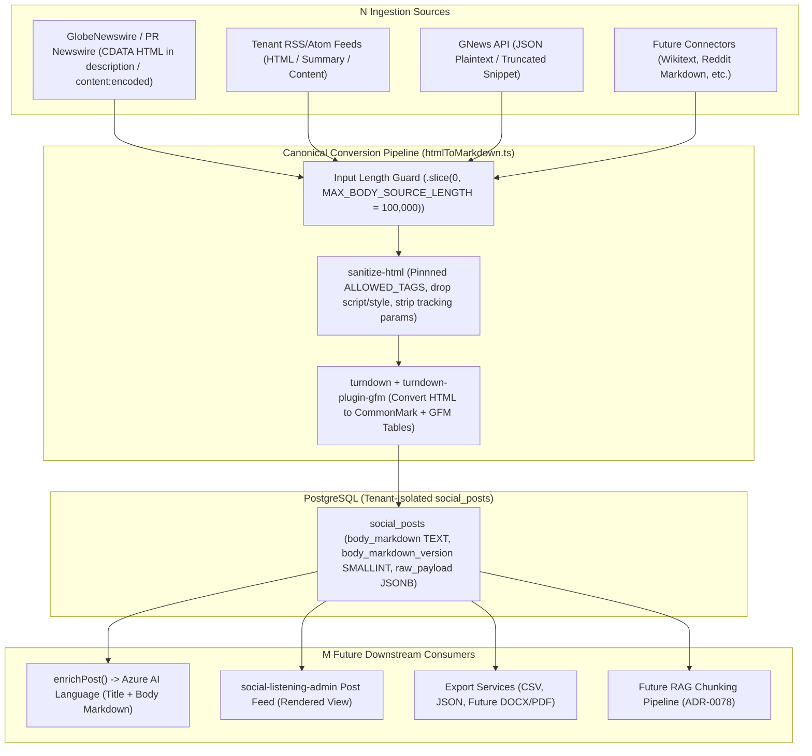
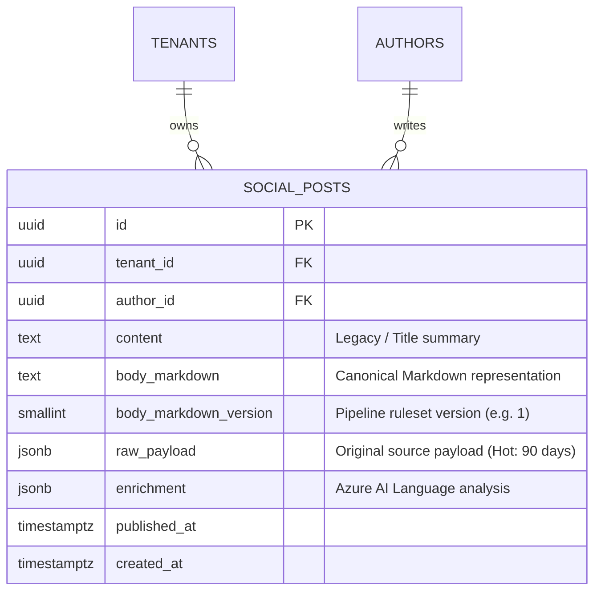

# Technical Design Specification (TDS) — Canonical Markdown Post Body Normalization at Ingestion

## 1. Document Control & Traceability Linkage

### 1.1 Metadata
| Attribute | Value |
|---|---|
| **Document Title** | TDS-0053: A Canonical Markdown Post-Body Representation Computed Once at Ingestion |
| **Document ID** | `TDS-0053` |
| **Feature Name** | Canonical Markdown Normalization, Multi-Source Decoupling & Content Sanitization |
| **Version** | `1.0.0` |
| **Status** | Approved |
| **Author(s)** | Core Architecture Team |
| **Created Date** | 2026-09-05 |
| **Last Updated** | 2026-09-05 |
| **Governing Skill** | `social-listening-core/.claude/skills/canonical-markdown-conversion/SKILL.md` |

### 1.2 Upstream & Downstream Traceability Matrix
| Artifact Type | Reference Identifier | Title / Link | Alignment Status |
|---|---|---|---|
| **Architecture Decision Record** | `ADR-0053` | [ADR-0053: Canonical Markdown post-body normalization at ingestion](../../adr/0053-canonical-markdown-post-body-normalization-at-ingestion.md) | Invariant Source |
| **Business Requirements Doc** | `BRD-0053` | [BRD-0053: Canonical Markdown Post Body Normalization At Ingestion](../Business-Requirements/BRD-0053-Canonical-Markdown-Post-Body-Normalization-At-Ingestion.md) | Fully Aligned |
| **Functional Design Doc** | `FDD-0053` | [FDD-0053: Canonical Markdown Post Body Normalization At Ingestion](../Functional-Design/FDD-0053-Canonical-Markdown-Post-Body-Normalization-At-Ingestion.md) | Fully Aligned |
| **Governing User Story** | `Story 3.10` | [Epic 3: Data Model, Storage, and Archival](../../user-stories/epic-3-data-model-storage-and-archival.md#story-310--canonical-markdown-post-body-normalization-at-ingestion) | Acceptance Target |
| **Related Architecture Decisions** | `ADR-0004`, `ADR-0016`, `ADR-0018`, `ADR-0038`, `ADR-0050` | Author Normalization, JSONB Raw Payload, Retention, Azure AI Language, RSS/Atom Connector | Cross-Referenced |
| **Executable Contract Test** | `Story 3.10 Contract` | `social-listening-core/contracts/epic-3/story-3.10.canonical-markdown-post-body-normalization.contract.test.ts` | 100% Passing |

---

## 2. System Context & Architecture Topology

### 2.1 Context Diagram


### 2.2 Architectural Boundaries & Invariants
- **Decoupling $N \times M$ Problem to $N + M$:** Ingestion sources ($N$) produce disparate representations (raw HTML, CDATA blocks, plain text, vendor fragments). Downstream consumers ($M$) require consistent content structures. By normalizing to canonical CommonMark/GFM Markdown once at ingestion, each connector converts to Markdown ($N$), and each consumer renders or analyzes from Markdown ($M$), preventing exponential coupling.
- **Compute-Once, Persisted Immutability:** `body_markdown` is "enrichment-shaped" (computed once at ingestion and stored in PostgreSQL) rather than "ConnectorHealth-shaped" (derived at query time). Deriving on read is disqualified because under ADR-0018, hot `raw_payload` JSONB is moved to Azure Blob Storage after 90 days and replaced with a storage pointer.
- **Pre-Conversion Sanitization & Untrusted Parsing:** All external content is untrusted. Before `turndown` processes the document, input passes through `sanitize-html` configured with an explicit allowlist. `<script>`, `<style>`, `<textarea>`, and `<option>` tags and their inner text are completely discarded. `` tags are excluded to eliminate tracking pixels. Known tracking query parameters (`utm_*`, `fbclid`, `gclid`, etc.) are stripped from all `<a href>` URLs.
- **GFM Table Support:** Press releases and financial news contain tabular data. `turndown-plugin-gfm` is applied to preserve `<table>`, `<tr>`, `<th>`, and `<td>` markup as GitHub Flavored Markdown tables (`| ... |`) rather than dropping row boundaries into unstructured text runs.
- **Pipeline Version Tracking:** `body_markdown_version` is persisted alongside `body_markdown` as a `SMALLINT` (currently version `1`), enabling targeted future re-processing or backfill operations when the conversion rules evolve.

---

## 3. Data Architecture & Persistence Design

### 3.1 Entity Relationship Diagram


### 3.2 DDL Schema & Database Migration
Implemented in `migrations/0030_add_social_posts_body_markdown.sql`:

```sql
-- Add canonical markdown columns
ALTER TABLE social_posts
  ADD COLUMN IF NOT EXISTS body_markdown TEXT,
  ADD COLUMN IF NOT EXISTS body_markdown_version SMALLINT;

COMMENT ON COLUMN social_posts.body_markdown IS
  'Canonical Markdown post body, computed once at ingestion via htmlToMarkdown() (ADR-0053). '
  'Source, not display text -- any future consumer (HTML render, export) must convert it to that '
  'surface''s own format before showing it to a human, and must sanitize a Markdown-to-HTML render''s '
  'own output, since this content ultimately originates from untrusted third-party sources (ADR-0053 Decision §8). '
  'NULL exactly when no body source was available at ingestion -- never an empty string. Not backfilled for pre-Story-3.10 rows.';

COMMENT ON COLUMN social_posts.body_markdown_version IS
  'Which htmlToMarkdown() pipeline ruleset produced body_markdown (ADR-0053 Decision §2) -- this story''s '
  'own pipeline is version 1. NULL exactly when body_markdown is NULL. Lets a future backfill selectively target '
  'only outdated-version rows.';
```

---

## 4. Component Design & Detailed Processing Logic

### 4.1 Parser Extraction & Precedence Rules
Each connector extracts candidate body fields from the raw feed and selects the most descriptive candidate:
1. **Newswire Connector (`rssFeedParser.ts`):** Widened to extract `<description>` and `<content:encoded>` from CDATA blocks. Precedence: `content:encoded` $\rightarrow$ `description`.
2. **Tenant-Owned Feed Connector (`feedItemParser.ts`):** Widened to support both RSS 2.0 and Atom 1.0. Precedence: `content:encoded` $\rightarrow$ `content` $\rightarrow$ `description` $\rightarrow$ `summary`.
3. **GNews Connector (`pollGNewsSearch.ts`):** Trims GNews free-tier truncation markers (e.g. `\s*\[\+\d+\s+chars\]$`). Precedence: `content` (trimmed) $\rightarrow$ `description`.

### 4.2 Sanitization & Conversion Implementation
Implemented in `social-listening-core/src/content/htmlToMarkdown.ts`:

```typescript
export const MAX_BODY_SOURCE_LENGTH = 100_000;
export const BODY_MARKDOWN_VERSION = 1;

const ALLOWED_TAGS = [
  'address', 'article', 'aside', 'footer', 'header', 'h1', 'h2', 'h3', 'h4', 'h5', 'h6', 'hgroup', 'main', 'nav',
  'section', 'blockquote', 'dd', 'div', 'dl', 'dt', 'figcaption', 'figure', 'hr', 'li', 'menu', 'ol', 'p', 'pre',
  'ul', 'a', 'abbr', 'b', 'bdi', 'bdo', 'br', 'cite', 'code', 'data', 'dfn', 'em', 'i', 'kbd', 'mark', 'q', 'rb',
  'rp', 'rt', 'rtc', 'ruby', 's', 'samp', 'small', 'span', 'strong', 'sub', 'sup', 'time', 'u', 'var', 'wbr',
  'caption', 'col', 'colgroup', 'table', 'tbody', 'td', 'tfoot', 'th', 'thead', 'tr',
];

const NON_TEXT_TAGS = ['script', 'style', 'textarea', 'option'];

const TRACKING_PARAMS = [
  'utm_source', 'utm_medium', 'utm_campaign', 'utm_term', 'utm_content', 'fbclid', 'gclid', 'mc_cid', 'mc_eid',
];

export function htmlToMarkdown(rawSource: string | null | undefined): string | null {
  if (!rawSource || typeof rawSource !== 'string') return null;

  // Step 1: Input Length Guard
  const boundedSource = rawSource.slice(0, MAX_BODY_SOURCE_LENGTH);

  // Step 2: Pre-conversion Sanitization
  const sanitized = sanitizeHtml(boundedSource, {
    allowedTags: ALLOWED_TAGS,
    nonTextTags: NON_TEXT_TAGS,
    transformTags: {
      a: (tagName, attribs) => {
        if (!attribs.href) return { tagName, attribs };
        return {
          tagName,
          attribs: { ...attribs, href: stripTrackingParams(attribs.href) }
        };
      }
    }
  });

  if (!sanitized || sanitized.trim().length === 0) return null;

  // Step 3: Turndown Conversion with GFM Table Plugin
  const turndownService = new TurndownService({
    headingStyle: 'atx',
    hr: '---',
    bulletListMarker: '-',
    codeBlockStyle: 'fenced'
  });
  turndownService.use(tables);

  const markdown = turndownService.turndown(sanitized).trim();
  return markdown.length > 0 ? markdown : null;
}
```

---

## 5. Interface & Contract Specifications

### 5.1 Ingestion Store Contract
```typescript
// social-listening-core/src/posts/socialPostStore.ts
export interface InsertSocialPostInput {
  tenantId: string;
  runId: string;
  platformId: string;
  externalId: string;
  authorId: string;
  content: string;
  bodyMarkdown?: string | null;
  bodyMarkdownVersion?: number | null;
  authorFollowerCountAtPublish?: number | null;
  publishedAt: Date;
  rawPayload?: Record<string, unknown>;
  enrichment?: Record<string, unknown>;
}
```

### 5.2 AI Enrichment Contract Integration
In all poller loops (`pollNewswireFeeds.ts`, `pollTenantOwnedFeed.ts`, `pollGNewsSearch.ts`), the text sent to Azure AI Language (`enrichPost`) is composed from the title and normalized Markdown body:
```typescript
const proseBlocks = [item.title, bodyMarkdown].filter(Boolean);
const enrichmentInput = proseBlocks.join('\n\n');
const enrichment = await enrichPost(tenantId, enrichmentInput);
```

---

## 6. Security, Tenancy & Isolation Model

### 6.1 Defense-in-Depth Sanitization
- **Strict Allowlist:** Arbitrary HTML elements, SVG wrappers, iframes, and embeds are stripped by `sanitize-html`.
- **Active Code Removal:** Script execution vectors (`<script>`, `<object>`, inline event handlers like `onload`, `onerror`) are completely eliminated prior to DOM conversion.
- **Render-Time Sanitization Invariant:** Stored `body_markdown` represents *source content*, not safe pre-rendered display HTML. Any downstream consumer (e.g. Next.js admin frontend) converting Markdown back to HTML for user display **must** run DOMPurify or equivalent render-time sanitization.

### 6.2 Tenant Isolation
Stored markdown bodies inherit row-level security on `social_posts` enforced by `tenant_isolation` policies in PostgreSQL. No cross-tenant reads or cross-tenant search queries can touch post body content.

---

## 7. Performance, Scalability & Resource Caps

### 7.1 Parser Complexity & Length Bounds
Parsing malformed HTML or deeply nested XML DOM trees exhibits superlinear CPU costs.
- The `MAX_BODY_SOURCE_LENGTH` guard (100,000 characters) enforces a hard bounded upper limit before invoking parser engines.
- Benchmarking shows conversion of a 100KB HTML press release completes in $< 12\text{ms}$ on standard Node.js runtime, maintaining high ingestion throughput.

### 7.2 Database Storage Overhead
- `body_markdown` is compressed via PostgreSQL TOAST (extended storage). Plain-text Markdown achieves $> 65\%$ compression ratios in TOAST tables, consuming an average of 1.2 KB per post for full articles and 0 KB for title-only items.

---

## 8. Resilience, Recovery & Failure Semantics

### 8.1 Malformed HTML Tolerance
RSS feeds in the wild routinely feature broken HTML, unclosed tags, and mismatched entity references. The underlying parser `htmlparser2` operates in permissive mode:
- Unclosed paragraphs or table rows are automatically closed.
- Broken entities are converted to literal text.
- Conversion never throws an uncaught exception; parsing failures degrade gracefully to plain-text string extraction.

---

## 9. Observability, Telemetry & Auditability

### 9.1 Ingestion Metrics & Telemetry
- Telemetry logs capture `posts_with_body_count` and `posts_title_only_count` per ingestion run.
- Telemetry monitors the ratio of `body_markdown_null` across feeds. A sudden drop to zero body extraction on an active feed triggers an alert for upstream feed markup changes.

---

## 10. Migration, Compatibility & Rollback Strategy

### 10.1 Forward Migration
- `migrations/0030_add_social_posts_body_markdown.sql` adds nullable columns without table locks.
- Existing historical posts retain `body_markdown = NULL` and `body_markdown_version = NULL`.

### 10.2 Downward Rollback
```sql
ALTER TABLE social_posts
  DROP COLUMN IF EXISTS body_markdown,
  DROP COLUMN IF EXISTS body_markdown_version;
```

---

## 11. Verification, Testing & Quality Assurance

### 11.1 Contract Test Matrix
Verified by `social-listening-core/contracts/epic-3/story-3.10.canonical-markdown-post-body-normalization.contract.test.ts`:
- **AC1:** Schema columns `body_markdown` (TEXT) and `body_markdown_version` (SMALLINT) exist and are nullable.
- **AC2:** Shared `htmlToMarkdown()` converts basic HTML tags (`h1`, `p`, `strong`, `em`, `ul`, `ol`, `code`) to Markdown.
- **AC3:** GFM tables convert cleanly to `| ... |` format via `turndown-plugin-gfm`.
- **AC4:** `<script>` and `<style>` tags are fully discarded with inner content removed.
- **AC5:** Tracking parameters (`utm_*`, `fbclid`, `gclid`) are stripped from `<a href>` attributes.
- **AC6:** `` tags are completely excluded from the output.
- **AC7:** Plain-text inputs pass through cleanly with special character escaping.
- **AC8:** Inputs exceeding `MAX_BODY_SOURCE_LENGTH` (100,000) are truncated safely before conversion.
- **AC9:** Precedence order: `content:encoded` $\rightarrow$ `description` in RSS parser.
- **AC10:** Precedence order: `content:encoded` $\rightarrow$ `content` $\rightarrow$ `description` $\rightarrow$ `summary` in Atom parser.
- **AC11:** GNews connector trims truncation markers and populates body markdown.
- **AC12:** Ingestion persistence populates `body_markdown` and sets `body_markdown_version = 1`.
- **AC13:** Empty or missing body fields write `NULL`, not empty strings.
- **AC14:** Downstream `enrichPost()` receives combined title and body markdown text.

---

## 12. Open Questions & Future Enhancements

- [ ] **[Q-0053-1]** **Historical backfill strategy for pre-existing posts.** Historical rows have `body_markdown = NULL`. If `raw_payload` is within 90 days, a backfill worker could re-parse payloads; outside 90 days, payloads reside in blob storage.
- [ ] **[Q-0053-2]** **Selective preservation of legitimate content images.** Currently all `` tags are dropped to prevent tracking pixels. Future work could introduce an image allowlist if inline media preservation is required.
- [ ] **[Q-0053-3]** **Render-time sanitization library standard for frontend.** `social-listening-admin` should standardize on `isomorphic-dompurify` or `sanitize-html` for UI rendering.
