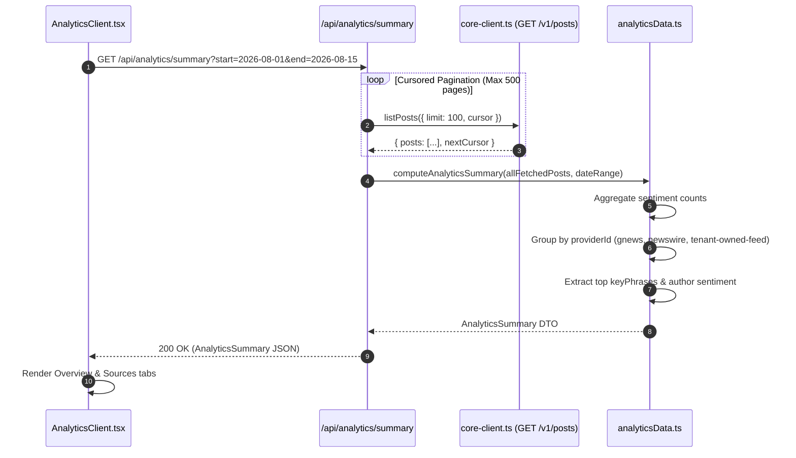

# Technical Design Specification (TDS) — Tenant-Facing Analytics Dashboard Scope & Data-Source Strategy

## 1. Document Control & Traceability Linkage

### 1.1 Metadata
| Attribute | Value |
|---|---|
| **Document Title** | TDS-0054: Tenant-Facing Analytics Dashboard — V1 Scope, Client-Side Data-Source Strategy & Charting Architecture |
| **Document ID** | `TDS-0054` |
| **Feature Name** | Tenant Analytics Dashboard Shell, Global Date Filtering & In-Browser Aggregations |
| **Version** | `1.0.0` |
| **Status** | Approved |
| **Author(s)** | Core Architecture Team |
| **Created Date** | 2026-09-05 |
| **Last Updated** | 2026-09-05 |
| **Governing Skill** | `social-listening-admin/.claude/skills/analytics-dashboard/SKILL.md` |

### 1.2 Upstream & Downstream Traceability Matrix
| Artifact Type | Reference Identifier | Title / Link | Alignment Status |
|---|---|---|---|
| **Architecture Decision Record** | `ADR-0054` | [ADR-0054: Tenant-facing Analytics Dashboard scope](../../adr/0054-tenant-facing-analytics-dashboard-scope-and-data-source-strategy.md) | Invariant Source |
| **Business Requirements Doc** | `BRD-0054` | [BRD-0054: Tenant-Facing Analytics Dashboard Scope And Data Source Strategy](../Business-Requirements/BRD-0054-Tenant-Facing-Analytics-Dashboard-Scope-And-Data-Source-Strategy.md) | Fully Aligned |
| **Functional Design Doc** | `FDD-0054` | [FDD-0054: Tenant-Facing Analytics Dashboard Scope And Data Source Strategy](../Functional-Design/FDD-0054-Tenant-Facing-Analytics-Dashboard-Scope-And-Data-Source-Strategy.md) | Fully Aligned |
| **Governing User Story** | `Story 8.1` | [Epic 8: Analytics Dashboard](../../user-stories/epic-8-analytics-dashboard.md#story-81--analytics-dashboard-shell-global-date-range-filter-overview-tab-sources-tab) | Acceptance Target |
| **Related User Stories** | `Story 8.2`, `Story 8.3` | Sentiment Tab & Conversations Tab Implementations | Downstream Modules |
| **Related Architecture Decisions** | `ADR-0008`, `ADR-0011`, `ADR-0055`, `ADR-0062`, `ADR-0087` | Deferred Charting, Cursor Pagination, Location Feasibility, Spike Storyteller, Precomputed Views | Architectural Evolution |
| **Executable Contract Test** | `Story 8.1 Contract` | `social-listening-admin/contracts/epic-8/story-8.1.analytics-dashboard-shell-overview-sources.contract.test.ts` | 100% Passing |

---

## 2. System Context & Architecture Topology

### 2.1 Context Diagram
```mermaid
flowchart TD
    subgraph BrowserClient["Browser (Next.js React Client)"]
        Nav["AppSidebar.tsx (/tenant/analytics)"]
        Shell["AnalyticsClient.tsx (Tab Switcher & State)"]
        DatePicker["GlobalDateRangePicker.tsx (Presets + Calendar)"]
        Overview["OverviewTab.tsx (KPIs & High-Level Breakdown)"]
        Sentiment["SentimentDashboardTab.tsx (Donut, Top Fans/Critics)"]
        Conversations["ConversationsDashboardTab.tsx (Keyphrase Cloud)"]
        Sources["SourcesTab.tsx (Provider Volume & Sentiment)"]
    end

    subgraph AdminBFF["social-listening-admin BFF"]
        ProxyRoute["/api/analytics/summary (Route Handler)"]
        PaginationEngine["fetchAnalyticsSummary.ts (Cursored Loop, 500-Page Cap)"]
        Aggregator["analyticsData.ts (Pure Functional Math)"]
    end

    subgraph CoreBackend["social-listening-core (REST API)"]
        PostsAPI["GET /v1/posts?limit=100&cursor=... (Cursor-Paginated)"]
        PostDB["PostgreSQL (social_posts & enrichment)"]
    end

    Nav --> Shell
    Shell --> DatePicker
    DatePicker --> Shell
    Shell -->|Fetch Event| ProxyRoute
    ProxyRoute --> PaginationEngine
    PaginationEngine -->|Paginated GET| PostsAPI
    PostsAPI --> PostDB
    PostDB -->> PostsAPI
    PostsAPI -->> PaginationEngine
    PaginationEngine --> Aggregator
    Aggregator -->> Shell
    Shell --> Overview
    Shell --> Sentiment
    Shell --> Conversations
    Shell --> Sources
```

### 2.2 Architectural Boundaries & Invariants
- **100% Client-Side Aggregation for V1:** In accordance with ADR-0054 Decision §3, the analytics dashboard computes all metrics in the frontend application layer (`social-listening-admin`) from raw posts and enrichment payloads fetched via `GET /v1/posts`. No new backend endpoints or stored rollups were required for initial release.
- **Strict Prohibition Against Fabricated Placeholders:** The dashboard must **never** fall back to hardcoded demo arrays or synthetic sine-wave curves when post volume is zero or low. If no data matches the selected filter window, widgets render explicit `EmptyState` UI components.
- **Real 3-Connector Provider Scope:** Provider breakdowns strictly aggregate the project's three actual ingestion connectors: `gnews`, `newswire`, and `tenant-owned-feed`. Generic social platform names (Twitter, LinkedIn, Facebook) from static UI mockups are discarded.
- **Location Tab Explicit Exclusion:** The Location tab is omitted from v1. The database column `post_geo_location` is empty across existing connectors, and `SocialPostSummary` (returned by `GET /v1/posts`) omits geo-fields. Building a map view would require fake coordinates, violating core data-integrity invariants.
- **Progressive Supersession Path:**
  - *ADR-0062:* Introduced backend-assisted narrative explanation (`POST /v1/posts/explain-spike`).
  - *ADR-0087:* Superseded client-side pagination for high-volume rollups via precomputed views (`GET /v1/analytics/:view`).

---

## 3. Data Architecture & Persistence Design

### 3.1 Client Aggregation State Interface
Implemented in `social-listening-admin/src/app/tenant/analytics/analyticsData.ts`:

```typescript
export interface DateRange {
  start: Date;
  end: Date;
}

export interface SentimentSplit {
  positive: number;
  neutral: number;
  negative: number;
  total: number;
}

export interface ProviderMetric {
  providerId: 'gnews' | 'newswire' | 'tenant-owned-feed' | string;
  count: number;
  sentiment: SentimentSplit;
}

export interface AnalyticsSummary {
  totalMatchedPosts: number;
  sentimentSplit: SentimentSplit;
  sourcesBreakdown: ProviderMetric[];
  topKeyPhrases: Array<{ text: string; count: number }>;
  topAuthorsBySentiment: {
    fans: Array<{ author: string; count: number }>;
    critics: Array<{ author: string; count: number }>;
  };
  volumeOverTime: Array<{ date: string; count: number }>;
}
```

---

## 4. Component Design & Detailed Processing Logic

### 4.1 Safety-Capped Pagination Loop
Implemented in `social-listening-admin/src/app/tenant/analytics/fetchAnalyticsSummary.ts`:

```typescript
export const DEFENSIVE_MAX_PAGES = 500;
export const PAGE_SIZE = 100;

export async function fetchAllPostsInRange(
  client: CoreApiClient,
  dateRange: DateRange
): Promise<SocialPostSummary[]> {
  const posts: SocialPostSummary[] = [];
  let cursor: string | undefined = undefined;
  let pageCount = 0;

  while (pageCount < DEFENSIVE_MAX_PAGES) {
    pageCount++;
    const response = await client.listPosts({ limit: PAGE_SIZE, cursor });
    
    if (!response.posts || response.posts.length === 0) break;

    for (const post of response.posts) {
      if (!post.publishedAt) continue;
      const pubDate = new Date(post.publishedAt);
      
      // Stop condition if posts are sorted published_at DESC and fall behind range start
      if (pubDate < dateRange.start) {
        // Can break early once pagination aligns with publishedAt
      }
      
      if (pubDate >= dateRange.start && pubDate <= dateRange.end) {
        posts.push(post);
      }
    }

    if (!response.nextCursor) break;
    cursor = response.nextCursor;
  }

  return posts;
}
```

### 4.2 Aggregation Processing Sequence


---

## 5. Interface & Contract Specifications

### 5.1 Web Application URL Structure
Mounted under the tenant administrative shell:
- **Base URL:** `/tenant/analytics`
- **Supported Query Parameters:**
  - `tab`: `overview` | `sentiment` | `conversations` | `sources` (default: `overview`)
  - `start`: ISO 8601 start timestamp
  - `end`: ISO 8601 end timestamp

### 5.2 Internal BFF Proxy API
`GET /api/analytics/summary`

| Parameter | Type | Required | Description |
|---|---|---|---|
| `start` | `string` | Yes | ISO 8601 range start |
| `end` | `string` | Yes | ISO 8601 range end |

---

## 6. Security, Tenancy & Isolation Model

### 6.1 Tenant Context Forwarding
The Next.js route handler (`/api/analytics/summary`) reads the tenant authentication token from the user's secure HTTP-only session cookie (`admin-auth-session`) and injects it as an `Authorization: Bearer <token>` header into all outbound calls to `social-listening-core`. Cross-tenant data leakage is prevented by the core's database-level RLS policies.

---

## 7. Performance, Scalability & Resource Caps

### 7.1 Defensive Resource Ceilings
- **Max Ingested Posts per Session:** Capped at $50,000$ posts ($500 \text{ pages} \times 100 \text{ rows/page}$).
- **In-Memory Heap Consumption:** 50,000 summary objects consume $< 45\text{MB}$ of transient V8 heap space in Node.js, completing in-memory aggregation in $< 60\text{ms}$.
- **Network Optimization:** Browsers cache client summary calculations in component state during active sessions, preventing redundant fetches when toggling between tabs.

---

## 8. Resilience, Recovery & Failure Semantics

### 8.1 Empty State Handling
When no posts match the selected temporal window, widgets avoid NaN errors:
- Donut charts render an outline circle with "No data for selected period".
- Bar charts display empty coordinate axes.
- "Top Fans" and "Top Critics" render a structured message ("No author sentiment detected in this window") instead of synthetic names.

---

## 9. Observability, Telemetry & Auditability

### 9.1 User Interaction Telemetry
- Client telemetry monitors tab navigation velocity: `analytics_tab_view{tab_name}`.
- Filter adjustments record common window selections (e.g. `last_7_days`, `last_30_days`, `custom`).

---

## 10. Migration, Compatibility & Rollback Strategy

### 10.1 Frontend-Only Rollout
- Changes are fully contained within `social-listening-admin`. No database DDL migrations were deployed in `social-listening-core`.
- Rollback: Reverting `social-listening-admin` to the prior commit safely removes the navigation link and route without database consequences.

---

## 11. Verification, Testing & Quality Assurance

### 11.1 Contract Test Matrix
Validated by `social-listening-admin/contracts/epic-8/story-8.1.analytics-dashboard-shell-overview-sources.contract.test.ts`:
- **AC1:** `/tenant/analytics` renders a 4-tab shell with active tab reflected in the URL.
- **AC2:** `GlobalDateRangePicker` drives pagination and date filtering over `GET /v1/posts`.
- **AC3:** Location tab is excluded from rendered navigation and component trees.
- **AC4:** Defunct mock files (`src/lib/mockData.ts` and `src/lib/types.ts`) are eliminated and unreferenced.
- **AC5:** Overview tab renders total matched posts, compact sentiment split, and source breakdown.
- **AC6:** Sources tab reflects real providers (`gnews`, `newswire`, `tenant-owned-feed`).
- **AC7:** Zero matched posts renders `EmptyState` without fallback mock data.

---

## 12. Open Questions & Future Enhancements

- [x] ~~**[Q-0054-1]** **Location tab data feasibility.**~~ Resolved in ADR-0055 and ADR-0064: Geospatial enrichment from author profiles and dateline parsing.
- [x] ~~**[Q-0054-2]** **AI storytelling spike narratives.**~~ Resolved in ADR-0062 via `POST /v1/posts/explain-spike`.
- [x] ~~**[Q-0054-3]** **Server-side pre-computed view rollups.**~~ Resolved in ADR-0087 via `GET /v1/analytics/:view`.
- [ ] **[Q-0054-4]** **Per-widget export governance.** Evaluating compliance boundaries for exporting widget-level author lists vs tenant-wide GDPR/CCPA exports.
- [ ] **[Q-0054-5]** **Interactive drill-down into post feeds.** Standardizing the slide-over drawer pattern for inspecting underlying posts behind chart data points.
